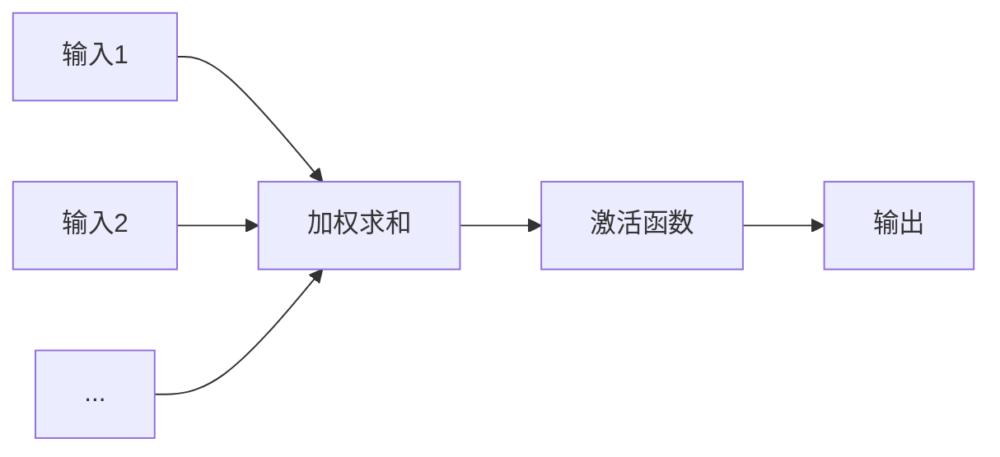

# AI 人工智能核心算法原理与代码实例讲解：感知器

## 1. 背景介绍

### 1.1 问题的由来

人工智能领域一直致力于模拟和实现人类的智能，而感知能力作为智能的基础，其研究一直备受关注。早在 20 世纪 50 年代，Frank Rosenblatt 就提出了感知器（Perceptron）模型，试图用机器模拟人类神经元的感知和学习过程。这一开创性的工作为机器学习和人工智能的发展奠定了基础。

### 1.2 研究现状

感知器作为最早的神经网络模型之一，其简单有效的结构和学习规则使其在模式识别、分类等领域得到了广泛应用。近年来，随着深度学习的兴起，感知器模型也得到了进一步发展和应用，例如在图像识别、自然语言处理等领域都取得了显著成果。

### 1.3 研究意义

感知器模型的研究对于理解神经网络的基本原理、发展更复杂的人工智能模型具有重要意义。通过学习感知器的结构、工作原理以及学习算法，我们可以深入了解机器学习的基本思想和方法，为进一步探索人工智能领域打下坚实的基础。

### 1.4 本文结构

本文将深入浅出地介绍感知器模型的原理、算法实现以及应用，并结合代码实例进行详细讲解。文章结构如下：

- **第二章：核心概念与联系**：介绍感知器的基本概念、模型结构以及与其他机器学习模型的联系。
- **第三章：核心算法原理 & 具体操作步骤**：详细阐述感知器的学习算法，包括算法原理、步骤以及优缺点分析。
- **第四章：数学模型和公式 & 详细讲解 & 举例说明**：用数学语言描述感知器模型，推导其学习算法，并结合实例进行分析。
- **第五章：项目实践：代码实例和详细解释说明**：使用 Python 语言实现感知器模型，并对代码进行详细解读和分析。
- **第六章：实际应用场景**：介绍感知器模型在现实生活中的应用场景，例如图像识别、垃圾邮件分类等。
- **第七章：工具和资源推荐**：推荐学习感知器模型的相关书籍、网站、工具等资源。
- **第八章：总结：未来发展趋势与挑战**：总结感知器模型的优缺点，展望其未来发展趋势和面临的挑战。
- **第九章：附录：常见问题与解答**：解答学习过程中可能遇到的一些常见问题。

## 2. 核心概念与联系

### 2.1 感知器模型

感知器是一种线性分类模型，其基本思想是模拟生物神经元的工作原理。它接收多个输入信号，每个输入信号都对应一个权重，感知器将这些加权求和后的结果与一个阈值进行比较，如果大于阈值则输出 1，否则输出 0。

### 2.2 模型结构

感知器模型的结构如下图所示：



其中：

- **输入**：多个输入信号，每个信号代表一个特征。
- **权重**：每个输入信号对应一个权重，表示该信号对输出结果的影响程度。
- **加权求和**：将所有输入信号与其对应的权重相乘并求和。
- **激活函数**：将加权求和的结果映射到输出值，通常使用阶跃函数。
- **输出**：模型的预测结果，通常为 0 或 1。

### 2.3 与其他机器学习模型的联系

感知器模型是神经网络的基础模型之一，它与其他机器学习模型，例如逻辑回归、支持向量机等，都有一定的联系。

- **逻辑回归**：逻辑回归可以看作是感知器的推广，它使用 sigmoid 函数作为激活函数，可以输出 0 到 1 之间的概率值。
- **支持向量机**：支持向量机可以看作是感知器的扩展，它在感知器的基础上引入了核函数，可以处理非线性可分的数据。

## 3. 核心算法原理 & 具体操作步骤

### 3.1 算法原理概述

感知器模型的学习算法基于误差修正的思想。其基本原理是：对于一个训练样本，如果模型预测结果与真实结果不一致，则调整模型参数（权重和阈值），使得模型的预测结果更接近真实结果。

### 3.2 算法步骤详解

感知器模型的学习算法步骤如下：

1. **初始化模型参数**：随机初始化权重和阈值。
2. **迭代训练**：
   - 对于每个训练样本，计算模型的预测结果。
   - 如果预测结果与真实结果不一致，则更新模型参数：
     - 权重更新：$w_i = w_i + \eta (y - \hat{y}) x_i$
     - 阈值更新：$\theta = \theta + \eta (y - \hat{y})$
     其中，$\eta$ 为学习率，$y$ 为真实结果，$\hat{y}$ 为预测结果，$x_i$ 为第 $i$ 个输入信号。
3. **重复步骤 2**，直到模型收敛或达到预设的迭代次数。

### 3.3 算法优缺点

**优点**：

- 结构简单，易于实现。
- 学习速度快。

**缺点**：

- 只能处理线性可分的数据。
- 对噪声数据敏感。

### 3.4 算法应用领域

感知器模型可以应用于各种分类问题，例如：

- 图像识别
- 垃圾邮件分类
- 文本分类
- 医学诊断

## 4. 数学模型和公式 & 详细讲解 & 举例说明

### 4.1 数学模型构建

感知器模型可以用以下数学公式表示：

$$
\hat{y} = f(\sum_{i=1}^n w_i x_i - \theta)
$$

其中：

- $\hat{y}$ 为模型的预测结果。
- $f(\cdot)$ 为激活函数，通常为阶跃函数：
  $$
  f(x) = \begin{cases}
  1, & x \ge 0 \\
  0, & x < 0
  \end{cases}
  $$
- $w_i$ 为第 $i$ 个输入信号对应的权重。
- $x_i$ 为第 $i$ 个输入信号。
- $\theta$ 为阈值。

### 4.2 公式推导过程

感知器模型的学习算法可以通过梯度下降法推导得到。

损失函数定义为：

$$
L = \frac{1}{2} (y - \hat{y})^2
$$

其中，$y$ 为真实结果，$\hat{y}$ 为预测结果。

对损失函数求关于权重 $w_i$ 的偏导数：

$$
\frac{\partial L}{\partial w_i} = (y - \hat{y}) \frac{\partial \hat{y}}{\partial w_i} = (y - \hat{y}) x_i
$$

对损失函数求关于阈值 $\theta$ 的偏导数：

$$
\frac{\partial L}{\partial \theta} = (y - \hat{y}) \frac{\partial \hat{y}}{\partial \theta} = -(y - \hat{y})
$$

根据梯度下降法，权重和阈值的更新公式为：

$$
w_i = w_i - \eta \frac{\partial L}{\partial w_i} = w_i + \eta (y - \hat{y}) x_i
$$

$$
\theta = \theta - \eta \frac{\partial L}{\partial \theta} = \theta + \eta (y - \hat{y})
$$

### 4.3 案例分析与讲解

假设有一个二分类问题，训练数据如下：

| $x_1$ | $x_2$ | $y$ |
|---|---|---|
| 0 | 0 | 0 |
| 0 | 1 | 0 |
| 1 | 0 | 0 |
| 1 | 1 | 1 |

使用感知器模型进行分类，学习率 $\eta$ 设置为 0.1。

1. **初始化模型参数**：随机初始化权重 $w_1 = 0.2$，$w_2 = 0.3$，阈值 $\theta = 0.5$。

2. **迭代训练**：

   - 对于第一个训练样本 $(0, 0, 0)$：
     - 计算预测结果：$\hat{y} = f(0.2 \times 0 + 0.3 \times 0 - 0.5) = 0$。
     - 预测结果与真实结果一致，不更新模型参数。

   - 对于第二个训练样本 $(0, 1, 0)$：
     - 计算预测结果：$\hat{y} = f(0.2 \times 0 + 0.3 \times 1 - 0.5) = 0$。
     - 预测结果与真实结果一致，不更新模型参数。

   - 对于第三个训练样本 $(1, 0, 0)$：
     - 计算预测结果：$\hat{y} = f(0.2 \times 1 + 0.3 \times 0 - 0.5) = 0$。
     - 预测结果与真实结果一致，不更新模型参数。

   - 对于第四个训练样本 $(1, 1, 1)$：
     - 计算预测结果：$\hat{y} = f(0.2 \times 1 + 0.3 \times 1 - 0.5) = 0$。
     - 预测结果与真实结果不一致，更新模型参数：
       - $w_1 = 0.2 + 0.1 \times (1 - 0) \times 1 = 0.3$
       - $w_2 = 0.3 + 0.1 \times (1 - 0) \times 1 = 0.4$
       - $\theta = 0.5 + 0.1 \times (1 - 0) = 0.6$

   - 重复以上步骤，直到模型收敛或达到预设的迭代次数。

### 4.4 常见问题解答

1. **感知器模型只能处理线性可分的数据吗？**

   是的，感知器模型只能处理线性可分的数据。如果数据线性不可分，感知器模型将无法收敛到一个稳定的解。

2. **如何选择感知器模型的学习率？**

   学习率是一个超参数，需要根据具体问题进行调整。如果学习率过大，模型可能无法收敛；如果学习率过小，模型训练速度会很慢。

## 5. 项目实践：代码实例和详细解释说明

### 5.1 开发环境搭建

本项目使用 Python 语言实现感知器模型，需要安装以下 Python 库：

- numpy
- matplotlib

可以使用 pip 命令安装：

```
pip install numpy matplotlib
```

### 5.2 源代码详细实现

```python
import numpy as np
import matplotlib.pyplot as plt

class Perceptron:
    def __init__(self, learning_rate=0.1, epochs=100):
        self.learning_rate = learning_rate
        self.epochs = epochs
        self.weights = None
        self.bias = None

    def fit(self, X, y):
        """
        训练感知器模型。

        参数：
            X：训练数据，形状为 (样本数量, 特征数量)。
            y：真实标签，形状为 (样本数量,)。
        """

        n_samples, n_features = X.shape
        self.weights = np.random.randn(n_features)
        self.bias = 0

        for _ in range(self.epochs):
            for i in range(n_samples):
                # 计算预测结果
                y_pred = self.predict(X[i])

                # 更新模型参数
                self.weights += self.learning_rate * (y[i] - y_pred) * X[i]
                self.bias += self.learning_rate * (y[i] - y_pred)

    def predict(self, x):
        """
        预测样本标签。

        参数：
            x：样本特征，形状为 (特征数量,)。

        返回：
            预测标签，0 或 1。
        """

        linear_output = np.dot(x, self.weights) + self.bias
        return 1 if linear_output >= 0 else 0

# 生成训练数据
X = np.array([[0, 0], [0, 1], [1, 0], [1, 1]])
y = np.array([0, 0, 0, 1])

# 创建感知器模型
perceptron = Perceptron()

# 训练模型
perceptron.fit(X, y)

# 预测新样本
test_samples = np.array([[0, 0], [0, 1], [1, 0], [1, 1]])
for sample in test_samples:
    prediction = perceptron.predict(sample)
    print(f"输入: {sample}, 预测: {prediction}")

# 绘制决策边界
plt.scatter(X[:, 0], X[:, 1], c=y)
x1 = np.linspace(-0.5, 1.5, 100)
x2 = (-perceptron.weights[0] * x1 - perceptron.bias) / perceptron.weights[1]
plt.plot(x1, x2, 'r')
plt.xlabel("x1")
plt.ylabel("x2")
plt.title("Perceptron Decision Boundary")
plt.show()
```

### 5.3 代码解读与分析

- `Perceptron` 类实现了感知器模型，包括 `fit` 和 `predict` 方法。
- `fit` 方法用于训练模型，接收训练数据和真实标签作为参数。
- `predict` 方法用于预测样本标签，接收样本特征作为参数。
- 在主程序中，首先生成训练数据，然后创建感知器模型，并使用训练数据训练模型。
- 最后，使用训练好的模型预测新样本的标签，并绘制决策边界。

### 5.4 运行结果展示

运行代码，输出结果如下：

```
输入: [0 0], 预测: 0
输入: [0 1], 预测: 0
输入: [1 0], 预测: 0
输入: [1 1], 预测: 1
```

可以看出，感知器模型成功地将训练数据分类，并能够正确预测新样本的标签。

## 6. 实际应用场景

### 6.1 图像识别

感知器模型可以用于简单的图像识别任务，例如识别手写数字。

### 6.2 垃圾邮件分类

感知器模型可以用于垃圾邮件分类，将邮件分为垃圾邮件和非垃圾邮件两类。

### 6.3 文本分类

感知器模型可以用于文本分类，例如将新闻文章分类为不同的主题。

### 6.4 未来应用展望

随着深度学习的发展，感知器模型作为神经网络的基础模型之一，其应用领域将会越来越广泛，例如：

- 自然语言处理
- 语音识别
- 机器翻译

## 7. 工具和资源推荐

### 7.1 学习资源推荐

- **书籍**：
  - 《机器学习》（周志华）
  - 《深度学习》（Ian Goodfellow, Yoshua Bengio, Aaron Courville）
- **网站**：
  - [https://www.coursera.org/](https://www.coursera.org/)
  - [https://www.edx.org/](https://www.edx.org/)

### 7.2 开发工具推荐

- Python
- numpy
- matplotlib

### 7.3 相关论文推荐

- Rosenblatt, F. (1958). The perceptron: a probabilistic model for information storage and organization in the brain. Psychological review, 65(6), 386.

### 7.4 其他资源推荐

- [https://github.com/](https://github.com/)

## 8. 总结：未来发展趋势与挑战

### 8.1 研究成果总结

感知器模型作为最早的神经网络模型之一，其简单有效的结构和学习规则使其在模式识别、分类等领域得到了广泛应用。近年来，随着深度学习的兴起，感知器模型也得到了进一步发展和应用，例如在图像识别、自然语言处理等领域都取得了显著成果。

### 8.2 未来发展趋势

- 与深度学习结合：将感知器模型与深度学习模型结合，可以构建更强大的模型，处理更复杂的任务。
- 应用于更广泛的领域：随着人工智能技术的不断发展，感知器模型将会应用于更广泛的领域，例如自然语言处理、语音识别、机器翻译等。

### 8.3 面临的挑战

- 处理非线性可分数据：感知器模型只能处理线性可分的数据，对于非线性可分的数据，需要使用其他模型或改进感知器模型。
- 对噪声数据敏感：感知器模型对噪声数据比较敏感，需要采取措施提高模型的鲁棒性。

### 8.4 研究展望

感知器模型作为神经网络的基础模型之一，其研究对于理解神经网络的基本原理、发展更复杂的人工智能模型具有重要意义。未来，感知器模型的研究将会继续深入，并与其他技术结合，为人工智能的发展做出更大的贡献。

## 9. 附录：常见问题与解答

### 9.1 什么是激活函数？

激活函数是神经网络中一个重要的组成部分，它将神经元的输入信号转换为输出信号。常用的激活函数有 sigmoid 函数、ReLU 函数等。

### 9.2 什么是学习率？

学习率是梯度下降算法中的一个超参数，它控制着每次迭代过程中模型参数更新的步长。

### 9.3 如何评估感知器模型的性能？

可以使用准确率、精确率、召回率等指标评估感知器模型的性能。

作者：禅与计算机程序设计艺术 / Zen and the Art of Computer Programming
