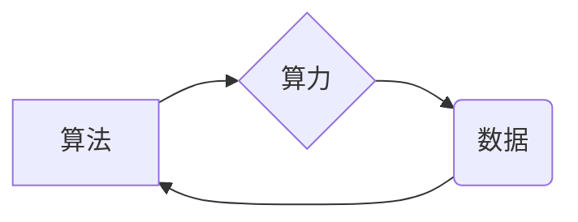

# AI发展的三大动力：算法、算力与数据

## 1. 背景介绍

### 1.1 问题的由来

近年来，人工智能(Artificial Intelligence, AI)经历了爆发式的发展，从AlphaGo战胜围棋世界冠军，到自动驾驶汽车上路测试，再到AI辅助医疗诊断，人工智能正在深刻地改变着我们的生活。回顾AI的发展历程，每一次大的突破都离不开算法、算力和数据的有力支撑。可以说，算法、算力和数据是推动AI发展的三驾马车，它们相辅相成，缺一不可。

### 1.2 研究现状

**算法方面**:  深度学习的兴起将AI推向了新的高度，卷积神经网络(CNN)、循环神经网络(RNN)、生成对抗网络(GAN)等算法不断涌现，在图像识别、自然语言处理、语音识别等领域取得了突破性进展。

**算力方面**:  GPU、TPU等专用芯片的出现，以及云计算、边缘计算等技术的快速发展，为AI提供了强大的算力支持，使得训练更大规模、更复杂的模型成为可能。

**数据方面**:  互联网、物联网的普及产生了海量数据，为AI提供了丰富的训练素材，大数据技术的发展也为数据的存储、处理和分析提供了有力保障。

### 1.3 研究意义

深入探讨算法、算力和数据这三大动力对AI发展的影响，对于我们理解AI的本质，把握AI的发展方向，以及推动AI技术的进步具有重要意义。

### 1.4 本文结构

本文将从以下几个方面展开论述：

- 核心概念与联系：介绍算法、算力和数据的定义、特点以及它们之间的相互关系。
- 核心算法原理 & 具体操作步骤：以深度学习为例，详细介绍其算法原理、操作步骤、优缺点以及应用领域。
- 数学模型和公式  & 详细讲解 & 举例说明：以线性回归为例，介绍其数学模型、公式推导过程、案例分析以及常见问题解答。
- 项目实践：代码实例和详细解释说明：以手写数字识别为例，展示如何使用Python和TensorFlow构建一个简单的神经网络模型。
- 实际应用场景：介绍AI在各个领域的应用情况，例如：图像识别、自然语言处理、语音识别等。
- 工具和资源推荐：推荐一些学习AI的书籍、网站、开源项目等资源。
- 总结：未来发展趋势与挑战：总结AI发展面临的挑战，并展望其未来发展趋势。


## 2. 核心概念与联系

### 2.1 算法

算法是指解决特定问题的一系列明确的指令或步骤，它是计算机程序的灵魂。在AI领域，算法指的是让计算机模拟人类智能的算法，例如：机器学习算法、深度学习算法等。

### 2.2 算力

算力指的是计算机每秒钟能够执行的浮点运算次数，是衡量计算机性能的重要指标。AI算法通常需要进行大量的计算，因此强大的算力是AI发展的重要保障。

### 2.3 数据

数据是信息的载体，是AI算法的“燃料”。AI算法需要从大量的数据中学习规律，从而做出预测或决策。

### 2.4 三者之间的联系

算法、算力和数据三者之间相互促进，相辅相成。

- **算法依赖于算力和数据**:  先进的AI算法通常需要强大的算力和海量的数据才能发挥其作用。
- **算力推动算法发展**:  强大的算力可以支持研究人员开发和训练更复杂的AI算法。
- **数据促进算法改进**:  海量的数据可以帮助研究人员不断改进和优化AI算法。

下图展示了算法、算力和数据之间的关系：



## 3. 核心算法原理 & 具体操作步骤

### 3.1 算法原理概述

深度学习是机器学习的一种，其核心思想是通过构建多层神经网络来模拟人脑的学习过程。神经网络由多个神经元组成，每个神经元接收来自其他神经元的输入，并对其进行加权求和，然后通过激活函数进行非线性变换，最后输出结果。

### 3.2 算法步骤详解

深度学习的训练过程可以分为以下几个步骤：

1. **数据预处理**:  对原始数据进行清洗、转换、特征提取等操作，使其符合模型输入要求。
2. **模型构建**:  根据具体问题选择合适的网络结构，例如：卷积神经网络、循环神经网络等。
3. **模型训练**:  使用训练数据对模型进行训练，不断调整模型参数，使其能够拟合训练数据的特征。
4. **模型评估**:  使用测试数据对训练好的模型进行评估，检验其泛化能力。
5. **模型部署**:  将训练好的模型部署到实际应用环境中，例如：Web服务器、移动设备等。

### 3.3 算法优缺点

**优点**:

- 能够处理高维、非线性的复杂数据。
- 具有强大的特征学习能力，能够自动提取数据特征。
- 泛化能力强，能够应用于不同的领域。

**缺点**:

- 需要大量的训练数据。
- 训练时间长，计算量大。
- 可解释性差，难以理解模型内部的决策过程。

### 3.4 算法应用领域

深度学习在图像识别、自然语言处理、语音识别等领域取得了广泛应用，例如：

- **图像识别**:  人脸识别、物体识别、图像分类等。
- **自然语言处理**:  机器翻译、文本摘要、情感分析等。
- **语音识别**:  语音助手、语音输入法、智能客服等。

## 4. 数学模型和公式 & 详细讲解 & 举例说明

### 4.1 数学模型构建

线性回归是一种常用的机器学习算法，其目标是找到一个线性函数来拟合数据，并预测未知数据的输出值。线性回归的数学模型可以表示为：

$$
y = wx + b
$$

其中：

- $y$ 是预测值。
- $x$ 是输入特征。
- $w$ 是权重参数。
- $b$ 是偏置参数。

### 4.2 公式推导过程

线性回归的目标是最小化预测值与真实值之间的误差，通常使用均方误差(MSE)作为损失函数：

$$
MSE = \frac{1}{n} \sum_{i=1}^{n} (y_i - \hat{y_i})^2
$$

其中：

- $n$ 是样本数量。
- $y_i$ 是第 $i$ 个样本的真实值。
- $\hat{y_i}$ 是第 $i$ 个样本的预测值。

为了最小化损失函数，可以使用梯度下降算法来更新模型参数：

$$
w = w - \alpha \frac{\partial MSE}{\partial w}
$$

$$
b = b - \alpha \frac{\partial MSE}{\partial b}
$$

其中：

- $\alpha$ 是学习率。

### 4.3 案例分析与讲解

假设我们有一组房价数据，其中包含房屋面积和房价两个特征，我们想建立一个线性回归模型来预测房屋价格。

| 面积(平方米) | 价格(万元) |
|---|---|
| 50 | 100 |
| 60 | 120 |
| 70 | 140 |
| 80 | 160 |
| 90 | 180 |

我们可以使用Python和Scikit-learn库来实现线性回归模型：

```python
import pandas as pd
from sklearn.linear_model import LinearRegression

# 创建数据
data = {'面积': [50, 60, 70, 80, 90],
        '价格': [100, 120, 140, 160, 180]}
df = pd.DataFrame(data)

# 创建线性回归模型
model = LinearRegression()

# 训练模型
model.fit(df[['面积']], df['价格'])

# 预测房价
print(model.predict([[100]]))
```

### 4.4 常见问题解答

**1. 如何评估线性回归模型的性能？**

可以使用均方误差(MSE)、均方根误差(RMSE)、决定系数(R^2)等指标来评估线性回归模型的性能。

**2. 如何处理线性回归模型中的过拟合问题？**

可以使用正则化技术来解决过拟合问题，例如：L1正则化、L2正则化等。

## 5. 项目实践：代码实例和详细解释说明

### 5.1 开发环境搭建

本项目使用Python语言和TensorFlow框架来实现手写数字识别，需要安装以下软件：

- Python 3.6+
- TensorFlow 2.0+

### 5.2 源代码详细实现

```python
import tensorflow as tf

# 加载MNIST数据集
(x_train, y_train), (x_test, y_test) = tf.keras.datasets.mnist.load_data()

# 数据预处理
x_train = x_train.astype('float32') / 255.0
x_test = x_test.astype('float32') / 255.0

# 将标签转换为独热编码
y_train = tf.keras.utils.to_categorical(y_train, num_classes=10)
y_test = tf.keras.utils.to_categorical(y_test, num_classes=10)

# 构建神经网络模型
model = tf.keras.models.Sequential([
  tf.keras.layers.Flatten(input_shape=(28, 28)),
  tf.keras.layers.Dense(128, activation='relu'),
  tf.keras.layers.Dense(10, activation='softmax')
])

# 编译模型
model.compile(optimizer='adam',
              loss='categorical_crossentropy',
              metrics=['accuracy'])

# 训练模型
model.fit(x_train, y_train, epochs=5)

# 评估模型
loss, accuracy = model.evaluate(x_test, y_test)
print('Test loss:', loss)
print('Test accuracy:', accuracy)
```

### 5.3 代码解读与分析

- `tf.keras.datasets.mnist.load_data()`: 加载MNIST数据集，该数据集包含60000张训练图片和10000张测试图片，每张图片都是28x28像素的灰度图像。
- `tf.keras.utils.to_categorical()`: 将标签转换为独热编码，例如：数字5转换为[0, 0, 0, 0, 0, 1, 0, 0, 0, 0]。
- `tf.keras.models.Sequential()`: 创建一个顺序模型，该模型按顺序堆叠多个层。
- `tf.keras.layers.Flatten()`: 将输入数据展平成一维向量。
- `tf.keras.layers.Dense()`: 创建一个全连接层，该层的所有神经元都与上一层的所有神经元相连接。
- `tf.keras.layers.Activation('relu')`: 使用ReLU激活函数。
- `tf.keras.layers.Activation('softmax')`: 使用Softmax激活函数，将输出转换为概率分布。
- `model.compile()`: 编译模型，指定优化器、损失函数和评估指标。
- `model.fit()`: 训练模型，指定训练数据、训练轮数等参数。
- `model.evaluate()`: 评估模型，计算损失值和评估指标。

### 5.4 运行结果展示

训练完成后，模型在测试集上的准确率可以达到98%以上。

## 6. 实际应用场景

### 6.1 图像识别

- **人脸识别**:  用于身份验证、门禁系统、安防监控等。
- **物体识别**:  用于自动驾驶、智能安防、工业自动化等。
- **图像分类**:  用于图片搜索、内容审核、医疗诊断等。

### 6.2 自然语言处理

- **机器翻译**:  用于跨语言交流、文献翻译、网站本地化等。
- **文本摘要**:  用于新闻摘要、文章摘要、会议纪要等。
- **情感分析**:  用于舆情监测、产品评论分析、客户服务等。

### 6.3 语音识别

- **语音助手**:  用于智能家居、车载系统、移动设备等。
- **语音输入法**:  用于文字输入、语音搜索、语音控制等。
- **智能客服**:  用于自动回复、语音导航、在线咨询等。

### 6.4 未来应用展望

随着AI技术的不断发展，未来AI将在更多领域得到应用，例如：

- **个性化教育**:  根据学生的学习情况和特点，提供个性化的学习内容和推荐。
- **精准医疗**:  根据患者的基因信息和病历数据，提供精准的诊断和治疗方案。
- **智能交通**:  通过智能交通信号灯、自动驾驶等技术，提高交通效率，减少交通事故。

## 7. 工具和资源推荐

### 7.1 学习资源推荐

- **书籍**:
    - 《深度学习》(Deep Learning)，Ian Goodfellow、Yoshua Bengio、Aaron Courville著。
    - 《机器学习》(Machine Learning)，周志华著。
- **网站**:
    - TensorFlow官网：https://www.tensorflow.org/
    - PyTorch官网：https://pytorch.org/
    - 机器学习课程(Coursera)：https://www.coursera.org/learn/machine-learning
- **开源项目**:
    - TensorFlow：https://github.com/tensorflow/tensorflow
    - PyTorch：https://github.com/pytorch/pytorch

### 7.2 开发工具推荐

- **Python**:  一种易于学习和使用的编程语言。
- **TensorFlow**:  一个开源的机器学习框架。
- **PyTorch**:  另一个开源的机器学习框架。
- **Jupyter Notebook**:  一个交互式的编程环境。

### 7.3 相关论文推荐

- [LeCun, Y., Bengio, Y., & Hinton, G. (2015). Deep learning. nature, 521(7553), 436-444.](https://www.nature.com/articles/nature14539)
- [Krizhevsky, A., Sutskever, I., & Hinton, G. E. (2012). Imagenet classification with deep convolutional neural networks. Advances in neural information processing systems, 25, 1097-1105.](https://proceedings.neurips.cc/paper/2012/file/c399862d3b9d6b76c8436e924a68c45b-Paper.pdf)

### 7.4 其他资源推荐

- **Kaggle**:  一个数据科学竞赛平台，可以参与各种机器学习竞赛，并学习其他人的代码。
- **GitHub**:  一个代码托管平台，可以找到各种机器学习相关的开源项目。

## 8. 总结：未来发展趋势与挑战

### 8.1 研究成果总结

本文介绍了AI发展的三大动力：算法、算力和数据，并以深度学习和线性回归为例，详细介绍了其算法原理、操作步骤、数学模型以及应用场景。

### 8.2 未来发展趋势

- **算法方面**:  未来将涌现更多更先进的AI算法，例如：强化学习、迁移学习等。
- **算力方面**:  量子计算、神经形态计算等新兴计算技术将为AI提供更强大的算力支持。
- **数据方面**:  物联网、边缘计算等技术将产生更多的数据，为AI提供更丰富的训练素材。

### 8.3 面临的挑战

- **数据隐私和安全**:  AI的发展需要大量的数据，如何保护数据隐私和安全是一个重要挑战。
- **算法偏见和歧视**:  AI算法可能会受到训练数据的影响，产生偏见和歧视。
- **AI伦理和道德**:  AI的发展引发了一系列伦理和道德问题，例如：AI的责任和权利、AI的决策透明度等。

### 8.4 研究展望

AI是一个充满机遇和挑战的领域，未来需要学术界、工业界和政府部门共同努力，推动AI技术的健康发展，让AI更好地造福人类。


## 9. 附录：常见问题与解答

**1. 什么是人工智能？**

人工智能是指机器模拟人类智能的能力，例如：学习、推理、问题求解等。

**2. 人工智能有哪些应用领域？**

人工智能的应用领域非常广泛，例如：图像识别、自然语言处理、语音识别、机器人、金融、医疗等。

**3. 学习人工智能需要哪些基础知识？**

学习人工智能需要具备一定的数学、统计学、计算机科学等方面的基础知识。

**4. 如何入门人工智能？**

可以通过学习在线课程、阅读书籍、参与开源项目等方式入门人工智能。

**5. 人工智能的发展前景如何？**

人工智能是一个快速发展的领域，未来将在更多领域得到应用，并对人类社会产生深远影响。

作者：禅与计算机程序设计艺术 / Zen and the Art of Computer Programming 
