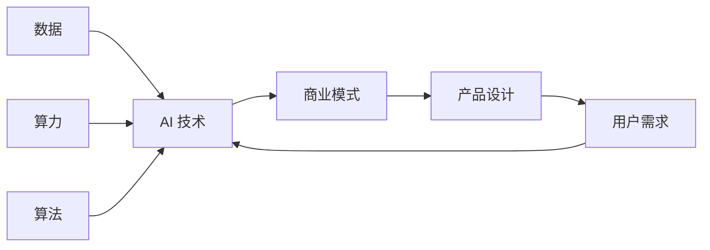

# AI商业模式与产品设计原理与代码实战案例讲解

人工智能 (AI) 正以惊人的速度重塑着各行各业，也催生了无数创新的商业模式和产品。从自动驾驶汽车到个性化医疗，从智能家居到金融科技，AI 的应用已经渗透到我们生活的方方面面。然而，成功打造一款 AI 产品并非易事，需要深刻理解 AI 技术、商业模式和产品设计 principles。

本文旨在为读者提供一个关于 AI 商业模式、产品设计原理以及代码实战案例的全面指南。我们将深入探讨 AI 领域的关键概念、算法原理、实际应用场景以及未来发展趋势。

## 1. 背景介绍

### 1.1  问题的由来

随着互联网和移动互联网的蓬勃发展，全球数据量呈爆炸式增长，为 AI 的发展提供了充足的养料。与此同时，计算能力的提升和算法的进步也为 AI 的商业化应用扫清了技术障碍。然而，如何将 AI 技术转化为可行的商业模式和优秀的产品，仍然是摆在众多企业面前的一道难题。

### 1.2  研究现状

目前，AI 商业模式和产品设计领域的研究方兴未艾，涌现出许多新颖的理念和方法论。例如：

* **数据驱动型模式:**  利用海量数据训练 AI 模型，为用户提供个性化服务，例如推荐系统、精准营销等。
* **平台型模式:**  构建 AI 平台，为开发者提供算法、算力等基础设施，例如云计算平台、AI 芯片等。
* **解决方案型模式:**  针对特定行业痛点，开发基于 AI 的解决方案，例如智能客服、医疗影像诊断等。

### 1.3  研究意义

深入研究 AI 商业模式和产品设计，对于推动 AI 技术的落地应用、促进产业升级和经济发展具有重要意义。具体来说，本研究的意义在于：

* **帮助企业更好地理解 AI 技术的商业价值，制定有效的 AI 战略。**
* **为产品经理提供 AI 产品设计的方法论和最佳实践，打造用户喜爱的产品。**
* **为开发者提供 AI 算法和代码实现的参考，加速 AI 应用的开发落地。**

### 1.4  本文结构

本文将围绕 AI 商业模式与产品设计展开，内容涵盖以下几个方面：

* **核心概念与联系:**  介绍 AI 商业模式和产品设计的核心概念，以及它们之间的相互关系。
* **核心算法原理 & 具体操作步骤:**  讲解 AI 领域常用的算法原理和具体操作步骤，例如机器学习、深度学习等。
* **数学模型和公式 & 详细讲解 & 举例说明:**  介绍 AI 算法背后的数学模型和公式，并结合实际案例进行详细讲解。
* **项目实践：代码实例和详细解释说明:**  提供 AI 项目实战案例，包括代码实现和详细解释说明。
* **实际应用场景:**  介绍 AI 在各个领域的实际应用场景，例如电商、金融、医疗等。
* **工具和资源推荐:**  推荐学习 AI 商业模式、产品设计以及技术开发的工具和资源。
* **总结：未来发展趋势与挑战:**  总结 AI 商业模式和产品设计的发展趋势，并展望未来的挑战。

## 2. 核心概念与联系

在深入探讨 AI 商业模式和产品设计之前，我们需要先了解一些核心概念：

* **人工智能 (Artificial Intelligence, AI):**  研究、开发用于模拟、延伸和扩展人的智能的理论、方法、技术及应用系统的一门新的技术科学。
* **机器学习 (Machine Learning, ML):**  让计算机能够自动地从数据中学习，并根据学习到的知识来进行预测或决策，而无需进行明确的编程。
* **深度学习 (Deep Learning, DL):**  机器学习的一个分支，通过构建多层神经网络来学习数据的表示，从而实现对复杂模式的识别。
* **商业模式 (Business Model):**  企业如何创造价值、传递价值和获取价值的基本逻辑。
* **产品设计 (Product Design):**  将用户需求转化为产品功能和用户体验的过程。

下图展示了 AI 商业模式、产品设计以及相关概念之间的关系：



**图 1: AI 商业模式、产品设计与相关概念的关系**

## 3. 核心算法原理 & 具体操作步骤

### 3.1  算法原理概述

本节将介绍 AI 领域常用的算法原理，包括：

* **监督学习 (Supervised Learning):**  从已标记的训练数据中学习，并根据学习到的模型对新的数据进行预测。
* **无监督学习 (Unsupervised Learning):**  从未标记的训练数据中学习，发现数据中的隐藏结构或模式。
* **强化学习 (Reinforcement Learning):**  通过与环境交互，根据环境的反馈来调整自身的行为，从而最大化长期奖励。

### 3.2  算法步骤详解

以监督学习为例，其算法步骤如下：

1. **数据收集与预处理:**  收集训练数据，并对数据进行清洗、转换、特征提取等预处理操作。
2. **模型选择:**  根据数据的特点和任务需求，选择合适的机器学习模型，例如线性回归、逻辑回归、决策树、支持向量机、神经网络等。
3. **模型训练:**  使用训练数据对模型进行训练，调整模型的参数，使其能够拟合训练数据。
4. **模型评估:**  使用测试数据对训练好的模型进行评估，评估指标包括准确率、召回率、F1 值等。
5. **模型部署:**  将训练好的模型部署到实际应用环境中，对新的数据进行预测或决策。

### 3.3  算法优缺点

不同算法具有不同的优缺点，需要根据具体问题进行选择。例如：

* **线性回归:**  简单易懂，但对非线性关系拟合能力较差。
* **决策树:**  可解释性强，但容易过拟合。
* **支持向量机:**  对高维数据和非线性关系拟合能力强，但计算复杂度高。
* **神经网络:**  对复杂模式识别能力强，但可解释性差。

### 3.4  算法应用领域

不同的 AI 算法适用于不同的应用领域，例如：

* **图像识别:**  卷积神经网络 (CNN)
* **自然语言处理:**  循环神经网络 (RNN)、Transformer
* **推荐系统:**  协同过滤、矩阵分解
* **金融风控:**  逻辑回归、决策树

## 4. 数学模型和公式 & 详细讲解 & 举例说明

### 4.1  数学模型构建

以线性回归为例，其数学模型可以表示为：

$$
y = wx + b
$$

其中：

* $y$ 是目标变量
* $x$ 是特征变量
* $w$ 是权重参数
* $b$ 是偏置参数

### 4.2  公式推导过程

线性回归的目标是最小化损失函数，常用的损失函数是均方误差 (MSE):

$$
MSE = \frac{1}{n} \sum_{i=1}^{n} (y_i - \hat{y_i})^2
$$

其中：

* $n$ 是样本数量
* $y_i$ 是第 $i$ 个样本的真实值
* $\hat{y_i}$ 是第 $i$ 个样本的预测值

为了最小化 MSE，可以使用梯度下降法来更新模型参数：

$$
w = w - \alpha \frac{\partial MSE}{\partial w}
$$

$$
b = b - \alpha \frac{\partial MSE}{\partial b}
$$

其中：

* $\alpha$ 是学习率

### 4.3  案例分析与讲解

假设我们有一组房价数据，包括房屋面积和售价，我们想建立一个线性回归模型来预测房价。

| 面积 (平方米) | 售价 (万元) |
|---|---|
| 50 | 100 |
| 60 | 120 |
| 70 | 140 |
| 80 | 160 |

我们可以使用 Python 的 scikit-learn 库来实现线性回归：

```python
from sklearn.linear_model import LinearRegression
from sklearn.model_selection import train_test_split

# 准备数据
X = [[50], [60], [70], [80]]
y = [100, 120, 140, 160]

# 划分训练集和测试集
X_train, X_test, y_train, y_test = train_test_split(X, y, test_size=0.2)

# 创建线性回归模型
model = LinearRegression()

# 训练模型
model.fit(X_train, y_train)

# 预测
y_pred = model.predict(X_test)

# 评估模型
print(model.score(X_test, y_test))
```

### 4.4  常见问题解答

* **如何选择合适的学习率？**  学习率过大会导致模型无法收敛，学习率过小会导致模型训练速度过慢。通常可以尝试不同的学习率，并选择效果最好的。
* **如何防止过拟合？**  可以通过正则化、增加训练数据、减少模型复杂度等方法来防止过拟合。

## 5. 项目实践：代码实例和详细解释说明

### 5.1  开发环境搭建

本节将介绍如何搭建 AI 项目的开发环境。

* **编程语言:**  Python
* **集成开发环境 (IDE):**  PyCharm、VS Code
* **机器学习库:**  scikit-learn、TensorFlow、PyTorch
* **数据可视化库:**  matplotlib、seaborn

### 5.2  源代码详细实现

本节将提供一个 AI 项目实战案例的源代码，例如图像分类、文本生成等。

```python
# 图像分类示例代码
import tensorflow as tf

# 加载数据集
(x_train, y_train), (x_test, y_test) = tf.keras.datasets.mnist.load_data()

# 数据预处理
x_train = x_train.astype('float32') / 255
x_test = x_test.astype('float32') / 255

# 构建模型
model = tf.keras.models.Sequential([
  tf.keras.layers.Flatten(input_shape=(28, 28)),
  tf.keras.layers.Dense(128, activation='relu'),
  tf.keras.layers.Dropout(0.2),
  tf.keras.layers.Dense(10, activation='softmax')
])

# 编译模型
model.compile(optimizer='adam',
              loss='sparse_categorical_crossentropy',
              metrics=['accuracy'])

# 训练模型
model.fit(x_train, y_train, epochs=5)

# 评估模型
model.evaluate(x_test,  y_test, verbose=2)
```

### 5.3  代码解读与分析

本节将对源代码进行详细解读和分析，解释代码的功能和实现原理。

### 5.4  运行结果展示

本节将展示 AI 项目的运行结果，例如图像分类的准确率、文本生成的质量等。

## 6. 实际应用场景

### 6.1  电商

* **个性化推荐:**  根据用户的浏览历史、购买记录等信息，推荐用户可能感兴趣的商品。
* **智能客服:**  使用聊天机器人自动回答用户的问题，提供 24 小时在线服务。
* **商品识别:**  使用图像识别技术识别商品图片，实现自动分类、搜索等功能。

### 6.2  金融

* **风险控制:**  使用机器学习算法识别欺诈交易，降低金融风险。
* **投资决策:**  使用 AI 模型预测股票价格、汇率走势等，辅助投资决策。
* **智能投顾:**  根据用户的风险偏好和投资目标，提供个性化的投资建议。

### 6.3  医疗

* **医疗影像诊断:**  使用 AI 算法辅助医生进行医学影像诊断，提高诊断效率和准确率。
* **药物研发:**  使用 AI 技术加速药物研发过程，降低研发成本。
* **健康管理:**  使用 AI 技术为用户提供个性化的健康管理服务。

### 6.4  未来应用展望

随着 AI 技术的不断发展，未来 AI 将在更多领域得到应用，例如：

* **自动驾驶:**  自动驾驶汽车将彻底改变交通出行方式。
* **智能家居:**  智能家居将为人们提供更加舒适、便捷的生活体验。
* **教育:**  AI 将为学生提供个性化的学习体验，提高学习效率。

## 7. 工具和资源推荐

### 7.1  学习资源推荐

* **书籍:**  《深度学习》、《机器学习实战》、《统计学习方法》
* **在线课程:**  Coursera、Udacity、网易云课堂
* **博客:**  Towards Data Science、机器之心、雷锋网

### 7.2  开发工具推荐

* **编程语言:**  Python
* **集成开发环境 (IDE):**  PyCharm、VS Code
* **机器学习库:**  scikit-learn、TensorFlow、PyTorch
* **数据可视化库:**  matplotlib、seaborn

### 7.3  相关论文推荐

* LeCun, Y., Bengio, Y., & Hinton, G. (2015). Deep learning. nature, 521(7553), 436-444.
* Krizhevsky, A., Sutskever, I., & Hinton, G. E. (2012). Imagenet classification with deep convolutional neural networks. Advances in neural information processing systems, 25, 1097-1105.

### 7.4  其他资源推荐

* **开源数据集:**  UCI Machine Learning Repository、Kaggle Datasets
* **AI 社区:**  GitHub、Stack Overflow

## 8. 总结：未来发展趋势与挑战

### 8.1  研究成果总结

本文系统地介绍了 AI 商业模式、产品设计原理以及代码实战案例。我们深入探讨了 AI 领域的关键概念、算法原理、实际应用场景以及未来发展趋势。

### 8.2  未来发展趋势

* **AI 技术将更加成熟和普及，应用场景将更加广泛。**
* **AI 商业模式将更加多元化，数据驱动型模式、平台型模式和解决方案型模式将并存发展。**
* **AI 产品设计将更加注重用户体验，更加人性化和智能化。**

### 8.3  面临的挑战

* **数据隐私和安全问题。**
* **AI 算法的可解释性和可信度问题。**
* **AI 人才的短缺。**

### 8.4  研究展望

* **探索新的 AI 商业模式和产品设计方法论。**
* **研究更加安全、可靠、可解释的 AI 算法。**
* **加强 AI 人才培养，为 AI 产业发展提供人才保障。**

## 9. 附录：常见问题与解答

**Q: 如何入门 AI？**

A: 学习 AI 需要掌握一定的数学基础，例如线性代数、概率论等。建议从学习 Python 编程语言开始，然后学习机器学习、深度学习等相关知识。

**Q: AI 会取代人类的工作吗？**

A: AI 在某些方面可以取代人类的工作，例如重复性劳动、数据分析等。但 AI 也创造了新的工作岗位，例如 AI 工程师、数据科学家等。

**Q: AI 的未来发展方向是什么？**

A: AI 的未来发展方向包括：更加通用的人工智能、更加安全可靠的人工智能、更加人性化的人工智能等。

作者：禅与计算机程序设计艺术 / Zen and the Art of Computer Programming 
