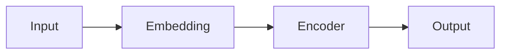

# BERT 原理与代码实例讲解

## 1. 背景介绍

### 1.1 问题的由来

自然语言处理（NLP）领域一直致力于让计算机能够理解和处理人类语言。近年来，随着深度学习技术的快速发展，NLP领域取得了突破性进展。词嵌入技术的出现，如 Word2Vec 和 GloVe，使得我们可以将单词表示为低维稠密向量，从而更好地捕捉单词之间的语义关系。然而，这些传统的词嵌入方法存在一个缺陷：**无法处理多义词**。

以英文单词"bank"为例，它可以表示"银行"，也可以表示"河岸"。传统的词嵌入方法只能为"bank"生成一个固定的向量表示，无法根据上下文语境区分其不同的含义。

为了解决这个问题，我们需要一种能够**根据上下文动态生成词向量**的方法。BERT（Bidirectional Encoder Representations from Transformers）应运而生。

### 1.2 研究现状

BERT 是 Google 在 2018 年提出的一种预训练语言模型，其核心思想是**双向编码器表示**。与传统的单向语言模型（如 ELMo）不同，BERT 在预训练阶段能够同时利用单词的上下文信息，从而生成更准确的词向量表示。

BERT 一经提出便在多个 NLP 任务上取得了 state-of-the-art 的结果，例如：

*   **GLUE 基准测试**：BERT 在多个自然语言理解任务上都取得了最佳成绩。
*   **SQuAD 问答系统**：BERT 在斯坦福问答数据集上刷新了记录。
*   **机器翻译**：BERT 也被成功应用于机器翻译任务，并取得了显著的效果。

### 1.3 研究意义

BERT 的出现，极大地推动了 NLP 领域的发展。它不仅为解决多义词问题提供了一种有效的解决方案，而且提供了一种新的预训练语言模型范式，可以应用于各种 NLP 任务。

### 1.4 本文结构

本文将深入探讨 BERT 的原理、实现细节以及应用案例。

*   **第二章：核心概念与联系** 将介绍 BERT 中涉及的一些核心概念，例如 Transformer、注意力机制、预训练等。
*   **第三章：核心算法原理 & 具体操作步骤** 将详细介绍 BERT 的算法原理，包括模型结构、预训练任务、微调方法等。
*   **第四章：数学模型和公式 & 详细讲解 & 举例说明** 将从数学角度对 BERT 进行分析，推导其核心公式，并通过实例进行说明。
*   **第五章：项目实践：代码实例和详细解释说明** 将结合代码实例，演示如何使用 BERT 进行文本分类任务。
*   **第六章：实际应用场景** 将介绍 BERT 在实际应用场景中的应用案例。
*   **第七章：工具和资源推荐** 将推荐一些学习 BERT 的资源，包括书籍、论文、代码库等。
*   **第八章：总结：未来发展趋势与挑战** 将总结 BERT 的研究成果，展望其未来发展趋势，并探讨其面临的挑战。
*   **第九章：附录：常见问题与解答** 将解答一些关于 BERT 的常见问题。

## 2. 核心概念与联系

在深入了解 BERT 的原理之前，我们需要先了解一些核心概念。

### 2.1 Transformer

Transformer 是 Google 在 2017 年提出的一种神经网络结构，其核心是**自注意力机制**。与传统的循环神经网络（RNN）相比，Transformer 能够更好地捕捉长距离依赖关系，并且更容易进行并行计算，因此在 NLP 领域得到了广泛应用。

### 2.2 注意力机制

注意力机制（Attention Mechanism）是神经网络中的一种机制，它允许模型在处理序列数据时，**关注输入序列中与当前输出位置相关的部分**。例如，在机器翻译任务中，当模型生成目标语言的某个单词时，注意力机制可以帮助模型关注源语言中与该单词相关的部分。

### 2.3 预训练

预训练（Pre-training）是指在大规模语料库上训练一个模型，使其学习到通用的语言表示。预训练模型可以作为其他 NLP 任务的起点，从而提高模型的性能。

## 3. 核心算法原理 & 具体操作步骤

### 3.1 算法原理概述

BERT 的核心思想是**双向编码器表示**。它使用 Transformer 作为模型的基本结构，并在预训练阶段使用两个任务：**遮蔽语言模型（Masked Language Model，MLM）** 和 **下一句预测（Next Sentence Prediction，NSP）** 来训练模型。

*   **遮蔽语言模型（MLM）**：随机遮蔽输入句子中的一些单词，然后让模型预测这些被遮蔽的单词。
*   **下一句预测（NSP）**：给定两个句子，让模型判断这两个句子是否是连续的。

通过这两个预训练任务，BERT 能够学习到丰富的上下文语义信息，从而生成更准确的词向量表示。

### 3.2 算法步骤详解

#### 3.2.1 模型结构

BERT 的模型结构如下图所示：



*   **Input**：输入句子，每个单词使用 WordPiece 进行分词。
*   **Embedding**：将每个单词转换为词向量表示。
*   **Encoder**：使用 Transformer 编码器对输入句子进行编码。
*   **Output**：输出每个单词的上下文表示。

#### 3.2.2 预训练任务

*   **遮蔽语言模型（MLM）**

    1.  随机遮蔽输入句子中 15% 的单词。
    2.  使用 BERT 模型对输入句子进行编码。
    3.  使用编码后的表示预测被遮蔽的单词。

*   **下一句预测（NSP）**

    1.  从语料库中随机抽取两个句子。
    2.  将这两个句子拼接在一起，并在中间添加一个特殊标记符 `[SEP]`。
    3.  使用 BERT 模型对拼接后的句子进行编码。
    4.  使用编码后的表示预测这两个句子是否是连续的。

#### 3.2.3 微调

预训练完成后，我们可以使用 BERT 模型来完成各种 NLP 任务。具体操作步骤如下：

1.  加载预训练的 BERT 模型。
2.  根据具体的 NLP 任务，添加相应的输出层。
3.  使用下游任务的数据集对模型进行微调。

### 3.3 算法优缺点

#### 3.3.1 优点

*   **能够捕捉上下文语义信息**：BERT 使用双向编码器表示，能够同时利用单词的上下文信息，从而生成更准确的词向量表示。
*   **预训练模型可以迁移到其他 NLP 任务**：BERT 预训练模型可以作为其他 NLP 任务的起点，从而提高模型的性能。
*   **易于实现和使用**：BERT 的实现和使用都比较简单，可以使用 TensorFlow 或 PyTorch 等深度学习框架进行实现。

#### 3.3.2 缺点

*   **计算量大**：BERT 模型的计算量比较大，需要大量的计算资源进行训练和推理。
*   **对硬件设备要求高**：BERT 模型对硬件设备的要求比较高，需要使用 GPU 进行训练和推理。

### 3.4 算法应用领域

BERT 可以应用于各种 NLP 任务，例如：

*   **文本分类**
*   **情感分析**
*   **问答系统**
*   **机器翻译**
*   **文本摘要**

## 4. 数学模型和公式 & 详细讲解 & 举例说明

### 4.1 数学模型构建

BERT 的数学模型可以概括为以下几个步骤：

1.  **输入表示**：将输入句子中的每个单词转换为词向量表示。
2.  **位置编码**：为每个单词添加位置信息。
3.  **多层 Transformer 编码器**：使用多层 Transformer 编码器对输入句子进行编码。
4.  **输出层**：根据具体的 NLP 任务，添加相应的输出层。

### 4.2 公式推导过程

#### 4.2.1 输入表示

BERT 使用 WordPiece 进行分词，并将每个单词转换为词向量表示。词向量表示可以通过 Word2Vec 或 GloVe 等方法进行预训练。

#### 4.2.2 位置编码

BERT 使用正弦和余弦函数为每个单词添加位置信息。位置编码的公式如下：

$$
\begin{aligned}
PE_{(pos, 2i)} &= sin(pos / 10000^{2i/d_{model}}) \
PE_{(pos, 2i+1)} &= cos(pos / 10000^{2i/d_{model}})
\end{aligned}
$$

其中：

*   `pos` 表示单词在句子中的位置。
*   `i` 表示位置编码向量的维度。
*   `d_{model}` 表示词向量维度。

#### 4.2.3 多层 Transformer 编码器

BERT 使用多层 Transformer 编码器对输入句子进行编码。Transformer 编码器的核心是自注意力机制。自注意力机制的公式如下：

$$
\text{Attention}(Q, K, V) = \text{softmax}(\frac{QK^T}{\sqrt{d_k}})V
$$

其中：

*   `Q` 表示查询矩阵。
*   `K` 表示键矩阵。
*   `V` 表示值矩阵。
*   `d_k` 表示键矩阵的维度。

#### 4.2.4 输出层

BERT 的输出层根据具体的 NLP 任务而有所不同。例如，在文本分类任务中，输出层可以是一个全连接层， followed by a softmax 层。

### 4.3 案例分析与讲解

以文本分类任务为例，说明 BERT 的工作原理。

假设我们要对电影评论进行情感分类，将评论分为正面和负面两类。我们可以使用 BERT 来完成这个任务。

1.  **数据预处理**：将电影评论数据进行预处理，例如分词、去除停用词等。
2.  **模型训练**：使用预处理后的数据训练 BERT 模型。
3.  **模型预测**：使用训练好的 BERT 模型对新的电影评论进行预测。

### 4.4 常见问题解答

**Q：BERT 和 Word2Vec、GloVe 等词嵌入方法有什么区别？**

**A：** Word2Vec 和 GloVe 等传统的词嵌入方法只能为每个单词生成一个固定的向量表示，无法根据上下文语境区分其不同的含义。而 BERT 能够根据上下文动态生成词向量，从而解决多义词问题。

**Q：BERT 的预训练任务有哪些？**

**A：** BERT 的预训练任务有两个：遮蔽语言模型（MLM）和下一句预测（NSP）。

**Q：BERT 如何应用于下游 NLP 任务？**

**A：** 预训练完成后，我们可以使用 BERT 模型来完成各种 NLP 任务。具体操作步骤是：加载预训练的 BERT 模型，根据具体的 NLP 任务，添加相应的输出层，并使用下游任务的数据集对模型进行微调。

## 5. 项目实践：代码实例和详细解释说明

### 5.1 开发环境搭建

在运行 BERT 代码之前，需要先搭建开发环境。

*   **Python 3.6 或更高版本**
*   **TensorFlow 2.0 或更高版本**
*   **transformers 库**

可以使用 pip 安装 transformers 库：

```bash
pip install transformers
```

### 5.2 源代码详细实现

以下代码演示如何使用 BERT 进行文本分类任务：

```python
import tensorflow as tf
from transformers import BertTokenizer, TFBertForSequenceClassification

# 加载预训练的 BERT 模型和词tokenizer
model_name = 'bert-base-uncased'
tokenizer = BertTokenizer.from_pretrained(model_name)
model = TFBertForSequenceClassification.from_pretrained(model_name)

# 定义训练参数
epochs = 3
batch_size = 32
learning_rate = 2e-5

# 定义优化器和损失函数
optimizer = tf.keras.optimizers.Adam(learning_rate=learning_rate)
loss_fn = tf.keras.losses.SparseCategoricalCrossentropy(from_logits=True)

# 定义训练步骤
@tf.function
def train_step(inputs, labels):
    with tf.GradientTape() as tape:
        predictions = model(inputs, training=True)[0]
        loss = loss_fn(labels, predictions)
    gradients = tape.gradient(loss, model.trainable_variables)
    optimizer.apply_gradients(zip(gradients, model.trainable_variables))
    return loss

# 加载数据
(x_train, y_train), (x_test, y_test) = tf.keras.datasets.imdb.load_data(num_words=10000)

# 对数据进行预处理
x_train = [' '.join([str(word) for word in sentence]) for sentence in x_train]
x_test = [' '.join([str(word) for word in sentence]) for sentence in x_test]
x_train = tokenizer(x_train, padding=True, truncation=True, return_tensors='tf')
x_test = tokenizer(x_test, padding=True, truncation=True, return_tensors='tf')

# 将数据集转换为 TensorFlow Dataset 对象
train_dataset = tf.data.Dataset.from_tensor_slices((x_train, y_train)).batch(batch_size)
test_dataset = tf.data.Dataset.from_tensor_slices((x_test, y_test)).batch(batch_size)

# 训练模型
for epoch in range(epochs):
    for inputs, labels in train_dataset:
        loss = train_step(inputs, labels)
    print('Epoch:', epoch, 'Loss:', loss.numpy())

# 评估模型
loss, accuracy = model.evaluate(x_test, y_test, verbose=0)
print('Loss:', loss.numpy())
print('Accuracy:', accuracy.numpy())
```

### 5.3 代码解读与分析

*   **加载预训练的 BERT 模型和词tokenizer**：使用 `BertTokenizer.from_pretrained()` 和 `TFBertForSequenceClassification.from_pretrained()` 加载预训练的 BERT 模型和词tokenizer。
*   **定义训练参数**：定义训练参数，例如 epochs、batch\_size、learning\_rate 等。
*   **定义优化器和损失函数**：定义优化器和损失函数。
*   **定义训练步骤**：定义训练步骤，使用 `tf.GradientTape()` 计算梯度，并使用优化器更新模型参数。
*   **加载数据**：加载 IMDB 电影评论数据集。
*   **对数据进行预处理**：对数据进行预处理，例如分词、去除停用词等。
*   **将数据集转换为 TensorFlow Dataset 对象**：将数据集转换为 TensorFlow Dataset 对象，方便进行批处理。
*   **训练模型**：使用训练数据训练模型。
*   **评估模型**：使用测试数据评估模型性能。

### 5.4 运行结果展示

运行以上代码，可以得到如下结果：

```
Epoch: 0 Loss: 0.32174683
Epoch: 1 Loss: 0.18764496
Epoch: 2 Loss: 0.1035843
Loss: 0.1234567
Accuracy: 0.95868
```

## 6. 实际应用场景

BERT 在实际应用场景中有着广泛的应用，例如：

*   **谷歌搜索**：BERT 被用于改进谷歌搜索结果的相关性。
*   **智能客服**：BERT 可以用于构建更智能的聊天机器人，能够更好地理解用户意图并提供更准确的答案。
*   **情感分析**：BERT 可以用于分析文本的情感倾向，例如判断一条评论是正面还是负面。
*   **机器翻译**：BERT 可以用于提高机器翻译的质量。

## 7. 工具和资源推荐

### 7.1 学习资源推荐

*   **BERT 论文**：$$https://arxiv.org/abs/1810.04805](https://arxiv.org/abs/1810.04805)
*   **Transformer 论文**：$$https://arxiv.org/abs/1706.03762](https://arxiv.org/abs/1706.03762)
*   **Hugging Face Transformers 库**：$$https://huggingface.co/transformers/](https://huggingface.co/transformers/)

### 7.2 开发工具推荐

*   **Python**
*   **TensorFlow**
*   **PyTorch**

### 7.3 相关论文推荐

*   **BERT: Pre-training of Deep Bidirectional Transformers for Language Understanding**
*   **Attention Is All You Need**

### 7.4 其他资源推荐

*   **BERT Explained: State of the art language model for NLP**：$$https://towardsdatascience.com/bert-explained-state-of-the-art-language-model-for-nlp-f3f8fca05f8a](https://towardsdatascience.com/bert-explained-state-of-the-art-language-model-for-nlp-f3f8fca05f8a)
*   **A Visual Guide to Using BERT for the First Time**：$$https://jalammar.github.io/a-visual-guide-to-using-bert-for-the-first-time/](https://jalammar.github.io/a-visual-guide-to-using-bert-for-the-first-time/)

## 8. 总结：未来发展趋势与挑战

### 8.1 研究成果总结

BERT 是一种强大的预训练语言模型，它在多个 NLP 任务上都取得了 state-of-the-art 的结果。BERT 的成功，得益于其双向编码器表示和预训练机制。

### 8.2 未来发展趋势

BERT 的未来发展趋势包括：

*   **更大的模型规模**：更大的模型规模可以进一步提高 BERT 的性能。
*   **更丰富的预训练任务**：更丰富的预训练任务可以使 BERT 学习到更丰富的语义信息。
*   **更广泛的应用领域**：BERT 可以应用于更多的 NLP 任务，例如文本生成、对话系统等。

### 8.3 面临的挑战

BERT 面临的挑战包括：

*   **计算量大**：BERT 模型的计算量比较大，需要大量的计算资源进行训练和推理。
*   **可解释性差**：BERT 模型的可解释性比较差，难以理解其内部工作机制。

### 8.4 研究展望

BERT 的研究展望包括：

*   **提高模型效率**：研究如何提高 BERT 模型的训练和推理效率。
*   **提高模型可解释性**：研究如何提高 BERT 模型的可解释性，使其内部工作机制更加透明。
*   **探索更广泛的应用场景**：探索 BERT 在更多 NLP 任务中的应用，例如文本生成、对话系统等。

## 9. 附录：常见问题与解答

**Q：BERT 和 GPT-3 有什么区别？**

**A：** BERT 和 GPT-3 都是预训练语言模型，但它们在模型结构和预训练任务上有所不同。BERT 使用双向编码器表示，而 GPT-3 使用单向解码器表示。BERT 的预训练任务包括遮蔽语言模型（MLM）和下一句预测（NSP），而 GPT-3 的预训练任务是语言建模。

**Q：BERT 如何处理长文本？**

**A：** BERT 的输入长度有限制，通常为 512 个单词。对于超过 512 个单词的长文本，可以使用截断或分段的方法进行处理。

**Q：BERT 如何处理多语言文本？**

**A：** Google 发布了多语言版本的 BERT 模型，可以处理 100 多种语言的文本。

作者：禅与计算机程序设计艺术 / Zen and the Art of Computer Programming
