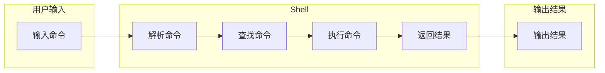

# CUI如何改变数字产品的交互方式

作者：禅与计算机程序设计艺术 / Zen and the Art of Computer Programming 

## 1. 背景介绍

### 1.1 问题的由来

随着科技的不断发展，数字产品已经成为我们生活中不可或缺的一部分。从智能手机到智能家居，从云计算到人工智能，数字产品正在改变着我们的生活方式。然而，传统的图形用户界面（GUI）在某些场景下已经无法满足用户需求，例如：

* **复杂的操作流程:**  GUI 界面在处理复杂操作时，用户需要进行大量的点击和操作，容易造成操作失误和效率低下。
* **有限的屏幕空间:** GUI 界面需要占用大量的屏幕空间，在移动设备等屏幕空间有限的场景下，用户体验会受到影响。
* **可访问性:**  对于视力障碍者或行动不便的用户来说，GUI 界面可能难以使用。

为了解决这些问题，命令行用户界面（CUI）逐渐得到了人们的关注。CUI 是一种基于文本的界面，用户通过输入命令来控制应用程序。CUI 具有以下优点：

* **高效快捷:** 用户可以通过简单的命令快速完成操作，提高工作效率。
* **灵活强大:** CUI 允许用户使用脚本和自动化工具，实现更复杂的操作。
* **可访问性:**  CUI 界面对于视力障碍者和行动不便的用户来说更加友好。

### 1.2 研究现状

近年来，CUI 在各个领域得到了广泛的应用，例如：

* **系统管理:**  Linux 和 macOS 等操作系统都提供了强大的 CUI 工具，方便用户进行系统管理。
* **软件开发:**  程序员使用 CUI 工具进行代码编写、编译和调试。
* **数据分析:**  数据科学家使用 CUI 工具进行数据处理和分析。
* **网络安全:**  安全专家使用 CUI 工具进行安全测试和漏洞修复。

随着人工智能技术的不断发展，CUI 也正在发生着新的变化。基于自然语言处理技术的 CUI 可以理解用户的自然语言指令，并执行相应的操作。这使得 CUI 更加易于使用，也更加强大。

### 1.3 研究意义

研究 CUI 如何改变数字产品的交互方式具有重要的意义：

* **提高用户体验:**  CUI 可以提供更加高效、灵活和可访问的交互方式，提升用户体验。
* **推动数字产品创新:**  CUI 的应用可以推动数字产品设计和开发的创新，创造出更加智能和便捷的数字产品。
* **促进数字技术发展:**  CUI 的研究和应用可以促进数字技术的发展，为人类社会带来更多益处。

### 1.4 本文结构

本文将从以下几个方面探讨 CUI 如何改变数字产品的交互方式：

* **CUI 的概念和特点:**  介绍 CUI 的基本概念、特点和优势。
* **CUI 的设计原则:**  探讨 CUI 设计的原则和最佳实践。
* **CUI 的应用场景:**  分析 CUI 在不同领域中的应用场景。
* **CUI 的未来发展趋势:**  展望 CUI 的未来发展方向和挑战。

## 2. 核心概念与联系

CUI（Command-line User Interface，命令行用户界面）是一种以文本形式进行交互的用户界面。它通过命令行解释器（Shell）接收用户的文本命令，并执行相应的操作。CUI 通常用于系统管理、软件开发、数据分析等领域，因为它具有高效、灵活、可扩展等优点。

**CUI 的主要特点：**

* **文本交互:** 用户通过输入文本命令来与系统进行交互。
* **命令行解释器:**  系统使用命令行解释器来解析用户的命令。
* **基于文本的输出:**  系统通过文本形式向用户反馈信息。
* **强大的功能:**  CUI 可以执行各种复杂的操作，例如系统管理、软件开发、数据分析等。
* **可扩展性:**  CUI 可以通过编写脚本和自动化工具来扩展功能。

**CUI 与 GUI 的区别：**

| 特征 | CUI | GUI |
|---|---|---|
| 交互方式 | 文本命令 | 图形界面 |
| 界面元素 | 文本、命令 | 窗口、按钮、菜单 |
| 操作方式 | 输入命令 | 点击、拖拽 |
| 学习曲线 | 陡峭 | 平缓 |
| 效率 | 高 | 低 |
| 灵活度 | 高 | 低 |
| 可扩展性 | 高 | 低 |

**CUI 与其他用户界面的联系:**

* **CLI（Command-Line Interface，命令行界面）:**  CLI 是 CUI 的一种特殊形式，它通常用于系统管理和软件开发。
* **NUI（Natural User Interface，自然用户界面）:**  NUI 是一种基于自然语言和手势的界面，它可以与 CUI 结合使用，提供更加自然和便捷的交互方式。
* **VUI（Voice User Interface，语音用户界面）:**  VUI 是一种基于语音的界面，它可以与 CUI 结合使用，为用户提供更加便捷的操作方式。

## 3. 核心算法原理 & 具体操作步骤

### 3.1 算法原理概述

CUI 的核心算法是命令行解释器（Shell）。Shell 的主要功能是解析用户的命令，并执行相应的操作。Shell 的工作原理如下：

1. **读取用户输入的命令:**  Shell 从标准输入（通常是键盘）读取用户的命令。
2. **解析命令:**  Shell 将用户输入的命令解析成一系列的单词（token）。
3. **查找命令:**  Shell 根据命令的第一个单词（命令名）查找相应的命令执行程序。
4. **执行命令:**  Shell 启动命令执行程序，并将命令的参数传递给程序。
5. **返回结果:**  命令执行程序将执行结果返回给 Shell，Shell 将结果输出到标准输出（通常是终端）。

### 3.2 算法步骤详解

**Shell 的工作流程:**



**Shell 的解析过程:**

* **词法分析:**  将用户输入的命令字符串分解成一系列的单词（token）。
* **语法分析:**  检查单词的语法是否正确，并构建语法树。
* **语义分析:**  检查语法树的语义是否正确，并生成可执行的代码。

### 3.3 算法优缺点

**CUI 的优点:**

* **高效快捷:**  用户可以通过简单的命令快速完成操作，提高工作效率。
* **灵活强大:**  CUI 允许用户使用脚本和自动化工具，实现更复杂的操作。
* **可访问性:**  CUI 界面对于视力障碍者和行动不便的用户来说更加友好。
* **可扩展性:**  CUI 可以通过编写脚本和自动化工具来扩展功能。

**CUI 的缺点:**

* **学习曲线陡峭:**  用户需要学习大量的命令才能使用 CUI。
* **用户体验差:**  CUI 界面缺乏图形界面带来的直观性和易用性。
* **错误提示信息不友好:**  CUI 的错误提示信息通常是文本形式，难以理解。

### 3.4 算法应用领域

CUI 在以下领域得到了广泛的应用：

* **系统管理:**  Linux 和 macOS 等操作系统都提供了强大的 CUI 工具，方便用户进行系统管理。
* **软件开发:**  程序员使用 CUI 工具进行代码编写、编译和调试。
* **数据分析:**  数据科学家使用 CUI 工具进行数据处理和分析。
* **网络安全:**  安全专家使用 CUI 工具进行安全测试和漏洞修复。
* **自动化脚本:**  CUI 可以用于编写自动化脚本，实现各种任务的自动化。
* **游戏开发:**  一些游戏使用 CUI 提供更深层的控制和定制选项。

## 4. 数学模型和公式 & 详细讲解 & 举例说明

### 4.1 数学模型构建

CUI 的核心算法可以抽象成一个数学模型：

$$
CUI = Shell(Command)
$$

其中：

* $CUI$ 表示命令行用户界面。
* $Shell$ 表示命令行解释器。
* $Command$ 表示用户输入的命令。

### 4.2 公式推导过程

CUI 的工作过程可以表示为以下步骤：

1. 用户输入命令：$Command$
2. Shell 解析命令：$Shell(Command)$
3. Shell 执行命令：$Execute(Shell(Command))$
4. Shell 返回结果：$Result(Execute(Shell(Command)))$

### 4.3 案例分析与讲解

**示例：**

假设用户在 Linux 系统中输入命令 `ls -l`，该命令用于列出当前目录下的所有文件和目录。

* $Command = ls -l$
* $Shell(Command) = Parse(ls -l)$
* $Execute(Shell(Command)) = Execute(Parse(ls -l))$
* $Result(Execute(Shell(Command))) = List files and directories in current directory$

**解释：**

1. 用户输入命令 `ls -l`。
2. Shell 解析命令 `ls -l`，并将命令分解成两个单词：`ls` 和 `-l`。
3. Shell 查找 `ls` 命令的执行程序，并启动该程序。
4. `ls` 命令执行程序将当前目录下的所有文件和目录信息返回给 Shell。
5. Shell 将结果输出到终端，显示当前目录下的所有文件和目录信息。

### 4.4 常见问题解答

**Q: CUI 真的比 GUI 更高效吗？**

**A:**  这取决于具体的操作和用户的使用习惯。对于一些简单的操作，GUI 界面可能更加直观和易用。但对于一些复杂的操作，CUI 界面可以通过脚本和自动化工具实现更高的效率。

**Q: 如何学习 CUI？**

**A:**  学习 CUI 的最佳方法是实践。选择一个操作系统（例如 Linux 或 macOS），并开始使用 CUI 工具进行操作。网上有很多学习 CUI 的资源，例如教程、文档和视频。

**Q: CUI 的未来发展趋势是什么？**

**A:**  CUI 的未来发展趋势是与人工智能技术结合，实现更加智能和便捷的交互方式。例如，基于自然语言处理技术的 CUI 可以理解用户的自然语言指令，并执行相应的操作。

## 5. 项目实践：代码实例和详细解释说明

### 5.1 开发环境搭建

**开发环境:**

* 操作系统：Linux 或 macOS
* 编程语言：Python
* 框架：Click

**安装依赖：**

```bash
pip install click
```

### 5.2 源代码详细实现

```python
import click

@click.command()
@click.option('--name', prompt='What is your name?', help='Your name.')
@click.option('--age', prompt='How old are you?', help='Your age.')
def hello(name, age):
    """Simple program that greets the user."""
    click.echo(f'Hello, {name}! You are {age} years old.')

if __name__ == '__main__':
    hello()
```

### 5.3 代码解读与分析

* **`click` 库:**  Click 库是一个用于创建命令行界面的 Python 库。
* **`@click.command()`:**  装饰器用于将函数注册为命令。
* **`@click.option()`:**  装饰器用于添加命令行选项。
* **`prompt` 参数:**  用于在命令行提示用户输入。
* **`help` 参数:**  用于提供选项的帮助信息。
* **`click.echo()`:**  用于输出文本到终端。

### 5.4 运行结果展示

**运行命令：**

```bash
python hello.py
```

**终端输出：**

```
What is your name? > John
How old are you? > 30
Hello, John! You are 30 years old.
```

## 6. 实际应用场景

### 6.1 系统管理

CUI 是系统管理的常用工具，例如：

* **查看系统信息:**  使用 `uname` 和 `df` 命令查看系统信息。
* **管理用户和组:**  使用 `useradd` 和 `groupadd` 命令添加用户和组。
* **安装软件:**  使用 `apt` 或 `yum` 命令安装软件。
* **配置网络:**  使用 `ifconfig` 和 `route` 命令配置网络。

### 6.2 软件开发

CUI 是软件开发的常用工具，例如：

* **代码编写:**  使用 Vim 或 Emacs 等编辑器进行代码编写。
* **编译代码:**  使用 `gcc` 或 `clang` 命令编译代码。
* **调试代码:**  使用 `gdb` 命令调试代码。
* **版本控制:**  使用 Git 等版本控制系统管理代码。

### 6.3 数据分析

CUI 是数据分析的常用工具，例如：

* **数据处理:**  使用 `awk` 和 `sed` 命令处理数据。
* **数据分析:**  使用 Python 或 R 语言进行数据分析。
* **数据可视化:**  使用 Gnuplot 等工具进行数据可视化。

### 6.4 未来应用展望

随着人工智能技术的不断发展，CUI 的应用场景将更加广泛。例如：

* **基于自然语言处理的 CUI:**  用户可以使用自然语言与系统进行交互，例如使用语音或文本输入命令。
* **智能化 CUI:**  CUI 可以根据用户的操作习惯和上下文信息，自动推荐命令和操作。
* **跨平台 CUI:**  CUI 可以跨平台使用，例如在 Windows、Linux 和 macOS 等操作系统上运行。

## 7. 工具和资源推荐

### 7.1 学习资源推荐

* **Linux 命令行教程:**  [https://www.tutorialspoint.com/unix/unix-commands.htm](https://www.tutorialspoint.com/unix/unix-commands.htm)
* **Click 库文档:**  [https://click.palletsprojects.com/en/8.1.x/](https://click.palletsprojects.com/en/8.1.x/)
* **Shell 编程教程:**  [https://www.shellscript.sh/](https://www.shellscript.sh/)

### 7.2 开发工具推荐

* **Vim:**  一款强大的文本编辑器，支持 CUI 模式。
* **Emacs:**  另一款强大的文本编辑器，支持 CUI 模式。
* **Git:**  一款流行的版本控制系统，支持 CUI 模式。
* **Python:**  一种流行的编程语言，支持 CUI 开发。

### 7.3 相关论文推荐

* **"Command-Line Interfaces: A Review of Design Principles and Best Practices"**
* **"The Future of Command-Line Interfaces: A Look at Emerging Trends"**

### 7.4 其他资源推荐

* **Stack Overflow:**  一个问答网站，可以找到有关 CUI 的各种问题和解答。
* **GitHub:**  一个代码托管平台，可以找到各种 CUI 项目和代码示例。

## 8. 总结：未来发展趋势与挑战

### 8.1 研究成果总结

本文探讨了 CUI 如何改变数字产品的交互方式，分析了 CUI 的概念、特点、设计原则、应用场景和未来发展趋势。CUI 具有高效、灵活、可扩展等优点，在系统管理、软件开发、数据分析等领域得到了广泛的应用。

### 8.2 未来发展趋势

CUI 的未来发展趋势是与人工智能技术结合，实现更加智能和便捷的交互方式。例如，基于自然语言处理技术的 CUI 可以理解用户的自然语言指令，并执行相应的操作。

### 8.3 面临的挑战

CUI 面临的挑战包括：

* **学习曲线陡峭:**  用户需要学习大量的命令才能使用 CUI。
* **用户体验差:**  CUI 界面缺乏图形界面带来的直观性和易用性。
* **错误提示信息不友好:**  CUI 的错误提示信息通常是文本形式，难以理解。

### 8.4 研究展望

未来的研究方向包括：

* **开发更加智能的 CUI:**  利用人工智能技术，实现更加智能和便捷的 CUI。
* **提高 CUI 的用户体验:**  设计更加友好、直观的 CUI 界面。
* **扩展 CUI 的应用场景:**  将 CUI 应用于更多领域，例如物联网、云计算和人工智能。

## 9. 附录：常见问题与解答

**Q: CUI 真的比 GUI 更高效吗？**

**A:**  这取决于具体的操作和用户的使用习惯。对于一些简单的操作，GUI 界面可能更加直观和易用。但对于一些复杂的操作，CUI 界面可以通过脚本和自动化工具实现更高的效率。

**Q: 如何学习 CUI？**

**A:**  学习 CUI 的最佳方法是实践。选择一个操作系统（例如 Linux 或 macOS），并开始使用 CUI 工具进行操作。网上有很多学习 CUI 的资源，例如教程、文档和视频。

**Q: CUI 的未来发展趋势是什么？**

**A:**  CUI 的未来发展趋势是与人工智能技术结合，实现更加智能和便捷的交互方式。例如，基于自然语言处理技术的 CUI 可以理解用户的自然语言指令，并执行相应的操作。

**Q: CUI 会取代 GUI 吗？**

**A:**  CUI 和 GUI 都是重要的用户界面形式，它们各有优缺点。CUI 适合于高效、灵活的操作，而 GUI 适合于直观、易用的操作。未来，CUI 和 GUI 可能会相互融合，提供更加丰富和便捷的交互方式。
