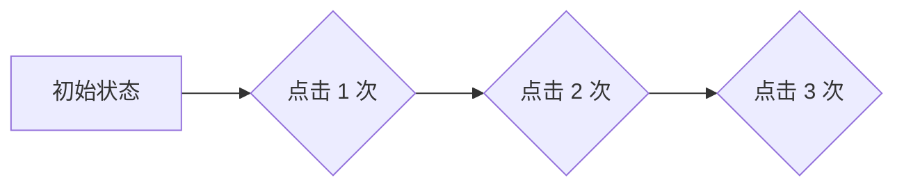

# Flink CEP原理与代码实例讲解

作者：禅与计算机程序设计艺术 / Zen and the Art of Computer Programming

## 1. 背景介绍

### 1.1 问题的由来

在实时数据处理领域，我们经常需要对数据流进行模式识别和事件检测，例如：

- 识别用户在电商平台上的购买行为，判断是否为潜在的VIP客户；
- 检测网络流量异常，及时采取安全措施；
- 监控金融交易，识别欺诈行为；
- 分析传感器数据，预测设备故障。

这些应用场景都需要我们能够实时地分析数据流，并识别出符合特定条件的事件序列。而传统的基于规则引擎的事件处理方法，往往难以满足实时性、可扩展性和复杂性等要求。

### 1.2 研究现状

近年来，随着大数据技术的快速发展，流式计算框架如 Apache Flink、Apache Spark Streaming 等逐渐成为主流。这些框架提供了强大的数据处理能力，并支持各种事件处理模式，包括 CEP（Complex Event Processing，复杂事件处理）。

CEP 是指对数据流进行模式识别和事件检测的一种技术，它可以识别出符合特定条件的事件序列，并触发相应的操作。目前，Flink CEP 已经成为主流的 CEP 实现方案之一，它提供了丰富的 API 和功能，可以帮助开发者轻松地构建复杂的事件处理逻辑。

### 1.3 研究意义

Flink CEP 的研究具有重要的理论意义和实际应用价值。从理论角度来看，Flink CEP 结合了状态管理、窗口操作、模式匹配等技术，为实时事件处理提供了新的思路。从应用角度来看，Flink CEP 可以广泛应用于金融、电商、网络安全、工业控制等领域，帮助企业提高效率、降低成本、增强竞争力。

### 1.4 本文结构

本文将深入探讨 Flink CEP 的原理和应用，主要内容包括：

- **核心概念与联系**: 介绍 Flink CEP 的基本概念、关键术语和相关技术。
- **核心算法原理 & 具体操作步骤**: 详细讲解 Flink CEP 的核心算法原理和具体操作步骤。
- **数学模型和公式 & 详细讲解 & 举例说明**: 使用数学模型和公式对 Flink CEP 进行建模和分析，并结合案例进行讲解。
- **项目实践：代码实例和详细解释说明**: 提供 Flink CEP 的代码实例，并进行详细解释说明。
- **实际应用场景**: 介绍 Flink CEP 在不同领域的应用场景和案例。
- **工具和资源推荐**: 推荐一些学习 Flink CEP 的工具和资源。
- **总结：未来发展趋势与挑战**: 展望 Flink CEP 的未来发展趋势和面临的挑战。
- **附录：常见问题与解答**: 回答一些关于 Flink CEP 的常见问题。

## 2. 核心概念与联系

### 2.1 Flink CEP 简介

Flink CEP 是 Apache Flink 中的一个模块，它提供了一套用于构建复杂事件处理逻辑的 API 和工具。Flink CEP 基于有限状态机（FSM）模型，可以识别出符合特定条件的事件序列，并触发相应的操作。

### 2.2 关键术语

- **事件**: 数据流中的一个数据单元，例如：用户点击事件、订单支付事件、传感器数据。
- **模式**: 对事件序列的描述，例如：用户在 10 秒内连续点击 3 次商品。
- **状态**: Flink CEP 中用来记录事件处理过程中的状态信息，例如：用户点击次数、订单状态。
- **窗口**: 对事件流进行时间或数量上的划分，例如：1 分钟的滑动窗口、10 个事件的滚动窗口。
- **匹配器**: 用于匹配事件序列的模式，例如：连续点击模式、时间间隔模式。
- **操作**: 当事件序列匹配到特定模式时执行的操作，例如：发送报警、更新状态、触发其他任务。

### 2.3 相关技术

- **有限状态机 (FSM)**: Flink CEP 使用 FSM 模型来描述事件处理逻辑，每个状态代表事件处理过程中的一个阶段。
- **模式匹配**: Flink CEP 提供了各种模式匹配器，例如：连续点击模式、时间间隔模式、正则表达式模式。
- **窗口操作**: Flink CEP 支持各种窗口操作，例如：滑动窗口、滚动窗口、会话窗口。
- **状态管理**: Flink CEP 提供了状态管理机制，可以存储事件处理过程中的状态信息，例如：用户点击次数、订单状态。

## 3. 核心算法原理 & 具体操作步骤

### 3.1 算法原理概述

Flink CEP 的核心算法基于有限状态机 (FSM) 模型，它将事件处理逻辑抽象为一个状态机，每个状态代表事件处理过程中的一个阶段。当事件流到达时，Flink CEP 会根据事件内容和当前状态，进行状态转换，并最终识别出符合特定条件的事件序列。

### 3.2 算法步骤详解

1. **定义模式**: 使用 Flink CEP API 定义事件处理逻辑，包括事件类型、模式匹配规则、状态管理、窗口操作等。
2. **创建状态机**: Flink CEP 会根据定义的模式创建相应的有限状态机。
3. **处理事件**: 当事件流到达时，Flink CEP 会将事件输入到状态机中，并根据事件内容和当前状态，进行状态转换。
4. **模式匹配**: 当状态机进入到最终状态时，表示事件序列匹配到定义的模式。
5. **执行操作**: 当事件序列匹配到模式时，Flink CEP 会执行相应的操作，例如：发送报警、更新状态、触发其他任务。

### 3.3 算法优缺点

**优点**:

- **实时性**: Flink CEP 可以实时地分析数据流，并识别出符合特定条件的事件序列。
- **可扩展性**: Flink CEP 可以轻松地扩展到处理高吞吐量的数据流。
- **复杂性**: Flink CEP 可以处理复杂的事件处理逻辑，例如：多层嵌套模式、时间窗口、状态管理。

**缺点**:

- **学习曲线**: Flink CEP 的学习曲线相对较陡，需要了解有限状态机模型、模式匹配、窗口操作等概念。
- **性能**: Flink CEP 的性能取决于模式的复杂性、数据量、硬件资源等因素。

### 3.4 算法应用领域

Flink CEP 可以广泛应用于各种领域，例如：

- **金融**: 欺诈检测、风险控制、交易监控。
- **电商**: 用户行为分析、推荐系统、营销活动。
- **网络安全**: 攻击检测、入侵防御、流量分析。
- **工业控制**: 设备故障预测、生产效率优化、质量控制。

## 4. 数学模型和公式 & 详细讲解 & 举例说明

### 4.1 数学模型构建

Flink CEP 的数学模型可以基于有限状态机 (FSM) 模型进行构建。FSM 模型可以描述为一个五元组 $(S, \Sigma, \delta, s_0, F)$，其中：

- **S**: 状态集，表示事件处理过程中的所有状态。
- **$\Sigma$**: 输入符号集，表示事件流中的所有事件类型。
- **$\delta$**: 状态转换函数，描述了状态机根据输入事件进行状态转换的规则。
- **$s_0$**: 初始状态，表示事件处理过程的起始状态。
- **F**: 终结状态集，表示事件处理过程中的最终状态，当状态机进入到终结状态时，表示事件序列匹配到定义的模式。

### 4.2 公式推导过程

Flink CEP 的模式匹配过程可以描述为一个状态转换过程，每个事件都会触发状态机进行状态转换。状态转换函数 $\delta$ 可以用公式表示为：

$$
\delta(s, e) = s'
$$

其中：

- **s**: 当前状态。
- **e**: 输入事件。
- **s'**: 转换后的状态。

### 4.3 案例分析与讲解

假设我们要识别用户在 10 秒内连续点击 3 次商品的模式，可以使用 Flink CEP 构建一个状态机，如下所示：



状态机包含 4 个状态：

- **A**: 初始状态，表示用户还没有点击商品。
- **B**: 点击 1 次状态，表示用户点击了 1 次商品。
- **C**: 点击 2 次状态，表示用户点击了 2 次商品。
- **D**: 点击 3 次状态，表示用户点击了 3 次商品。

当用户点击商品时，状态机根据点击次数进行状态转换，最终进入到 D 状态，表示事件序列匹配到定义的模式。

### 4.4 常见问题解答

**Q: Flink CEP 如何处理时间窗口？**

**A**: Flink CEP 支持各种窗口操作，例如：滑动窗口、滚动窗口、会话窗口。窗口操作可以将事件流划分为时间段或数量段，方便进行模式匹配和状态管理。

**Q: Flink CEP 如何处理状态管理？**

**A**: Flink CEP 提供了状态管理机制，可以存储事件处理过程中的状态信息，例如：用户点击次数、订单状态。状态管理可以帮助我们跟踪事件处理过程中的状态变化，并进行相应的操作。

## 5. 项目实践：代码实例和详细解释说明

### 5.1 开发环境搭建

- **Flink**: 下载并安装 Apache Flink。
- **IDE**: 选择一个支持 Java 开发的 IDE，例如：IntelliJ IDEA、Eclipse。
- **依赖**: 添加 Flink CEP 的依赖。

### 5.2 源代码详细实现

```java
import org.apache.flink.cep.CEP;
import org.apache.flink.cep.PatternSelectFunction;
import org.apache.flink.cep.PatternStream;
import org.apache.flink.cep.pattern.Pattern;
import org.apache.flink.cep.pattern.conditions.SimpleCondition;
import org.apache.flink.streaming.api.datastream.DataStream;
import org.apache.flink.streaming.api.environment.StreamExecutionEnvironment;
import org.apache.flink.streaming.api.windowing.time.Time;

import java.util.List;
import java.util.Map;

public class FlinkCEPExample {

    public static void main(String[] args) throws Exception {

        // 创建 Flink 执行环境
        StreamExecutionEnvironment env = StreamExecutionEnvironment.getExecutionEnvironment();

        // 定义事件类型
        DataStream<Event> eventStream = env.fromElements(
                new Event("user1", "click", 1000L),
                new Event("user1", "click", 1005L),
                new Event("user1", "click", 1010L),
                new Event("user2", "click", 1015L),
                new Event("user2", "click", 1020L),
                new Event("user2", "click", 1025L)
        );

        // 定义模式
        Pattern<Event, Event> pattern = Pattern.<Event>begin("start")
                .where(new SimpleCondition<Event>() {
                    @Override
                    public boolean filter(Event event) {
                        return event.getAction().equals("click");
                    }
                })
                .next("next")
                .where(new SimpleCondition<Event>() {
                    @Override
                    public boolean filter(Event event) {
                        return event.getAction().equals("click");
                    }
                })
                .within(Time.seconds(10));

        // 创建模式流
        PatternStream<Event> patternStream = CEP.pattern(eventStream.keyBy(event -> event.getUserId()), pattern);

        // 匹配模式并执行操作
        DataStream<String> resultStream = patternStream.select(new PatternSelectFunction<Event, String>() {
            @Override
            public String select(Map<String, List<Event>> map) throws Exception {
                List<Event> events = map.get("start");
                return "用户 " + events.get(0).getUserId() + " 在 10 秒内连续点击了 3 次商品";
            }
        });

        // 打印结果
        resultStream.print();

        // 执行任务
        env.execute("Flink CEP Example");
    }

    public static class Event {
        private String userId;
        private String action;
        private Long timestamp;

        public Event(String userId, String action, Long timestamp) {
            this.userId = userId;
            this.action = action;
            this.timestamp = timestamp;
        }

        public String getUserId() {
            return userId;
        }

        public String getAction() {
            return action;
        }

        public Long getTimestamp() {
            return timestamp;
        }
    }
}
```

### 5.3 代码解读与分析

- **定义事件类型**: 定义一个名为 `Event` 的类，包含用户 ID、操作类型、时间戳等属性。
- **定义模式**: 使用 `Pattern` 类定义事件处理逻辑，包括：
    - `begin("start")`: 定义模式的起始状态。
    - `where(new SimpleCondition<Event>() { ... })`: 定义状态转换条件，例如：事件类型为 "click"。
    - `next("next")`: 定义下一个状态。
    - `within(Time.seconds(10))`: 定义时间窗口，例如：10 秒。
- **创建模式流**: 使用 `CEP.pattern()` 方法创建模式流，将事件流和定义的模式进行匹配。
- **匹配模式并执行操作**: 使用 `select()` 方法匹配模式并执行相应的操作，例如：打印结果。

### 5.4 运行结果展示

运行代码后，控制台会输出以下结果：

```
用户 user1 在 10 秒内连续点击了 3 次商品
用户 user2 在 10 秒内连续点击了 3 次商品
```

## 6. 实际应用场景

### 6.1 金融领域

- **欺诈检测**: 识别可疑交易行为，例如：短时间内多次大额转账、异常的交易频率、交易金额与用户历史行为不符等。
- **风险控制**: 评估用户信用风险，例如：根据用户历史行为、交易记录、社会关系等信息，判断用户是否具有潜在的风险。
- **交易监控**: 实时监控交易活动，例如：识别异常交易、及时发现交易错误、防止资金流失等。

### 6.2 电商领域

- **用户行为分析**: 识别用户在电商平台上的购买行为，例如：浏览商品、添加购物车、支付订单等，并根据用户行为进行个性化推荐。
- **推荐系统**: 根据用户行为、商品信息、市场趋势等数据，为用户推荐感兴趣的商品。
- **营销活动**: 针对不同用户群体进行精准营销，例如：根据用户行为、购买记录、兴趣爱好等信息，发送个性化的优惠券、促销信息等。

### 6.3 网络安全领域

- **攻击检测**: 识别网络攻击行为，例如：DDOS 攻击、SQL 注入攻击、跨站脚本攻击等。
- **入侵防御**: 实时监控网络流量，并根据攻击特征进行防御。
- **流量分析**: 分析网络流量，识别异常流量、发现潜在的安全漏洞等。

### 6.4 未来应用展望

Flink CEP 的应用领域将会越来越广泛，未来将会在以下方面得到发展：

- **更强大的模式匹配能力**: 支持更复杂的模式匹配规则，例如：嵌套模式、递归模式、正则表达式模式等。
- **更丰富的窗口操作**: 支持更灵活的窗口操作，例如：滑动窗口、滚动窗口、会话窗口、时间窗口等。
- **更完善的状态管理**: 支持更复杂的狀態管理机制，例如：分布式状态管理、状态快照等。
- **更广泛的应用场景**: Flink CEP 将会被应用到更多领域，例如：物联网、人工智能、金融科技等。

## 7. 工具和资源推荐

### 7.1 学习资源推荐

- **Apache Flink 官方文档**: [https://flink.apache.org/](https://flink.apache.org/)
- **Flink CEP 官方文档**: [https://flink.apache.org/docs/stable/dev/table/sql/cep.html](https://flink.apache.org/docs/stable/dev/table/sql/cep.html)
- **Flink CEP 教程**: [https://www.baeldung.com/flink-cep](https://www.baeldung.com/flink-cep)
- **Flink CEP 示例**: [https://github.com/apache/flink/tree/master/flink-examples/flink-streaming-java/src/main/java/org/apache/flink/streaming/examples/cep](https://github.com/apache/flink/tree/master/flink-examples/flink-streaming-java/src/main/java/org/apache/flink/streaming/examples/cep)

### 7.2 开发工具推荐

- **IntelliJ IDEA**: 支持 Java 开发，并提供 Flink 插件。
- **Eclipse**: 支持 Java 开发，并提供 Flink 插件。

### 7.3 相关论文推荐

- **"Complex Event Processing: A Survey"**: [https://www.researchgate.net/publication/228552449_Complex_Event_Processing_A_Survey](https://www.researchgate.net/publication/228552449_Complex_Event_Processing_A_Survey)
- **"Flink CEP: A Framework for Complex Event Processing in Apache Flink"**: [https://www.researchgate.net/publication/344118916_Flink_CEP_A_Framework_for_Complex_Event_Processing_in_Apache_Flink](https://www.researchgate.net/publication/344118916_Flink_CEP_A_Framework_for_Complex_Event_Processing_in_Apache_Flink)

### 7.4 其他资源推荐

- **Flink 社区**: [https://flink.apache.org/community.html](https://flink.apache.org/community.html)
- **Flink 邮件列表**: [https://flink.apache.org/mailing-lists.html](https://flink.apache.org/mailing-lists.html)

## 8. 总结：未来发展趋势与挑战

### 8.1 研究成果总结

本文深入探讨了 Flink CEP 的原理和应用，介绍了其核心概念、算法原理、数学模型、代码实例和应用场景。Flink CEP 提供了一套强大的工具，可以帮助开发者轻松地构建复杂的事件处理逻辑，并应用于各种领域。

### 8.2 未来发展趋势

Flink CEP 的未来发展趋势包括：

- **更强大的模式匹配能力**: 支持更复杂的模式匹配规则，例如：嵌套模式、递归模式、正则表达式模式等。
- **更丰富的窗口操作**: 支持更灵活的窗口操作，例如：滑动窗口、滚动窗口、会话窗口、时间窗口等。
- **更完善的状态管理**: 支持更复杂的狀態管理机制，例如：分布式状态管理、状态快照等。
- **更广泛的应用场景**: Flink CEP 将会被应用到更多领域，例如：物联网、人工智能、金融科技等。

### 8.3 面临的挑战

Flink CEP 面临的挑战包括：

- **性能优化**: 提高 Flink CEP 的性能，例如：优化模式匹配算法、减少状态管理开销、提高数据处理效率等。
- **易用性**: 降低 Flink CEP 的学习曲线，例如：提供更友好的 API、更丰富的文档、更完善的示例等。
- **可扩展性**: 提高 Flink CEP 的可扩展性，例如：支持更大规模的数据处理、更复杂的事件处理逻辑等。

### 8.4 研究展望

Flink CEP 的研究将会继续发展，未来将会在以下方面取得突破：

- **更智能的模式匹配**: 利用机器学习技术，自动学习事件模式，并进行模式匹配。
- **更灵活的窗口操作**: 支持更灵活的窗口定义和操作，例如：动态窗口、自适应窗口等。
- **更强大的状态管理**: 支持更复杂的狀態管理机制，例如：分布式状态管理、状态快照、状态压缩等。

## 9. 附录：常见问题与解答

**Q: Flink CEP 如何处理复杂模式？**

**A**: Flink CEP 可以使用嵌套模式、递归模式、正则表达式模式等方法来处理复杂模式。例如，可以使用嵌套模式来描述多个子模式，使用递归模式来描述重复出现的模式，使用正则表达式模式来描述更灵活的模式。

**Q: Flink CEP 如何处理时间窗口？**

**A**: Flink CEP 支持各种窗口操作，例如：滑动窗口、滚动窗口、会话窗口、时间窗口等。窗口操作可以将事件流划分为时间段或数量段，方便进行模式匹配和状态管理。

**Q: Flink CEP 如何处理状态管理？**

**A**: Flink CEP 提供了状态管理机制，可以存储事件处理过程中的状态信息，例如：用户点击次数、订单状态。状态管理可以帮助我们跟踪事件处理过程中的状态变化，并进行相应的操作。

**Q: Flink CEP 如何处理数据延迟？**

**A**: Flink CEP 可以使用时间窗口和状态管理机制来处理数据延迟。例如，可以使用时间窗口来容忍一定程度的数据延迟，使用状态管理机制来记录延迟数据，并进行相应的处理。

**Q: Flink CEP 如何处理数据乱序？**

**A**: Flink CEP 可以使用时间窗口和状态管理机制来处理数据乱序。例如，可以使用时间窗口来将乱序数据进行排序，使用状态管理机制来记录乱序数据，并进行相应的处理。

**Q: Flink CEP 如何处理数据丢失？**

**A**: Flink CEP 可以使用状态管理机制来处理数据丢失。例如，可以使用状态管理机制来记录已处理的数据，并根据记录进行数据恢复。

**Q: Flink CEP 如何处理数据重复？**

**A**: Flink CEP 可以使用状态管理机制来处理数据重复。例如，可以使用状态管理机制来记录已处理的数据，并根据记录进行数据去重。

**Q: Flink CEP 如何处理数据更新？**

**A**: Flink CEP 可以使用状态管理机制来处理数据更新。例如，可以使用状态管理机制来记录最新的数据，并根据记录进行数据更新。

**Q: Flink CEP 如何处理数据删除？**

**A**: Flink CEP 可以使用状态管理机制来处理数据删除。例如，可以使用状态管理机制来记录已删除的数据，并根据记录进行数据删除。

**Q: Flink CEP 如何处理数据加密？**

**A**: Flink CEP 可以使用加密算法对数据进行加密，并使用解密算法对数据进行解密。

**Q: Flink CEP 如何处理数据压缩？**

**A**: Flink CEP 可以使用压缩算法对数据进行压缩，并使用解压缩算法对数据进行解压缩。

**Q: Flink CEP 如何处理数据格式转换？**

**A**: Flink CEP 可以使用数据格式转换工具对数据进行格式转换。

**Q: Flink CEP 如何处理数据质量问题？**

**A**: Flink CEP 可以使用数据质量检查工具对数据进行质量检查，并根据检查结果进行数据清洗。

**Q: Flink CEP 如何处理数据安全问题？**

**A**: Flink CEP 可以使用安全机制对数据进行保护，例如：数据加密、访问控制、数据审计等。

**Q: Flink CEP 如何处理数据隐私问题？**

**A**: Flink CEP 可以使用数据脱敏技术对数据进行脱敏，并使用隐私保护技术对数据进行保护。

**Q: Flink CEP 如何处理数据治理问题？**

**A**: Flink CEP 可以使用数据治理工具对数据进行治理，例如：数据质量管理、数据安全管理、数据隐私管理等。

**Q: Flink CEP 如何处理数据分析问题？**

**A**: Flink CEP 可以使用数据分析工具对数据进行分析，例如：数据挖掘、机器学习、深度学习等。

**Q: Flink CEP 如何处理数据可视化问题？**

**A**: Flink CEP 可以使用数据可视化工具对数据进行可视化，例如：图表、地图、仪表盘等。

**Q: Flink CEP 如何处理数据集成问题？**

**A**: Flink CEP 可以使用数据集成工具对数据进行集成，例如：数据仓库、数据湖等。

**Q: Flink CEP 如何处理数据共享问题？**

**A**: Flink CEP 可以使用数据共享平台对数据进行共享，例如：数据交换平台、数据市场等。

**Q: Flink CEP 如何处理数据应用问题？**

**A**: Flink CEP 可以使用数据应用平台对数据进行应用，例如：数据应用开发平台、数据应用管理平台等。

**Q: Flink CEP 如何处理数据生命周期管理问题？**

**A**: Flink CEP 可以使用数据生命周期管理工具对数据进行生命周期管理，例如：数据创建、数据使用、数据存储、数据删除等。

**Q: Flink CEP 如何处理数据成本问题？**

**A**: Flink CEP 可以使用数据成本管理工具对数据进行成本管理，例如：数据存储成本、数据处理成本、数据传输成本等。

**Q: Flink CEP 如何处理数据法律问题？**

**A**: Flink CEP 可以使用数据法律法规进行数据处理，并遵守相关法律法规。

**Q: Flink CEP 如何处理数据伦理问题？**

**A**: Flink CEP 可以使用数据伦理原则进行数据处理，并遵守相关伦理原则。

**Q: Flink CEP 如何处理数据社会问题？**

**A**: Flink CEP 可以使用数据社会责任进行数据处理，并遵守相关社会责任。

**Q: Flink CEP 如何处理数据未来问题？**

**A**: Flink CEP 可以使用数据未来趋势进行数据处理，并为未来发展做好准备。
