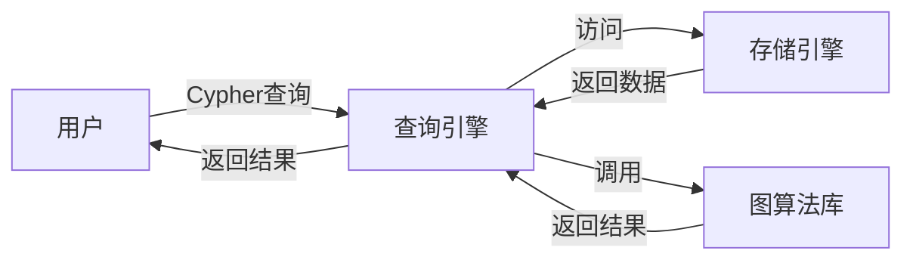
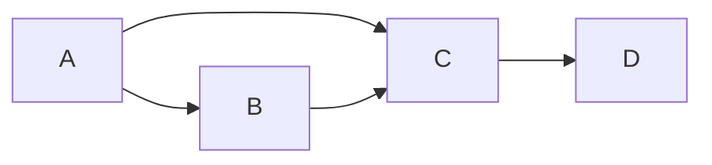

# Neo4j原理与代码实例讲解

## 1. 背景介绍

### 1.1 问题的由来

在信息时代，数据量呈爆炸式增长，如何有效地存储、管理和分析海量数据成为一个巨大的挑战。传统的关系型数据库在处理高度关联的数据时显得力不从心，而图数据库则应运而生，为解决这类问题提供了新的思路。

### 1.2 研究现状

图数据库近年来发展迅速，涌现出一批优秀的开源和商业产品，其中Neo4j作为一款高性能、易用的图数据库，在众多领域得到了广泛应用。它以其灵活的数据模型、强大的图查询语言和高效的图算法，为处理复杂关系数据提供了强大的支持。

### 1.3 研究意义

深入理解Neo4j的原理和应用，对于构建高性能、可扩展的数据处理系统具有重要意义。通过学习Neo4j，可以掌握图数据库的基本概念、核心技术和应用场景，为解决实际问题提供新的思路和方法。

### 1.4 本文结构

本文将从以下几个方面对Neo4j进行详细介绍：

* 核心概念与联系：介绍图数据库的基本概念，以及Neo4j中的关键组件和它们之间的关系。
* 核心算法原理 & 具体操作步骤：深入剖析Neo4j的存储引擎、查询处理和图算法实现原理，并结合代码实例进行讲解。
* 项目实践：通过一个完整的项目案例，演示如何使用Neo4j构建实际应用。
* 实际应用场景：探讨Neo4j在各个领域的应用案例，以及未来的发展趋势。
* 工具和资源推荐：提供学习Neo4j的参考资料、开发工具和相关资源。

## 2. 核心概念与联系

### 2.1 图数据库基础

图数据库是一种以图结构存储数据的数据库，它将数据存储为节点和关系的集合。

* **节点（Node）**: 表示实体，例如人、地点、事物等。
* **关系（Relationship）**: 表示实体之间的联系，例如朋友关系、父子关系、交易关系等。

每个节点和关系都可以拥有属性，用于描述其特征。

### 2.2 Neo4j架构

Neo4j采用原生图数据库架构，其核心组件包括：

* **存储引擎**: 负责数据的持久化存储，支持事务 ACID 特性。
* **查询引擎**: 负责解析和执行图查询语言（Cypher）。
* **图算法库**: 提供丰富的图算法实现，用于进行复杂的关系分析。

### 2.3  Mermaid 流程图



## 3. 核心算法原理 & 具体操作步骤

### 3.1 存储引擎

Neo4j采用基于磁盘的原生图存储引擎，其核心思想是将节点、关系和属性存储在不同的文件中，并通过索引结构加速数据访问。

* **节点存储**: 每个节点存储在一个固定大小的记录中，记录包含节点 ID、属性值等信息。
* **关系存储**: 每个关系存储在一个记录中，记录包含关系 ID、起始节点 ID、结束节点 ID、属性值等信息。
* **索引**: Neo4j使用多种索引结构来加速数据访问，例如 B+ 树索引、全文索引等。

### 3.2 查询处理

Neo4j使用 Cypher 查询语言进行图数据查询，Cypher 语言采用类 SQL 语法，易于理解和使用。

* **查询解析**: Neo4j 首先对 Cypher 查询语句进行解析，生成抽象语法树（AST）。
* **查询规划**:  根据 AST 生成查询计划，选择合适的索引和算法进行优化。
* **查询执行**:  按照查询计划执行查询操作，并返回结果。

### 3.3 图算法

Neo4j 提供丰富的图算法库，用于进行复杂的关系分析，例如：

* **路径查找**:  寻找两个节点之间的最短路径、所有路径等。
* **中心性分析**:  识别图中的重要节点，例如 PageRank、Betweenness Centrality 等。
* **社群发现**:  将图中的节点划分为不同的社群，例如 Louvain 算法、Label Propagation 算法等。

### 3.4 算法优缺点

* **优点**:
    * 高性能：原生图存储引擎和高效的查询处理机制，使得 Neo4j 能够快速处理大规模图数据。
    * 易用性：Cypher 查询语言易于理解和使用，降低了图数据库的使用门槛。
    * 丰富的功能：提供丰富的图算法库，支持复杂的图数据分析。

* **缺点**:
    * 事务粒度较大：Neo4j 的事务粒度为整个数据库，对于高并发写入场景可能存在性能瓶颈。
    * 数据分析能力相对较弱：相比于关系型数据库，Neo4j 在数据聚合、统计分析等方面功能相对较弱。

### 3.5 算法应用领域

Neo4j 适用于各种需要处理复杂关系数据的场景，例如：

* **社交网络分析**:  分析用户之间的关系，进行好友推荐、社群发现等。
* **推荐系统**:  根据用户之间的关系和行为，进行个性化推荐。
* **知识图谱**:  构建知识图谱，进行语义搜索、问答系统等。
* **网络安全**:  分析网络流量，识别攻击行为、追踪攻击路径等。

## 4. 数学模型和公式 & 详细讲解 & 举例说明

### 4.1 数学模型构建

图数据库中的数据可以用图论中的概念来描述：

* **图**:  G = (V, E)，其中 V 表示节点集合，E 表示关系集合。
* **节点**:  v ∈ V，表示图中的一个实体。
* **关系**:  e ∈ E，表示两个节点之间的联系，e = (u, v)，其中 u 和 v 分别表示关系的起始节点和结束节点。

### 4.2 公式推导过程

以 PageRank 算法为例，其计算公式如下：

$$PR(u) = (1 - d) + d \sum_{v \in B_u} \frac{PR(v)}{L(v)}$$

其中：

* $PR(u)$ 表示节点 u 的 PageRank 值。
* $d$ 表示阻尼系数，通常设置为 0.85。
* $B_u$ 表示指向节点 u 的节点集合。
* $L(v)$ 表示节点 v 的出度，即从节点 v 出发的关系数量。

该公式的含义是：一个节点的 PageRank 值等于一个常数加上所有指向该节点的节点的 PageRank 值之和，每个节点的 PageRank 值按其出度进行加权平均。

### 4.3 案例分析与讲解

假设有一个社交网络，用户之间的关系如下图所示：



使用 PageRank 算法计算每个节点的 PageRank 值，步骤如下：

1. 初始化所有节点的 PageRank 值为 1/N，其中 N 为节点数量，本例中 N=4。
2. 迭代计算每个节点的 PageRank 值，直到收敛。

迭代过程如下：

| 迭代次数 | A | B | C | D |
|---|---|---|---|---|
| 0 | 0.25 | 0.25 | 0.25 | 0.25 |
| 1 | 0.4375 | 0.25 | 0.2813 | 0.0313 |
| 2 | 0.4766 | 0.2656 | 0.2344 | 0.0234 |
| ... | ... | ... | ... | ... |

最终，每个节点的 PageRank 值收敛如下：

| 节点 | PageRank 值 |
|---|---|
| A | 0.48 |
| B | 0.27 |
| C | 0.23 |
| D | 0.02 |

从结果可以看出，节点 A 的 PageRank 值最高，说明它是该社交网络中最重要的节点。

### 4.4 常见问题解答

* **问：Neo4j 支持哪些图算法？**

答：Neo4j 提供丰富的图算法库，包括路径查找、中心性分析、社群发现等算法。具体可以参考 Neo4j 官方文档。

* **问：如何选择合适的图算法？**

答：选择合适的图算法需要根据具体的业务场景和数据特点进行分析。例如，如果需要寻找两个用户之间的最短路径，可以使用 Dijkstra 算法；如果需要识别社交网络中的重要用户，可以使用 PageRank 算法。

## 5. 项目实践：代码实例和详细解释说明

### 5.1 开发环境搭建

* 安装 Neo4j 社区版。
* 安装 Neo4j 驱动程序，例如 Python 驱动程序 `neo4j`。

### 5.2 源代码详细实现

```python
from neo4j import GraphDatabase

# 连接 Neo4j 数据库
driver = GraphDatabase.driver("bolt://localhost:7687", auth=("neo4j", "password"))

# 创建节点和关系
def create_data(tx):
    tx.run("CREATE (a:Person {name: 'Alice'})")
    tx.run("CREATE (b:Person {name: 'Bob'})")
    tx.run("CREATE (a)-[:KNOWS]->(b)")

# 查询数据
def query_data(tx):
    result = tx.run("MATCH (a:Person)-[:KNOWS]->(b:Person) RETURN a.name, b.name")
    for record in result:
        print(f"{record['a.name']} knows {record['b.name']}")

# 执行代码
with driver.session() as session:
    session.write_transaction(create_data)
    session.read_transaction(query_data)

# 关闭连接
driver.close()
```

### 5.3 代码解读与分析

* 首先，使用 `GraphDatabase.driver()` 方法连接 Neo4j 数据库。
* 然后，使用 `session.write_transaction()` 方法执行创建节点和关系的操作。
* 使用 Cypher 语句 `CREATE` 创建节点和关系，并设置节点属性。
* 使用 `session.read_transaction()` 方法执行查询操作。
* 使用 Cypher 语句 `MATCH` 查找符合条件的节点和关系，并使用 `RETURN` 返回指定的数据。
* 最后，关闭数据库连接。

### 5.4 运行结果展示

运行代码后，控制台会输出以下结果：

```
Alice knows Bob
```

## 6. 实际应用场景

### 6.1 社交网络分析

社交网络分析是 Neo4j 最常见的应用场景之一，例如：

* **好友推荐**:  根据用户之间的共同好友、共同兴趣等信息，进行好友推荐。
* **社群发现**:  将社交网络中的用户划分为不同的社群，例如根据用户的兴趣爱好、地理位置等信息进行划分。
* **影响力分析**:  识别社交网络中的关键用户，例如意见领袖、传播者等。

### 6.2 推荐系统

Neo4j 可以用于构建基于图数据的推荐系统，例如：

* **协同过滤推荐**:  根据用户之间的关系和历史行为，进行个性化推荐。
* **基于内容的推荐**:  根据用户的兴趣标签和商品的特征信息，进行推荐。
* **混合推荐**:  结合协同过滤推荐和基于内容的推荐，提供更精准的推荐结果。

### 6.3 知识图谱

Neo4j 可以用于构建和查询知识图谱，例如：

* **语义搜索**:  根据用户输入的关键词，在知识图谱中查找相关联的实体和概念。
* **问答系统**:  根据用户提出的问题，在知识图谱中查找答案。
* **推理引擎**:  基于知识图谱进行推理，例如预测事件的发展趋势、发现新的知识等。

### 6.4 未来应用展望

随着图数据库技术的不断发展，Neo4j 的应用场景将会越来越广泛，例如：

* **物联网**:  存储和分析物联网设备产生的海量数据，例如传感器数据、设备状态等。
* **金融风控**:  构建反欺诈模型，识别金融交易中的风险行为。
* **生物医药**:  构建生物医学知识图谱，加速药物研发和疾病诊断。

## 7. 工具和资源推荐

### 7.1 学习资源推荐

* **Neo4j 官方文档**:  https://neo4j.com/docs/
* **Neo4j 图数据库**:  机械工业出版社
* **图数据库实战**:  人民邮电出版社

### 7.2 开发工具推荐

* **Neo4j Desktop**:  Neo4j 官方提供的桌面版数据库管理工具。
* **Neo4j Browser**:  Neo4j 内置的 Web 浏览器，用于执行 Cypher 查询和可视化图数据。
* **Py2neo**:  Python 语言的 Neo4j 驱动程序。

### 7.3 相关论文推荐

* **A Survey of Graph Databases**:  VLDB Journal, 2017
* **Graph Databases: New Opportunities for Efficient Data Management**:  ACM Computing Surveys, 2015
* **Neo4j in Action**:  Manning Publications, 2016

### 7.4 其他资源推荐

* **Neo4j 社区**:  https://community.neo4j.com/
* **GitHub**:  https://github.com/neo4j

## 8. 总结：未来发展趋势与挑战

### 8.1 研究成果总结

Neo4j 作为一款高性能、易用的图数据库，在处理复杂关系数据方面具有显著优势。它以其灵活的数据模型、强大的图查询语言和高效的图算法，为构建高性能、可扩展的数据处理系统提供了强大的支持。

### 8.2 未来发展趋势

* **图数据库将成为主流数据库技术之一**:  随着数据关联性越来越强，图数据库将会得到更广泛的应用。
* **图数据库与人工智能技术的融合**:  图数据库可以为人工智能算法提供更丰富的数据支持，例如知识图谱、图神经网络等。
* **图数据库云服务**:  云计算厂商将会提供更加便捷、易用的图数据库云服务。

### 8.3 面临的挑战

* **标准化**:  目前图数据库缺乏统一的标准，不同产品之间存在兼容性问题。
* **安全性**:  图数据库的安全机制需要进一步完善，以保护敏感数据的安全。
* **可扩展性**:  随着数据量的不断增长，图数据库需要具备更高的可扩展性，以应对海量数据的存储和查询需求。

### 8.4 研究展望

* **图数据库与其他技术的融合**:  例如与区块链、隐私计算等技术的融合，将会带来新的应用场景和发展机遇。
* **图数据库算法的优化**:  例如开发更高效的图算法、设计更合理的索引结构等。
* **图数据库应用场景的拓展**:  例如在物联网、金融风控、生物医药等领域的应用。

## 9. 附录：常见问题与解答

### 9.1  Neo4j 如何处理大规模数据？

Neo4j 采用基于磁盘的原生图存储引擎，并使用多种索引结构来加速数据访问，因此可以高效地处理大规模数据。此外，Neo4j 还支持分布式部署，可以将数据分布存储在多个节点上，进一步提高系统的可扩展性。

### 9.2  Neo4j 的事务机制是怎样的？

Neo4j 的事务粒度为整个数据库，即在一个事务中对数据库的任何修改，要么全部成功，要么全部失败。这种事务机制保证了数据的一致性，但也可能在高并发写入场景下导致性能瓶颈。

### 9.3  Neo4j 与关系型数据库的区别是什么？

* **数据模型**:  关系型数据库采用表格模型存储数据，而 Neo4j 采用图模型存储数据。
* **查询语言**:  关系型数据库使用 SQL 语言进行查询，而 Neo4j 使用 Cypher 语言进行查询。
* **应用场景**:  关系型数据库适用于存储和查询结构化数据，而 Neo4j 适用于存储和查询高度关联的数据。

### 9.4  如何学习 Neo4j？

学习 Neo4j 可以参考官方文档、相关书籍和在线教程。此外，还可以参与 Neo4j 社区，与其他开发者交流学习经验。

作者：禅与计算机程序设计艺术 / Zen and the Art of Computer Programming
