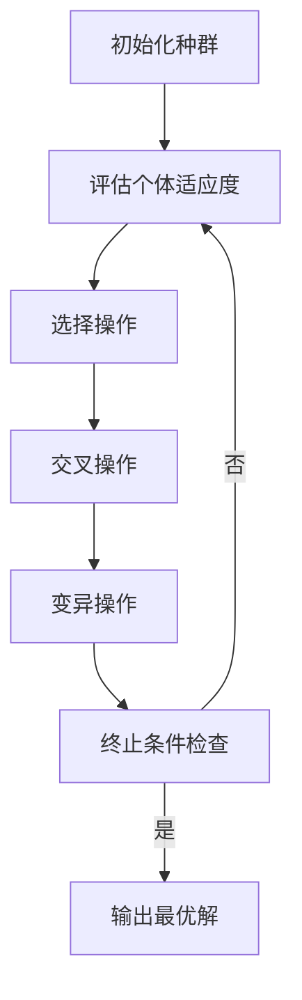

# Python机器学习实战：实现与优化遗传算法

## 1. 背景介绍

### 1.1 问题的由来

在现实世界中,我们经常会遇到各种优化问题,例如旅行商问题、作业调度问题、投资组合优化等。这些问题通常具有非线性、多峰值、高维等特点,使得传统的数学方法和确定性算法难以高效求解。遗传算法(Genetic Algorithm, GA)作为一种启发式搜索优化算法,模拟生物进化过程,具有全局寻优、鲁棒性强等优点,被广泛应用于各个领域的优化问题求解。

### 1.2 研究现状

遗传算法最早由约翰·霍兰德(John Holland)于20世纪70年代在密歇根大学提出,旨在模拟生物进化过程,用于解决复杂的优化问题。自那以后,遗传算法在理论和应用上都取得了长足进展,成为解决实际问题的有力工具。目前,遗传算法已广泛应用于机器学习、计算机科学、工程设计、生物信息学、经济金融等诸多领域。

### 1.3 研究意义

遗传算法作为一种通用的优化算法,具有以下优点:

1. **全局优化能力强**:遗传算法通过种群并行搜索,能够有效避免陷入局部最优解。
2. **鲁棒性好**:遗传算法不需要太多先验知识,对初始值不敏感,能够适应各种环境。
3. **易于并行处理**:遗传算法的种群特性使其天然适合并行计算。
4. **易编码**:遗传算法只需将问题编码为适应度函数,无需复杂的数学推导。

因此,掌握遗传算法的实现与优化技巧,对于解决实际优化问题具有重要意义。

### 1.4 本文结构

本文将全面介绍遗传算法的基本原理、实现细节和优化技术,具体内容安排如下:

1. 核心概念与联系
2. 核心算法原理与具体操作步骤
3. 数学模型和公式及详细讲解
4. 项目实践:代码实例和详细解释说明
5. 实际应用场景
6. 工具和资源推荐
7. 总结:未来发展趋势与挑战
8. 附录:常见问题与解答

## 2. 核心概念与联系

遗传算法借鉴了生物进化的三个主要理念:遗传、变异和自然选择。

- **遗传(Inheritance)**:优良基因通过重组得以保留和传递。
- **变异(Mutation)**:基因的细微变化为进化提供新的可能性。
- **自然选择(Natural Selection)**:适者生存,不适者被淘汰。

遗传算法将这些理念应用于优化问题求解过程中:

1. **编码**:将优化问题的解空间编码为一组个体(染色体)的群体(种群)。
2. **评估**:通过适应度函数评估每个个体的优劣程度。
3. **选择**:根据适应度值,选择优良个体进行交叉变异操作。
4. **交叉(Crossover)**:模拟生物遗传行为,将亲代个体的部分基因组合形成新的子代个体。
5. **变异(Mutation)**:以一定概率对个体的部分基因进行突变,增加种群多样性。
6. **迭代**:重复选择、交叉、变异步骤,直至满足终止条件。

通过不断迭代,种群中的个体逐渐向着更优的解空间区域演化。

## 3. 核心算法原理与具体操作步骤

### 3.1 算法原理概述

遗传算法的核心思想是模拟生物进化过程,通过"生存竞争"和"遗传交叉变异"机制,使种群中的个体不断进化,最终获得最优解或近似最优解。算法流程如下:

1. **初始化种群**:根据问题的编码方式,随机生成一定数量的个体,构成初始种群。
2. **评估个体适应度**:计算每个个体的适应度值,作为选择操作的依据。
3. **选择操作**:根据适应度值,从当前种群中选择若干个体,作为交叉变异操作的亲本。
4. **交叉操作**:对选出的亲本个体进行交叉组合,产生新的子代个体。
5. **变异操作**:以一定的变异概率,对子代个体的部分基因进行突变。
6. **终止条件检查**:检查是否满足终止条件(如迭代次数、适应度阈值等),若满足则输出最优解,否则回到步骤2,进行下一轮迭代。

通过不断迭代,种群中的个体逐渐向着更优的解空间区域演化,最终获得满意的解。

### 3.2 算法步骤详解

1. **编码**

   首先需要将待优化问题的解空间编码为一组染色体(个体)的表示形式。常用的编码方式有二进制编码、浮点数编码、排列编码等。编码的好坏直接影响算法的性能。

2. **初始化种群**

   根据编码方式,随机生成一定数量的个体,构成初始种群。种群规模的选择需要权衡收敛速度和多样性。

3. **适应度函数设计**

   适应度函数用于评估每个个体的优劣程度,是遗传算法的核心部分。设计合理的适应度函数对算法性能至关重要。

4. **选择操作**

   根据个体的适应度值,从当前种群中选择若干个体,作为交叉变异操作的亲本。常用的选择方法有轮盘赌选择、排序选择、锦标赛选择等。

5. **交叉操作**

   交叉操作模拟生物遗传行为,将亲本个体的部分基因组合形成新的子代个体。常用的交叉方式有单点交叉、多点交叉、均匀交叉等。

6. **变异操作**

   以一定的变异概率,对子代个体的部分基因进行突变。变异操作为种群引入新的基因,有助于跳出局部最优解,维持种群多样性。

7. **新一代种群替换**

   将交叉变异后的子代个体加入种群,替换掉部分适应度较低的个体,形成新一代种群。

8. **终止条件检查**

   检查是否满足终止条件,如最大迭代次数、适应度阈值、无改善代数等。若满足则输出当前最优解,否则回到步骤3,进行下一轮迭代。

### 3.3 算法优缺点

**优点**:

- 全局优化能力强,不易陷入局部最优
- 无需连续、可导等条件约束
- 易于并行实现,加速收敛
- 具有隐性并行性,能同时处理多个搜索点
- 算法简单,易于编码实现

**缺点**:

- 缺乏理论收敛性证明
- 计算效率较低,需要大量迭代
- 参数设置对性能影响较大
- 求解高维复杂问题时,性能下降明显
- 存在"基因漂移"和"早熟收敛"等问题

### 3.4 算法应用领域

由于其全局寻优、鲁棒性强等优点,遗传算法已广泛应用于多个领域的优化问题:

- **组合优化**:旅行商问题、背包问题、流水线调度等
- **机器学习与模式识别**:特征选择、聚类分析、神经网络训练等
- **工程设计**:电路设计、控制系统参数优化、产品造型设计等
- **运筹与管理**:投资组合优化、资源分配、物流路径规划等
- **生物信息学**:基因编码、蛋白质结构预测、药物分子设计等
- **多目标优化**:同时优化多个目标函数
- **动态优化**:优化目标随时间变化的动态环境

## 4. 数学模型和公式及详细讲解

### 4.1 数学模型构建

在正式实现遗传算法之前,我们需要将待优化问题建模为适应度函数的形式。以下以经典的0-1背包问题为例,介绍数学模型的构建过程。

0-1背包问题可描述为:给定一组物品,每个物品都有自己的重量和价值,在总重量不超过给定背包容量的前提下,如何选择物品,使背包中物品的总价值最大。

令:
- $n$为物品个数
- $w_i$为第$i$个物品的重量
- $v_i$为第$i$个物品的价值
- $W$为背包的最大容量
- $x_i$为决策变量,取0或1,表示是否选择第$i$个物品

则该问题可建模为如下0-1整数规划问题:

$$
\begin{aligned}
\max \quad & \sum_{i=1}^n v_i x_i \\
\text{s.t.}\quad & \sum_{i=1}^n w_i x_i \leq W\\
& x_i \in \{0, 1\}, \quad i = 1, 2, \cdots, n
\end{aligned}
$$

其中,目标函数$\sum_{i=1}^n v_i x_i$表示背包中物品的总价值;约束条件$\sum_{i=1}^n w_i x_i \leq W$确保总重量不超过背包容量;$x_i$为0-1决策变量,表示是否选择第$i$个物品。

在遗传算法中,我们将以上0-1整数规划问题转化为如下适应度函数的最大化问题:

$$
\begin{aligned}
\max \quad & f(x) = \sum_{i=1}^n v_i x_i \\
\text{s.t.}\quad & g(x) = \sum_{i=1}^n w_i x_i \leq W\\
& x_i \in \{0, 1\}, \quad i = 1, 2, \cdots, n
\end{aligned}
$$

其中,$f(x)$为适应度函数,$g(x)$为约束条件。遗传算法的目标是在满足约束条件的前提下,寻找使适应度函数$f(x)$最大的解$x^*$。

### 4.2 公式推导过程

在遗传算法的选择操作中,个体被选中的概率应与其适应度值成正比。常用的选择方法是轮盘赌选择(Roulette Wheel Selection)。

假设种群中有$N$个个体,第$i$个个体的适应度值为$f_i$,则其被选中的概率$p_i$可按如下方式计算:

$$
p_i = \frac{f_i}{\sum_{j=1}^N f_j}
$$

为了避免出现$f_i \leq 0$的情况,我们通常对适应度值进行线性缩放变换,将最小适应度值映射为一个小正数$C$:

$$
f_i' = f_i - f_{\min} + C
$$

其中,$f_{\min}$为种群中的最小适应度值。

则第$i$个个体被选中的概率为:

$$
p_i = \frac{f_i'}{\sum_{j=1}^N f_j'}
$$

在实际实现中,我们可以构建一个累积概率分布,然后在[0,1]区间内均匀随机抽取一个数,根据它所落在的区间来确定选择哪个个体。

### 4.3 案例分析与讲解

以上一节的0-1背包问题为例,我们具体分析遗传算法的实现过程。

假设有5件物品,重量和价值如下:

| 物品编号 | 重量($w_i$) | 价值($v_i$) |
| -------- | ----------- | ----------- |
| 1        | 2           | 6           |
| 2        | 5           | 3           |
| 3        | 7           | 5           |
| 4        | 4           | 9           |
| 5        | 3           | 7           |

背包的最大容量$W=10$。

1. **编码**

   我们采用二进制编码,每个个体由5个二进制位组成,表示是否选择对应的物品。例如,个体"10110"表示选择了第1、2、4个物品。

2. **初始化种群**

   假设种群规模为8,我们随机生成8个