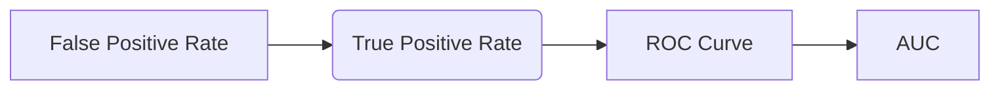

# ROC Curve 原理与代码实战案例讲解

## 1. 背景介绍

### 1.1  问题的由来

在机器学习领域，模型评估是至关重要的环节。我们希望构建的模型能够准确地预测目标变量，并对未知数据具有良好的泛化能力。然而，现实世界中的数据往往存在噪声、缺失值、样本不均衡等问题，导致模型评估变得复杂。为了更好地评估模型性能，需要引入合适的指标和方法。

ROC曲线 (Receiver Operating Characteristic Curve) 作为一种常用的模型评估指标，能够直观地展示模型在不同阈值下对正负样本的区分能力，为模型选择和优化提供了重要的参考依据。

### 1.2  研究现状

ROC曲线最早应用于雷达信号检测领域，用于评估雷达系统对目标信号的识别能力。近年来，随着机器学习技术的快速发展，ROC曲线在分类、回归、异常检测等多个领域得到了广泛应用。许多研究者针对ROC曲线进行了深入研究，提出了各种改进算法和应用方法。

### 1.3  研究意义

ROC曲线能够提供模型性能的全面评估，帮助我们：

- **选择最佳阈值:** 针对特定应用场景，选择最优的阈值，以最大化模型的预测准确率。
- **比较不同模型:** 通过比较不同模型的ROC曲线，可以直观地判断哪个模型的性能更好。
- **分析模型偏差:** ROC曲线能够揭示模型对正负样本的区分能力差异，帮助我们分析模型偏差并进行相应的调整。

### 1.4  本文结构

本文将从以下几个方面对ROC曲线进行深入讲解：

- **核心概念与联系:** 介绍ROC曲线的定义、基本概念和与其他指标的关系。
- **核心算法原理 & 具体操作步骤:** 详细阐述ROC曲线的计算过程和绘制方法。
- **数学模型和公式 & 详细讲解 & 举例说明:** 使用数学模型和公式对ROC曲线进行解释，并结合案例进行分析。
- **项目实践：代码实例和详细解释说明:** 提供Python代码示例，演示如何使用Scikit-learn库绘制ROC曲线。
- **实际应用场景:** 介绍ROC曲线在不同领域的应用场景。
- **工具和资源推荐:** 推荐一些学习ROC曲线的资源和工具。
- **总结：未来发展趋势与挑战:** 展望ROC曲线的未来发展方向和面临的挑战。
- **附录：常见问题与解答:** 回答一些关于ROC曲线的常见问题。

## 2. 核心概念与联系

### 2.1  ROC曲线的定义

ROC曲线 (Receiver Operating Characteristic Curve) 是一个用来评估二元分类模型性能的图形工具。它通过将模型的**真阳性率 (True Positive Rate, TPR)** 和**假阳性率 (False Positive Rate, FPR)** 绘制在坐标轴上，形成一条曲线。

- **真阳性率 (TPR)**：模型正确预测为正样本的正样本比例，也称为**灵敏度 (Sensitivity)**。
- **假阳性率 (FPR)**：模型错误预测为正样本的负样本比例，也称为**误报率 (False Alarm Rate)**。

### 2.2  ROC曲线的绘制

ROC曲线通常通过以下步骤绘制：

1. **计算不同阈值下的TPR和FPR:**  对模型的预测结果进行排序，并根据不同的阈值计算TPR和FPR。
2. **绘制TPR和FPR点:** 将计算得到的TPR和FPR点绘制在坐标轴上。
3. **连接所有点:** 将所有点用曲线连接起来，形成ROC曲线。

### 2.3  ROC曲线与其他指标的关系

ROC曲线与其他模型评估指标之间存在密切的关系，例如：

- **AUC (Area Under the Curve):** ROC曲线下的面积，表示模型对正负样本的区分能力。AUC值越大，模型的区分能力越强。
- **精度 (Precision):** 模型正确预测为正样本的样本比例。
- **召回率 (Recall):** 模型正确预测为正样本的正样本比例，与TPR相同。
- **F1-score:** 精度和召回率的调和平均值。

## 3. 核心算法原理 & 具体操作步骤

### 3.1  算法原理概述

ROC曲线的基本原理是通过改变模型的分类阈值，观察模型对正负样本的区分能力变化。当阈值较高时，模型倾向于将更多样本预测为负样本，导致TPR较低，FPR也较低。反之，当阈值较低时，模型倾向于将更多样本预测为正样本，导致TPR较高，FPR也较高。

ROC曲线上的每个点都代表着模型在某个特定阈值下的性能表现。通过观察ROC曲线的形状和位置，可以直观地判断模型的性能优劣。

### 3.2  算法步骤详解

1. **收集数据:** 收集包含正负样本的数据集。
2. **训练模型:** 使用数据集训练一个二元分类模型。
3. **预测结果:** 对测试集进行预测，得到每个样本的预测概率。
4. **排序预测概率:** 将预测概率进行排序，并根据不同的阈值将样本划分为正负样本。
5. **计算TPR和FPR:** 根据不同的阈值，计算TPR和FPR。
6. **绘制ROC曲线:** 将计算得到的TPR和FPR点绘制在坐标轴上，连接所有点形成ROC曲线。

### 3.3  算法优缺点

#### 3.3.1  优点

- **不受样本不均衡的影响:** ROC曲线不受样本不均衡的影响，因为它只关注模型对正负样本的区分能力。
- **提供直观的性能评估:** ROC曲线能够直观地展示模型在不同阈值下的性能表现，方便我们选择最优的阈值。
- **适用于多种分类模型:** ROC曲线适用于各种二元分类模型，例如逻辑回归、支持向量机、决策树等。

#### 3.3.2  缺点

- **无法直接反映模型的精度:** ROC曲线无法直接反映模型的精度，因为精度与阈值的选择有关。
- **绘制ROC曲线需要计算多个阈值:** 绘制ROC曲线需要计算多个阈值下的TPR和FPR，计算量较大。

### 3.4  算法应用领域

ROC曲线广泛应用于机器学习的各个领域，例如：

- **医疗诊断:** 评估诊断模型对疾病的识别能力。
- **金融风控:** 评估风险模型对欺诈行为的识别能力。
- **图像识别:** 评估图像分类模型对不同物体的识别能力。
- **自然语言处理:** 评估文本分类模型对不同主题的识别能力。

## 4. 数学模型和公式 & 详细讲解 & 举例说明

### 4.1  数学模型构建

ROC曲线可以被看作是一个二元分类模型的**决策边界 (Decision Boundary)**。决策边界是指将正负样本区分开来的分界线。ROC曲线上的每个点都对应着决策边界的一个位置，而决策边界的移动则对应着阈值的改变。

### 4.2  公式推导过程

ROC曲线的数学公式如下：

$$
TPR = \frac{TP}{TP+FN}
$$

$$
FPR = \frac{FP}{FP+TN}
$$

其中：

- $TP$ (True Positive): 模型正确预测为正样本的正样本数量。
- $FN$ (False Negative): 模型错误预测为负样本的正样本数量。
- $FP$ (False Positive): 模型错误预测为正样本的负样本数量。
- $TN$ (True Negative): 模型正确预测为负样本的负样本数量。

### 4.3  案例分析与讲解

假设我们有一个二元分类模型，用于预测客户是否会购买某款产品。模型的预测结果如下：

| 客户 | 实际情况 | 预测结果 | 预测概率 |
|---|---|---|---|
| A | 购买 | 购买 | 0.8 |
| B | 购买 | 购买 | 0.7 |
| C | 不购买 | 不购买 | 0.2 |
| D | 不购买 | 不购买 | 0.1 |
| E | 购买 | 不购买 | 0.4 |
| F | 不购买 | 购买 | 0.6 |

根据预测概率，我们可以计算不同阈值下的TPR和FPR，并绘制ROC曲线。

例如，当阈值为0.5时，模型将预测概率大于0.5的样本预测为购买，预测概率小于0.5的样本预测为不购买。

- $TP=2$ (A, B)
- $FN=1$ (E)
- $FP=1$ (F)
- $TN=1$ (C, D)

因此，TPR = 2 / (2 + 1) = 0.67，FPR = 1 / (1 + 1) = 0.5。

通过计算不同阈值下的TPR和FPR，我们可以得到以下数据：

| 阈值 | TPR | FPR |
|---|---|---|
| 0.1 | 1 | 1 |
| 0.2 | 1 | 0.5 |
| 0.3 | 1 | 0.5 |
| 0.4 | 0.67 | 0.5 |
| 0.5 | 0.67 | 0.5 |
| 0.6 | 0.33 | 0 |
| 0.7 | 0.33 | 0 |
| 0.8 | 0 | 0 |

将这些数据绘制在坐标轴上，就可以得到ROC曲线。

### 4.4  常见问题解答

#### 4.4.1  如何选择最佳阈值？

最佳阈值的选择取决于具体的应用场景。例如，在医疗诊断中，我们希望模型能够尽可能地识别出所有患病的病人，因此应该选择较低的阈值，以提高TPR，即使这意味着FPR也会较高。

#### 4.4.2  如何判断ROC曲线的好坏？

ROC曲线越靠近左上角，模型的性能越好。理想情况下，ROC曲线应该是一条从左下角到右上角的直线，这意味着模型能够完美地将正负样本区分开来。

#### 4.4.3  ROC曲线与AUC的关系？

AUC是ROC曲线下的面积，它能够衡量模型对正负样本的区分能力。AUC值越大，模型的区分能力越强。

## 5. 项目实践：代码实例和详细解释说明

### 5.1  开发环境搭建

- Python 3.x
- Scikit-learn库

### 5.2  源代码详细实现

```python
import numpy as np
from sklearn.datasets import make_classification
from sklearn.linear_model import LogisticRegression
from sklearn.metrics import roc_curve, auc
import matplotlib.pyplot as plt

# 生成模拟数据集
X, y = make_classification(n_samples=1000, n_features=20, n_informative=10, n_redundant=5, random_state=42)

# 训练逻辑回归模型
model = LogisticRegression()
model.fit(X, y)

# 预测概率
y_pred_proba = model.predict_proba(X)[:, 1]

# 计算TPR和FPR
fpr, tpr, thresholds = roc_curve(y, y_pred_proba)

# 计算AUC
roc_auc = auc(fpr, tpr)

# 绘制ROC曲线
plt.plot(fpr, tpr, label='ROC curve (area = %0.2f)' % roc_auc)
plt.plot([0, 1], [0, 1], 'k--')
plt.xlim([0.0, 1.0])
plt.ylim([0.0, 1.05])
plt.xlabel('False Positive Rate')
plt.ylabel('True Positive Rate')
plt.title('Receiver Operating Characteristic')
plt.legend(loc="lower right")
plt.show()
```

### 5.3  代码解读与分析

- **生成模拟数据集:** 使用`make_classification`函数生成一个包含1000个样本、20个特征的模拟数据集。
- **训练逻辑回归模型:** 使用`LogisticRegression`类训练一个逻辑回归模型。
- **预测概率:** 使用`predict_proba`方法预测每个样本的正样本概率。
- **计算TPR和FPR:** 使用`roc_curve`函数计算不同阈值下的TPR和FPR。
- **计算AUC:** 使用`auc`函数计算ROC曲线下的面积。
- **绘制ROC曲线:** 使用`plt.plot`函数绘制ROC曲线。

### 5.4  运行结果展示

运行代码后，将会得到一个类似于以下的ROC曲线图：



## 6. 实际应用场景

### 6.1  医疗诊断

ROC曲线可以用于评估医疗诊断模型对疾病的识别能力。例如，我们可以使用ROC曲线来评估一个模型对癌症的诊断能力。

### 6.2  金融风控

ROC曲线可以用于评估金融风控模型对欺诈行为的识别能力。例如，我们可以使用ROC曲线来评估一个模型对信用卡欺诈的识别能力。

### 6.3  图像识别

ROC曲线可以用于评估图像分类模型对不同物体的识别能力。例如，我们可以使用ROC曲线来评估一个模型对人脸的识别能力。

### 6.4  未来应用展望

随着机器学习技术的不断发展，ROC曲线将会在更多领域得到应用，例如：

- **个性化推荐:** 评估推荐模型对用户偏好的识别能力。
- **自动驾驶:** 评估自动驾驶模型对道路状况的识别能力。
- **智能家居:** 评估智能家居模型对用户意图的识别能力。

## 7. 工具和资源推荐

### 7.1  学习资源推荐

- **Scikit-learn官方文档:** [https://scikit-learn.org/stable/](https://scikit-learn.org/stable/)
- **机器学习实战:** [https://www.amazon.com/Machine-Learning-Action-Peter-Harrington/dp/1617290182](https://www.amazon.com/Machine-Learning-Action-Peter-Harrington/dp/1617290182)
- **统计学习方法:** [https://book.douban.com/subject/26708111/](https://book.douban.com/subject/26708111/)

### 7.2  开发工具推荐

- **Python:** [https://www.python.org/](https://www.python.org/)
- **Scikit-learn:** [https://scikit-learn.org/stable/](https://scikit-learn.org/stable/)
- **Jupyter Notebook:** [https://jupyter.org/](https://jupyter.org/)

### 7.3  相关论文推荐

- **The Relationship Between ROC Curve and AUC:** [https://www.researchgate.net/publication/266829297_The_Relationship_Between_ROC_Curve_and_AUC](https://www.researchgate.net/publication/266829297_The_Relationship_Between_ROC_Curve_and_AUC)
- **ROC Analysis in Medical Diagnosis:** [https://pubmed.ncbi.nlm.nih.gov/11566563/](https://pubmed.ncbi.nlm.nih.gov/11566563/)

### 7.4  其他资源推荐

- **ROC曲线在线计算器:** [https://www.socscistatistics.com/tests/roc/](https://www.socscistatistics.com/tests/roc/)

## 8. 总结：未来发展趋势与挑战

### 8.1  研究成果总结

本文对ROC曲线进行了深入讲解，介绍了其定义、绘制方法、数学模型和应用场景。通过代码示例，演示了如何使用Scikit-learn库绘制ROC曲线。

### 8.2  未来发展趋势

未来，ROC曲线将会在以下几个方面得到进一步发展：

- **多类别分类:** 扩展ROC曲线到多类别分类问题。
- **不平衡数据:** 研究针对不平衡数据的ROC曲线改进方法。
- **深度学习:** 将ROC曲线应用于深度学习模型的评估。

### 8.3  面临的挑战

ROC曲线也面临着一些挑战，例如：

- **计算复杂度:** 绘制ROC曲线需要计算多个阈值下的TPR和FPR，计算量较大。
- **解释性:** ROC曲线虽然能够直观地展示模型的性能，但解释起来可能比较困难。

### 8.4  研究展望

未来，需要进一步研究ROC曲线的改进方法，使其能够更好地适应各种应用场景，并提高其解释性。

## 9. 附录：常见问题与解答

### 9.1  ROC曲线和PR曲线有什么区别？

ROC曲线和PR曲线都是用于评估二元分类模型性能的指标，但它们关注的方面不同。ROC曲线关注模型对正负样本的区分能力，而PR曲线关注模型对正样本的预测精度。

### 9.2  如何选择ROC曲线和PR曲线？

选择ROC曲线还是PR曲线取决于具体的应用场景。如果正负样本不均衡，或者我们更关注模型对正样本的预测精度，则应该选择PR曲线。如果正负样本均衡，或者我们更关注模型对正负样本的区分能力，则应该选择ROC曲线。

### 9.3  ROC曲线可以用于回归模型吗？

ROC曲线主要用于评估二元分类模型的性能，不适用于回归模型。

### 9.4  如何解释ROC曲线上的某个点？

ROC曲线上的每个点都代表着模型在某个特定阈值下的性能表现。例如，ROC曲线上的点(0.5, 0.8)表示当阈值为0.5时，模型的TPR为0.8，FPR为0.5。

作者：禅与计算机程序设计艺术 / Zen and the Art of Computer Programming
