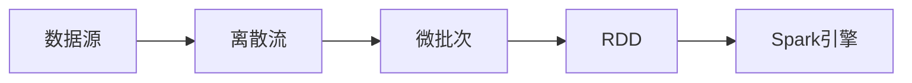

# Spark Streaming原理与代码实例讲解

## 1. 背景介绍

### 1.1 问题的由来

在当今大数据时代，海量数据的实时处理需求日益增长。传统的批处理系统已经无法满足实时性要求，因此流处理技术应运而生。流处理技术能够实时地处理和分析连续不断的数据流，并在数据到达时就进行计算，从而实现毫秒级的延迟。

### 1.2 研究现状

目前，主流的流处理框架包括 Apache Storm、Apache Flink 和 Apache Spark Streaming 等。其中，Spark Streaming 作为 Spark 生态系统的一部分，凭借其易用性、高吞吐量和容错性等优势，在实时数据处理领域得到了广泛应用。

### 1.3 研究意义

Spark Streaming 的出现，为实时数据处理提供了一种高效、可靠的解决方案。它能够帮助企业从海量数据中快速获取有价值的信息，并做出及时的决策。

### 1.4 本文结构

本文将深入浅出地介绍 Spark Streaming 的原理、架构和代码实例，并结合实际应用场景，探讨其优势和未来发展趋势。

## 2. 核心概念与联系

### 2.1 离散流（DStream）

离散流（Discretized Stream，DStream）是 Spark Streaming 中最基本的数据抽象。它代表一个连续不断的数据流，可以是来自 Kafka、Flume 等数据源的数据流，也可以是通过 Spark Core 对批处理数据进行转换得到的数据流。

### 2.2 微批处理（Micro-Batching）

Spark Streaming 采用微批处理的方式来处理数据流。它将连续不断的数据流按照时间间隔切分成一个个小的数据块（称为微批次），然后对每个微批次进行处理。

### 2.3 弹性分布式数据集（RDD）

Spark Streaming 的底层是基于 Spark Core 的弹性分布式数据集（Resilient Distributed Dataset，RDD）。每个微批次的数据都会被转换成一个 RDD，然后由 Spark 引擎进行处理。

### 2.4 核心概念之间的联系

下图展示了 Spark Streaming 中核心概念之间的联系：



## 3. 核心算法原理 & 具体操作步骤

### 3.1 算法原理概述

Spark Streaming 的核心算法原理是基于微批处理的思想，将数据流切分成一个个小的数据块，然后对每个数据块进行处理。具体来说，它包含以下步骤：

1. **接收数据流：** Spark Streaming 从数据源接收数据流，并将其缓存到内存中。
2. **切分微批次：** Spark Streaming 按照预先定义的时间间隔（称为批处理时间间隔）将数据流切分成一个个小的数据块（称为微批次）。
3. **生成 RDD：** 每个微批次的数据都会被转换成一个 RDD。
4. **执行计算：** Spark 引擎对每个 RDD 执行用户定义的计算逻辑。
5. **输出结果：** 计算结果可以输出到各种数据存储系统中，例如 HDFS、数据库等。

### 3.2 算法步骤详解

1. **接收数据流**

   Spark Streaming 支持从多种数据源接收数据流，例如：

   - **Kafka：** 高吞吐量、低延迟的消息队列系统。
   - **Flume：** 分布式的日志收集、聚合和传输系统。
   - **Socket：** 用于测试和演示的简单数据源。

2. **切分微批次**

   Spark Streaming 使用 `DStream` 的 `window` 操作来将数据流切分成一个个小的数据块。例如，以下代码将数据流按照 10 秒的时间间隔切分成一个个微批次：

   ```scala
   val stream = ssc.socketTextStream("localhost", 9999)
   val windowedStream = stream.window(Seconds(10))
   ```

3. **生成 RDD**

   每个微批次的数据都会被转换成一个 RDD。RDD 是 Spark 中最基本的数据抽象，它代表一个不可变的、分布式的数据集。

4. **执行计算**

   Spark 引擎对每个 RDD 执行用户定义的计算逻辑。Spark Streaming 提供了丰富的算子来处理数据，例如：

   - **map：** 对 RDD 中的每个元素进行转换。
   - **filter：** 过滤 RDD 中的元素。
   - **reduceByKey：** 对 RDD 中具有相同 key 的元素进行聚合。

5. **输出结果**

   计算结果可以输出到各种数据存储系统中，例如：

   - **HDFS：** 分布式文件系统。
   - **数据库：** 关系型数据库或 NoSQL 数据库。
   - **控制台：** 用于测试和演示。

### 3.3 算法优缺点

**优点：**

- **易用性：** Spark Streaming 提供了简单易用的 API，方便用户快速开发流处理应用程序。
- **高吞吐量：** Spark Streaming 能够处理高吞吐量的数据流。
- **容错性：** Spark Streaming 支持数据恢复和任务重试机制，保证了数据处理的可靠性。

**缺点：**

- **延迟：** Spark Streaming 的微批处理机制会导致一定的延迟。
- **状态管理：** Spark Streaming 的状态管理功能相对较弱。

### 3.4 算法应用领域

Spark Streaming 适用于各种实时数据处理场景，例如：

- **实时日志分析：** 实时分析网站和应用程序的日志数据，以便及时发现和解决问题。
- **实时推荐系统：** 根据用户的实时行为数据，推荐用户可能感兴趣的产品或服务。
- **实时欺诈检测：** 实时分析交易数据，识别和阻止欺诈行为。

## 4. 数学模型和公式 & 详细讲解 & 举例说明

### 4.1 数学模型构建

Spark Streaming 的数学模型可以抽象为一个有向无环图（DAG），其中每个节点代表一个 RDD，每条边代表一个 RDD 依赖关系。

### 4.2 公式推导过程

Spark Streaming 的计算过程可以表示为一系列的 RDD 转换操作。每个 RDD 转换操作都会生成一个新的 RDD，并与之前的 RDD 建立依赖关系。

### 4.3 案例分析与讲解

以下是一个简单的 Spark Streaming 代码示例，用于统计文本数据流中每个单词出现的次数：

```scala
import org.apache.spark.SparkConf
import org.apache.spark.streaming.{Seconds, StreamingContext}

object WordCount {
  def main(args: Array[String]): Unit = {
    // 创建 Spark 配置
    val conf = new SparkConf().setAppName("WordCount").setMaster("local[2]")
    // 创建 StreamingContext
    val ssc = new StreamingContext(conf, Seconds(10))

    // 创建数据流
    val lines = ssc.socketTextStream("localhost", 9999)

    // 对数据流进行处理
    val words = lines.flatMap(_.split(" "))
    val wordCounts = words.map(x => (x, 1)).reduceByKey(_ + _)

    // 打印结果
    wordCounts.print()

    // 启动 StreamingContext
    ssc.start()
    ssc.awaitTermination()
  }
}
```

**代码解释：**

1. 首先，创建 Spark 配置和 StreamingContext。
2. 然后，创建数据流，这里使用 `socketTextStream` 从本地端口 9999 接收文本数据流。
3. 接下来，对数据流进行处理：
   - 使用 `flatMap` 算子将每行文本分割成单词。
   - 使用 `map` 算子将每个单词转换成 (word, 1) 的键值对。
   - 使用 `reduceByKey` 算子对具有相同 key 的键值对进行聚合，统计每个单词出现的次数。
4. 最后，打印结果，并启动 StreamingContext。

### 4.4 常见问题解答

**1. Spark Streaming 如何保证数据处理的实时性？**

Spark Streaming 采用微批处理的方式来处理数据流，将数据流切分成一个个小的数据块，然后对每个数据块进行处理。这种方式可以有效地降低数据处理的延迟。

**2. Spark Streaming 如何保证数据处理的可靠性？**

Spark Streaming 支持数据恢复和任务重试机制，保证了数据处理的可靠性。

**3. Spark Streaming 的应用场景有哪些？**

Spark Streaming 适用于各种实时数据处理场景，例如实时日志分析、实时推荐系统、实时欺诈检测等。

## 5. 项目实践：代码实例和详细解释说明

### 5.1 开发环境搭建

1. 安装 Java JDK 8 或更高版本。
2. 下载并解压 Spark 3.0.0 或更高版本。
3. 配置环境变量：
   - `JAVA_HOME`：指向 Java JDK 的安装目录。
   - `SPARK_HOME`：指向 Spark 的安装目录。
   - `PATH`：添加 `$JAVA_HOME/bin` 和 `$SPARK_HOME/bin`。

### 5.2 源代码详细实现

以下是一个完整的 Spark Streaming 代码示例，用于统计 Twitter 数据流中出现频率最高的 10 个话题标签：

```scala
import org.apache.spark.SparkConf
import org.apache.spark.streaming.{Seconds, StreamingContext}
import org.apache.spark.streaming.twitter.TwitterUtils

object TwitterHashtagCount {
  def main(args: Array[String]): Unit = {
    // 设置 Twitter API 密钥
    System.setProperty("twitter4j.oauth.consumerKey", "YOUR_CONSUMER_KEY")
    System.setProperty("twitter4j.oauth.consumerSecret", "YOUR_CONSUMER_SECRET")
    System.setProperty("twitter4j.oauth.accessToken", "YOUR_ACCESS_TOKEN")
    System.setProperty("twitter4j.oauth.accessTokenSecret", "YOUR_ACCESS_TOKEN_SECRET")

    // 创建 Spark 配置
    val conf = new SparkConf().setAppName("TwitterHashtagCount").setMaster("local[2]")
    // 创建 StreamingContext
    val ssc = new StreamingContext(conf, Seconds(10))

    // 创建 Twitter 数据流
    val tweets = TwitterUtils.createStream(ssc, None)

    // 对数据流进行处理
    val hashtags = tweets.flatMap(_.getText.split(" ").filter(_.startsWith("#")))
    val hashtagCounts = hashtags.map(x => (x, 1)).reduceByKey(_ + _)
    val topHashtags = hashtagCounts.transform(_.sortBy(_._2, false).take(10))

    // 打印结果
    topHashtags.print()

    // 启动 StreamingContext
    ssc.start()
    ssc.awaitTermination()
  }
}
```

**代码解释：**

1. 首先，设置 Twitter API 密钥。
2. 然后，创建 Spark 配置和 StreamingContext。
3. 接下来，创建 Twitter 数据流，这里使用 `TwitterUtils.createStream` 方法创建。
4. 然后，对数据流进行处理：
   - 使用 `flatMap` 算子提取每个 tweet 中的 hashtag。
   - 使用 `map` 算子将每个 hashtag 转换成 (hashtag, 1) 的键值对。
   - 使用 `reduceByKey` 算子对具有相同 key 的键值对进行聚合，统计每个 hashtag 出现的次数。
   - 使用 `transform` 算子对每个 RDD 进行排序，并取前 10 个 hashtag。
5. 最后，打印结果，并启动 StreamingContext。

### 5.3 代码解读与分析

- `TwitterUtils.createStream` 方法用于创建 Twitter 数据流。
- `flatMap`、`map`、`reduceByKey` 和 `transform` 都是 Spark Streaming 中常用的算子。
- `sortBy` 方法用于对 RDD 进行排序。
- `take` 方法用于获取 RDD 中的前 n 个元素。

### 5.4 运行结果展示

运行代码后，控制台会每隔 10 秒打印一次 Twitter 数据流中出现频率最高的 10 个话题标签。

## 6. 实际应用场景

### 6.1 实时日志分析

Spark Streaming 可以用于实时分析网站和应用程序的日志数据，以便及时发现和解决问题。例如，可以使用 Spark Streaming 来监控网站的访问量、错误率等指标，并在指标出现异常时及时发出警报。

### 6.2 实时推荐系统

Spark Streaming 可以用于构建实时推荐系统。例如，可以使用 Spark Streaming 来分析用户的实时行为数据，例如浏览历史、搜索记录等，并根据这些数据实时推荐用户可能感兴趣的产品或服务。

### 6.3 实时欺诈检测

Spark Streaming 可以用于实时分析交易数据，识别和阻止欺诈行为。例如，可以使用 Spark Streaming 来监控信用卡交易数据，并在发现异常交易时及时发出警报。

### 6.4 未来应用展望

随着物联网、人工智能等技术的不断发展，Spark Streaming 将在更多领域得到应用，例如：

- **实时交通监控：** 实时分析交通流量数据，优化交通信号灯控制，缓解交通拥堵。
- **智能家居：** 实时分析传感器数据，控制家电设备，提高生活质量。
- **智慧城市：** 实时分析城市运行数据，提高城市管理效率。

## 7. 工具和资源推荐

### 7.1 学习资源推荐

- **Spark 官方文档：** https://spark.apache.org/docs/latest/
- **Spark Streaming Programming Guide：** https://spark.apache.org/docs/latest/streaming-programming-guide.html
- **Learning Spark, 2nd Edition：** https://www.oreilly.com/library/view/learning-spark-2nd/9781491912201/

### 7.2 开发工具推荐

- **IntelliJ IDEA：** 支持 Scala 和 Spark 开发的 IDE。
- **Eclipse：** 支持 Scala 和 Spark 开发的 IDE。
- **Zeppelin Notebook：** 交互式数据分析工具，支持 Spark。

### 7.3 相关论文推荐

- **Spark Streaming: Fault-tolerant Stream Processing at Scale：** https://people.csail.mit.edu/matei/papers/2013/sigmod_spark_streaming.pdf
- **Discretized Streams: Fault-Tolerant Processing of Data Stream Systems：** http://www.vldb.org/conf/2009/papers/files/p1074-zaharia.pdf

### 7.4 其他资源推荐

- **Spark Meetup：** https://www.meetup.com/topics/spark/
- **Spark Summit：** https://spark-summit.org/

## 8. 总结：未来发展趋势与挑战

### 8.1 研究成果总结

Spark Streaming 是一种高效、可靠的流处理框架，它能够帮助企业从海量数据中快速获取有价值的信息，并做出及时的决策。

### 8.2 未来发展趋势

- **更低的延迟：** 随着硬件和软件技术的不断发展，Spark Streaming 的延迟将会越来越低。
- **更强大的状态管理功能：** Spark Streaming 的状态管理功能将会越来越强大，以满足更复杂的应用场景。
- **与人工智能技术的融合：** Spark Streaming 将会与人工智能技术更加紧密地融合，例如用于实时机器学习模型训练和部署。

### 8.3 面临的挑战

- **数据一致性：** 在处理高吞吐量的数据流时，如何保证数据的一致性是一个挑战。
- **状态管理：** 如何高效地管理和维护应用程序的状态是一个挑战。
- **与其他系统的集成：** 如何与其他系统进行无缝集成是一个挑战。

### 8.4 研究展望

未来，Spark Streaming 将会继续发展，以满足不断增长的实时数据处理需求。同时，Spark Streaming 也将会面临更多的挑战，例如如何进一步降低延迟、提高数据一致性和状态管理效率等。

## 9. 附录：常见问题与解答

**1. Spark Streaming 和 Spark Core 有什么区别？**

Spark Streaming 是 Spark Core 之上的一个流处理框架，它利用 Spark Core 的 RDD 和 DAG 执行模型来处理数据流。

**2. Spark Streaming 和 Apache Storm 有什么区别？**

Spark Streaming 和 Apache Storm 都是流处理框架，但它们在架构和设计理念上有所不同。Spark Streaming 采用微批处理的方式来处理数据流，而 Apache Storm 采用的是 record-by-record 的处理方式。

**3. Spark Streaming 和 Apache Flink 有什么区别？**

Spark Streaming 和 Apache Flink 都是流处理框架，但它们在延迟、状态管理和窗口函数等方面有所不同。Spark Streaming 的延迟相对较高，但易用性较好；Apache Flink 的延迟较低，但使用起来相对复杂。

**作者：禅与计算机程序设计艺术 / Zen and the Art of Computer Programming**
