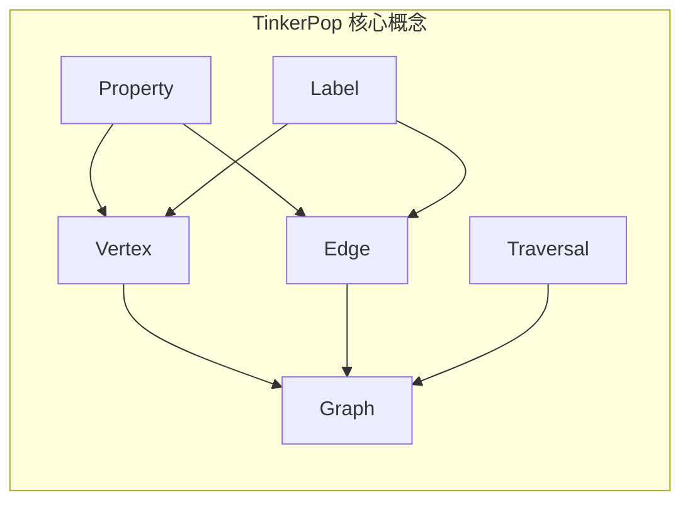

# TinkerPop原理与代码实例讲解

## 1. 背景介绍

### 1.1 问题的由来

随着互联网的快速发展，数据量呈现爆炸式增长，数据之间的关系也变得越来越复杂。传统的关系型数据库在处理这类复杂数据关系时显得力不从心。图数据库作为一种新型数据库，以图论为基础，能够高效地存储和查询具有复杂关系的数据，因此应运而生并得到了广泛应用。

TinkerPop 作为 Apache 软件基金会下的一个顶级项目，是一个面向属性图的机器无关的计算框架。它提供了一套标准的 API 和工具集，用于访问、操作和分析图数据，使得开发者能够更加方便地使用图数据库。

### 1.2 研究现状

目前，TinkerPop 已经成为图数据库领域的行业标准，被广泛应用于社交网络分析、推荐系统、知识图谱、欺诈检测等领域。许多知名的图数据库，如 Neo4j、JanusGraph、OrientDB 等都支持 TinkerPop。

### 1.3 研究意义

深入理解 TinkerPop 的原理和使用方法，对于开发者掌握图数据库技术、构建高性能的图数据应用具有重要意义。

### 1.4 本文结构

本文将从以下几个方面对 TinkerPop 进行详细介绍：

* 核心概念与联系
* 核心算法原理 & 具体操作步骤
* 数学模型和公式 & 详细讲解 & 举例说明
* 项目实践：代码实例和详细解释说明
* 实际应用场景
* 工具和资源推荐
* 总结：未来发展趋势与挑战
* 附录：常见问题与解答

## 2. 核心概念与联系

TinkerPop 中的核心概念包括：

* **图 (Graph)**：图是由顶点 (Vertex) 和边 (Edge) 组成的数据结构，用于表示实体之间的关系。
* **顶点 (Vertex)**：顶点表示图中的实体，例如人、地点、事件等。
* **边 (Edge)**：边表示顶点之间的关系，例如朋友关系、父子关系等。
* **属性 (Property)**：属性是顶点和边的键值对，用于描述顶点和边的特征。
* **标签 (Label)**：标签用于对顶点和边进行分类。
* **遍历 (Traversal)**：遍历是 TinkerPop 中用于查询和操作图数据的核心机制，它定义了一系列步骤，用于从图中查找和过滤数据。

下图展示了 TinkerPop 中核心概念之间的关系：



## 3. 核心算法原理 & 具体操作步骤

### 3.1 算法原理概述

TinkerPop 的核心算法是图遍历算法，它基于深度优先搜索 (DFS) 或广度优先搜索 (BFS) 算法，从指定的起始顶点开始，沿着图中的边进行遍历，直到找到满足条件的目标顶点或遍历完整个图。

### 3.2 算法步骤详解

TinkerPop 的图遍历算法主要包括以下步骤：

1. **选择起始顶点：** 根据查询条件选择一个或多个起始顶点。
2. **遍历边：** 从起始顶点开始，沿着出边或入边遍历图中的边。
3. **过滤顶点和边：** 根据查询条件过滤遍历到的顶点和边。
4. **处理数据：** 对符合条件的顶点和边进行处理，例如计数、求和、排序等。
5. **返回结果：** 返回处理后的结果。

### 3.3 算法优缺点

**优点：**

* **高效性：** 图遍历算法能够高效地查询和操作图数据，特别适用于处理具有复杂关系的数据。
* **灵活性：** TinkerPop 提供了丰富的遍历步骤，可以灵活地组合使用，满足各种复杂的查询需求。
* **可扩展性：** TinkerPop 支持多种图数据库后端，可以根据实际需求选择合适的数据库。

**缺点：**

* **学习曲线较陡峭：** TinkerPop 的 API 设计比较抽象，需要一定的学习成本。
* **性能受图结构影响：** 图遍历算法的性能受图结构的影响较大，对于稠密图的查询效率可能较低。

### 3.4 算法应用领域

TinkerPop 的图遍历算法可以应用于以下领域：

* **社交网络分析：** 分析用户之间的关系、社区发现、影响力分析等。
* **推荐系统：** 根据用户之间的关系和历史行为推荐商品或服务。
* **知识图谱：** 构建知识库、语义搜索、问答系统等。
* **欺诈检测：** 检测异常交易、识别虚假账户等。

## 4. 数学模型和公式 & 详细讲解 & 举例说明

### 4.1 数学模型构建

在图论中，图可以用数学模型表示为：

$$G = (V, E)$$

其中：

* $G$ 表示图
* $V$ 表示顶点集合
* $E$ 表示边集合

顶点和边可以具有属性，例如：

* 顶点属性：姓名、年龄、性别等
* 边属性：关系类型、权重等

### 4.2 公式推导过程

TinkerPop 的图遍历算法可以表示为一个函数：

$$T(G, v, F) = \{v' \in V | (v, v') \in E \land F(v') = True\}$$

其中：

* $T$ 表示图遍历算法
* $G$ 表示图
* $v$ 表示起始顶点
* $F$ 表示过滤条件
* $v'$ 表示满足过滤条件的顶点

### 4.3 案例分析与讲解

假设有一个社交网络图，顶点表示用户，边表示朋友关系。现在要查找用户 A 的所有二度好友（即朋友的朋友）。

使用 TinkerPop 的遍历语法可以表示为：

```
g.V().has('name', 'A').out('friend').out('friend').values('name')
```

这段代码的含义是：

1. 从图中查找名为 "A" 的顶点。
2. 沿着出边 "friend" 遍历到 A 的所有朋友。
3. 再次沿着出边 "friend" 遍历到 A 朋友的所有朋友。
4. 返回所有二度好友的姓名。

### 4.4 常见问题解答

**问：TinkerPop 支持哪些图数据库？**

答：TinkerPop 支持多种图数据库后端，包括：

* Neo4j
* JanusGraph
* OrientDB
* Amazon Neptune
* DataStax Enterprise Graph
* IBM Graph
* Azure Cosmos DB Graph

**问：TinkerPop 的遍历语法有哪些常用步骤？**

答：TinkerPop 的遍历语法提供了丰富的步骤，常用的步骤包括：

* `V()`：获取图中的所有顶点。
* `E()`：获取图中的所有边。
* `has()`：根据属性过滤顶点或边。
* `out()`：沿着出边遍历。
* `in()`：沿着入边遍历。
* `both()`：沿着出边和入边遍历。
* `values()`：获取顶点或边的属性值。

## 5. 项目实践：代码实例和详细解释说明

### 5.1 开发环境搭建

1. 安装 Java 开发环境 (JDK 8 或以上版本)。
2. 下载 TinkerPop 的依赖包。
3. 创建一个 Maven 或 Gradle 项目，并将 TinkerPop 的依赖包添加到项目中。

### 5.2 源代码详细实现

以下是一个使用 TinkerPop 操作 Neo4j 数据库的代码示例：

```java
import org.apache.tinkerpop.gremlin.process.traversal.dsl.graph.GraphTraversalSource;
import org.apache.tinkerpop.gremlin.process.traversal.dsl.graph.__;
import org.apache.tinkerpop.gremlin.structure.Graph;
import org.apache.tinkerpop.gremlin.structure.T;
import org.apache.tinkerpop.gremlin.structure.Vertex;
import org.neo4j.driver.AuthTokens;
import org.neo4j.driver.Driver;
import org.neo4j.driver.GraphDatabase;

public class TinkerPopExample {

    public static void main(String[] args) {
        // 连接到 Neo4j 数据库
        Driver driver = GraphDatabase.driver("bolt://localhost:7687", AuthTokens.basic("neo4j", "password"));
        Graph graph = driver.session().graph();

        // 创建一个图遍历对象
        GraphTraversalSource g = graph.traversal();

        // 创建顶点和边
        Vertex marko = g.addV(T.label, "person", "name", "marko", "age", 29).next();
        Vertex vadas = g.addV(T.label, "person", "name", "vadas", "age", 27).next();
        g.addE("knows").from(marko).to(vadas).property("weight", 0.5).next();

        // 查询数据
        g.V().has("name", "marko").out("knows").values("name").forEachRemaining(System.out::println);

        // 关闭连接
        driver.close();
    }
}
```

### 5.3 代码解读与分析

* 首先，使用 Neo4j 的 Java 驱动程序连接到 Neo4j 数据库。
* 然后，创建一个 `GraphTraversalSource` 对象，用于执行图遍历操作。
* 使用 `addV()` 方法创建两个顶点，分别表示 "marko" 和 "vadas"。
* 使用 `addE()` 方法创建一条边，表示 "marko" 认识 "vadas"，边的权重为 0.5。
* 使用 `has()`、`out()` 和 `values()` 方法查询 "marko" 认识的所有人的姓名。
* 最后，关闭数据库连接。

### 5.4 运行结果展示

运行以上代码，将会输出：

```
vadas
```

## 6. 实际应用场景

### 6.1 社交网络分析

* **用户关系分析：** 分析用户之间的关注、好友、互动等关系，识别用户群体和社区。
* **影响力分析：** 识别社交网络中的关键节点，例如意见领袖、传播者等。
* **推荐系统：** 根据用户之间的关系和兴趣推荐好友、内容等。

### 6.2 知识图谱

* **知识表示：** 使用图数据库存储和管理知识，例如实体、关系、属性等。
* **语义搜索：** 根据语义理解用户的查询意图，返回更精准的搜索结果。
* **问答系统：** 基于知识图谱回答用户的问题。

### 6.3 欺诈检测

* **异常交易检测：** 识别异常的交易行为，例如刷单、套现等。
* **虚假账户识别：** 识别虚假的用户账户，例如僵尸粉、水军等。
* **网络安全分析：** 分析网络攻击路径、识别攻击者等。

### 6.4 未来应用展望

随着图数据库技术的不断发展，TinkerPop 将在更多领域得到应用，例如：

* **物联网：** 分析设备之间的连接关系、监控设备状态等。
* **生物医药：** 分析基因、蛋白质之间的相互作用关系，加速药物研发。
* **金融风控：** 分析资金流动、识别洗钱等风险。

## 7. 工具和资源推荐

### 7.1 学习资源推荐

* **TinkerPop 官方文档：** [https://tinkerpop.apache.org/docs/current/](https://tinkerpop.apache.org/docs/current/)
* **Neo4j 官方文档：** [https://neo4j.com/docs/](https://neo4j.com/docs/)
* **图数据库书籍：** 《Graph Databases》，《Neo4j in Action》

### 7.2 开发工具推荐

* **Neo4j Desktop：** Neo4j 官方提供的图形化数据库管理工具。
* **DataGrip：** JetBrains 公司开发的数据库管理工具，支持 Neo4j。
* **IntelliJ IDEA：** JetBrains 公司开发的 Java 集成开发环境，支持 TinkerPop 开发。

### 7.3 相关论文推荐

* **TinkerPop: An Operational Framework for History-Dependent Computations over Large Graphs.**
* **A Survey of Graph Database Models.**

### 7.4 其他资源推荐

* **TinkerPop GitHub 仓库：** [https://github.com/apache/tinkerpop](https://github.com/apache/tinkerpop)
* **Neo4j 社区论坛：** [https://community.neo4j.com/](https://community.neo4j.com/)

## 8. 总结：未来发展趋势与挑战

### 8.1 研究成果总结

TinkerPop 作为图数据库领域的行业标准，提供了一套灵活、高效的 API 和工具集，用于访问、操作和分析图数据。它被广泛应用于社交网络分析、推荐系统、知识图谱、欺诈检测等领域。

### 8.2 未来发展趋势

* **更加易用：** TinkerPop 的 API 设计将更加简洁易懂，降低学习成本。
* **更高性能：** TinkerPop 将会优化图遍历算法，提高查询效率。
* **更丰富的功能：** TinkerPop 将会提供更多功能，例如图算法、机器学习等。

### 8.3 面临的挑战

* **图数据库的普及：** 相比于关系型数据库，图数据库的应用还比较少，需要进一步推广和普及。
* **数据规模的挑战：** 随着数据量的不断增长，图数据库需要解决海量数据的存储和查询问题。
* **安全和隐私问题：** 图数据库存储了大量敏感数据，需要解决安全和隐私问题。

### 8.4 研究展望

未来，TinkerPop 将会继续发展，为开发者提供更加强大、易用、安全的图数据管理工具。同时，图数据库技术也将与其他技术领域深度融合，例如人工智能、大数据等，为解决更复杂的实际问题提供支持。


## 9. 附录：常见问题与解答

**问：TinkerPop 和 Gremlin 之间是什么关系？**

答：Gremlin 是 TinkerPop 的图遍历语言，它定义了一套语法规则，用于描述图遍历操作。TinkerPop 提供了 Gremlin 的 Java 实现，开发者可以使用 Java 代码编写 Gremlin 查询语句。

**问：如何选择合适的图数据库？**

答：选择图数据库需要考虑以下因素：

* **数据规模：** 不同的图数据库支持的数据规模不同。
* **性能需求：** 不同的图数据库的查询效率不同。
* **功能需求：** 不同的图数据库支持的功能不同。
* **成本：** 不同的图数据库的成本不同。

**问：TinkerPop 支持事务吗？**

答：TinkerPop 本身不提供事务支持，但是它可以与支持事务的图数据库一起使用，例如 Neo4j。

作者：禅与计算机程序设计艺术 / Zen and the Art of Computer Programming
