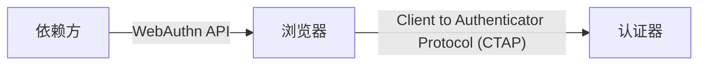

# WebAuthn 的实施步骤

## 1. 背景介绍

### 1.1 问题的由来

在互联网时代，身份验证是网络安全的基石。传统的用户名和密码验证方式存在诸多安全隐患，例如容易被盗取、用户密码设置过于简单等。为了解决这些问题，WebAuthn 应运而生，它是一种基于公钥加密技术的全新身份验证标准，旨在提供更安全、更便捷的用户体验。

### 1.2 研究现状

WebAuthn 由 FIDO 联盟和 W3C 共同制定，目前已成为 W3C 推荐标准，并得到主流浏览器和操作系统的广泛支持。越来越多的网站和应用开始采用 WebAuthn 进行身份验证，例如 Google、Facebook、Microsoft 等。

### 1.3 研究意义

WebAuthn 的实施对于提升网络安全水平、改善用户体验具有重要意义。它可以有效抵御网络钓鱼、中间人攻击等安全威胁，同时简化用户登录流程，提升用户满意度。

### 1.4 本文结构

本文将详细介绍 WebAuthn 的实施步骤，包括以下内容：

- 核心概念与联系
- 核心算法原理 & 具体操作步骤
- 数学模型和公式 & 详细讲解 & 举例说明
- 项目实践：代码实例和详细解释说明
- 实际应用场景
- 工具和资源推荐
- 总结：未来发展趋势与挑战
- 附录：常见问题与解答

## 2. 核心概念与联系

### 2.1 WebAuthn 架构

WebAuthn 架构主要包含三个角色：

- 依赖方（Relying Party，RP）：需要进行用户身份验证的网站或应用。
- 认证器（Authenticator）：用于存储用户密钥并执行身份验证操作的设备，例如手机、安全密钥等。
- 浏览器（Browser）：作为依赖方和认证器之间的桥梁，负责传递身份验证请求和响应。



### 2.2 核心概念

- 公钥加密技术：WebAuthn 基于公钥加密技术，用户拥有公钥和私钥对。私钥存储在认证器中，用于签名身份验证请求；公钥则存储在依赖方，用于验证签名。
- 挑战值（Challenge）：依赖方在每次身份验证时生成一个随机的挑战值，用于防止重放攻击。
- 断言（Assertion）：认证器对挑战值进行签名后生成的响应数据，包含用户的公钥信息和签名数据。

## 3. 核心算法原理 & 具体操作步骤

### 3.1 算法原理概述

WebAuthn 采用椭圆曲线数字签名算法（ECDSA）进行身份验证。

1. 依赖方生成一对密钥对，并将公钥存储在服务器上。
2. 用户在认证器上注册账户时，认证器生成一对密钥对，并将公钥发送给依赖方。
3. 当用户进行身份验证时，依赖方生成一个随机的挑战值，并将其发送给浏览器。
4. 浏览器将挑战值传递给认证器。
5. 认证器使用用户的私钥对挑战值进行签名，生成断言。
6. 浏览器将断言发送给依赖方。
7. 依赖方使用用户的公钥验证断言的签名，如果签名有效，则身份验证成功。

### 3.2 算法步骤详解

#### 3.2.1 注册

1. 依赖方生成一个随机的挑战值，并将其发送给浏览器。
2. 浏览器将挑战值传递给认证器。
3. 认证器生成一对密钥对，并将公钥发送给浏览器。
4. 浏览器将公钥和挑战值发送给依赖方。
5. 依赖方将用户的公钥存储在数据库中。

#### 3.2.2 认证

1. 依赖方生成一个随机的挑战值，并将其发送给浏览器。
2. 浏览器将挑战值传递给认证器。
3. 认证器使用用户的私钥对挑战值进行签名，生成断言。
4. 浏览器将断言发送给依赖方。
5. 依赖方使用用户的公钥验证断言的签名，如果签名有效，则身份验证成功。

### 3.3 算法优缺点

#### 3.3.1 优点

- 安全性高：私钥存储在认证器中，不会被网络攻击窃取。
- 用户体验好：用户无需记忆复杂的密码，只需进行简单的操作即可完成身份验证。
- 跨平台性好：WebAuthn 是 W3C 推荐标准，得到主流浏览器和操作系统的广泛支持。

#### 3.3.2 缺点

- 需要硬件支持：用户需要使用支持 WebAuthn 的认证器。
- 推广难度较大：网站和应用需要进行改造才能支持 WebAuthn。

### 3.4 算法应用领域

WebAuthn 可应用于各种需要进行身份验证的场景，例如：

- 网站和应用登录
- 在线支付
- 电子商务
- 物联网设备认证

## 4. 数学模型和公式 & 详细讲解 & 举例说明

### 4.1 数学模型构建

WebAuthn 采用椭圆曲线密码学（ECC）进行身份验证。ECC 是一种基于椭圆曲线数学的公钥加密算法，其安全性基于椭圆曲线离散对数问题的难解性。

### 4.2 公式推导过程

ECDSA 签名算法的公式如下：

1. 生成一个随机数 $k$。
2. 计算点 $P = k * G$，其中 $G$ 是椭圆曲线的基点。
3. 计算 $r = x \mod n$，其中 $x$ 是点 $P$ 的横坐标，$n$ 是椭圆曲线的阶。
4. 计算 $s = k^{-1} (hash(m) + dr) \mod n$，其中 $d$ 是用户的私钥，$m$ 是要签名的消息。
5. 签名结果为 $(r, s)$。

### 4.3 案例分析与讲解

假设用户要使用 WebAuthn 登录某个网站：

1. 网站生成一个随机的挑战值，并将其发送给浏览器。
2. 浏览器将挑战值传递给用户的安全密钥。
3. 安全密钥使用用户的私钥对挑战值进行签名，生成断言。
4. 浏览器将断言发送给网站。
5. 网站使用用户的公钥验证断言的签名，如果签名有效，则身份验证成功。

### 4.4 常见问题解答

**Q：WebAuthn 如何防止重放攻击？**

A：WebAuthn 使用随机的挑战值来防止重放攻击。每次身份验证时，依赖方都会生成一个新的挑战值，攻击者无法使用之前的挑战值来伪造身份验证请求。

**Q：WebAuthn 如何保护用户的私钥？**

A：用户的私钥存储在认证器中，不会离开设备。即使攻击者获取了用户的设备，也无法轻易获取私钥。

## 5. 项目实践：代码实例和详细解释说明

### 5.1 开发环境搭建

- Node.js
- Express
- WebAuthn 库

### 5.2 源代码详细实现

```javascript
// 依赖
const express = require('express');
const WebAuthn = require('webauthn');

// 初始化 WebAuthn
const webauthn = new WebAuthn({
  rpDisplayName: '示例网站',
  rpId: 'example.com',
  rpOrigin: 'https://example.com',
});

// 创建 Express 应用
const app = express();

// 注册路由
app.post('/register', async (req, res) => {
  // 生成注册选项
  const options = await webauthn.generateRegistrationOptions({
    username: req.body.username,
  });

  // 将选项存储在 session 中
  req.session.registrationOptions = options;

  // 返回选项
  res.json(options);
});

// 验证注册路由
app.post('/register/verify', async (req, res) => {
  // 从 session 中获取注册选项
  const options = req.session.registrationOptions;

  // 验证注册响应
  const { verified, registrationInfo } = await webauthn.verifyRegistrationResponse({
    credential: req.body,
    expectedChallenge: options.challenge,
    expectedOrigin: options.origin,
  });

  // 如果验证成功，则存储注册信息
  if (verified) {
    // ...
  }

  // 返回结果
  res.json({ verified });
});

// 登录路由
app.post('/login', async (req, res) => {
  // 生成登录选项
  const options = await webauthn.generateAuthenticationOptions({
    username: req.body.username,
  });

  // 将选项存储在 session 中
  req.session.authenticationOptions = options;

  // 返回选项
  res.json(options);
});

// 验证登录路由
app.post('/login/verify', async (req, res) => {
  // 从 session 中获取登录选项
  const options = req.session.authenticationOptions;

  // 验证登录响应
  const { verified, authenticationInfo } = await webauthn.verifyAuthenticationResponse({
    credential: req.body,
    expectedChallenge: options.challenge,
    expectedOrigin: options.origin,
  });

  // 如果验证成功，则登录用户
  if (verified) {
    // ...
  }

  // 返回结果
  res.json({ verified });
});

// 启动服务器
app.listen(3000, () => {
  console.log('服务器已启动');
});
```

### 5.3 代码解读与分析

- `generateRegistrationOptions` 函数用于生成注册选项，包括挑战值、用户名等信息。
- `verifyRegistrationResponse` 函数用于验证注册响应，检查签名是否有效。
- `generateAuthenticationOptions` 函数用于生成登录选项，包括挑战值、用户名等信息。
- `verifyAuthenticationResponse` 函数用于验证登录响应，检查签名是否有效。

### 5.4 运行结果展示

- 用户访问注册页面，浏览器向服务器请求注册选项。
- 服务器生成注册选项，并将其返回给浏览器。
- 浏览器将注册选项传递给用户的安全密钥。
- 安全密钥生成密钥对，并将公钥发送给浏览器。
- 浏览器将公钥和挑战值发送给服务器。
- 服务器验证注册响应，并将用户的公钥存储在数据库中。
- 用户访问登录页面，浏览器向服务器请求登录选项。
- 服务器生成登录选项，并将其返回给浏览器。
- 浏览器将登录选项传递给用户的安全密钥。
- 安全密钥使用用户的私钥对挑战值进行签名，生成断言。
- 浏览器将断言发送给服务器。
- 服务器验证登录响应，如果签名有效，则登录用户。

## 6. 实际应用场景

### 6.1 网站和应用登录

WebAuthn 可以用于替换传统的用户名和密码登录方式，提供更安全、更便捷的用户体验。

### 6.2 在线支付

WebAuthn 可以用于保护在线支付交易，防止未经授权的访问。

### 6.3 电子商务

WebAuthn 可以用于验证用户身份，防止欺诈交易。

### 6.4 未来应用展望

随着物联网、人工智能等技术的不断发展，WebAuthn 将在更多领域得到应用，例如：

- 物联网设备认证
- 无密码身份验证
- 分布式身份管理

## 7. 工具和资源推荐

### 7.1 学习资源推荐

- [WebAuthn 官方网站](https://webauthn.guide/)
- [FIDO 联盟网站](https://fidoalliance.org/)

### 7.2 开发工具推荐

- [WebAuthn 库](https://www.npmjs.com/package/webauthn)
- [安全密钥](https://www.yubico.com/)

### 7.3 相关论文推荐

- [Web Authentication: An API for accessing Public Key Credentials](https://www.w3.org/TR/webauthn-2/)

### 7.4 其他资源推荐

- [WebAuthn 演示](https://webauthn.io/)

## 8. 总结：未来发展趋势与挑战

### 8.1 研究成果总结

WebAuthn 是一种基于公钥加密技术的全新身份验证标准，旨在提供更安全、更便捷的用户体验。它可以有效抵御网络钓鱼、中间人攻击等安全威胁，同时简化用户登录流程，提升用户满意度。

### 8.2 未来发展趋势

- 更广泛的应用：WebAuthn 将在更多领域得到应用，例如物联网设备认证、无密码身份验证等。
- 更便捷的用户体验：WebAuthn 将与生物识别技术等结合，提供更加便捷的用户体验。
- 更完善的生态系统：WebAuthn 的生态系统将更加完善，包括更多支持 WebAuthn 的浏览器、操作系统和认证器。

### 8.3 面临的挑战

- 推广难度：WebAuthn 的推广需要网站和应用进行改造，以及用户普及安全密钥等硬件设备。
- 标准化问题：WebAuthn 标准仍在不断发展和完善中，可能会出现兼容性问题。
- 安全问题：WebAuthn 虽然安全性较高，但仍然存在潜在的安全风险，例如认证器漏洞等。

### 8.4 研究展望

未来，WebAuthn 将继续发展和完善，为用户提供更加安全、更加便捷的身份验证体验。

## 9. 附录：常见问题与解答

**Q：WebAuthn 是否支持所有浏览器？**

A：WebAuthn 得到主流浏览器和操作系统的广泛支持，但部分旧版浏览器可能不支持 WebAuthn。

**Q：如何获取安全密钥？**

A：安全密钥可以通过在线商店或电子产品零售商购买。

**Q：如果安全密钥丢失或损坏怎么办？**

A：用户需要使用备用身份验证方式登录账户，并重新注册安全密钥。

作者：禅与计算机程序设计艺术 / Zen and the Art of Computer Programming 
