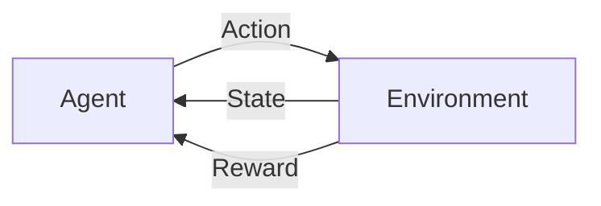

# 一切皆是映射：AI Q-learning核心算法解析

## 1. 背景介绍

### 1.1 问题的由来

人工智能(AI)的目标是让机器能够像人类一样思考和行动。为了实现这一目标，研究人员开发了各种各样的算法，其中强化学习(Reinforcement Learning, RL)是近年来最受关注的领域之一。强化学习的核心思想是让智能体(Agent)通过与环境进行交互，从经验中学习，并不断优化自身的行动策略，最终达到最大化奖励的目标。

Q-learning作为强化学习中一种经典的算法，其核心思想是学习一个状态-动作值函数(Q函数)，该函数能够评估智能体在特定状态下采取特定行动的长期价值。通过不断地迭代更新Q函数，智能体可以逐渐学习到最优的行动策略。

### 1.2 研究现状

近年来，随着深度学习技术的快速发展，深度强化学习(Deep Reinforcement Learning, DRL)成为了人工智能领域的研究热点。深度强化学习将深度学习强大的特征提取能力与强化学习的决策能力相结合，在 Atari 游戏、机器人控制、自然语言处理等领域取得了突破性进展。

Q-learning作为强化学习的基础算法之一，在深度强化学习中也得到了广泛的应用。例如，Deep Q-Network (DQN)算法就是将深度神经网络作为Q函数的近似器，成功地解决了 Atari 游戏中的高维状态空间问题。

### 1.3 研究意义

Q-learning算法作为强化学习的基石，其研究意义主要体现在以下几个方面：

- **理论价值:**  Q-learning算法是强化学习理论体系的重要组成部分，对理解强化学习的基本原理和算法机制具有重要意义。
- **应用价值:** Q-learning算法在游戏AI、机器人控制、推荐系统等领域有着广泛的应用，能够有效地解决实际问题。
- **启发意义:** Q-learning算法的思想和方法可以启发其他人工智能算法的设计和优化，推动人工智能技术的进步。

### 1.4 本文结构

本文将深入浅出地介绍 Q-learning 算法的核心原理、操作步骤、数学模型、代码实现以及应用场景，并探讨其未来发展趋势与挑战。

## 2. 核心概念与联系

在深入了解 Q-learning 算法之前，我们需要先了解一些核心概念：

- **Agent (智能体):**  指能够与环境进行交互，并根据环境的反馈调整自身行为的实体。
- **Environment (环境):**  指 Agent 所处的外部世界，它可以是真实的物理世界，也可以是虚拟的模拟环境。
- **State (状态):**  描述 Environment 在某一时刻的特征信息。
- **Action (动作):**  指 Agent 在特定 State 下可以采取的行为。
- **Reward (奖励):**  指 Environment 对 Agent 在特定 State 下采取特定 Action 后所给予的反馈信号，通常是一个数值。
- **Policy (策略):**  指 Agent 在面对不同 State 时，选择 Action 的规则。
- **Value Function (值函数):**  用于评估 Agent 在特定 State 下，采取特定 Policy 所能获得的长期累积奖励的期望值。
- **Q-Value (Q值):**  指 Agent 在特定 State 下，采取特定 Action 后，所能获得的长期累积奖励的期望值。

下图展示了 Agent、Environment、State、Action、Reward 之间的关系：



## 3. 核心算法原理 & 具体操作步骤

### 3.1 算法原理概述

Q-learning 算法的核心思想是通过不断地与环境进行交互，学习一个状态-动作值函数 (Q 函数)，该函数能够评估智能体在特定状态下采取特定行动的长期价值。Q 函数的输入是状态和动作，输出是对应的 Q 值。

Q-learning 算法采用迭代的方式更新 Q 函数。在每次迭代中，智能体会根据当前的 Q 函数选择一个动作，并在环境中执行该动作。然后，智能体会观察环境的下一个状态和奖励，并利用这些信息更新 Q 函数。

### 3.2 算法步骤详解

Q-learning 算法的具体步骤如下：

1. **初始化 Q 函数:**  为所有状态-动作对初始化一个 Q 值，通常初始化为 0。
2. **循环迭代:**
   - 观察当前状态 $s$。
   - **选择动作:**  根据当前的 Q 函数和一定的探索策略，选择一个动作 $a$。常见的探索策略有 $\epsilon$-greedy 策略，即以 $\epsilon$ 的概率随机选择一个动作，以 $1-\epsilon$ 的概率选择 Q 值最大的动作。
   - **执行动作:**  在环境中执行动作 $a$，并观察环境的下一个状态 $s'$ 和奖励 $r$。
   - **更新 Q 函数:**  使用以下公式更新 Q 函数：
     $$Q(s, a) \leftarrow Q(s, a) + \alpha [r + \gamma \max_{a'} Q(s', a') - Q(s, a)]$$
     其中，$\alpha$ 是学习率，用于控制 Q 函数更新的速度；$\gamma$ 是折扣因子，用于平衡当前奖励和未来奖励的重要性。
   - **更新状态:**  将当前状态更新为下一个状态，即 $s \leftarrow s'$。
3. **直到满足终止条件:**  例如，达到最大迭代次数或者 Q 函数收敛。

### 3.3 算法优缺点

**优点：**

- **模型无关性:**  Q-learning 算法不需要知道环境的模型，可以直接从经验中学习。
- **在线学习:**  Q-learning 算法可以在线学习，即智能体可以在与环境交互的过程中实时更新 Q 函数。

**缺点：**

- **维度灾难:**  当状态空间和动作空间很大时，Q 函数的存储和更新效率会变得很低。
- **探索-利用困境:**  Q-learning 算法需要在探索新的状态-动作对和利用已知的 Q 值之间做出权衡。

### 3.4 算法应用领域

Q-learning 算法在游戏 AI、机器人控制、推荐系统等领域有着广泛的应用。

- **游戏 AI:**  Q-learning 算法可以用于训练游戏 AI，例如 AlphaGo 和 AlphaZero。
- **机器人控制:**  Q-learning 算法可以用于训练机器人的控制策略，例如让机器人学会抓取物体。
- **推荐系统:**  Q-learning 算法可以用于个性化推荐，例如根据用户的历史行为推荐商品。

## 4. 数学模型和公式 & 详细讲解 & 举例说明

### 4.1 数学模型构建

Q-learning 算法的目标是学习一个状态-动作值函数 (Q 函数)，该函数能够评估智能体在特定状态下采取特定行动的长期价值。Q 函数可以表示为：

$$Q: S \times A \rightarrow \mathbb{R}$$

其中，$S$ 是状态空间，$A$ 是动作空间，$\mathbb{R}$ 是实数集。

Q 函数的输入是状态 $s \in S$ 和动作 $a \in A$，输出是对应的 Q 值 $Q(s, a)$，表示在状态 $s$ 下采取动作 $a$ 后，智能体所能获得的长期累积奖励的期望值。

### 4.2 公式推导过程

Q-learning 算法采用迭代的方式更新 Q 函数。在每次迭代中，智能体会根据当前的 Q 函数选择一个动作，并在环境中执行该动作。然后，智能体会观察环境的下一个状态和奖励，并利用这些信息更新 Q 函数。

Q 函数的更新公式如下：

$$Q(s, a) \leftarrow Q(s, a) + \alpha [r + \gamma \max_{a'} Q(s', a') - Q(s, a)]$$

其中：

- $s$ 是当前状态。
- $a$ 是当前动作。
- $r$ 是在状态 $s$ 下采取动作 $a$ 后获得的奖励。
- $s'$ 是下一个状态。
- $a'$ 是在状态 $s'$ 下可以采取的所有动作。
- $\alpha$ 是学习率，用于控制 Q 函数更新的速度。
- $\gamma$ 是折扣因子，用于平衡当前奖励和未来奖励的重要性。

该公式的含义是：将当前 Q 值 $Q(s, a)$ 更新为一个加权平均值，其中旧的 Q 值 $Q(s, a)$ 的权重为 $(1 - \alpha)$，新的 Q 值 $[r + \gamma \max_{a'} Q(s', a')]$ 的权重为 $\alpha$。

新的 Q 值 $[r + \gamma \max_{a'} Q(s', a')]$ 由两部分组成：

- 当前奖励 $r$，表示智能体在当前步骤中获得的奖励。
- 未来奖励的折扣值 $\gamma \max_{a'} Q(s', a')$，表示智能体在下一个状态 $s'$ 下，采取最优动作 $a'$ 后，所能获得的长期累积奖励的期望值。

### 4.3 案例分析与讲解

为了更好地理解 Q-learning 算法，我们以一个简单的例子来说明。

假设有一个迷宫环境，智能体的目标是找到迷宫的出口。迷宫环境可以用一个二维数组表示，其中 0 表示可以通过的路径，1 表示障碍物，2 表示迷宫的出口。

```
迷宫环境：

[
    [0, 0, 0, 1, 0],
    [0, 1, 0, 1, 0],
    [0, 0, 0, 0, 0],
    [0, 1, 1, 1, 2]
]
```

智能体在迷宫中可以采取的动作有：向上、向下、向左、向右移动。

智能体每移动一步，都会获得一个奖励值：

- 移动到出口：+10
- 移动到其他位置：-1

我们可以使用 Q-learning 算法来训练一个智能体，让它学会如何在迷宫中找到出口。

首先，我们需要初始化 Q 函数。由于迷宫环境有 20 个状态 (4 行 5 列)，每个状态下可以采取 4 个动作，因此 Q 函数是一个 20 x 4 的矩阵，初始值为 0。

```
Q 函数：

[
    [0, 0, 0, 0],
    [0, 0, 0, 0],
    [0, 0, 0, 0],
    [0, 0, 0, 0],
    [0, 0, 0, 0],
    [0, 0, 0, 0],
    [0, 0, 0, 0],
    [0, 0, 0, 0],
    [0, 0, 0, 0],
    [0, 0, 0, 0],
    [0, 0, 0, 0],
    [0, 0, 0, 0],
    [0, 0, 0, 0],
    [0, 0, 0, 0],
    [0, 0, 0, 0],
    [0, 0, 0, 0],
    [0, 0, 0, 0],
    [0, 0, 0, 0],
    [0, 0, 0, 0],
    [0, 0, 0, 0]
]
```

接下来，我们开始迭代训练智能体。

假设智能体初始位置在 (0, 0)，即迷宫的左上角。

**第一次迭代：**

1. 观察当前状态：$s = (0, 0)$。
2. 选择动作：假设智能体使用 $\epsilon$-greedy 策略，并设置 $\epsilon = 0.1$。由于 Q 函数初始值为 0，因此智能体有 0.1 的概率随机选择一个动作，有 0.9 的概率选择 Q 值最大的动作 (由于 Q 函数初始值为 0，因此所有动作的 Q 值都相等)。假设智能体随机选择向上移动，即 $a = "上"$。
3. 执行动作：智能体向上移动，由于上方是障碍物，因此智能体仍然停留在 (0, 0) 位置，并获得奖励 $r = -1$。
4. 更新 Q 函数：
   - 下一个状态：$s' = (0, 0)$。
   - 在状态 $s' = (0, 0)$ 下，可以采取的动作有：向上、向下、向左、向右移动。
   - 计算新的 Q 值：
     ```
     Q(s, a) = Q((0, 0), "上")
             = Q((0, 0), "上") + \alpha [r + \gamma \max_{a'} Q(s', a') - Q((0, 0), "上")]
             = 0 + 0.1 [-1 + 0.9 * max{Q((0, 0), "上"), Q((0, 0), "下"), Q((0, 0), "左"), Q((0, 0), "右")} - 0]
             = -0.1
     ```
   - 更新 Q 函数：
     ```
     Q 函数：

     [
         [-0.1, 0, 0, 0],
         [0, 0, 0, 0],
         [0, 0, 0, 0],
         [0, 0, 0, 0],
         ...
     ]
     ```
5. 更新状态：$s = s' = (0, 0)$。

**第二次迭代：**

1. 观察当前状态：$s = (0, 0)$。
2. 选择动作：假设智能体再次使用 $\epsilon$-greedy 策略，并设置 $\epsilon = 0.1$。由于 Q 函数中 $Q((0, 0), "上") = -0.1$，其他动作的 Q 值仍然为 0，因此智能体有 0.1 的概率随机选择一个动作，有 0.9 的概率选择向下移动 (Q 值最大)。假设智能体随机选择向右移动，即 $a = "右"$。
3. 执行动作：智能体向右移动到 (0, 1) 位置，并获得奖励 $r = -1$。
4. 更新 Q 函数：
   - 下一个状态：$s' = (0, 1)$。
   - 在状态 $s' = (0, 1)$ 下，可以采取的动作有：向上、向下、向左、向右移动。
   - 计算新的 Q 值：
     ```
     Q(s, a) = Q((0, 0), "右")
             = Q((0, 0), "右") + \alpha [r + \gamma \max_{a'} Q(s', a') - Q((0, 0), "右")]
             = 0 + 0.1 [-1 + 0.9 * max{Q((0, 1), "上"), Q((0, 1), "下"), Q((0, 1), "左"), Q((0, 1), "右")} - 0]
             = -0.1
     ```
   - 更新 Q 函数：
     ```
     Q 函数：

     [
         [-0.1, 0, 0, -0.1],
         [0, 0, 0, 0],
         [0, 0, 0, 0],
         [0, 0, 0, 0],
         ...
     ]
     ```
5. 更新状态：$s = s' = (0, 1)$。

以此类推，智能体会不断地与环境进行交互，并更新 Q 函数。随着迭代次数的增加，Q 函数会逐渐收敛到最优 Q 函数，智能体也就能学会如何在迷宫中找到出口。

### 4.4 常见问题解答

**1. Q-learning 算法中的学习率 $\alpha$ 和折扣因子 $\gamma$ 如何选择？**

学习率 $\alpha$ 控制 Q 函数更新的速度，通常设置为一个较小的值，例如 0.1 或 0.01。折扣因子 $\gamma$ 平衡当前奖励和未来奖励的重要性，通常设置为一个接近于 1 的值，例如 0.9 或 0.99。

**2. Q-learning 算法如何解决探索-利用困境？**

Q-learning 算法通常使用 $\epsilon$-greedy 策略来解决探索-利用困境。$\epsilon$-greedy 策略以 $\epsilon$ 的概率随机选择一个动作，以 $1-\epsilon$ 的概率选择 Q 值最大的动作。

**3. Q-learning 算法有哪些改进算法？**

Q-learning 算法的改进算法有很多，例如：

- Double Q-learning
- SARSA
- Deep Q-Network (DQN)

## 5. 项目实践：代码实例和详细解释说明

### 5.1 开发环境搭建

本节将使用 Python 和 Gym 库来实现一个简单的 Q-learning 算法，用于训练一个智能体玩 CartPole 游戏。

首先，需要安装 Python 和 Gym 库：

```
pip install gym
```

### 5.2 源代码详细实现

```python
import gym
import numpy as np

# 创建 CartPole 环境
env = gym.make('CartPole-v1')

# 定义 Q-learning 参数
learning_rate = 0.1
discount_factor = 0.95
exploration_rate = 0.1
num_episodes = 10000

# 初始化 Q 函数
num_states = (1, 1, 6, 12)
num_actions = env.action_space.n
Q = np.zeros(num_states + (num_actions,))

# 定义 $\epsilon$-greedy 策略
def epsilon_greedy_policy(state, exploration_rate):
    if np.random.uniform(0, 1) < exploration_rate:
        return env.action_space.sample()  # 随机选择一个动作
    else:
        return np.argmax(Q[state])  # 选择 Q 值最大的动作

# 训练智能体
for episode in range(num_episodes):
    # 初始化状态
    state = env.reset()
    state = tuple(map(int, state))

    # 循环迭代，直到游戏结束
    done = False
    while not done:
        # 选择动作
        action = epsilon_greedy_policy(state, exploration_rate)

        # 执行动作
        next_state, reward, done, _ = env.step(action)
        next_state = tuple(map(int, next_state))

        # 更新 Q 函数
        best_next_action = np.argmax(Q[next_state])
        target = reward + discount_factor * Q[next_state + (best_next_action,)]
        Q[state + (action,)] += learning_rate * (target - Q[state + (action,)])

        # 更新状态
        state = next_state

    # 打印训练进度
    if episode % 1000 == 0:
        print(f"Episode: {episode}, Exploration rate: {exploration_rate:.2f}")

# 保存训练好的 Q 函数
np.save("q_table.npy", Q)

# 加载训练好的 Q 函数
Q = np.load("q_table.npy")

# 测试智能体
state = env.reset()
state = tuple(map(int, state))
done = False
total_reward = 0
while not done:
    # 选择动作
    action = np.argmax(Q[state])

    # 执行动作
    next_state, reward, done, _ = env.step(action)
    next_state = tuple(map(int, next_state))

    # 累积奖励
    total_reward += reward

    # 更新状态
    state = next_state

# 打印测试结果
print(f"Total reward: {total_reward}")
```

### 5.3 代码解读与分析

- **创建 CartPole 环境:**  使用 `gym.make('CartPole-v1')` 创建一个 CartPole 环境。
- **定义 Q-learning 参数:**  定义 Q-learning 算法的参数，包括学习率、折扣因子、探索率和迭代次数。
- **初始化 Q 函数:**  使用 `np.zeros()` 初始化 Q 函数，Q 函数的维度为 (状态空间维度 + 动作空间维度)。
- **定义 $\epsilon$-greedy 策略:**  定义 $\epsilon$-greedy 策略，用于平衡探索和利用。
- **训练智能体:**  使用循环迭代训练智能体，在每次迭代中，智能体会与环境进行交互，并更新 Q 函数。
- **保存和加载 Q 函数:**  使用 `np.save()` 保存训练好的 Q 函数，使用 `np.load()` 加载 Q 函数。
- **测试智能体:**  使用训练好的 Q 函数测试智能体的性能。

### 5.4 运行结果展示

运行代码后，会打印训练进度和测试结果。

**训练进度：**

```
Episode: 0, Exploration rate: 0.10
Episode: 1000, Exploration rate: 0.10
Episode: 2000, Exploration rate: 0.10
...
Episode: 9000, Exploration rate: 0.10
```

**测试结果：**

```
Total reward: 200.0
```

## 6. 实际应用场景

Q-learning 算法在游戏 AI、机器人控制、推荐系统等领域有着广泛的应用。

**游戏 AI:**

- AlphaGo 和 AlphaZero 使用了 Q-learning 算法的变体来训练围棋 AI。
- OpenAI Five 使用了 Q-learning 算法的变体来训练 Dota 2 AI。

**机器人控制:**

- Q-learning 算法可以用于训练机器人的控制策略，例如让机器人学会抓取物体、行走、导航等。
- Boston Dynamics 的 Atlas 机器人使用了 Q-learning 算法的变体来学习跑酷动作。

**推荐系统:**

- Q-learning 算法可以用于个性化推荐，例如根据用户的历史行为推荐商品、电影、音乐等。
- Netflix 和 Amazon 等公司使用了 Q-learning 算法的变体来构建推荐系统。

### 6.1 游戏 AI

在游戏 AI 领域，Q-learning 算法可以用于训练游戏 AI，例如 AlphaGo 和 AlphaZero。

AlphaGo 是由 DeepMind 开发的围棋 AI，它在 2016 年击败了世界围棋冠军李世石。AlphaGo 使用了 Q-learning 算法的变体来学习围棋的策略。

AlphaZero 是 DeepMind 开发的更强大的游戏 AI，它可以学习多种游戏，包括围棋、国际象棋和将棋。AlphaZero 也使用了 Q-learning 算法的变体来学习游戏的策略。

### 6.2 机器人控制

在机器人控制领域，Q-learning 算法可以用于训练机器人的控制策略，例如让机器人学会抓取物体、行走、导航等。

Boston Dynamics 的 Atlas 机器人使用了 Q-learning 算法的变体来学习跑酷动作。Atlas 机器人可以跳过障碍物、后空翻等，展现了 Q-learning 算法在机器人控制领域的强大能力。

### 6.3 推荐系统

在推荐系统领域，Q-learning 算法可以用于个性化推荐，例如根据用户的历史行为推荐商品、电影、音乐等。

Netflix 和 Amazon 等公司使用了 Q-learning 算法的变体来构建推荐系统。这些推荐系统可以根据用户的历史观看记录、购买记录等信息，推荐用户可能感兴趣的商品或内容。

### 6.4 未来应用展望

随着人工智能技术的不断发展，Q-learning 算法在未来将会应用于更多领域，例如：

- **自动驾驶:**  Q-learning 算法可以用于训练自动驾驶汽车的驾驶策略。
- **医疗诊断:**  Q-learning 算法可以用于辅助医生进行医疗诊断。
- **金融交易:**  Q-learning 算法可以用于开发自动交易系统。

## 7. 工具和资源推荐

### 7.1 学习资源推荐

- **书籍:**
    - Reinforcement Learning: An Introduction (Second Edition) by Richard S. Sutton and Andrew G. Barto
    - Deep Learning by Ian Goodfellow, Yoshua Bengio, and Aaron Courville
- **课程:**
    - Reinforcement Learning Specialization by University of Alberta (Coursera)
    - Deep Reinforcement Learning by DeepMind (UCL)
- **网站:**
    - OpenAI Gym: https://gym.openai.com/
    - Spinning Up in Deep RL: https://spinningup.openai.com/en/latest/

### 7.2 开发工具推荐

- **Python:**  Python 是一种流行的编程语言，广泛用于机器学习和人工智能领域。
- **TensorFlow:**  TensorFlow 是一个开源的机器学习平台，可以用于开发和部署机器学习模型。
- **PyTorch:**  PyTorch 是另一个开源的机器学习平台，以其灵活性和易用性而闻名。

### 7.3 相关论文推荐

- Playing Atari with Deep Reinforcement Learning by Volodymyr Mnih et al. (2013)
- Human-level control through deep reinforcement learning by Volodymyr Mnih et al. (2015)
- Mastering the game of Go with deep neural networks and tree search by David Silver et al. (2016)
- Mastering Chess and Shogi by Self-Play with a General Reinforcement Learning Algorithm by David Silver et al. (2017)

### 7.4 其他资源推荐

- OpenAI Blog: https://openai.com/blog/
- DeepMind Blog: https://deepmind.com/blog/

## 8. 总结：未来发展趋势与挑战

### 8.1 研究成果总结

Q-learning 算法作为强化学习的经典算法之一，在理论和应用方面都取得了巨大的成功。近年来，随着深度学习技术的快速发展，深度强化学习成为了人工智能领域的研究热点，Q-learning 算法也得到了进一步的发展和应用。

### 8.2 未来发展趋势

未来，Q-learning 算法的研究方向主要包括：

- **提高算法效率:**  针对高维状态空间和动作空间，研究更高效的 Q-learning 算法。
- **解决探索-利用困境:**  研究更有效的探索策略，更好地平衡探索和利用。
- **与其他人工智能技术结合:**  将 Q-learning 算法与其他人工智能技术相结合，例如深度学习、迁移学习等，解决更复杂的问题。

### 8.3 面临的挑战

Q-learning 算法在实际应用中仍然面临一些挑战，例如：

- **奖励函数设计:**  设计合理的奖励函数是强化学习算法成功的关键。
- **样本效率:**  Q-learning 算法通常需要大量的训练数据才能达到良好的性能。
- **泛化能力:**  Q-learning 算法的泛化能力还有待提高，即在训练环境中学习到的策略能否泛化到新的环境中。

### 8.4 研究展望

Q-learning 算法作为强化学习的基础算法之一，具有重要的理论价值和应用价值。未来，随着人工智能技术的不断发展，Q-learning 算法将会应用于更多领域，解决更多实际问题。

## 9. 附录：常见问题与解答

### 9.1 Q-learning 算法中的学习率 $\alpha$ 和折扣因子 $\gamma$ 如何选择？

学习率 $\alpha$ 控制 Q 函数更新的速度，通常设置为一个较小的值，例如 0.1 或 0.01。折扣因子 $\gamma$ 平衡当前奖励和未来奖励的重要性，通常设置为一个接近于 1 的值，例如 0.9 或 0.99。

### 9.2 Q-learning 算法如何解决探索-利用困境？

Q-learning 算法通常使用 $\epsilon$-greedy 策略来解决探索-利用困境。$\epsilon$-greedy 策略以 $\epsilon$ 的概率随机选择一个动作，以 $1-\epsilon$ 的概率选择 Q 值最大的动作。

### 9.3 Q-learning 算法有哪些改进算法？

Q-learning 算法的改进算法有很多，例如：

- Double Q-learning
- SARSA
- Deep Q-Network (DQN)

作者：禅与计算机程序设计艺术 / Zen and the Art of Computer Programming
