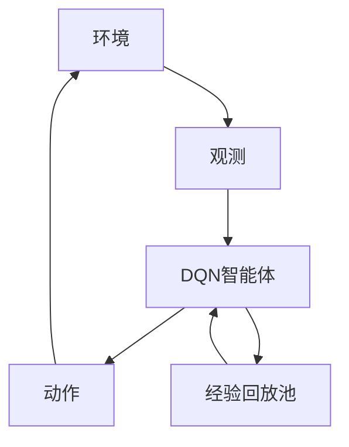

# 一切皆是映射：DQN在机器人领域的实践：挑战与策略

## 1. 背景介绍

### 1.1 问题的由来

在过去的几十年里，机器人技术取得了长足的进步,并在制造业、服务业、医疗保健、国防等多个领域得到了广泛应用。然而,传统的机器人系统主要依赖于手工编写的规则和算法,难以适应复杂多变的环境。因此,如何赋予机器人更强的自主学习和决策能力,成为了机器人领域的一个重要课题。

### 1.2 研究现状

近年来,深度强化学习(Deep Reinforcement Learning, DRL)作为一种前沿的机器学习方法,在机器人领域引起了广泛关注。其中,深度Q网络(Deep Q-Network, DQN)作为DRL的一种核心算法,展现出了强大的决策能力和环境适应性。DQN通过神经网络来近似最优的行为策略,并通过与环境的不断互动来优化网络参数,从而实现自主学习和决策。

### 1.3 研究意义

将DQN应用于机器人系统,可以赋予机器人更强的自主学习和决策能力,使其能够适应复杂多变的环境,提高机器人的智能化水平。同时,DQN在机器人领域的实践也将推动DRL算法的进一步发展和完善,为其在更多领域的应用奠定基础。

### 1.4 本文结构

本文将全面介绍DQN在机器人领域的实践,包括核心概念、算法原理、数学模型、代码实现、应用场景等多个方面。文章结构如下:

1. 背景介绍
2. 核心概念与联系
3. 核心算法原理 & 具体操作步骤
4. 数学模型和公式 & 详细讲解 & 举例说明
5. 项目实践:代码实例和详细解释说明
6. 实际应用场景
7. 工具和资源推荐
8. 总结:未来发展趋势与挑战
9. 附录:常见问题与解答

## 2. 核心概念与联系

在介绍DQN算法之前,我们先来了解一些核心概念和它们之间的联系。

**强化学习(Reinforcement Learning, RL)**: 是一种基于环境交互的机器学习范式,其目标是通过与环境的互动,学习一种策略,使得在给定环境下获得的长期累积奖励最大化。

**马尔可夫决策过程(Markov Decision Process, MDP)**: 是强化学习问题的数学模型,用于描述智能体与环境之间的交互过程。MDP由状态空间、动作空间、状态转移概率和奖励函数组成。

**Q-Learning**: 是一种基于价值函数的强化学习算法,旨在学习一个Q函数,该函数能够估计在给定状态下执行某个动作所能获得的长期累积奖励。传统的Q-Learning算法使用表格来存储Q值,但在状态和动作空间很大的情况下,表格会变得非常庞大,难以存储和计算。

**深度Q网络(Deep Q-Network, DQN)**: 是一种结合深度神经网络和Q-Learning的强化学习算法。DQN使用神经网络来近似Q函数,从而克服了传统Q-Learning在高维状态和动作空间下的局限性。通过与环境的不断互动,DQN可以自主学习最优的行为策略,实现智能决策。

下图展示了DQN在机器人系统中的应用框架:

在这个框架中,机器人通过传感器观测到当前环境状态,将状态输入到DQN智能体中。DQN智能体根据当前状态,选择一个最优动作执行。机器人执行该动作,环境状态发生变化,并给出相应的奖励信号。智能体将这个(状态,动作,奖励,新状态)的四元组存储到经验回放池中,用于神经网络的训练。通过不断地与环境交互,DQN智能体可以逐步优化神经网络参数,学习到最优的行为策略。

## 3. 核心算法原理 & 具体操作步骤

### 3.1 算法原理概述

DQN算法的核心思想是使用深度神经网络来近似Q函数,从而解决传统Q-Learning在高维状态和动作空间下的局限性。具体来说,DQN算法包括以下几个关键步骤:

1. **初始化**: 初始化一个深度神经网络,用于近似Q函数。该网络的输入为当前环境状态,输出为每个可能动作对应的Q值。
2. **经验回放池**: 在与环境交互的过程中,将(状态,动作,奖励,新状态)的四元组存储到经验回放池中。
3. **采样训练数据**: 从经验回放池中随机采样一批训练数据。
4. **计算目标Q值**: 对于每个训练样本,计算目标Q值,即在新状态下执行最优动作所能获得的Q值。
5. **网络训练**: 使用采样的训练数据和目标Q值,通过梯度下降等优化算法,更新神经网络的参数,使网络输出的Q值逼近目标Q值。
6. **执行动作**: 在新的状态下,根据当前的Q网络,选择Q值最大的动作执行。

通过不断地与环境交互、存储经验、训练网络、执行动作的循环,DQN算法可以逐步优化神经网络参数,学习到最优的行为策略。

### 3.2 算法步骤详解

下面我们详细介绍DQN算法的具体步骤:

1. **初始化**
    - 初始化一个深度神经网络,用于近似Q函数。网络的输入为当前环境状态,输出为每个可能动作对应的Q值。
    - 初始化经验回放池,用于存储(状态,动作,奖励,新状态)的四元组。
    - 初始化epsilon-greedy策略的参数epsilon,用于探索和利用的权衡。

2. **与环境交互**
    - 观测当前环境状态s。
    - 根据epsilon-greedy策略,选择一个动作a执行。
        - 以概率epsilon随机选择一个动作(探索)。
        - 以概率1-epsilon选择Q值最大的动作(利用)。
    - 执行动作a,观测到新的状态s'和获得的即时奖励r。
    - 将(s,a,r,s')四元组存储到经验回放池中。
    - 将s'设为新的当前状态。

3. **采样训练数据**
    - 从经验回放池中随机采样一批训练数据,包括(s,a,r,s')四元组。

4. **计算目标Q值**
    - 对于每个训练样本(s,a,r,s'):
        - 使用当前的Q网络,计算在新状态s'下执行所有可能动作时的Q值。
        - 选择这些Q值中的最大值,记为max_Q。
        - 计算目标Q值target_Q = r + gamma * max_Q,其中gamma是折现因子。

5. **网络训练**
    - 使用采样的训练数据(s,a)和目标Q值target_Q,通过梯度下降等优化算法,更新Q网络的参数,使网络输出的Q值逼近目标Q值。

6. **执行动作**
    - 在新的状态s'下,根据当前的Q网络,选择Q值最大的动作a'执行。

7. **更新epsilon**
    - 逐步降低epsilon的值,增加利用已学习策略的概率。

8. **重复步骤2-7**,直到达到终止条件(如最大训练步数或收敛)。

### 3.3 算法优缺点

**优点**:

- 通过深度神经网络近似Q函数,可以解决传统Q-Learning在高维状态和动作空间下的局限性。
- 使用经验回放池,可以提高训练数据的利用效率,加快收敛速度。
- epsilon-greedy策略可以平衡探索和利用,避免陷入局部最优。

**缺点**:

- 训练过程需要大量的环境交互数据,对于实际系统可能代价高昂。
- 算法的性能高度依赖于神经网络的结构和超参数设置,需要进行大量的调试和优化。
- 在连续动作空间下,DQN算法的性能可能会受到影响,需要进行特殊处理。

### 3.4 算法应用领域

DQN算法可以应用于各种需要智能决策的机器人系统,包括但不限于:

- 机器人导航和路径规划
- 机器人控制和操作
- 机器人视觉和目标检测
- 机器人语音交互
- 机器人游戏和模拟环境

除了机器人领域,DQN算法也可以应用于其他需要智能决策的领域,如自动驾驶、智能制造、金融交易等。

## 4. 数学模型和公式 & 详细讲解 & 举例说明

### 4.1 数学模型构建

在介绍DQN算法的数学模型之前,我们先来回顾一下强化学习问题的数学描述:马尔可夫决策过程(Markov Decision Process, MDP)。

MDP由以下几个要素组成:

- 状态空间 $\mathcal{S}$: 环境可能的状态集合。
- 动作空间 $\mathcal{A}$: 智能体可执行的动作集合。
- 状态转移概率 $\mathcal{P}_{ss'}^a = \mathbb{P}(s' | s, a)$: 在状态 $s$ 下执行动作 $a$ 后,转移到状态 $s'$ 的概率。
- 奖励函数 $\mathcal{R}_{ss'}^a$: 在状态 $s$ 下执行动作 $a$ 并转移到状态 $s'$ 时,获得的即时奖励。
- 折现因子 $\gamma \in [0, 1)$: 用于平衡即时奖励和长期累积奖励的权重。

在MDP中,智能体的目标是学习一个策略 $\pi: \mathcal{S} \rightarrow \mathcal{A}$,使得在该策略下的长期累积奖励最大化,即:

$$
\max_{\pi} \mathbb{E}_{\pi} \left[ \sum_{t=0}^{\infty} \gamma^t r_t \right]
$$

其中 $r_t$ 是在时间步 $t$ 获得的即时奖励。

为了解决这个最优化问题,我们引入状态-动作值函数 $Q^{\pi}(s, a)$,它表示在状态 $s$ 下执行动作 $a$,之后遵循策略 $\pi$ 所能获得的长期累积奖励:

$$
Q^{\pi}(s, a) = \mathbb{E}_{\pi} \left[ \sum_{t=0}^{\infty} \gamma^t r_t | s_0 = s, a_0 = a \right]
$$

Q-Learning算法的目标就是学习一个最优的Q函数 $Q^*(s, a)$,它满足贝尔曼最优方程:

$$
Q^*(s, a) = \mathbb{E}_{s' \sim \mathcal{P}_{ss'}^a} \left[ r + \gamma \max_{a'} Q^*(s', a') \right]
$$

传统的Q-Learning算法使用表格来存储Q值,但在高维状态和动作空间下,表格会变得非常庞大,难以存储和计算。DQN算法的核心思想就是使用深度神经网络来近似Q函数,从而解决这个问题。

### 4.2 公式推导过程

在DQN算法中,我们使用一个深度神经网络 $Q(s, a; \theta)$ 来近似真实的Q函数 $Q^*(s, a)$,其中 $\theta$ 是网络的参数。我们的目标是通过优化 $\theta$,使得网络输出的Q值 $Q(s, a; \theta)$ 尽可能地接近真实的Q值 $Q^*(s, a)$。

为了优化网络参数 $\theta$,我们定义一个损失函数 $L(\theta)$,它衡量了网络输出的Q值与真实Q值之间的差距:

$$
L(\theta) = \mathbb{E}_{(s, a, r, s') \sim \mathcal{D}} \left[ \left( r + \gamma \max_{a'} Q(s', a'; \theta^-) - Q(s, a; \theta) \right)^2 \right]
$$

其中:

- $(s, a, r, s')$ 是从经验回放池 $\