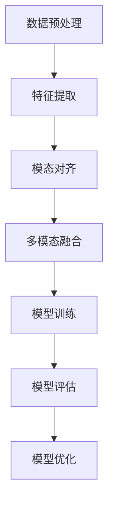

# 多模态大模型：技术原理与实战 优化逻辑介绍

## 1.背景介绍

在人工智能领域，多模态大模型（Multimodal Large Models, MLMs）正逐渐成为研究和应用的热点。多模态大模型能够处理和理解多种类型的数据，如文本、图像、音频和视频，从而实现更为复杂和智能的任务。这些模型的出现不仅推动了技术的进步，也为实际应用带来了巨大的潜力。

### 1.1 多模态大模型的定义

多模态大模型是指能够同时处理多种模态数据的机器学习模型。与传统的单模态模型不同，多模态大模型能够融合来自不同模态的数据，从而提供更为全面和准确的分析和预测。

### 1.2 发展历程

多模态大模型的发展经历了几个重要阶段。从最初的单模态模型到多模态融合，再到如今的大规模预训练模型，每一个阶段都标志着技术的重大突破。

### 1.3 重要性和应用前景

多模态大模型在许多领域都有广泛的应用前景，如医疗诊断、自动驾驶、智能客服和内容生成等。通过融合多种模态的数据，这些模型能够提供更为智能和全面的解决方案。

## 2.核心概念与联系

在深入探讨多模态大模型的技术原理之前，我们需要了解一些核心概念和它们之间的联系。

### 2.1 模态

模态是指数据的不同类型，如文本、图像、音频和视频。每种模态都有其独特的特征和表示方法。

### 2.2 多模态融合

多模态融合是指将来自不同模态的数据进行整合，以便模型能够同时利用这些数据进行分析和预测。常见的多模态融合方法包括早期融合、晚期融合和混合融合。

### 2.3 预训练模型

预训练模型是指在大规模数据集上进行预训练的模型，这些模型能够捕捉数据的广泛特征，并在特定任务上进行微调。多模态大模型通常采用预训练的方法，以提高模型的泛化能力和性能。

### 2.4 自监督学习

自监督学习是一种无需人工标注数据的学习方法，通过设计合适的任务，模型能够从未标注的数据中学习到有用的特征。自监督学习在多模态大模型的预训练中起到了重要作用。

## 3.核心算法原理具体操作步骤

多模态大模型的核心算法涉及多个步骤，从数据预处理到模型训练和优化，每一个步骤都至关重要。

### 3.1 数据预处理

数据预处理是多模态大模型训练的第一步。不同模态的数据需要进行不同的预处理操作，如文本的分词和向量化，图像的归一化和增强，音频的特征提取等。

### 3.2 特征提取

特征提取是指从原始数据中提取出有用的特征表示。对于多模态数据，每种模态都有其特定的特征提取方法，如卷积神经网络（CNN）用于图像特征提取，循环神经网络（RNN）用于文本特征提取等。

### 3.3 模态对齐

模态对齐是指将不同模态的数据对齐到同一时间或空间维度，以便进行融合和分析。常见的模态对齐方法包括时间对齐、空间对齐和特征对齐。

### 3.4 多模态融合

多模态融合是多模态大模型的核心步骤。常见的多模态融合方法包括早期融合、晚期融合和混合融合。早期融合是指在特征提取阶段进行融合，晚期融合是指在决策阶段进行融合，混合融合则是结合了早期和晚期融合的方法。

### 3.5 模型训练

模型训练是指通过优化算法对模型参数进行调整，以最小化损失函数。常见的优化算法包括随机梯度下降（SGD）、Adam等。多模态大模型的训练通常需要大规模的计算资源和数据集。

### 3.6 模型评估

模型评估是指通过一系列指标对模型的性能进行评估。常见的评估指标包括准确率、精确率、召回率、F1值等。对于多模态大模型，还需要考虑不同模态之间的协同效果。

### 3.7 模型优化

模型优化是指通过调整模型结构和参数，提高模型的性能。常见的优化方法包括超参数调优、正则化、剪枝等。



## 4.数学模型和公式详细讲解举例说明

在多模态大模型中，数学模型和公式是理解其工作原理的关键。以下是一些核心的数学模型和公式。

### 4.1 特征提取

特征提取的目标是将原始数据映射到一个高维特征空间。对于图像数据，常用的特征提取方法是卷积神经网络（CNN）。其基本公式为：

$$
f(x) = \sigma(W * x + b)
$$

其中，$f(x)$ 是特征提取函数，$W$ 是卷积核，$*$ 表示卷积操作，$b$ 是偏置，$\sigma$ 是激活函数。

### 4.2 模态对齐

模态对齐的目标是将不同模态的数据对齐到同一时间或空间维度。常用的方法是时间对齐，其基本公式为：

$$
D_{aligned} = \text{align}(D_{text}, D_{image})
$$

其中，$D_{aligned}$ 是对齐后的数据，$\text{align}$ 是对齐函数，$D_{text}$ 和 $D_{image}$ 分别是文本和图像数据。

### 4.3 多模态融合

多模态融合的目标是将不同模态的特征进行融合，以便进行联合分析。常用的方法是早期融合，其基本公式为：

$$
F_{fused} = \text{concat}(F_{text}, F_{image})
$$

其中，$F_{fused}$ 是融合后的特征，$\text{concat}$ 是特征拼接操作，$F_{text}$ 和 $F_{image}$ 分别是文本和图像的特征。

### 4.4 损失函数

损失函数是模型训练的关键，其目标是最小化预测值和真实值之间的差异。常用的损失函数是交叉熵损失，其基本公式为：

$$
L = -\sum_{i=1}^{N} y_i \log(\hat{y}_i)
$$

其中，$L$ 是损失值，$N$ 是样本数量，$y_i$ 是真实标签，$\hat{y}_i$ 是预测值。

### 4.5 优化算法

优化算法的目标是通过迭代更新模型参数，以最小化损失函数。常用的优化算法是Adam，其基本公式为：

$$
\theta_{t+1} = \theta_t - \alpha \frac{\hat{m}_t}{\sqrt{\hat{v}_t} + \epsilon}
$$

其中，$\theta_t$ 是第 $t$ 次迭代的参数，$\alpha$ 是学习率，$\hat{m}_t$ 和 $\hat{v}_t$ 分别是动量和二阶动量的无偏估计，$\epsilon$ 是一个小常数。

## 5.项目实践：代码实例和详细解释说明

为了更好地理解多模态大模型的实际应用，我们将通过一个具体的项目实例来展示其实现过程。

### 5.1 项目简介

本项目的目标是构建一个多模态情感分析模型，能够同时处理文本和图像数据，以预测用户的情感状态。

### 5.2 数据集准备

我们将使用一个包含文本和图像的多模态数据集。数据集中的每个样本包含一段文本、一张图像和一个情感标签。

### 5.3 数据预处理

首先，我们需要对文本和图像数据进行预处理。对于文本数据，我们将进行分词和向量化；对于图像数据，我们将进行归一化和增强。

```python
import numpy as np
import tensorflow as tf
from tensorflow.keras.preprocessing.text import Tokenizer
from tensorflow.keras.preprocessing.sequence import pad_sequences
from tensorflow.keras.preprocessing.image import ImageDataGenerator

# 文本数据预处理
tokenizer = Tokenizer(num_words=10000)
tokenizer.fit_on_texts(texts)
sequences = tokenizer.texts_to_sequences(texts)
text_data = pad_sequences(sequences, maxlen=100)

# 图像数据预处理
image_data_gen = ImageDataGenerator(rescale=1./255)
image_data = image_data_gen.flow_from_directory('path_to_images', target_size=(224, 224))
```

### 5.4 特征提取

接下来，我们将使用预训练的BERT模型进行文本特征提取，使用预训练的ResNet模型进行图像特征提取。

```python
import transformers
from tensorflow.keras.applications import ResNet50

# 文本特征提取
bert_model = transformers.TFBertModel.from_pretrained('bert-base-uncased')
text_features = bert_model(text_data)[0]

# 图像特征提取
resnet_model = ResNet50(weights='imagenet', include_top=False)
image_features = resnet_model.predict(image_data)
```

### 5.5 模态对齐

我们将文本和图像的特征进行对齐，以便进行融合。

```python
# 模态对齐
aligned_text_features = tf.keras.layers.Dense(512)(text_features)
aligned_image_features = tf.keras.layers.GlobalAveragePooling2D()(image_features)
```

### 5.6 多模态融合

我们将对齐后的文本和图像特征进行融合。

```python
# 多模态融合
fused_features = tf.keras.layers.Concatenate()([aligned_text_features, aligned_image_features])
```

### 5.7 模型训练

我们将构建一个简单的全连接网络进行情感预测，并进行模型训练。

```python
# 构建模型
model = tf.keras.models.Sequential([
    tf.keras.layers.Dense(256, activation='relu', input_shape=(fused_features.shape[1],)),
    tf.keras.layers.Dropout(0.5),
    tf.keras.layers.Dense(1, activation='sigmoid')
])

# 编译模型
model.compile(optimizer='adam', loss='binary_crossentropy', metrics=['accuracy'])

# 训练模型
model.fit(fused_features, labels, epochs=10, batch_size=32, validation_split=0.2)
```

### 5.8 模型评估

我们将使用测试数据对模型进行评估。

```python
# 模型评估
test_loss, test_accuracy = model.evaluate(test_fused_features, test_labels)
print(f'Test Accuracy: {test_accuracy}')
```

## 6.实际应用场景

多模态大模型在许多实际应用场景中都有广泛的应用。以下是一些典型的应用场景。

### 6.1 医疗诊断

在医疗诊断中，多模态大模型可以同时处理患者的病历文本和医学影像，从而提供更为准确的诊断结果。

### 6.2 自动驾驶

在自动驾驶中，多模态大模型可以同时处理来自摄像头、激光雷达和雷达的数据，从而实现更为智能的驾驶决策。

### 6.3 智能客服

在智能客服中，多模态大模型可以同时处理用户的文本输入和语音输入，从而提供更为自然和智能的客服体验。

### 6.4 内容生成

在内容生成中，多模态大模型可以同时处理文本和图像，从而生成更为丰富和多样的内容，如图文并茂的文章和视频。

## 7.工具和资源推荐

为了更好地进行多模态大模型的研究和应用，我们推荐以下工具和资源。

### 7.1 工具

- **TensorFlow**：一个开源的机器学习框架，支持多模态数据处理和模型训练。
- **PyTorch**：一个开源的深度学习框架，支持多模态数据处理和模型训练。
- **Transformers**：一个开源的自然语言处理库，提供了预训练的BERT模型和其他语言模型。

### 7.2 数据集

- **COCO**：一个包含图像和文本描述的多模态数据集，常用于图像描述生成和图像分类任务。
- **VQA**：一个包含图像和问题的多模态数据集，常用于视觉问答任务。
- **MM-IMDb**：一个包含电影海报和文本描述的多模态数据集，常用于多模态情感分析任务。

### 7.3 研究论文

- **Attention is All You Need**：介绍了Transformer模型的基础原理，是理解多模态大模型的重要文献。
- **BERT: Pre-training of Deep Bidirectional Transformers for Language Understanding**：介绍了BERT模型的预训练方法，是理解多模态文本特征提取的重要文献。
- **VisualBERT: A Simple and Performant Baseline for Vision and Language**：介绍了VisualBERT模型，是理解多模态融合的重要文献。

## 8.总结：未来发展趋势与挑战

多模态大模型在人工智能领域具有广阔的应用前景，但也面临着许多挑战和机遇。

### 8.1 未来发展趋势

- **更大规模的预训练模型**：随着计算资源的增加和数据集的扩展，未来的多模态大模型将会更加庞大和复杂，能够捕捉更多的特征和模式。
- **自监督学习的应用**：自监督学习在多模态大模型中的应用将会越来越广泛，能够从未标注的数据中学习到有用的特征。
- **跨模态迁移学习**：跨模态迁移学习将会成为多模态大模型的重要研究方向，能够将一种模态的知识迁移到另一种模态中，从而提高模型的泛化能力。

### 8.2 挑战

- **计算资源的需求**：多模态大模型的训练通常需要大量的计算资源和数据集，这对于许多研究机构和企业来说是一个巨大的挑战。
- **数据的多样性和质量**：多模态数据的多样性和质量对模型的性能有着重要影响，如何获取和处理高质量的多模态数据是一个重要的研究方向。
- **模型的解释性和可控性**：多模态大模型的复杂性使得其解释性和可控性成为一个重要的挑战，如何设计可解释和可控的多模态大模型是一个重要的研究方向。

## 9.附录：常见问题与解答

### 9.1 什么是多模态大模型？

多模态大模型是指能够同时处理多种模态数据的机器学习模型，如文本、图像、音频和视频。

### 9.2 多模态大模型的应用场景有哪些？

多模态大模型在许多领域都有广泛的应用，如医疗诊断、自动驾驶、智能客服和内容生成等。

### 9.3 多模态大模型的核心算法有哪些？

多模态大模型的核心算法包括数据预处理、特征提取、模态对齐、多模态融合、模型训练、模型评估和模型优化等。

### 9.4 如何进行多模态大模型的训练？

多模态大模型的训练通常需要大规模的计算资源和数据集，通过优化算法对模型参数进行调整，以最小化损失函数。

### 9.5 多模态大模型的未来发展趋势是什么？

多模态大模型的未来发展趋势包括更大规模的预训练模型、自监督学习的应用和跨模态迁移学习等。

---

作者：禅与计算机程序设计艺术 / Zen and the Art of Computer Programming