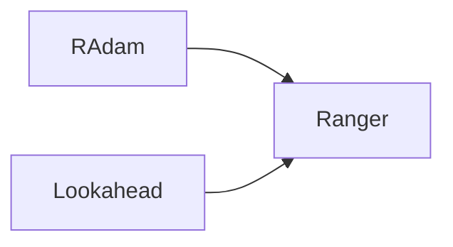

## 1.背景介绍

深度学习网络的优化算法一直是研究的热点。在众多优化算法中，Ranger算法以其出色的性能和稳定的表现受到了广大研究者和工程师的青睐。Ranger是一种混合优化算法，它结合了RAdam和Lookahead两种优化策略，充分发挥了两者的优点，有效提高了模型训练的效率和精度。

## 2.核心概念与联系

Ranger算法的核心思想是结合RAdam和Lookahead两种优化策略。RAdam是一种自适应学习率的优化算法，它可以根据模型的训练进度动态调整学习率，避免了学习率设置过大导致模型训练不稳定，或者设置过小导致训练速度过慢的问题。Lookahead则是一种快速前瞻的优化策略，它会预测模型在未来的更新方向，从而提前调整模型参数，加快模型的收敛速度。



## 3.核心算法原理具体操作步骤

Ranger算法的具体操作步骤如下：

1. 首先，我们使用RAdam算法对模型参数进行更新。RAdam算法的主要步骤包括计算梯度，更新一阶矩和二阶矩，计算自适应学习率，以及更新模型参数。

2. 然后，我们使用Lookahead策略对模型参数进行进一步的更新。Lookahead策略的主要步骤包括保存模型参数的历史值，预测模型在未来的更新方向，以及更新模型参数。

3. 最后，我们将更新后的模型参数返回，以供下一轮的模型训练使用。

## 4.数学模型和公式详细讲解举例说明

RAdam算法的数学模型如下：

首先，我们定义模型参数的梯度为$g_t$，一阶矩为$m_t$，二阶矩为$v_t$，然后我们可以根据以下公式更新一阶矩和二阶矩：

$$
m_t = \beta_1 m_{t-1} + (1 - \beta_1) g_t
$$

$$
v_t = \beta_2 v_{t-1} + (1 - \beta_2) g_t^2
$$

其中，$\beta_1$和$\beta_2$是超参数，一般取值为0.9和0.999。

然后，我们可以计算自适应学习率$\eta_t$：

$$
\eta_t = \frac{\eta}{\sqrt{v_t} + \epsilon}
$$

其中，$\eta$是学习率，$\epsilon$是一个很小的数，用来防止分母为0。

最后，我们可以根据以下公式更新模型参数$w_t$：

$$
w_t = w_{t-1} - \eta_t m_t
$$

Lookahead策略的数学模型如下：

首先，我们定义模型参数的历史值为$w'_t$，然后我们可以根据以下公式保存模型参数的历史值：

$$
w'_t = w_{t-k}
$$

其中，$k$是一个超参数，一般取值为5。

然后，我们可以预测模型在未来的更新方向，并更新模型参数$w_t$：

$$
w_t = w'_t + \alpha (w_t - w'_t)
$$

其中，$\alpha$是一个超参数，一般取值为0.5。

## 5.项目实践：代码实例和详细解释说明

下面我们来看一个使用Ranger算法训练深度学习模型的代码实例：

```python
import torch
from torch.optim import Optimizer
from torch.optim.lr_scheduler import _LRScheduler

class Ranger(Optimizer):
    def __init__(self, params, lr=1e-3, alpha=0.5, k=5, betas=(0.9, 0.999), eps=1e-8):
        defaults = dict(lr=lr, alpha=alpha, k=k, betas=betas, eps=eps)
        super(Ranger, self).__init__(params, defaults)

    def step(self, closure=None):
        for group in self.param_groups:
            for p in group['params']:
                if p.grad is None:
                    continue
                grad = p.grad.data
                if grad.is_sparse:
                    raise RuntimeError('Ranger does not support sparse gradients')

                state = self.state[p]

                # State initialization
                if len(state) == 0:
                    state['step'] = 0
                    # Exponential moving average of gradient values
                    state['exp_avg'] = torch.zeros_like(p.data)
                    # Exponential moving average of squared gradient values
                    state['exp_avg_sq'] = torch.zeros_like(p.data)
                    # Previous parameter value
                    state['prev_param'] = torch.clone(p.data)

                exp_avg, exp_avg_sq = state['exp_avg'], state['exp_avg_sq']
                beta1, beta2 = group['betas']

                state['step'] += 1

                # Decay the first and second moment running average coefficient
                exp_avg.mul_(beta1).add_(1 - beta1, grad)
                exp_avg_sq.mul_(beta2).addcmul_(1 - beta2, grad, grad)

                denom = exp_avg_sq.sqrt().add_(group['eps'])

                step_size = group['lr']
                p.data.addcdiv_(-step_size, exp_avg, denom)

                # Lookahead step
                if state['step'] % group['k'] == 0:
                    slow_p = state['prev_param']
                    slow_p.add_(group['alpha'], p.data - slow_p)
                    p.data.copy_(slow_p)

        return loss
```

这段代码实现了Ranger算法的主要步骤，包括RAdam的梯度计算和参数更新，以及Lookahead的参数预测和更新。其中，`alpha`和`k`是Lookahead的超参数，`betas`和`eps`是RAdam的超参数。

## 6.实际应用场景

Ranger算法广泛应用于深度学习模型的训练中，尤其是在图像分类、语义分割、物体检测等视觉任务中，Ranger算法都有出色的表现。此外，Ranger算法还可以应用于自然语言处理、推荐系统、强化学习等多种任务中，具有很强的通用性和实用性。

## 7.工具和资源推荐

如果你想在自己的项目中使用Ranger算法，我推荐使用以下工具和资源：

1. PyTorch：一个开源的深度学习框架，提供了丰富的模型和优化算法，包括Ranger算法。

2. Ranger的GitHub仓库：包含了Ranger算法的源代码和使用示例，可以帮助你快速理解和使用Ranger算法。

## 8.总结：未来发展趋势与挑战

Ranger算法作为一种混合优化算法，已经在深度学习模型的训练中取得了很好的效果。然而，Ranger算法还有一些挑战和未来的发展趋势：

1. 参数调优：Ranger算法有多个超参数，如何选择合适的超参数是一大挑战。未来可能会有更多的研究关注到自动参数调优的问题。

2. 算法组合：Ranger算法是RAdam和Lookahead的组合，未来可能会有更多的研究关注到如何将多种优化算法有效地组合起来。

3. 算法理论：Ranger算法的理论分析还不够充分，未来可能会有更多的研究关注到Ranger算法的理论性质和性能分析。

## 9.附录：常见问题与解答

1. Ranger算法和Adam算法有什么区别？

Ranger算法是RAdam和Lookahead的组合，RAdam是对Adam算法的改进，它引入了自适应学习率，可以根据模型的训练进度动态调整学习率。Lookahead则是一种快速前瞻的优化策略，它会预测模型在未来的更新方向，从而提前调整模型参数。

2. Ranger算法的超参数应该如何选择？

Ranger算法的超参数包括RAdam的超参数`betas`和`eps`，以及Lookahead的超参数`alpha`和`k`。一般来说，`betas`取值为(0.9, 0.999)，`eps`取值为1e-8，`alpha`取值为0.5，`k`取值为5。这些超参数的具体取值可能需要根据具体的任务和数据进行调整。

3. Ranger算法适用于哪些任务？

Ranger算法广泛应用于深度学习模型的训练中，尤其是在图像分类、语义分割、物体检测等视觉任务中，Ranger算法都有出色的表现。此外，Ranger算法还可以应用于自然语言处理、推荐系统、强化学习等多种任务中，具有很强的通用性和实用性。

作者：禅与计算机程序设计艺术 / Zen and the Art of Computer Programming