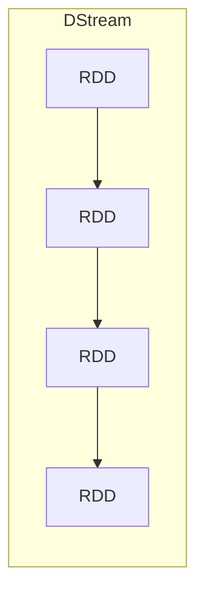

# Spark Streaming 原理与代码实例讲解

## 1. 背景介绍
### 1.1 实时流数据处理的重要性
在当今大数据时代,海量的数据正以前所未有的速度不断产生。传统的批处理模式已经无法满足实时性要求较高的应用场景,如实时推荐、实时欺诈检测等。因此,实时流数据处理技术应运而生,成为大数据领域的研究热点。
### 1.2 Spark Streaming 的优势
Spark Streaming 是 Apache Spark 生态系统中的一个重要组件,用于对实时流数据进行处理。相比于其他流处理框架,Spark Streaming 具有如下优势:

1. 易用性:Spark Streaming 继承了 Spark 的优雅 API 设计,开发者可以使用 Scala、Java、Python 等多种语言进行开发,上手简单。
2. 高吞吐低延迟:得益于 Spark 高效的内存计算模型,Spark Streaming 能够实现高吞吐、低延迟的实时处理。
3. 容错性:Spark Streaming 基于 Spark 的弹性分布式数据集(RDD)模型构建,具有高容错性。
4. 集成性:Spark Streaming 可以与 Spark SQL、MLlib 等其他 Spark 组件无缝集成,构建端到端的实时处理管道。

## 2. 核心概念与联系
### 2.1 DStream
DStream(Discretized Stream)是 Spark Streaming 的核心抽象,代表一个持续不断的数据流。在内部实现上,DStream 是一系列连续的 RDD(弹性分布式数据集)。每个 RDD 包含一个时间间隔内的数据。
### 2.2 InputDStream 与 ReceiverInputDStream  
InputDStream 是所有输入流的基类,代表从外部数据源获取的输入数据流。ReceiverInputDStream 是 InputDStream 的子类,用于从可靠的数据源(如 Kafka、Flume)中获取数据。系统会为每个 ReceiverInputDStream 分配一个 Receiver,负责数据的接收。
### 2.3 TransformedDStream
TransformedDStream 代表对 DStream 进行转换操作(如 map、filter 等)后生成的新 DStream。转换操作是惰性求值的,只有在触发 Action 操作时才会真正执行。
### 2.4 DStream 与 RDD 的关系
下图展示了 DStream 与 RDD 的关系:



每个 DStream 都是一系列时间上连续的 RDD,每个 RDD 包含一个时间间隔内的数据。对 DStream 的操作都会转换为对其内部 RDD 的操作。

## 3. 核心算法原理与具体操作步骤
Spark Streaming 的核心算法可以概括为以下步骤:

1. 数据接收:通过 Receiver 或直接从 Kafka、Flume 等数据源接收实时数据流。
2. 数据分批:将连续的数据流按照一定的时间间隔(如1秒)分割成一个个 batch,每个 batch 对应一个 RDD。
3. 数据处理:对每个 batch 进行 RDD 操作,如 map、reduce、join 等,进行数据处理与聚合。
4. 结果输出:将处理后的数据写入外部数据库或文件系统。
5. 错误恢复:如果在数据处理过程中发生错误,Spark Streaming 会重新处理对应的 batch,保证数据处理的完整性。

具体操作步骤如下:

1. 初始化 StreamingContext 对象,设置批处理时间间隔。
2. 通过 StreamingContext 的 receiverStream 或 directStream 等 API 创建输入 DStream。
3. 对 DStream 应用转换操作,如 map、filter、reduce、join 等,定义数据处理逻辑。
4. 通过 print、saveAsTextFiles 等输出操作,将处理结果输出到外部系统。
5. 调用 StreamingContext 的 start 方法启动流处理,awaitTermination 方法等待终止。

## 4. 数学模型和公式详细讲解举例说明
Spark Streaming 的数学模型可以用下面的公式来表示:

$DStream = \{RDD_1, RDD_2, ..., RDD_n\}$

其中,$RDD_i$代表第$i$个时间间隔内的数据,即一个 batch。每个$RDD_i$都是一个弹性分布式数据集,可以进行各种转换操作。

假设我们有一个输入数据流,每秒产生一些键值对数据。我们希望每5秒计算一次每个键对应的值的平均值。可以用如下公式表示:

$AVG(\mathit{k}) = \frac{\sum_{i=1}^{n} v_i}{n}, \forall (k,v) \in RDD_i, i \in [1,5]$

其中,$k$代表键,$v$代表对应的值,$n$代表5秒内键$k$出现的次数。这个计算可以通过 Spark Streaming 的 reduceByKeyAndWindow 操作实现:

```scala
val avgStream = keyValueStream.reduceByKeyAndWindow(
  (v1: Int, v2: Int) => v1 + v2,
  (v1: Int, v2: Int) => v1 - v2,
  Seconds(5)
)
```

这里,第一个匿名函数用于在窗口内对值进行累加,第二个匿名函数用于在窗口滑动时对离开窗口的值进行减法,从而实现窗口内值的自动更新。

## 5. 项目实践:代码实例和详细解释说明
下面是一个使用 Spark Streaming 实时处理 Kafka 数据的 Scala 代码示例:

```scala
import org.apache.spark._
import org.apache.spark.streaming._
import org.apache.spark.streaming.kafka010._
import org.apache.kafka.common.serialization.StringDeserializer

object KafkaWordCount {
  def main(args: Array[String]): Unit = {
    val conf = new SparkConf().setAppName("KafkaWordCount")
    val ssc = new StreamingContext(conf, Seconds(5))

    val kafkaParams = Map[String, Object](
      "bootstrap.servers" -> "localhost:9092",
      "key.deserializer" -> classOf[StringDeserializer],
      "value.deserializer" -> classOf[StringDeserializer],
      "group.id" -> "test-group",
      "auto.offset.reset" -> "latest",
      "enable.auto.commit" -> (false: java.lang.Boolean)
    )
    
    val topics = Array("test-topic")
    val stream = KafkaUtils.createDirectStream[String, String](
      ssc,
      LocationStrategies.PreferConsistent,
      ConsumerStrategies.Subscribe[String, String](topics, kafkaParams)
    )

    val wordCounts = stream.map(record => (record.value, 1))
      .reduceByKey(_ + _)
      
    wordCounts.print()
    
    ssc.start()
    ssc.awaitTermination()
  }
}
```

代码解释:

1. 首先创建 SparkConf 和 StreamingContext 对象,设置批处理时间间隔为5秒。
2. 然后配置 Kafka 参数,包括 broker 地址、key 和 value 的反序列化器、消费者组 id 等。
3. 通过 KafkaUtils.createDirectStream 创建输入 DStream,订阅指定的 topic。
4. 对 DStream 进行 map 和 reduceByKey 操作,计算每个单词的出现次数。
5. 通过 print 操作将结果打印到控制台。
6. 最后启动 StreamingContext,并等待终止。

这个例子展示了如何使用 Spark Streaming 处理 Kafka 数据,并进行实时的单词计数。可以看到,使用 Spark Streaming 进行实时流处理非常简洁和直观。

## 6. 实际应用场景
Spark Streaming 可以应用于多种实时数据处理场景,包括但不限于:

1. 实时日志分析:对服务器、应用程序产生的日志进行实时分析,监控系统运行状态,及时发现和解决问题。
2. 实时推荐:根据用户的实时行为数据,如浏览、点击、购买等,实时更新用户画像,给出个性化推荐。
3. 实时欺诈检测:对交易数据进行实时分析,识别异常交易,防范金融欺诈。
4. 实时流量监控:对网络流量进行实时监控和分析,及时发现和应对流量异常。
5. 物联网数据处理:对传感器、设备产生的海量实时数据进行处理和分析,实现智能监控和预测性维护。

## 7. 工具和资源推荐
以下是一些学习和使用 Spark Streaming 的有用资源:

1. Spark 官方文档:https://spark.apache.org/docs/latest/streaming-programming-guide.html
2. Spark Streaming 源码:https://github.com/apache/spark/tree/master/streaming
3. Spark Streaming 示例程序:https://github.com/apache/spark/tree/master/examples/src/main/scala/org/apache/spark/examples/streaming
4. Kafka 官方文档:https://kafka.apache.org/documentation/
5. 《Spark 快速大数据分析》书籍:https://book.douban.com/subject/26616244/
6. Coursera 上的 Spark Streaming 课程:https://www.coursera.org/lecture/big-data-analysis/spark-streaming-overview-Qb6ft

## 8. 总结:未来发展趋势与挑战
Spark Streaming 是一个强大的实时流数据处理框架,在可预见的未来仍将是大数据实时处理领域的主流技术之一。未来的发展趋势可能包括:

1. 与其他大数据技术的进一步融合,如 Kafka、Flink 等,构建端到端的实时处理管道。
2. 基于 Structured Streaming 的高阶 API 的进一步发展和成熟,提供更加声明式和易用的编程模型。
3. 流批一体化处理的进一步深入,实现流数据和静态数据的无缝融合和统一处理。

同时,Spark Streaming 也面临一些挑战:

1. 流数据的质量和一致性问题,如何保证数据的准确性和完整性。
2. 流数据的隐私和安全问题,如何在处理流数据的同时保护用户隐私和数据安全。
3. 大规模流数据的高效处理问题,如何优化和改进 Spark Streaming 的性能和吞吐量。

## 9. 附录:常见问题与解答
1. Spark Streaming 和 Flink 的区别是什么?
   
   Spark Streaming 是基于微批处理模型的准实时处理框架,而 Flink 是基于事件驱动的纯实时处理框架。Spark Streaming 的吞吐量较高,而 Flink 的延迟较低。
   
2. Spark Streaming 如何保证数据的 exactly-once 语义?

   Spark Streaming 通过 WAL(Write Ahead Log)和 checkpoint 机制,结合幂等性输出操作,可以实现端到端的 exactly-once 语义。

3. Spark Streaming 可以处理哪些类型的数据源?

   Spark Streaming 可以处理多种数据源,包括 Kafka、Flume、Kinesis、TCP Socket 等。也可以自定义数据源,实现 Receiver 或 DirectStream。
   
4. Spark Streaming 的容错机制是怎样的?

   Spark Streaming 的容错机制主要有两种:一是基于 Receiver 的容错,通过 WAL 和 acknowledgement 机制,保证数据不丢失;二是基于 Checkpoint 的容错,通过周期性地将 DStream 的状态存储到可靠的存储系统如 HDFS,在发生失败时进行恢复。
   
5. Spark Streaming 中的 updateStateByKey 和 mapWithState 的区别是什么?

   updateStateByKey 用于对整个历史数据进行状态更新,适用于需要全局聚合的场景;而 mapWithState 用于对每个 batch 进行有状态的 map 操作,只维护每个 key 的最新状态,适用于只需要局部状态的场景。前者性能较低,后者性能较高。

作者：禅与计算机程序设计艺术 / Zen and the Art of Computer Programming