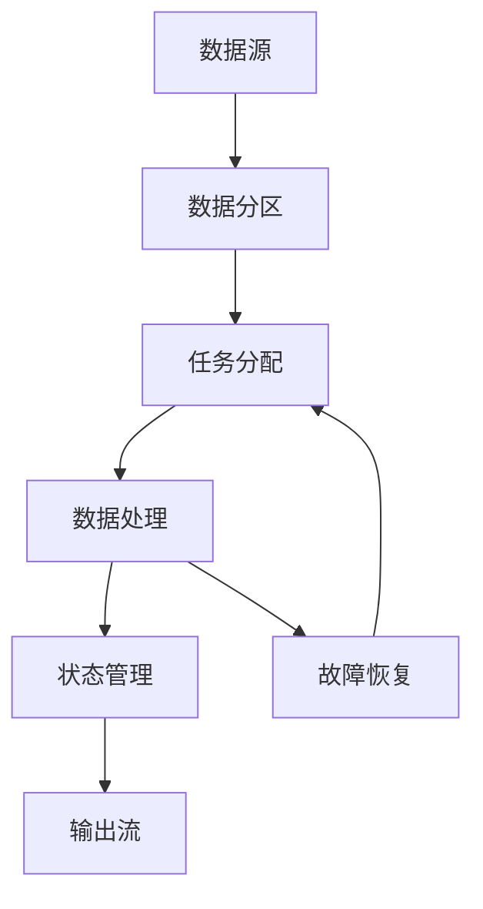

# Samza原理与代码实例讲解

## 1.背景介绍

在大数据和实时流处理的时代，如何高效地处理和分析海量数据成为了一个重要的课题。Apache Samza作为一个分布式流处理框架，提供了强大的实时数据处理能力。Samza最初由LinkedIn开发，并在2013年开源。它与Apache Kafka紧密集成，能够处理来自Kafka的消息流，并支持多种数据源和数据接收器。

Samza的设计目标是提供一个简单、灵活且高效的流处理框架。它的核心理念是将流处理任务分解为多个独立的任务，每个任务处理一个数据流的子集，从而实现高并发和高可用性。

## 2.核心概念与联系

在深入了解Samza之前，我们需要掌握一些核心概念：

### 2.1 流（Stream）

流是一个有序的数据序列，通常是无穷的。每个数据项称为一个消息。流可以来自多种数据源，如Kafka、文件系统、数据库等。

### 2.2 作业（Job）

作业是一个逻辑处理单元，包含一个或多个任务。每个作业定义了如何处理输入流并生成输出流。

### 2.3 任务（Task）

任务是作业的基本执行单元。每个任务处理一个数据流的子集，并执行特定的处理逻辑。

### 2.4 容器（Container）

容器是任务的运行环境。每个容器可以运行一个或多个任务。容器通常由YARN或Mesos等资源管理器管理。

### 2.5 作业协调器（Job Coordinator）

作业协调器负责管理作业的生命周期，包括任务的分配、监控和故障恢复。

### 2.6 状态存储（State Store）

状态存储用于保存任务的中间状态。Samza支持多种状态存储后端，如RocksDB、In-Memory等。

### 2.7 消息传递保证（Message Delivery Guarantees）

Samza提供了三种消息传递保证：最多一次（At-most-once）、至少一次（At-least-once）和精确一次（Exactly-once）。

## 3.核心算法原理具体操作步骤

Samza的核心算法基于流处理模型，主要包括以下几个步骤：

### 3.1 数据分区

数据分区是将输入流划分为多个子流，每个子流由一个任务处理。分区策略可以是基于键的哈希分区、轮询分区等。

### 3.2 任务分配

任务分配是将任务分配到不同的容器中运行。作业协调器负责管理任务的分配和调度。

### 3.3 数据处理

每个任务从输入流中读取消息，执行处理逻辑，并将结果写入输出流。处理逻辑可以是过滤、聚合、连接等操作。

### 3.4 状态管理

任务在处理过程中可能需要维护中间状态。状态存储用于保存这些中间状态，并支持故障恢复。

### 3.5 故障恢复

当任务或容器发生故障时，作业协调器会重新分配任务，并从状态存储中恢复任务的中间状态。

以下是Samza的核心流程图：



## 4.数学模型和公式详细讲解举例说明

在流处理系统中，数学模型和公式是理解数据处理过程的关键。以下是一些常见的数学模型和公式：

### 4.1 滑动窗口（Sliding Window）

滑动窗口是一种常见的流处理模型，用于在连续的数据流中计算统计量。滑动窗口的大小和滑动步长是两个重要参数。

设 $W$ 为窗口大小，$S$ 为滑动步长，$t$ 为时间戳，$x(t)$ 为时间 $t$ 的数据值，则滑动窗口的平均值可以表示为：

$$
\text{平均值} = \frac{1}{W} \sum_{i=t-W+1}^{t} x(i)
$$

### 4.2 计数窗口（Count Window）

计数窗口是另一种常见的流处理模型，用于在固定数量的数据项上计算统计量。设 $N$ 为窗口大小，则计数窗口的平均值可以表示为：

$$
\text{平均值} = \frac{1}{N} \sum_{i=1}^{N} x(i)
$$

### 4.3 频率计数（Frequency Count）

频率计数用于计算数据流中各个元素的出现频率。设 $x_i$ 为数据流中的第 $i$ 个元素，$f(x_i)$ 为元素 $x_i$ 的频率，则频率计数可以表示为：

$$
f(x_i) = \sum_{j=1}^{N} \delta(x_j, x_i)
$$

其中，$\delta(x_j, x_i)$ 是Kronecker delta函数，当 $x_j = x_i$ 时，$\delta(x_j, x_i) = 1$，否则 $\delta(x_j, x_i) = 0$。

## 5.项目实践：代码实例和详细解释说明

为了更好地理解Samza的工作原理，我们将通过一个简单的代码实例来演示如何使用Samza进行流处理。

### 5.1 环境准备

首先，我们需要准备开发环境。以下是所需的工具和依赖：

- Java 8
- Apache Maven
- Apache Kafka
- Apache Samza

### 5.2 创建Maven项目

使用Maven创建一个新的Java项目：

```bash
mvn archetype:generate -DgroupId=com.example -DartifactId=samza-example -DarchetypeArtifactId=maven-archetype-quickstart -DinteractiveMode=false
cd samza-example
```

### 5.3 添加依赖

在`pom.xml`文件中添加Samza和Kafka的依赖：

```xml
<dependencies>
    <dependency>
        <groupId>org.apache.samza</groupId>
        <artifactId>samza-api</artifactId>
        <version>1.6.0</version>
    </dependency>
    <dependency>
        <groupId>org.apache.samza</groupId>
        <artifactId>samza-core</artifactId>
        <version>1.6.0</version>
    </dependency>
    <dependency>
        <groupId>org.apache.kafka</groupId>
        <artifactId>kafka-clients</artifactId>
        <version>2.6.0</version>
    </dependency>
</dependencies>
```

### 5.4 编写任务代码

创建一个新的Java类`WordCountTask`，实现Samza的`StreamTask`接口：

```java
package com.example;

import org.apache.samza.task.StreamTask;
import org.apache.samza.task.MessageCollector;
import org.apache.samza.task.TaskCoordinator;
import org.apache.samza.system.IncomingMessageEnvelope;
import org.apache.samza.system.OutgoingMessageEnvelope;
import org.apache.samza.storage.kv.KeyValueStore;

import java.util.HashMap;
import java.util.Map;

public class WordCountTask implements StreamTask {
    private KeyValueStore<String, Integer> store;

    @Override
    public void process(IncomingMessageEnvelope envelope, MessageCollector collector, TaskCoordinator coordinator) {
        String message = (String) envelope.getMessage();
        String[] words = message.split(" ");
        for (String word : words) {
            Integer count = store.get(word);
            if (count == null) {
                count = 0;
            }
            count++;
            store.put(word, count);
            collector.send(new OutgoingMessageEnvelope(new SystemStream("kafka", "word-count-output"), word + ": " + count));
        }
    }
}
```

### 5.5 配置作业

创建一个配置文件`config/job.properties`，定义作业的配置：

```properties
# Job configuration
job.name=word-count-job
job.coordinator.system=kafka

# Task configuration
task.class=com.example.WordCountTask

# Input stream configuration
systems.kafka.samza.factory=org.apache.samza.system.kafka.KafkaSystemFactory
systems.kafka.consumer.zookeeper.connect=localhost:2181
systems.kafka.producer.bootstrap.servers=localhost:9092
systems.kafka.samza.key.serde=string
systems.kafka.samza.msg.serde=string
task.inputs=kafka.word-count-input

# Output stream configuration
systems.kafka.streams.word-count-output.samza.msg.serde=string

# State store configuration
stores.word-count.store.factory=org.apache.samza.storage.kv.RocksDbKeyValueStorageEngineFactory
stores.word-count.key.serde=string
stores.word-count.msg.serde=integer
```

### 5.6 运行作业

使用Samza的命令行工具运行作业：

```bash
./bin/run-job.sh --config-factory=org.apache.samza.config.factories.PropertiesConfigFactory --config-path=file://$PWD/config/job.properties
```

## 6.实际应用场景

Samza在实际应用中有广泛的应用场景，以下是一些典型的应用场景：

### 6.1 实时数据分析

Samza可以用于实时数据分析，如实时日志分析、实时用户行为分析等。通过处理实时数据流，企业可以及时获取数据洞察，做出快速决策。

### 6.2 实时推荐系统

在电商、社交媒体等领域，实时推荐系统是提升用户体验的重要手段。Samza可以处理用户的实时行为数据，生成个性化的推荐结果。

### 6.3 实时监控和告警

在运维和安全领域，实时监控和告警是保障系统稳定性和安全性的关键。Samza可以处理实时监控数据，检测异常情况并触发告警。

### 6.4 数据清洗和预处理

在数据仓库和数据湖中，数据清洗和预处理是数据分析的前提。Samza可以处理实时数据流，进行数据清洗、格式转换等操作。

## 7.工具和资源推荐

以下是一些与Samza相关的工具和资源，帮助读者更好地学习和使用Samza：

### 7.1 官方文档

- [Apache Samza官方文档](https://samza.apache.org/learn/documentation/latest/)

### 7.2 开源项目

- [Samza Examples](https://github.com/apache/samza-hello-samza)：一个包含多个Samza示例的开源项目。

### 7.3 社区资源

- [Samza用户邮件列表](https://samza.apache.org/community/mailing-lists)：可以在邮件列表中与其他用户交流经验和问题。

### 7.4 在线课程

- [Coursera上的大数据课程](https://www.coursera.org/courses?query=big%20data)：包含多个与大数据和流处理相关的在线课程。

## 8.总结：未来发展趋势与挑战

随着大数据和实时流处理技术的不断发展，Samza作为一个强大的流处理框架，具有广阔的应用前景。未来，Samza的发展趋势和挑战主要包括以下几个方面：

### 8.1 性能优化

随着数据量的不断增加，如何进一步优化Samza的性能，提升数据处理的效率，是一个重要的研究方向。

### 8.2 易用性提升

虽然Samza已经提供了丰富的功能，但其配置和使用仍然存在一定的复杂性。未来，如何提升Samza的易用性，使其更加友好和易于使用，是一个重要的方向。

### 8.3 与其他技术的集成

随着大数据生态系统的不断发展，如何更好地与其他技术（如Flink、Spark等）集成，形成一个完整的解决方案，是一个重要的挑战。

### 8.4 安全性和可靠性

在实际应用中，数据的安全性和系统的可靠性是至关重要的。未来，如何进一步提升Samza的安全性和可靠性，是一个重要的研究方向。

## 9.附录：常见问题与解答

### 9.1 Samza与Kafka的关系是什么？

Samza与Kafka紧密集成，Kafka通常作为Samza的消息系统，用于存储和传输数据流。Samza从Kafka读取消息，进行处理后将结果写回Kafka。

### 9.2 如何处理任务的状态？

Samza提供了状态存储机制，用于保存任务的中间状态。状态存储可以使用RocksDB、In-Memory等后端，并支持故障恢复。

### 9.3 如何保证消息的传递语义？

Samza提供了三种消息传递保证：最多一次、至少一次和精确一次。可以根据应用场景选择合适的传递语义。

### 9.4 如何进行故障恢复？

当任务或容器发生故障时，作业协调器会重新分配任务，并从状态存储中恢复任务的中间状态，从而实现故障恢复。

### 9.5 如何优化Samza的性能？

可以通过调整任务的并行度、优化数据分区策略、使用高效的状态存储后端等方式来优化Samza的性能。

---

作者：禅与计算机程序设计艺术 / Zen and the Art of Computer Programming