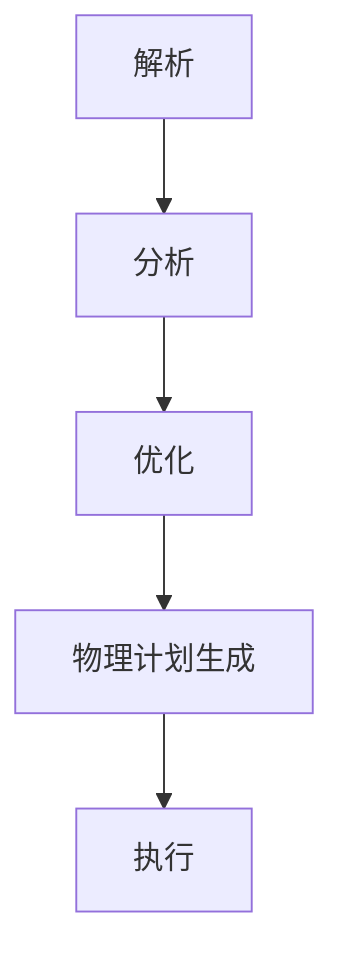

# Spark Catalyst原理与代码实例讲解

## 1.背景介绍

Apache Spark 是一个快速、通用的集群计算系统，广泛应用于大数据处理领域。Spark SQL 是 Spark 的一个模块，用于结构化数据处理。Catalyst 是 Spark SQL 的查询优化器和执行引擎，它通过一系列的规则和策略来优化查询计划，从而提高查询性能。Catalyst 的设计灵活且可扩展，使得开发者可以轻松地添加新的优化规则和数据源。

## 2.核心概念与联系

### 2.1 Catalyst 的架构

Catalyst 的架构主要包括以下几个部分：

- **抽象语法树（AST）**：表示查询的结构化表示。
- **逻辑计划**：表示查询的逻辑执行步骤。
- **物理计划**：表示查询的物理执行步骤。
- **优化器**：通过一系列规则和策略优化逻辑计划和物理计划。

### 2.2 Catalyst 的工作流程

Catalyst 的工作流程可以分为以下几个步骤：

1. **解析**：将 SQL 查询解析为抽象语法树（AST）。
2. **分析**：将 AST 转换为逻辑计划，并进行语义分析。
3. **优化**：通过一系列规则和策略优化逻辑计划。
4. **物理计划生成**：将优化后的逻辑计划转换为物理计划。
5. **执行**：执行物理计划并返回结果。

以下是 Catalyst 工作流程的 Mermaid 流程图：



## 3.核心算法原理具体操作步骤

### 3.1 解析

解析阶段将 SQL 查询转换为抽象语法树（AST）。解析器会检查 SQL 语法的正确性，并生成对应的 AST。

### 3.2 分析

分析阶段将 AST 转换为逻辑计划，并进行语义分析。语义分析包括类型检查、列解析等操作，确保查询的语义正确。

### 3.3 优化

优化阶段通过一系列规则和策略优化逻辑计划。常见的优化规则包括谓词下推、投影剪裁、连接重排序等。

### 3.4 物理计划生成

物理计划生成阶段将优化后的逻辑计划转换为物理计划。物理计划表示具体的执行步骤，包括选择合适的执行算子和数据分区策略。

### 3.5 执行

执行阶段根据物理计划执行查询，并返回结果。执行过程中，Catalyst 会利用 Spark 的分布式计算能力，提高查询性能。

## 4.数学模型和公式详细讲解举例说明

### 4.1 查询优化的数学模型

查询优化可以看作是一个数学优化问题，目标是找到最优的查询执行计划。常见的优化目标包括最小化查询执行时间、最小化资源消耗等。

### 4.2 成本模型

成本模型用于估算查询执行计划的成本。成本模型通常包括以下几个部分：

- **I/O 成本**：数据读取和写入的成本。
- **CPU 成本**：计算操作的成本。
- **网络成本**：数据传输的成本。

### 4.3 成本估算公式

假设有一个查询计划 $P$，其成本可以表示为：

$$
Cost(P) = \sum_{i=1}^{n} (IO_i + CPU_i + Network_i)
$$

其中，$IO_i$、$CPU_i$ 和 $Network_i$ 分别表示第 $i$ 个操作的 I/O 成本、CPU 成本和网络成本。

### 4.4 示例

假设有一个简单的查询：

```sql
SELECT * FROM orders WHERE order_date > '2023-01-01'
```

解析阶段生成的 AST 如下：

```plaintext
Select
  Filter
    TableScan(orders)
```

分析阶段生成的逻辑计划如下：

```plaintext
LogicalPlan
  Filter(order_date > '2023-01-01')
    TableScan(orders)
```

优化阶段应用谓词下推规则，生成优化后的逻辑计划：

```plaintext
OptimizedLogicalPlan
  TableScan(orders, filter=order_date > '2023-01-01')
```

物理计划生成阶段生成的物理计划如下：

```plaintext
PhysicalPlan
  FilterExec(order_date > '2023-01-01')
    ScanExec(orders)
```

执行阶段根据物理计划执行查询，并返回结果。

## 5.项目实践：代码实例和详细解释说明

### 5.1 环境准备

首先，确保已经安装了 Apache Spark。可以通过以下命令安装：

```bash
pip install pyspark
```

### 5.2 代码实例

以下是一个简单的 Spark SQL 查询示例：

```python
from pyspark.sql import SparkSession

# 创建 SparkSession
spark = SparkSession.builder \
    .appName("Spark Catalyst Example") \
    .getOrCreate()

# 创建 DataFrame
data = [("Alice", 34), ("Bob", 45), ("Cathy", 29)]
columns = ["Name", "Age"]
df = spark.createDataFrame(data, columns)

# 注册临时视图
df.createOrReplaceTempView("people")

# 执行 SQL 查询
result = spark.sql("SELECT * FROM people WHERE Age > 30")

# 显示结果
result.show()

# 停止 SparkSession
spark.stop()
```

### 5.3 详细解释

1. **创建 SparkSession**：SparkSession 是 Spark SQL 的入口点，用于创建 DataFrame 和执行 SQL 查询。
2. **创建 DataFrame**：DataFrame 是 Spark SQL 的核心数据结构，类似于关系数据库中的表。
3. **注册临时视图**：将 DataFrame 注册为临时视图，以便通过 SQL 查询访问。
4. **执行 SQL 查询**：使用 `spark.sql` 方法执行 SQL 查询，并返回结果。
5. **显示结果**：使用 `result.show()` 方法显示查询结果。
6. **停止 SparkSession**：使用 `spark.stop()` 方法停止 SparkSession。

## 6.实际应用场景

### 6.1 数据仓库

Spark SQL 和 Catalyst 广泛应用于数据仓库场景，用于处理和分析大规模结构化数据。通过 Catalyst 的查询优化能力，可以显著提高查询性能。

### 6.2 实时数据处理

Spark Streaming 和 Spark SQL 可以结合使用，实现实时数据处理和分析。Catalyst 的优化能力可以确保实时查询的高效执行。

### 6.3 机器学习

Spark MLlib 是 Spark 的机器学习库，可以与 Spark SQL 结合使用，实现大规模机器学习任务。Catalyst 的优化能力可以提高机器学习算法的执行效率。

## 7.工具和资源推荐

### 7.1 工具

- **Apache Spark**：大数据处理的核心工具。
- **Jupyter Notebook**：用于编写和运行 Spark 代码的交互式环境。
- **Zeppelin**：支持多种数据源和编程语言的交互式数据分析工具。

### 7.2 资源

- **Spark 官方文档**：详细介绍了 Spark 的各个模块和使用方法。
- **Spark SQL: Relational Data Processing in Spark**：介绍了 Spark SQL 的设计和实现。
- **Advanced Analytics with Spark**：介绍了如何使用 Spark 进行高级数据分析。

## 8.总结：未来发展趋势与挑战

### 8.1 未来发展趋势

- **更智能的优化器**：未来的查询优化器将更加智能，能够自动适应不同的数据和查询模式。
- **更高效的执行引擎**：未来的执行引擎将更加高效，能够充分利用硬件资源，提高查询性能。
- **更广泛的应用场景**：Spark SQL 和 Catalyst 将在更多的应用场景中得到应用，如物联网、边缘计算等。

### 8.2 挑战

- **复杂查询的优化**：复杂查询的优化仍然是一个挑战，需要更智能的优化算法和策略。
- **大规模数据处理**：随着数据规模的不断增长，如何高效处理大规模数据仍然是一个挑战。
- **实时数据处理**：实时数据处理的性能和可靠性仍然需要进一步提升。

## 9.附录：常见问题与解答

### 9.1 Catalyst 是什么？

Catalyst 是 Spark SQL 的查询优化器和执行引擎，通过一系列的规则和策略优化查询计划，提高查询性能。

### 9.2 Catalyst 的工作流程是什么？

Catalyst 的工作流程包括解析、分析、优化、物理计划生成和执行五个步骤。

### 9.3 如何使用 Spark SQL 执行查询？

可以通过 SparkSession 创建 DataFrame，并注册为临时视图，然后使用 `spark.sql` 方法执行 SQL 查询。

### 9.4 Catalyst 的优化规则有哪些？

常见的优化规则包括谓词下推、投影剪裁、连接重排序等。

### 9.5 Catalyst 的未来发展趋势是什么？

未来的 Catalyst 将更加智能和高效，能够适应更多的应用场景，如物联网、边缘计算等。

---

作者：禅与计算机程序设计艺术 / Zen and the Art of Computer Programming