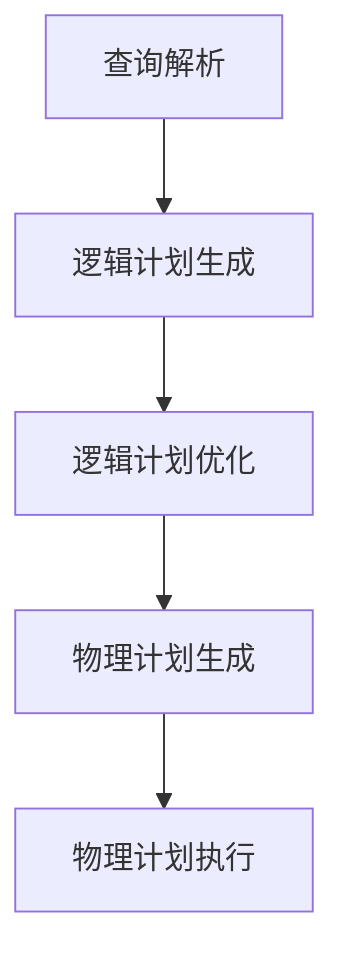

# Spark SQL 原理与代码实例讲解

## 1.背景介绍

在大数据处理领域，Apache Spark 已经成为了一个不可或缺的工具。Spark SQL 是 Spark 生态系统中的一个重要组件，它提供了对结构化数据的支持，并且允许用户使用 SQL 查询来处理数据。Spark SQL 结合了 Spark 的分布式计算能力和 SQL 的易用性，使得数据分析变得更加高效和便捷。

## 2.核心概念与联系

### 2.1 DataFrame 和 Dataset

DataFrame 是 Spark SQL 中的核心数据结构，它类似于传统数据库中的表格。DataFrame 是分布式的、不可变的，并且支持各种操作，如过滤、聚合、连接等。Dataset 是 DataFrame 的扩展，它提供了类型安全的 API，使得编译时可以进行类型检查。

### 2.2 Catalyst 优化器

Catalyst 是 Spark SQL 的查询优化器，它通过一系列的规则和策略来优化查询计划。Catalyst 优化器的目标是生成高效的物理执行计划，从而提高查询性能。

### 2.3 Tungsten 执行引擎

Tungsten 是 Spark SQL 的执行引擎，它通过改进内存管理和代码生成来提高执行效率。Tungsten 执行引擎的目标是最大化 CPU 和内存的利用率，从而提高整体性能。

## 3.核心算法原理具体操作步骤

### 3.1 查询解析

查询解析是将 SQL 查询转换为抽象语法树（AST）的过程。解析器会检查 SQL 语法的正确性，并生成相应的 AST。

### 3.2 逻辑计划生成

逻辑计划生成是将 AST 转换为逻辑计划的过程。逻辑计划是一个表示查询操作的有向无环图（DAG），它描述了查询的逻辑执行步骤。

### 3.3 逻辑计划优化

逻辑计划优化是对逻辑计划进行优化的过程。Catalyst 优化器会应用一系列的规则来简化和改进逻辑计划，例如谓词下推、投影剪裁等。

### 3.4 物理计划生成

物理计划生成是将优化后的逻辑计划转换为物理计划的过程。物理计划描述了具体的执行步骤和操作，例如扫描、过滤、排序等。

### 3.5 物理计划执行

物理计划执行是将物理计划转换为可执行的任务，并在集群上分布式执行。Tungsten 执行引擎会负责具体的执行细节，如内存管理、代码生成等。



## 4.数学模型和公式详细讲解举例说明

### 4.1 代数表达式

在查询优化过程中，SQL 查询会被转换为代数表达式。代数表达式是一种数学表示法，用于描述查询操作。例如，选择操作可以表示为 $\sigma_{condition}(R)$，其中 $R$ 是关系，$condition$ 是选择条件。

### 4.2 代数优化规则

代数优化规则是对代数表达式进行变换的规则。例如，选择操作和投影操作可以交换顺序，以减少中间结果的大小。具体的规则包括：

- 谓词下推：$\sigma_{condition1 \land condition2}(R) \rightarrow \sigma_{condition1}(\sigma_{condition2}(R))$
- 投影剪裁：$\pi_{columns}(\sigma_{condition}(R)) \rightarrow \sigma_{condition}(\pi_{columns}(R))$

### 4.3 代数优化示例

假设有一个查询：

```sql
SELECT name, age FROM users WHERE age > 30
```

解析后的代数表达式为：

$$
\pi_{name, age}(\sigma_{age > 30}(users))
$$

通过应用代数优化规则，可以将其优化为：

$$
\sigma_{age > 30}(\pi_{name, age}(users))
$$

## 5.项目实践：代码实例和详细解释说明

### 5.1 环境配置

首先，我们需要配置 Spark 环境。可以使用以下代码来初始化 SparkSession：

```python
from pyspark.sql import SparkSession

spark = SparkSession.builder \
    .appName("Spark SQL Example") \
    .getOrCreate()
```

### 5.2 数据加载

接下来，我们加载数据。假设我们有一个 JSON 文件 `users.json`，可以使用以下代码加载数据：

```python
df = spark.read.json("users.json")
df.show()
```

### 5.3 SQL 查询

我们可以使用 SQL 查询来处理数据。首先，需要注册临时视图：

```python
df.createOrReplaceTempView("users")
```

然后，可以使用 SQL 查询：

```python
result = spark.sql("SELECT name, age FROM users WHERE age > 30")
result.show()
```

### 5.4 DataFrame 操作

除了 SQL 查询，我们还可以使用 DataFrame API 来处理数据：

```python
result = df.filter(df.age > 30).select("name", "age")
result.show()
```

### 5.5 性能优化

为了提高性能，可以使用缓存和持久化：

```python
df.cache()
df.count()  # 触发缓存
```

## 6.实际应用场景

### 6.1 数据分析

Spark SQL 可以用于大规模数据分析。例如，可以使用 Spark SQL 来分析用户行为数据，生成报表和可视化图表。

### 6.2 数据清洗

数据清洗是数据处理中的重要步骤。可以使用 Spark SQL 来清洗和转换数据，例如去除重复记录、填充缺失值等。

### 6.3 数据集成

Spark SQL 可以用于数据集成，将来自不同数据源的数据进行合并和处理。例如，可以将关系数据库中的数据和 HDFS 中的数据进行联合查询。

## 7.工具和资源推荐

### 7.1 Spark 官方文档

Spark 官方文档是学习和使用 Spark 的重要资源。可以在 [Spark 官方网站](https://spark.apache.org/docs/latest/) 上找到详细的文档和教程。

### 7.2 Databricks

Databricks 是一个基于 Spark 的云平台，提供了丰富的工具和资源。可以在 [Databricks 官方网站](https://databricks.com/) 上找到相关信息。

### 7.3 书籍推荐

- 《Learning Spark: Lightning-Fast Data Analytics》：一本全面介绍 Spark 的书籍，适合初学者和中级用户。
- 《Spark: The Definitive Guide》：一本深入介绍 Spark 的书籍，适合高级用户和开发者。

## 8.总结：未来发展趋势与挑战

### 8.1 未来发展趋势

随着大数据技术的不断发展，Spark SQL 也在不断演进。未来，Spark SQL 可能会在以下几个方面有所突破：

- 更高效的查询优化：通过改进 Catalyst 优化器，进一步提高查询性能。
- 更强大的执行引擎：通过改进 Tungsten 执行引擎，进一步提高执行效率。
- 更广泛的应用场景：通过支持更多的数据源和格式，扩展 Spark SQL 的应用范围。

### 8.2 挑战

尽管 Spark SQL 具有许多优点，但在实际应用中仍然面临一些挑战：

- 性能瓶颈：在处理超大规模数据时，可能会遇到性能瓶颈。
- 复杂性：对于初学者来说，理解和使用 Spark SQL 可能具有一定的复杂性。
- 兼容性：在不同版本的 Spark 之间，可能会存在兼容性问题。

## 9.附录：常见问题与解答

### 9.1 如何处理数据倾斜？

数据倾斜是指在分布式计算中，某些节点的数据量远远大于其他节点。可以通过以下方法来处理数据倾斜：

- 使用 `repartition` 或 `coalesce` 方法重新分区数据。
- 使用 `salting` 技术，将数据进行随机分散。

### 9.2 如何调优 Spark SQL 性能？

可以通过以下方法来调优 Spark SQL 性能：

- 调整并行度：通过设置 `spark.sql.shuffle.partitions` 参数来调整并行度。
- 使用缓存和持久化：通过 `cache` 和 `persist` 方法来缓存数据，减少重复计算。
- 优化查询：通过优化 SQL 查询和 DataFrame 操作，减少不必要的计算。

### 9.3 如何处理内存溢出问题？

内存溢出是指在执行过程中，内存不足导致程序崩溃。可以通过以下方法来处理内存溢出问题：

- 增加内存：通过设置 `spark.executor.memory` 和 `spark.driver.memory` 参数来增加内存。
- 优化内存使用：通过优化查询和数据结构，减少内存占用。

---

作者：禅与计算机程序设计艺术 / Zen and the Art of Computer Programming