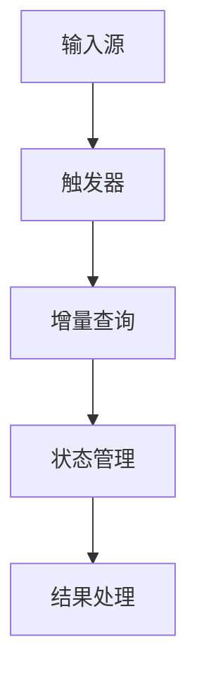

# Structured Streaming原理与代码实例讲解

## 1.背景介绍

近年来,随着大数据时代的到来,实时数据处理变得越来越重要。传统的批处理系统无法满足当前对实时数据处理的需求,因为它们需要周期性地处理数据,并且无法实时响应。为了解决这个问题,Apache Spark推出了Structured Streaming,这是一种新的实时数据处理引擎,可以高效地处理持续不断到达的数据流。

Structured Streaming是Spark 2.0中引入的一项新功能,它将流处理与Spark SQL引擎相结合,使用户可以使用相同的高级API和优化来处理批处理和流数据。这种统一的处理方式极大地简化了流式应用程序的开发和维护,同时保持了Spark强大的容错能力和可伸缩性。

## 2.核心概念与联系

### 2.1 Structured Streaming概念

Structured Streaming将流式计算视为一系列持续不断到达的临时视图,这些视图由到达的数据流组成。它将每个流式数据视为一个无界的表,并在内部将其处理为一系列基于时间的增量数据。这种方法允许Structured Streaming利用Spark SQL的优化能力来高效地处理流数据。

### 2.2 流式数据的持续处理

Structured Streaming通过将流式数据视为一系列临时视图来实现持续处理。每个视图都由在特定时间间隔内到达的数据组成,并且可以像处理静态数据一样进行处理。这种方法确保了数据的完整性和容错性,因为每个视图都是独立处理的,并且可以在需要时进行重新处理。

### 2.3 与批处理的关系

Structured Streaming与Spark的批处理引擎密切相关。实际上,它利用了Spark SQL的查询优化器和执行引擎来处理流式数据。这种统一的处理方式使得开发人员可以使用相同的API和优化技术来处理批处理和流式数据,从而简化了应用程序的开发和维护。

## 3.核心算法原理具体操作步骤

Structured Streaming的核心算法原理可以概括为以下几个步骤:

1. **输入源(Input Source)**: 流式数据从各种来源(如Kafka、文件系统等)被接收,并被视为一个无界的表。

2. **触发器(Triggers)**: 系统会根据设置的触发器间隔(如每隔1秒)来检查是否有新的数据到达。如果有新数据,则会触发下一步骤。

3. **增量查询(Incremental Query)**: 对于每个触发的时间间隔,系统会执行一个增量查询,该查询只处理自上一个触发间隔以来到达的新数据。

4. **状态管理(State Management)**: 系统会跟踪处理过的数据,以确保每个记录只被处理一次。这通过使用检查点和预写日志(Write-Ahead Log)机制来实现。

5. **结果处理(Result Handling)**: 增量查询的结果会被写入到外部数据接收器(如文件系统或数据库)中。

以下是Structured Streaming的工作流程图:



这种增量处理方式确保了数据的完整性和容错性,同时也提高了整体系统的吞吐量和延迟。

## 4.数学模型和公式详细讲解举例说明

在Structured Streaming中,流式数据被视为一个无界的表,表中的每一行都代表一个数据记录。我们可以使用以下数学模型来表示流式数据:

$$
Table = \{Row_1, Row_2, Row_3, \ldots\}
$$

其中,每一行$Row_i$都是一个元组,包含了多个字段的值。

为了处理流式数据,Structured Streaming将无界表划分为一系列有界的增量数据集。每个增量数据集都包含在特定时间间隔内到达的数据记录。我们可以使用以下公式来表示:

$$
Table = \bigcup_{i=1}^{\infty} Increment_i
$$

其中,$Increment_i$表示第$i$个时间间隔内到达的数据记录集合。

在处理每个增量数据集时,Structured Streaming会执行一个增量查询,该查询只处理自上一个时间间隔以来到达的新数据。增量查询的结果会被写入到外部数据接收器中。

为了确保每个数据记录只被处理一次,Structured Streaming使用了一种称为预写日志(Write-Ahead Log)的技术。预写日志记录了已经处理过的数据记录,以便在发生故障时可以从上次的检查点恢复。

我们可以使用以下公式来表示预写日志:

$$
WAL = \{Row_1, Row_2, \ldots, Row_n\}
$$

其中,$WAL$表示预写日志,它包含了已经处理过的数据记录。

在恢复时,Structured Streaming会从上次的检查点开始,重新处理所有未处理的数据记录。这可以通过以下公式来表示:

$$
Reprocess = Table \setminus WAL
$$

其中,$Reprocess$表示需要重新处理的数据记录集合,它是无界表$Table$与预写日志$WAL$的差集。

通过这种数学模型和公式,我们可以更好地理解Structured Streaming的工作原理,并且可以对其进行更深入的分析和优化。

## 5.项目实践:代码实例和详细解释说明

在本节中,我们将通过一个实际的代码示例来展示如何使用Structured Streaming进行流式数据处理。我们将使用Python和Spark Streaming API来构建一个简单的流式应用程序,该应用程序从Kafka主题中读取数据,并将处理后的结果写入到文件系统中。

### 5.1 设置环境

首先,我们需要设置Spark和Kafka的环境。假设您已经安装了Spark和Kafka,并且已经启动了Kafka服务器和ZooKeeper。

```python
# 导入所需的模块
from pyspark.sql import SparkSession
from pyspark.sql.functions import *
from pyspark.sql.types import *

# 创建SparkSession
spark = SparkSession.builder \
    .appName("StructuredStreamingExample") \
    .getOrCreate()

# 设置日志级别
spark.sparkContext.setLogLevel("ERROR")
```

### 5.2 定义输入源和Schema

接下来,我们需要定义输入源和Schema。在本例中,我们将从Kafka主题中读取数据,并定义一个简单的Schema,包含两个字段:`key`和`value`。

```python
# 定义Kafka主题和Schema
kafka_topic = "test-topic"
schema = StructType([
    StructField("key", StringType(), True),
    StructField("value", StringType(), True)
])
```

### 5.3 创建流式数据框架

现在,我们可以使用`spark.readStream()`方法创建一个流式数据框架,并指定输入源和Schema。

```python
# 创建流式数据框架
kafka_df = spark \
    .readStream \
    .format("kafka") \
    .option("kafka.bootstrap.servers", "localhost:9092") \
    .option("subscribe", kafka_topic) \
    .load() \
    .select(from_json(col("value").cast("string"), schema).alias("data")) \
    .select("data.*")
```

在上面的代码中,我们使用`from_json()`函数将Kafka消息的值从JSON格式解析为结构化数据。

### 5.4 执行流式查询

接下来,我们可以对流式数据框架执行一些转换和操作,并将结果写入到文件系统中。

```python
# 执行流式查询
query = kafka_df \
    .writeStream \
    .format("json") \
    .option("path", "output") \
    .option("checkpointLocation", "checkpoint") \
    .trigger(processingTime="10 seconds") \
    .start()

# 等待终止信号
query.awaitTermination()
```

在上面的代码中,我们使用`writeStream`方法指定输出格式和路径,并设置检查点位置。我们还使用`trigger()`方法指定触发间隔为10秒。最后,我们调用`start()`方法启动流式查询,并使用`awaitTermination()`方法等待终止信号。

### 5.5 测试

现在,我们可以测试我们的流式应用程序。首先,我们需要向Kafka主题发送一些测试数据。您可以使用任何Kafka生产者客户端来完成此操作。

例如,您可以使用Python的`kafka-python`库来发送测试数据:

```python
from kafka import KafkaProducer
import json

producer = KafkaProducer(bootstrap_servers='localhost:9092')

for i in range(10):
    data = {"key": str(i), "value": f"test message {i}"}
    producer.send('test-topic', value=json.dumps(data).encode('utf-8'))
    print(f"Sent message: {data}")

producer.flush()
```

上面的代码将向`test-topic`主题发送10条测试消息。

如果一切正常,您应该能够在`output`目录中看到处理后的数据文件。每个文件都应该包含10条记录,每条记录对应一条Kafka消息。

通过这个示例,您应该已经了解了如何使用Structured Streaming进行流式数据处理。当然,在实际应用中,您可能需要进行更复杂的转换和操作,但基本原理是相同的。

## 6.实际应用场景

Structured Streaming由于其简单、高效和容错的特性,在许多实际应用场景中得到了广泛的应用,包括但不限于以下几个方面:

1. **物联网(IoT)数据处理**: 在物联网领域,大量的传感器和设备会持续不断地产生海量的数据流。Structured Streaming可以用于实时处理这些数据流,例如实时监控设备状态、检测异常等。

2. **日志分析**: 在大型分布式系统中,日志数据是一种常见的数据源。Structured Streaming可以用于实时处理日志数据,进行实时监控、异常检测和分析等操作。

3. **实时推荐系统**: 在电子商务、社交媒体等领域,实时推荐系统对于提高用户体验至关重要。Structured Streaming可以用于实时处理用户行为数据,并根据这些数据实时生成个性化推荐。

4. **实时fraud检测**: 在金融、电子商务等领域,实时fraud检测对于防止欺诈行为至关重要。Structured Streaming可以用于实时处理交易数据,并基于机器学习模型实时检测潜在的欺诈行为。

5. **实时数据仓库**: 在大数据领域,实时数据仓库越来越受到重视。Structured Streaming可以用于实时处理各种数据源,并将处理后的数据实时加载到数据仓库中,为下游的分析和决策提供支持。

6. **实时监控和告警**: 在各种领域,实时监控和告警系统对于及时发现和响应异常情况至关重要。Structured Streaming可以用于实时处理各种监控数据,并基于预定义的规则实时触发告警。

这些只是Structured Streaming的一些典型应用场景,随着实时数据处理需求的不断增长,Structured Streaming在未来还将有更广阔的应用前景。

## 7.工具和资源推荐

在使用Structured Streaming进行流式数据处理时,有一些工具和资源可以为您提供帮助和支持。以下是一些推荐的工具和资源:

1. **Apache Kafka**: Apache Kafka是一个分布式流式处理平台,它提供了可靠的消息队列功能,可以作为Structured Streaming的输入源。Kafka具有高吞吐量、可伸缩性强等优点,非常适合用于实时数据处理。

2. **Apache Spark官方文档**: Apache Spark官方文档提供了详细的Structured Streaming介绍、API参考和示例代码。这是学习和使用Structured Streaming的重要资源。

3. **Spark Streaming编程指南**: Spark Streaming编程指南是一本免费的在线书籍,涵盖了Spark Streaming的各个方面,包括基本概念、API使用、性能调优等。对于初学者和有经验的开发者都非常有用。

4. **Spark Summit视频**: Spark Summit是Apache Spark社区的年度大会,会有许多关于Structured Streaming的演讲和教程。这些视频资源可以帮助您更深入地了解Structured Streaming的最新发展和最佳实践。

5. **Spark用户邮件列表**: Spark用户邮件列表是一个活跃的社区,您可以在这里提出问题、分享经验,并与其他Spark用户互动。

6. **Structured Streaming第三方库**: 除了Spark自身提供的功能之外,还有一些第三方库可以扩展Structured Streaming的功能,