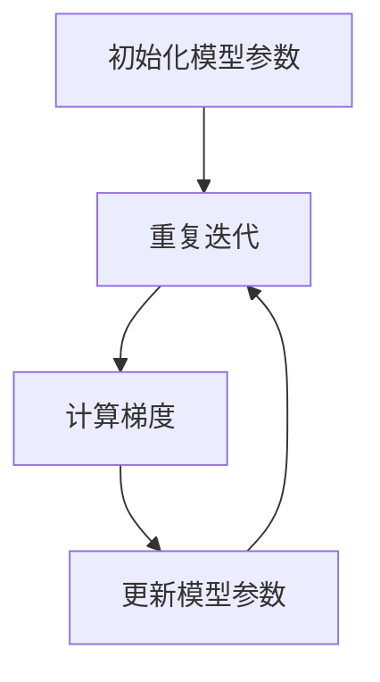

# Model Optimization 原理与代码实战案例讲解

## 1.背景介绍

在当今的人工智能和机器学习领域，模型优化（Model Optimization）是一个至关重要的环节。无论是为了提高模型的预测准确性，还是为了减少计算资源的消耗，模型优化都扮演着关键角色。随着深度学习模型的复杂性和规模不断增加，如何有效地优化模型成为了研究和应用中的热点问题。

模型优化不仅仅是调整超参数或选择合适的模型架构，它还涉及到一系列复杂的技术和方法，包括但不限于梯度下降算法、正则化技术、模型剪枝、量化、蒸馏等。这些技术的应用不仅可以提高模型的性能，还可以显著降低模型的计算和存储成本。

## 2.核心概念与联系

在深入探讨模型优化的具体方法之前，我们需要了解一些核心概念及其相互联系。

### 2.1 模型优化的定义

模型优化是指通过调整模型的参数、结构或训练过程，以提高模型的性能或效率的过程。优化的目标可以是多方面的，包括提高预测准确性、减少计算资源消耗、降低模型复杂度等。

### 2.2 超参数与参数

- **参数**：模型在训练过程中通过数据学习得到的变量，如神经网络中的权重和偏置。
- **超参数**：在训练开始前设置的变量，如学习率、批次大小、网络层数等。

### 2.3 损失函数

损失函数是衡量模型预测结果与真实结果之间差异的函数。优化的目标通常是最小化损失函数。

### 2.4 梯度下降

梯度下降是一种优化算法，用于通过迭代更新模型参数来最小化损失函数。常见的变种包括随机梯度下降（SGD）、动量梯度下降、Adam等。

### 2.5 正则化

正则化是一种防止模型过拟合的技术，通过在损失函数中加入惩罚项来限制模型的复杂度。常见的正则化方法有L1正则化和L2正则化。

### 2.6 模型剪枝

模型剪枝是通过移除不重要的神经元或连接来减少模型复杂度和计算量的方法。

### 2.7 量化

量化是将模型参数从高精度（如32位浮点数）转换为低精度（如8位整数）的方法，以减少存储和计算需求。

### 2.8 蒸馏

蒸馏是一种通过训练一个小模型（学生模型）来模仿一个大模型（教师模型）的方法，以在保持性能的同时减少模型复杂度。

## 3.核心算法原理具体操作步骤

在这一部分，我们将详细介绍几种常见的模型优化算法及其具体操作步骤。

### 3.1 梯度下降算法

梯度下降算法是最常用的优化算法之一，其基本思想是通过计算损失函数相对于模型参数的梯度，沿着梯度的反方向更新参数，以最小化损失函数。

#### 3.1.1 算法步骤

1. 初始化模型参数。
2. 计算损失函数。
3. 计算损失函数相对于模型参数的梯度。
4. 更新模型参数：$$ \theta = \theta - \eta \nabla_\theta L(\theta) $$
5. 重复步骤2-4，直到损失函数收敛或达到预定的迭代次数。

#### 3.1.2 Mermaid 流程图



### 3.2 正则化技术

正则化技术通过在损失函数中加入惩罚项来限制模型的复杂度，从而防止过拟合。

#### 3.2.1 L1正则化

L1正则化通过在损失函数中加入参数的绝对值和作为惩罚项：

$$ L_{reg} = L + \lambda \sum_{i} |\theta_i| $$

#### 3.2.2 L2正则化

L2正则化通过在损失函数中加入参数的平方和作为惩罚项：

$$ L_{reg} = L + \lambda \sum_{i} \theta_i^2 $$

### 3.3 模型剪枝

模型剪枝通过移除不重要的神经元或连接来减少模型的复杂度和计算量。

#### 3.3.1 剪枝步骤

1. 训练初始模型。
2. 评估每个神经元或连接的重要性。
3. 移除不重要的神经元或连接。
4. 微调剪枝后的模型。

### 3.4 量化

量化是将模型参数从高精度转换为低精度的方法，以减少存储和计算需求。

#### 3.4.1 量化步骤

1. 训练高精度模型。
2. 将模型参数转换为低精度。
3. 微调量化后的模型。

### 3.5 蒸馏

蒸馏通过训练一个小模型来模仿一个大模型，以在保持性能的同时减少模型复杂度。

#### 3.5.1 蒸馏步骤

1. 训练大模型（教师模型）。
2. 使用大模型的输出作为小模型（学生模型）的训练目标。
3. 训练小模型，使其输出尽可能接近大模型的输出。

## 4.数学模型和公式详细讲解举例说明

在这一部分，我们将通过具体的数学模型和公式来详细讲解模型优化的原理和应用。

### 4.1 梯度下降算法的数学原理

梯度下降算法的核心在于通过计算损失函数相对于模型参数的梯度，沿着梯度的反方向更新参数，以最小化损失函数。

#### 4.1.1 损失函数

假设我们有一个简单的线性回归模型，其损失函数为均方误差（MSE）：

$$ L(\theta) = \frac{1}{2m} \sum_{i=1}^{m} (h_\theta(x^{(i)}) - y^{(i)})^2 $$

其中，$h_\theta(x) = \theta^T x$ 是模型的预测值，$m$ 是样本数量。

#### 4.1.2 梯度计算

损失函数相对于模型参数的梯度为：

$$ \nabla_\theta L(\theta) = \frac{1}{m} \sum_{i=1}^{m} (h_\theta(x^{(i)}) - y^{(i)}) x^{(i)} $$

#### 4.1.3 参数更新

根据梯度下降算法，参数更新公式为：

$$ \theta = \theta - \eta \nabla_\theta L(\theta) $$

其中，$\eta$ 是学习率。

### 4.2 正则化技术的数学原理

正则化技术通过在损失函数中加入惩罚项来限制模型的复杂度，从而防止过拟合。

#### 4.2.1 L1正则化

L1正则化通过在损失函数中加入参数的绝对值和作为惩罚项：

$$ L_{reg} = L + \lambda \sum_{i} |\theta_i| $$

其中，$\lambda$ 是正则化参数。

#### 4.2.2 L2正则化

L2正则化通过在损失函数中加入参数的平方和作为惩罚项：

$$ L_{reg} = L + \lambda \sum_{i} \theta_i^2 $$

### 4.3 模型剪枝的数学原理

模型剪枝通过移除不重要的神经元或连接来减少模型的复杂度和计算量。

#### 4.3.1 剪枝策略

假设我们有一个神经网络，其权重矩阵为 $W$。我们可以通过评估每个权重的重要性来决定是否移除该权重。常见的评估方法包括权重的绝对值、梯度的大小等。

## 5.项目实践：代码实例和详细解释说明

在这一部分，我们将通过具体的代码实例来展示如何进行模型优化。

### 5.1 梯度下降算法的实现

以下是一个简单的梯度下降算法的实现示例：

```python
import numpy as np

# 生成数据
X = np.random.rand(100, 1)
y = 3 * X + np.random.randn(100, 1)

# 初始化参数
theta = np.random.randn(2, 1)
learning_rate = 0.01
iterations = 1000

# 添加偏置项
X_b = np.c_[np.ones((100, 1)), X]

# 梯度下降算法
for iteration in range(iterations):
    gradients = 2 / 100 * X_b.T.dot(X_b.dot(theta) - y)
    theta = theta - learning_rate * gradients

print("优化后的参数：", theta)
```

### 5.2 正则化技术的实现

以下是一个带有L2正则化的线性回归实现示例：

```python
import numpy as np

# 生成数据
X = np.random.rand(100, 1)
y = 3 * X + np.random.randn(100, 1)

# 初始化参数
theta = np.random.randn(2, 1)
learning_rate = 0.01
iterations = 1000
lambda_reg = 0.1

# 添加偏置项
X_b = np.c_[np.ones((100, 1)), X]

# 带有L2正则化的梯度下降算法
for iteration in range(iterations):
    gradients = 2 / 100 * X_b.T.dot(X_b.dot(theta) - y) + 2 * lambda_reg * theta
    theta = theta - learning_rate * gradients

print("优化后的参数：", theta)
```

### 5.3 模型剪枝的实现

以下是一个简单的模型剪枝实现示例：

```python
import tensorflow as tf
from tensorflow.keras.models import Sequential
from tensorflow.keras.layers import Dense
from tensorflow_model_optimization.sparsity import keras as sparsity

# 生成数据
X = np.random.rand(1000, 20)
y = np.random.randint(2, size=(1000, 1))

# 构建模型
model = Sequential([
    Dense(64, activation='relu', input_shape=(20,)),
    Dense(64, activation='relu'),
    Dense(1, activation='sigmoid')
])

# 编译模型
model.compile(optimizer='adam', loss='binary_crossentropy', metrics=['accuracy'])

# 定义剪枝参数
pruning_params = {
    'pruning_schedule': sparsity.PolynomialDecay(initial_sparsity=0.0,
                                                 final_sparsity=0.5,
                                                 begin_step=2000,
                                                 end_step=10000)
}

# 应用剪枝
model = sparsity.prune_low_magnitude(model, **pruning_params)

# 训练模型
model.fit(X, y, epochs=10, batch_size=32, callbacks=[sparsity.UpdatePruningStep()])

# 剪枝后的模型
model = sparsity.strip_pruning(model)
```

### 5.4 量化的实现

以下是一个简单的模型量化实现示例：

```python
import tensorflow as tf
from tensorflow.keras.models import Sequential
from tensorflow.keras.layers import Dense

# 生成数据
X = np.random.rand(1000, 20)
y = np.random.randint(2, size=(1000, 1))

# 构建模型
model = Sequential([
    Dense(64, activation='relu', input_shape=(20,)),
    Dense(64, activation='relu'),
    Dense(1, activation='sigmoid')
])

# 编译模型
model.compile(optimizer='adam', loss='binary_crossentropy', metrics=['accuracy'])

# 训练模型
model.fit(X, y, epochs=10, batch_size=32)

# 量化模型
converter = tf.lite.TFLiteConverter.from_keras_model(model)
converter.optimizations = [tf.lite.Optimize.DEFAULT]
tflite_model = converter.convert()

# 保存量化后的模型
with open('model.tflite', 'wb') as f:
    f.write(tflite_model)
```

### 5.5 蒸馏的实现

以下是一个简单的模型蒸馏实现示例：

```python
import tensorflow as tf
from tensorflow.keras.models import Sequential
from tensorflow.keras.layers import Dense

# 生成数据
X = np.random.rand(1000, 20)
y = np.random.randint(2, size=(1000, 1))

# 构建教师模型
teacher_model = Sequential([
    Dense(128, activation='relu', input_shape=(20,)),
    Dense(128, activation='relu'),
    Dense(1, activation='sigmoid')
])

# 编译教师模型
teacher_model.compile(optimizer='adam', loss='binary_crossentropy', metrics=['accuracy'])

# 训练教师模型
teacher_model.fit(X, y, epochs=10, batch_size=32)

# 构建学生模型
student_model = Sequential([
    Dense(64, activation='relu', input_shape=(20,)),
    Dense(64, activation='relu'),
    Dense(1, activation='sigmoid')
])

# 编译学生模型
student_model.compile(optimizer='adam', loss='binary_crossentropy', metrics=['accuracy'])

# 蒸馏训练
def distillation_loss(y_true, y_pred, teacher_pred, temperature=3):
    teacher_pred = tf.nn.softmax(teacher_pred / temperature)
    student_pred = tf.nn.softmax(y_pred / temperature)
    return tf.reduce_mean(tf.keras.losses.categorical_crossentropy(teacher_pred, student_pred))

for epoch in range(10):
    teacher_pred = teacher_model.predict(X)
    student_model.fit(X, y, epochs=1, batch_size=32, verbose=0)
    student_loss = distillation_loss(y, student_model.predict(X), teacher_pred)
    print(f'Epoch {epoch+1}, Student Loss: {student_loss.numpy()}')
```

## 6.实际应用场景

模型优化技术在实际应用中有着广泛的应用场景。以下是一些典型的应用场景：

### 6.1 移动设备上的模型部署

在移动设备上部署深度学习模型时，计算资源和存储空间通常是有限的。通过模型剪枝和量化技术，可以显著减少模型的大小和计算量，从而在移动设备上实现高效的模型部署。

### 6.2 实时系统中的模型推理

在实时系统中，模型推理的速度至关重要。通过优化模型的结构和参数，可以提高模型的推理速度，从而满足实时系统的需求。

### 6.3 云端服务中的模型优化

在云端服务中，模型的计算资源和存储成本是重要的考虑因素。通过模型优化技术，可以减少模型的计算和存储需求，从而降低云端服务的成本。

## 7.工具和资源推荐

在进行模型优化时，有许多工具和资源可以帮助我们更高效地完成任务。以下是一些推荐的工具和资源：

### 7.1 TensorFlow Model Optimization Toolkit

TensorFlow Model Optimization Toolkit 是一个用于优化TensorFlow模型的工具包，提供了剪枝、量化和蒸馏等功能。

### 7.2 PyTorch Quantization Toolkit

PyTorch Quantization Toolkit 是一个用于优化PyTorch模型的工具包，提供了量化和剪枝等功能。

### 7.3 ONNX Runtime

ONNX Runtime 是一个高性能的推理引擎，支持多种优化技术，如量化和剪枝。

### 7.4 相关文献和书籍

- 《深度学习》 - Ian Goodfellow, Yoshua Bengio, Aaron Courville
- 《模式识别与机器学习》 - Christopher M. Bishop
- 《神经网络与深度学习》 - Michael Nielsen

## 8.总结：未来发展趋势与挑战

模型优化技术在人工智能和机器学习领域有着广泛的应用前景。随着深度学习模型的复杂性和规模不断增加，如何有效地优化模型将成为一个持续的研究热点。

### 8.1 未来发展趋势

- **自动化模型优化**：通过自动化工具和算法，减少人工干预，提高模型优化的效率。
- **跨平台优化**：针对不同硬件平台（如CPU、GPU、TPU等）进行优化，以提高模型的性能。
- **联合优化**：结合多种优化技术，如剪枝、量化和蒸馏，以实现更高效的模型优化。

### 8.2 挑战

- **优化效果的评估**：如何有效地评估优化效果，确保优化后的模型在实际应用中表现良好。
- **优化过程的稳定性**：在进行模型优化时，如何保证优化过程的稳定性，避免模型性能的显著下降。
- **优化技术的通用性**：如何开发通用的优化技术，适用于不同类型的模型和应用场景。

## 9.附录：常见问题与解答

### 9.1 什么是模型优化？

模型优化是指通过调整模型的参数、结构或训练过程，以提高模型的性能或效率的过程。

### 9.2 模型优化有哪些常见方法？

常见的模型优化方法包括梯度下降算法、正则化技术、模型剪枝、量化和蒸馏等。

### 9.3 如何选择合适的优化方法？

选择合适的优化方法需要根据具体的应用场景和需求来决定。例如，在计算资源有限的情况下，可以考虑使用模型剪枝和量化技术。

### 9.4 模型优化的效果如何评估？

模型优化的效果可以通过多种指标来评估，如预测准确性、推理速度、模型大小等。

### 9.5 模型优化过程中需要注意哪些问题？

在进行模型优化时，需要注意优化过程的稳定性，避免模型性能的显著