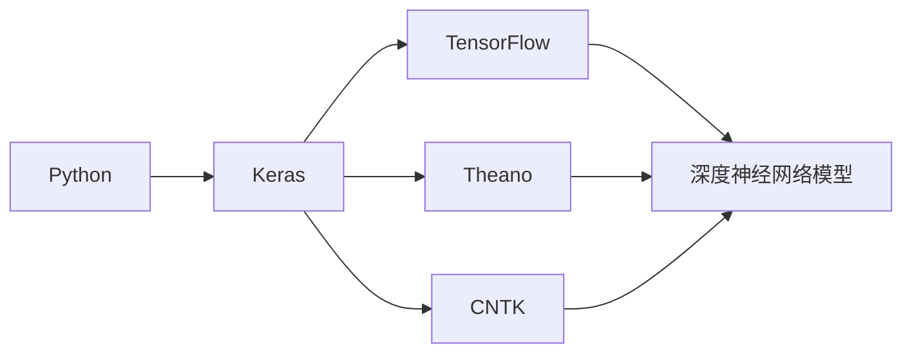
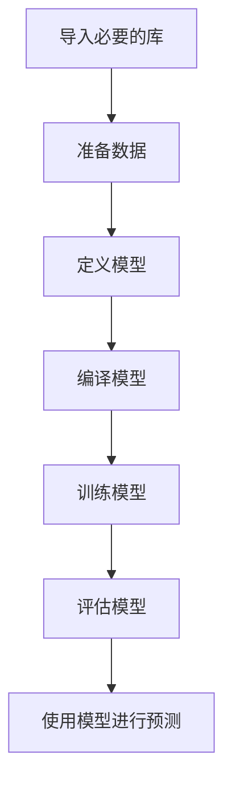

# Python机器学习实战：使用Keras快速搭建深度神经网络

## 1.背景介绍

在当今数据驱动的时代，机器学习已经成为各行各业的核心技术。深度学习作为机器学习的一个重要分支,已经在计算机视觉、自然语言处理、语音识别等领域取得了令人瞩目的成就。作为深度学习的主要工具之一,Python凭借其简洁易学的语法和丰富的第三方库,已经成为机器学习和深度学习领域的主流编程语言。

Keras是一个高级的Python神经网络API,它能够在TensorFlow、CNTK或Theano之上运行。Keras的设计理念是支持快速实验,它能够以最小的代价构建深度学习模型,从而使得开发人员能够专注于提出新的想法和测试新的想法。Keras非常适合快速搭建原型,并可以轻松地将其扩展到生产环境。



## 2.核心概念与联系

在深入探讨如何使用Keras搭建深度神经网络之前,我们需要先了解一些核心概念。

### 2.1 张量(Tensor)

张量是一种多维数组,它是Keras中最基本的数据结构。在Keras中,所有的输入数据和模型参数都被表示为张量。张量的阶数(rank)表示它的维度数,例如一个标量是一个0阶张量,一个向量是一个一阶张量,一个矩阵是一个二阶张量。

### 2.2 层(Layer)

层是深度神经网络的基本构建模块。Keras提供了多种预定义的层,例如全连接层、卷积层、池化层等。每一层都会对输入数据进行一些变换,并将变换后的结果传递给下一层。

### 2.3 模型(Model)

模型是由多个层按照一定的顺序堆叠而成的。Keras支持两种类型的模型:Sequential模型和函数式API模型。Sequential模型是一种线性的层堆叠方式,适用于简单的网络结构;而函数式API模型则更加灵活,可以构建任意复杂的网络结构。

### 2.4 损失函数(Loss Function)和优化器(Optimizer)

在训练深度神经网络时,我们需要定义一个损失函数来衡量模型的预测结果与真实结果之间的差异。常用的损失函数包括均方误差、交叉熵等。同时,我们还需要选择一个优化器,例如随机梯度下降、Adam等,来不断调整模型的参数,使得损失函数的值最小化。

## 3.核心算法原理具体操作步骤

使用Keras搭建深度神经网络的一般步骤如下:



### 3.1 导入必要的库

```python
import numpy as np
from keras.models import Sequential
from keras.layers import Dense, Dropout
```

### 3.2 准备数据

在开始构建模型之前,我们需要对数据进行预处理,包括归一化、编码等操作,以确保数据符合模型的输入要求。

### 3.3 定义模型

使用Sequential模型或函数式API定义模型的层次结构。以下是一个简单的Sequential模型示例:

```python
model = Sequential()
model.add(Dense(64, input_dim=20, activation='relu'))
model.add(Dropout(0.5))
model.add(Dense(64, activation='relu'))
model.add(Dropout(0.5))
model.add(Dense(1, activation='sigmoid'))
```

### 3.4 编译模型

在定义好模型结构后,我们需要编译模型,指定损失函数和优化器。

```python
model.compile(loss='binary_crossentropy', optimizer='rmsprop', metrics=['accuracy'])
```

### 3.5 训练模型

使用`model.fit()`函数训练模型,可以指定训练数据、验证数据、epochs(迭代次数)、batch_size(每次迭代的样本数)等参数。

```python
model.fit(X_train, y_train, epochs=20, batch_size=128)
```

### 3.6 评估模型

使用`model.evaluate()`函数评估模型在测试数据上的表现。

```python
score = model.evaluate(X_test, y_test, batch_size=128)
```

### 3.7 使用模型进行预测

使用`model.predict()`函数对新的数据进行预测。

```python
predictions = model.predict(X_new)
```

## 4.数学模型和公式详细讲解举例说明

在深度学习中,我们经常会遇到一些数学模型和公式,下面我们将详细讲解其中的一些重要概念。

### 4.1 激活函数

激活函数是深度神经网络中一个非常重要的概念,它决定了神经元的输出。常用的激活函数包括Sigmoid函数、Tanh函数、ReLU函数等。

1) Sigmoid函数

Sigmoid函数的数学表达式如下:

$$\sigma(x) = \frac{1}{1 + e^{-x}}$$

它将输入值映射到(0,1)范围内,常用于二分类问题的输出层。

2) Tanh函数

Tanh函数的数学表达式如下:

$$\tanh(x) = \frac{e^x - e^{-x}}{e^x + e^{-x}}$$

它将输入值映射到(-1,1)范围内,相比Sigmoid函数,它是一种零均值函数,收敛速度更快。

3) ReLU函数

ReLU(Rectified Linear Unit)函数的数学表达式如下:

$$\text{ReLU}(x) = \max(0, x)$$

它是一种分段线性函数,当输入值大于0时,直接输出该值;当输入值小于或等于0时,输出0。ReLU函数在深度神经网络中被广泛使用,因为它可以有效地缓解梯度消失问题。

### 4.2 损失函数

损失函数用于衡量模型的预测结果与真实结果之间的差异,是深度学习模型训练的关键。常用的损失函数包括均方误差、交叉熵等。

1) 均方误差(Mean Squared Error, MSE)

均方误差是回归问题中常用的损失函数,它的数学表达式如下:

$$\text{MSE} = \frac{1}{n}\sum_{i=1}^{n}(y_i - \hat{y}_i)^2$$

其中,n是样本数量,$y_i$是真实值,$\hat{y}_i$是预测值。均方误差对于异常值比较敏感。

2) 交叉熵(Cross Entropy)

交叉熵常用于分类问题的损失函数,它的数学表达式如下:

$$\text{CrossEntropy} = -\sum_{i=1}^{n}y_i\log(\hat{y}_i)$$

其中,n是样本数量,$y_i$是真实值(0或1),$\hat{y}_i$是预测值(介于0和1之间)。

### 4.3 优化算法

优化算法用于调整深度神经网络的参数,使得损失函数的值最小化。常用的优化算法包括随机梯度下降(Stochastic Gradient Descent, SGD)、Adam等。

1) 随机梯度下降(SGD)

SGD是一种简单而有效的优化算法,它的核心思想是通过计算损失函数关于模型参数的梯度,并沿着梯度的反方向更新参数。SGD的数学表达式如下:

$$\theta_{t+1} = \theta_t - \eta\nabla_\theta J(\theta_t)$$

其中,$\theta_t$是当前的参数值,$\eta$是学习率,$\nabla_\theta J(\theta_t)$是损失函数关于参数的梯度。

2) Adam优化算法

Adam是一种自适应学习率的优化算法,它可以根据梯度的一阶矩估计和二阶矩估计动态调整每个参数的学习率。Adam的数学表达式较为复杂,感兴趣的读者可以查阅相关资料。

## 5.项目实践:代码实例和详细解释说明

为了更好地理解如何使用Keras搭建深度神经网络,我们将通过一个实际的项目实践来演示。在这个项目中,我们将使用Keras构建一个多层感知器(Multilayer Perceptron, MLP)模型,对MNIST手写数字数据集进行分类。

### 5.1 导入必要的库

```python
import numpy as np
from keras.datasets import mnist
from keras.models import Sequential
from keras.layers import Dense, Dropout
from keras.optimizers import RMSprop
```

### 5.2 加载数据

```python
# 加载MNIST数据集
(X_train, y_train), (X_test, y_test) = mnist.load_data()

# 将图像数据展平
X_train = X_train.reshape(60000, 784)
X_test = X_test.reshape(10000, 784)

# 将像素值归一化到0-1之间
X_train = X_train.astype('float32') / 255
X_test = X_test.astype('float32') / 255

# 将标签进行一热编码
from keras.utils import np_utils
y_train = np_utils.to_categorical(y_train, 10)
y_test = np_utils.to_categorical(y_test, 10)
```

### 5.3 定义模型

```python
model = Sequential()
model.add(Dense(512, activation='relu', input_shape=(784,)))
model.add(Dropout(0.2))
model.add(Dense(512, activation='relu'))
model.add(Dropout(0.2))
model.add(Dense(10, activation='softmax'))
```

在这个模型中,我们使用了两个全连接层,每个全连接层后面都加入了Dropout层,用于防止过拟合。最后一层使用Softmax激活函数,输出10个概率值,对应0-9这10个数字类别。

### 5.4 编译模型

```python
model.compile(loss='categorical_crossentropy',
              optimizer=RMSprop(),
              metrics=['accuracy'])
```

我们使用了categorical_crossentropy作为损失函数,RMSprop作为优化器,并将accuracy作为评估指标。

### 5.5 训练模型

```python
batch_size = 128
epochs = 20

model.fit(X_train, y_train,
          batch_size=batch_size,
          epochs=epochs,
          verbose=1,
          validation_data=(X_test, y_test))
```

我们将训练数据分成128个样本的小批次,进行20个epoch的训练。同时,我们将测试数据作为验证数据,用于监控模型在训练过程中的表现。

### 5.6 评估模型

```python
score = model.evaluate(X_test, y_test, verbose=0)
print('Test loss:', score[0])
print('Test accuracy:', score[1])
```

在训练完成后,我们在测试数据集上评估模型的损失和准确率。

### 5.7 使用模型进行预测

```python
# 选取一个测试样本
digit = X_test[0]

# 对样本进行预测
predictions = model.predict(digit.reshape(1, 784))

# 打印预测结果
print('Prediction:', np.argmax(predictions))
```

最后,我们选取一个测试样本,使用训练好的模型对其进行预测,并打印出预测的数字。

通过这个实际项目,我们可以更好地理解如何使用Keras搭建深度神经网络模型,包括数据预处理、模型定义、模型编译、模型训练、模型评估和模型预测等步骤。

## 6.实际应用场景

深度神经网络在各个领域都有广泛的应用,下面我们列举一些典型的应用场景:

1. **计算机视觉**:图像分类、目标检测、语义分割等。
2. **自然语言处理**:机器翻译、文本生成、情感分析等。
3. **语音识别**:语音转文本、语音合成等。
4. **推荐系统**:个性化推荐、内容推荐等。
5. **金融**:信用评分、欺诈检测、风险管理等。
6. **医疗健康**:医学影像分析、疾病诊断、药物发现等。
7. **自动驾驶**:环境感知、路径规划、决策控制等。

随着深度学习技术的不断发展,未来还会有更多的应用场景被开发出来。

## 7.工具和资源推荐

如果您想进一步学习和实践深度学习,以下是一些推荐的工具和资源:

1. **Keras官方文档**:https://keras.io/
2. **TensorFlow官方文档**:https://www.tensorflow.org/
3. **PyTorch官方文档**:https://pytorch.