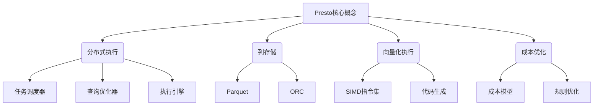

# Presto原理与代码实例讲解

## 1. 背景介绍

### 1.1 问题的由来

在大数据时代,海量数据的存储和高效查询成为了企业和组织面临的重大挑战。传统的数据库系统在处理大规模数据集时往往会遇到性能瓶颈,无法满足实时分析的需求。为了解决这一问题,分布式查询引擎应运而生。Presto作为一款开源的分布式SQL查询引擎,凭借其出色的查询性能和灵活的数据源连接能力,逐渐成为大数据分析领域的佼佼者。

### 1.2 研究现状

Presto最初由Facebook公司开发,旨在解决他们内部的大数据分析需求。自2013年开源以来,Presto得到了广泛的关注和采用,并吸引了包括Netflix、Airbnb、Uber等知名公司的贡献。目前,Presto已成为Apache软件基金会的顶级项目,拥有活跃的社区和持续的开发。

### 1.3 研究意义

深入理解Presto的原理和实现细节对于优化查询性能、解决实际问题具有重要意义。本文将全面剖析Presto的核心概念、算法原理、数学模型,并通过代码实例和应用场景分析,帮助读者掌握Presto的使用和优化技巧,提高大数据分析效率。

### 1.4 本文结构

本文将从以下几个方面深入探讨Presto:

1. 核心概念与联系
2. 核心算法原理与具体操作步骤
3. 数学模型和公式详细讲解与案例分析
4. 项目实践:代码实例和详细解释说明
5. 实际应用场景
6. 工具和资源推荐
7. 总结:未来发展趋势与挑战
8. 附录:常见问题与解答

## 2. 核心概念与联系



Presto的核心概念包括分布式执行、列存储、向量化执行和成本优化等,它们相互关联,共同构建了Presto高效的查询处理能力。

### 2.1 分布式执行

Presto采用主从架构,由一个协调节点(Coordinator)和多个工作节点(Worker)组成。查询由协调节点分解为多个阶段(Stage),每个阶段由一个或多个任务(Task)组成,这些任务分布在不同的工作节点上并行执行。

分布式执行由以下三个关键组件驱动:

1. **任务调度器(Task Scheduler)**: 负责将任务分发到合适的工作节点执行。
2. **查询优化器(Query Optimizer)**: 根据数据统计信息和成本模型,优化查询执行计划。
3. **执行引擎(Execution Engine)**: 在工作节点上执行任务,处理数据并生成结果。

### 2.2 列存储

与传统的行存储不同,Presto采用列存储格式,如Parquet和ORC,可以极大提高查询效率。列存储将同一列的数据存储在一起,有利于减少I/O操作和提高数据压缩率,尤其适合于只读取部分列的场景。

### 2.3 向量化执行

Presto通过向量化执行(Vectorized Execution)技术,充分利用现代CPU的SIMD(单指令多数据)指令集,同时处理多个数据元素,大幅提升了计算性能。此外,Presto还采用了代码生成(Code Generation)技术,在运行时动态生成高度优化的执行代码,进一步提高查询速度。

### 2.4 成本优化

Presto内置了成本优化器,通过成本模型(Cost Model)和规则优化(Rule-based Optimization),评估不同的执行计划,选择最优方案。成本模型考虑了多种因素,如CPU、内存、网络和I/O等,而规则优化则应用一系列优化规则,如谓词下推(Predicate Pushdown)、投影剪裁(Projection Pruning)等,以消除冗余计算。

## 3. 核心算法原理与具体操作步骤

### 3.1 算法原理概述

Presto的核心算法主要包括以下几个方面:

1. **查询解析和优化**: Presto将SQL查询解析为逻辑执行计划,并通过一系列优化规则转换为高效的分布式执行计划。
2. **任务调度**: 将执行计划分解为多个阶段和任务,并将任务分发到合适的工作节点执行。
3. **数据处理**: 工作节点执行任务,从数据源读取数据,进行过滤、投影、聚合等操作,并将结果传递给下一个阶段。
4. **数据交换**: 不同阶段之间通过高效的数据交换机制(如散射-聚集)传递中间结果。
5. **结果归并**: 协调节点将来自各个工作节点的部分结果进行归并,生成最终查询结果。

### 3.2 算法步骤详解

1. **查询解析**

   Presto将SQL查询解析为抽象语法树(AST),然后转换为逻辑执行计划。逻辑执行计划由一系列逻辑操作符(如扫描、投影、过滤、聚合等)组成,描述了查询的逻辑执行步骤。

2. **查询优化**

   Presto的查询优化器会应用一系列规则对逻辑执行计划进行等价转换,以生成更高效的执行计划。优化规则包括谓词下推、投影剪裁、常量折叠、连接重排序等。

3. **分布式执行计划生成**

   查询优化器将逻辑执行计划转换为分布式执行计划,其中包括多个阶段(Stage)和任务(Task)。每个阶段由一个或多个任务组成,任务将分布在不同的工作节点上执行。

4. **任务调度**

   任务调度器根据工作节点的负载情况,将任务分发到合适的工作节点执行。调度策略考虑了数据局部性、工作节点资源等因素,以实现高效的任务分布。

5. **数据处理**

   工作节点执行分配的任务,从数据源(如HDFS、Hive等)读取数据,并进行过滤、投影、聚合等操作。数据处理过程中,Presto利用了列存储和向量化执行技术,提高了计算效率。

6. **数据交换**

   不同阶段之间通过高效的数据交换机制(如散射-聚集)传递中间结果。数据交换过程中,Presto采用了优化策略,如数据重分区、数据压缩等,以减少网络传输开销。

7. **结果归并**

   协调节点将来自各个工作节点的部分结果进行归并,生成最终查询结果。结果归并过程中,Presto会进行排序、合并等操作,以确保结果的正确性和一致性。

### 3.3 算法优缺点

**优点**:

- 分布式执行,可以充分利用集群资源,处理大规模数据。
- 列存储和向量化执行技术,提高了查询性能。
- 成本优化器和规则优化,生成高效的执行计划。
- 支持多种数据源,如HDFS、Hive、MySQL等。
- 社区活跃,持续更新和优化。

**缺点**:

- 不支持事务和更新操作,仅限于分析查询。
- 对于小规模数据集,启动开销可能较大。
- 复杂查询优化可能存在性能瓶颈。
- 缺乏可视化工具,调试和监控较为困难。

### 3.4 算法应用领域

Presto主要应用于以下领域:

- **大数据分析**: 利用Presto的高效查询能力,对海量数据进行实时分析和探索。
- **数据湖分析**: 将Presto与数据湖(如Apache Hive)结合,实现对结构化和非结构化数据的统一分析。
- **交互式数据探索**: 借助Presto的低延迟查询,支持交互式数据可视化和探索。
- **ETL(Extract, Transform, Load)**: 将Presto作为高效的ETL工具,从多个数据源提取、转换和加载数据。

## 4. 数学模型和公式详细讲解与举例说明

在Presto中,数学模型和公式主要应用于查询优化和成本估算等方面。

### 4.1 数学模型构建

Presto的成本模型基于以下几个核心概念:

- **成本单位(Cost Unit)**: 用于衡量查询执行的成本,通常包括CPU、内存、网络和I/O等方面。
- **统计信息(Statistics)**: 描述数据特征的元数据,如行数、数据大小、数据分布等,用于估算操作符的成本。
- **代价函数(Cost Function)**: 根据统计信息和操作符的特征,计算操作符的成本。

成本模型可以用以下公式表示:

$$
Cost(op) = F(stats, op\_properties)
$$

其中,`Cost(op)`表示操作符`op`的成本,`F`是代价函数,`stats`是统计信息,`op_properties`是操作符的属性,如操作类型、数据格式等。

### 4.2 公式推导过程

以投影操作符(ProjectionNode)为例,其成本主要包括CPU成本和内存成本。

**CPU成本**:

CPU成本与需要处理的数据量和投影表达式的复杂度有关。假设需要处理`n`行数据,每行数据有`m`个列,投影表达式的复杂度为`c`,则CPU成本可表示为:

$$
CPU\_Cost = n \times m \times c
$$

**内存成本**:

内存成本与输出数据的大小有关。假设输出数据的大小为`output_size`,则内存成本可表示为:

$$
Memory\_Cost = output\_size
$$

综合CPU成本和内存成本,投影操作符的总成本为:

$$
Cost(ProjectionNode) = CPU\_Cost + Memory\_Cost = n \times m \times c + output\_size
$$

### 4.3 案例分析与讲解

考虑以下SQL查询:

```sql
SELECT
    year,
    count(*) as total_orders
FROM
    orders
WHERE
    status = 'COMPLETED'
GROUP BY
    year
ORDER BY
    total_orders DESC
LIMIT 5;
```

该查询从`orders`表中选取已完成订单的年份和数量,按照订单数量降序排列,并限制输出前5行。

我们可以使用Presto的成本模型来估算该查询的执行成本:

1. **扫描操作符(TableScanNode)**:

   假设`orders`表有1亿行数据,每行数据大小为100字节,则扫描操作符的成本为:

   $$
   Cost(TableScanNode) = 1\times10^8 \times 100 \text{ bytes} = 10 \text{ GB}
   $$

2. **过滤操作符(FilterNode)**:

   假设过滤条件`status = 'COMPLETED'`选择了20%的数据,则过滤操作符的成本为:

   $$
   Cost(FilterNode) = 0.2 \times Cost(TableScanNode) = 2 \text{ GB}
   $$

3. **聚合操作符(AggregationNode)**:

   假设聚合操作符需要处理2GB的数据,聚合表达式的复杂度为2,则聚合操作符的成本为:

   $$
   CPU\_Cost = 2 \times 10^9 \times 2 = 4 \times 10^9 \
   Memory\_Cost = 0.1 \times 2 \times 10^9 = 2 \times 10^8 \
   Cost(AggregationNode) = CPU\_Cost + Memory\_Cost = 4.2 \times 10^9
   $$

4. **排序操作符(SortNode)**:

   假设排序操作符需要处理0.1GB的数据,则排序操作符的成本为:

   $$
   Cost(SortNode) = 0.1 \times 10^9 \text{ bytes} = 0.1 \text{ GB}
   $$

5. **限制操作符(LimitNode)**:

   限制操作符的成本可以忽略不计。

通过估算各个操作符的成本,查询优化器可以比较不同执行计划的总成本,选择最优方案。

### 4.4 常见问题解答

**Q: 如何获取统