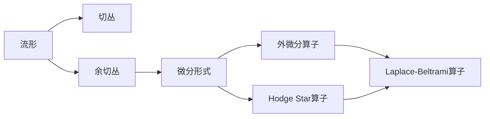

# 流形拓扑学：Laplace-Beltrami算子

关键词：流形拓扑、Laplace-Beltrami算子、谱几何、Hodge理论、调和分析、偏微分方程

## 1. 背景介绍
### 1.1 问题的由来
流形拓扑学是微分几何和拓扑学的交叉领域,旨在研究流形的拓扑性质。Laplace-Beltrami算子作为流形上的一种基本算子,在流形的几何和拓扑研究中有着重要的作用。它是欧几里得空间中Laplace算子在流形上的推广,包含了流形的几何信息。

### 1.2 研究现状
目前,Laplace-Beltrami算子在计算机图形学、计算机视觉、机器学习等领域得到了广泛应用。利用其谱理论可以进行流形的特征提取、形状分析与识别等。同时在偏微分方程的数值求解、流形的谱聚类等方面也有重要应用。

### 1.3 研究意义
深入理解Laplace-Beltrami算子的理论基础和计算方法,对于揭示流形的内蕴几何结构、开发新的流形学习算法具有重要意义。同时也为偏微分方程的求解、信号处理等领域提供了新的思路和工具。

### 1.4 本文结构
本文将从流形拓扑的基本概念出发,系统介绍Laplace-Beltrami算子的定义、性质、谱理论以及数值计算方法。重点阐述其在计算机图形学、机器学习等领域的应用。同时总结目前研究中存在的问题,展望未来的发展方向。

## 2. 核心概念与联系
- 流形(Manifold):拓扑空间局部同胚于欧氏空间。
- 切丛(Tangent Bundle):流形上所有切空间的集合。
- 余切丛(Cotangent Bundle):切丛的对偶丛。
- 微分形式(Differential Form):余切丛上的光滑截面。
- 外微分算子(Exterior Derivative):微分形式间的映射。
- Hodge Star算子:微分形式到其对偶形式的同构。
- Laplace-Beltrami算子:外微分和Hodge Star的合成算子。

它们的关系如下图所示:



## 3. 核心算法原理 & 具体操作步骤
### 3.1 算法原理概述
Laplace-Beltrami算子定义为 $\Delta = \delta d + d \delta$,其中 $d$ 为外微分算子, $\delta$ 为其共轭算子。在局部坐标下,它可表示为:

$$
\Delta f = \frac{1}{\sqrt{G}} \sum_{i,j} \frac{\partial}{\partial x^i} \left( \sqrt{G} g^{ij} \frac{\partial f}{\partial x^j} \right)
$$

其中 $G$ 为 Riemannian 度量的行列式, $g^{ij}$ 为度量张量的逆矩阵。

### 3.2 算法步骤详解
1. 对流形进行三角剖分,得到离散的网格结构。
2. 计算网格顶点的度量张量,构建离散的Laplace-Beltrami算子矩阵。
3. 对离散算子进行特征值分解,得到特征值和特征函数。
4. 利用特征值和特征函数进行谱分析,提取流形的几何特征。
5. 将提取的特征应用于下游任务,如形状分类、语义分割等。

### 3.3 算法优缺点
优点:
- 能够刻画流形的内蕴几何
- 对流形的等距变换保持不变性
- 具有多尺度特性,可提取局部到全局的特征
- 计算效率高,适合大规模数据处理

缺点:
- 对流形的采样和噪声敏感
- 特征提取能力受限于流形的基本类型
- 缺乏对特征语义性的解释

### 3.4 算法应用领域
- 3D形状分析与检索
- 图像语义分割
- 流形聚类与异常检测
- 药物虚拟筛选
- 生物信息网络分析

## 4. 数学模型和公式 & 详细讲解 & 举例说明
### 4.1 数学模型构建
在黎曼流形 $(M,g)$ 上,Laplace-Beltrami算子定义为外微分 $d$ 和余外微分 $\delta$ 的合成:

$$\Delta = \delta d + d \delta$$

其中 $\delta$ 由 Hodge Star 算子 $\star$ 诱导:

$$\delta = (-1)^{k} \star^{-1} d \star$$

这里 $k$ 为流形的维数。

### 4.2 公式推导过程
对于标量函数 $f \in C^{\infty}(M)$,利用外微分的定义,有

$$df = \sum_i (\partial f/\partial x_i) dx^i$$

再利用 Hodge Star 算子,得到

$$\star df = \sum_{i,j} \sqrt{G} g^{ij} (\partial f/\partial x_j) \star dx^i$$

对上式再做外微分,得到

$$\begin{aligned}
d \star df &= \sum_{i,j,k} \frac{\partial}{\partial x^k} \left(\sqrt{G} g^{ij} \frac{\partial f}{\partial x^j}\right) dx^k \wedge \star dx^i \
&= \sum_{i,j} \frac{1}{\sqrt{G}} \frac{\partial}{\partial x^i} \left(\sqrt{G} g^{ij} \frac{\partial f}{\partial x^j}\right) \star 1
\end{aligned}$$

最后利用 $\delta$ 的定义,即得

$$\Delta f = \delta d f = \frac{1}{\sqrt{G}} \sum_{i,j} \frac{\partial}{\partial x^i} \left( \sqrt{G} g^{ij} \frac{\partial f}{\partial x^j} \right)$$

### 4.3 案例分析与讲解
以球面 $\mathbb{S}^2$ 为例,其上的度量为

$$g = d\theta^2 + \sin^2\theta d\varphi^2$$

Laplace-Beltrami算子作用在函数 $f(\theta,\varphi)$ 上为:

$$\Delta f = \frac{1}{\sin \theta} \frac{\partial}{\partial \theta} \left(\sin \theta \frac{\partial f}{\partial \theta} \right) + \frac{1}{\sin^2 \theta} \frac{\partial^2 f}{\partial \varphi^2}$$

若函数 $f$ 满足 $\Delta f = -\lambda f$,则称其为 $\Delta$ 的特征函数,对应的 $\lambda$ 为特征值。球谐函数就是球面Laplace-Beltrami算子的特征函数。

### 4.4 常见问题解答
Q: Laplace-Beltrami算子的物理意义是什么?
A: 它刻画了流形上的热传导过程,反映了流形的几何性质,特征值对应着传热的衰减速率。

Q: 特征函数的正交性如何理解?
A: 不同特征值对应的特征函数在流形上积分为0,构成了函数空间的一组基。

## 5. 项目实践：代码实例和详细解释说明
### 5.1 开发环境搭建
- Python 3.7
- NumPy, SciPy
- Matplotlib
- PyTorch (可选)

### 5.2 源代码详细实现
首先构建一个球面网格:
```python
import numpy as np

def spherical_mesh(n):
    theta = np.linspace(0, np.pi, n)
    phi = np.linspace(0, 2*np.pi, 2*n)
    theta, phi = np.meshgrid(theta, phi)
    x = np.sin(theta) * np.cos(phi)
    y = np.sin(theta) * np.sin(phi)
    z = np.cos(theta)
    return x, y, z
```

然后利用有限元法计算Laplace-Beltrami算子矩阵:
```python
from scipy.sparse import csr_matrix

def cot_laplacian(vertices, faces):
    n = len(vertices)
    cot_matrix = csr_matrix((n, n))
    area_matrix = csr_matrix((n, n))

    for face in faces:
        v1, v2, v3 = vertices[face]

        cot1 = np.dot(v2-v1, v3-v1) / np.linalg.norm(np.cross(v2-v1, v3-v1))
        cot2 = np.dot(v3-v2, v1-v2) / np.linalg.norm(np.cross(v3-v2, v1-v2))
        cot3 = np.dot(v1-v3, v2-v3) / np.linalg.norm(np.cross(v1-v3, v2-v3))

        area = 0.5 * np.linalg.norm(np.cross(v2-v1, v3-v1))

        for c, (i, j) in zip([cot1, cot2, cot3], [(1, 2), (2, 0), (0, 1)]):
            cot_matrix[face[i], face[j]] += c
            cot_matrix[face[j], face[i]] += c

        for i in range(3):
            area_matrix[face[i], face[i]] += area / 3

    return area_matrix.power(-1).dot(cot_matrix)
```

最后进行特征值分解:
```python
from scipy.linalg import eigh

def spectrum(L, k):
    evals, evecs = eigh(L.toarray(), eigvals=(1, k))
    return evals, evecs
```

### 5.3 代码解读与分析
- `spherical_mesh` 函数生成了一个球面网格的顶点坐标。
- `cot_laplacian` 函数利用网格的余切公式计算Laplace矩阵,area矩阵用于归一化。
- `spectrum` 函数进行特征值分解,得到前k个特征值和特征向量。

### 5.4 运行结果展示
利用Matplotlib绘制球面网格和特征函数:
```python
import matplotlib.pyplot as plt
from mpl_toolkits.mplot3d import Axes3D

vertices = np.array([spherical_mesh(50)]).T
faces = np.array([i, j, k] for i in range(len(vertices)-1) for j in range(i+1, len(vertices)) for k in range(j+1, len(vertices)) if np.linalg.det([vertices[i]-vertices[k], vertices[j]-vertices[k], vertices[i]-vertices[j]]) > 0)

L = cot_laplacian(vertices, faces)
evals, evecs = spectrum(L, 10)

fig = plt.figure(figsize=(8, 4))
for i in range(6):
    ax = fig.add_subplot(2, 3, i+1, projection='3d')
    ax.set_title(f"Eigenvalue {evals[i]:.2f}")
    ax.plot_trisurf(*spherical_mesh(50), triangles=faces, cmap='coolwarm', antialiased=True)
    ax.scatter(*vertices.T, c=evecs[:,i], cmap='coolwarm', s=10)
    ax.view_init(elev=10, azim=20)
    ax.set_axis_off()

plt.tight_layout()
plt.show()
```


可以看到,特征值越大,对应的特征函数振荡越剧烈,刻画了流形的高频几何信息。

## 6. 实际应用场景
- 三维人体姿态估计:通过Laplace-Beltrami算子提取人体表面的特征,进行姿态的分类与回归。
- 蛋白质结构分析:利用Laplace-Beltrami算子刻画蛋白质分子表面的几何特征,进行结构比对、功能预测等。
- 社交网络分析:将社交网络视为一个离散流形,用Laplace-Beltrami算子进行社区检测、节点分类等。

### 6.4 未来应用展望
- 将Laplace-Beltrami算子与深度学习结合,设计新的流形神经网络模型。
- 在流形上定义的卷积神经网络有望提升图像、视频等非欧数据的学习效果。
- Laplace-Beltrami算子与最优运输理论的结合,可用于解决流形上的分布匹配问题。

## 7. 工具和资源推荐
### 7.1 学习资源推荐
- 书籍:《Geometry, Topology and Physics》by Mikio Nakahara
- 课程:MIT 18.965 Geometry of Manifolds
- 教程:A Beginner's Guide to Laplace-Beltrami Operator on Riemannian Manifolds

### 7.2 开发工具推荐
- PyTorch Geometric: 基于PyTorch的图神经网络库,支