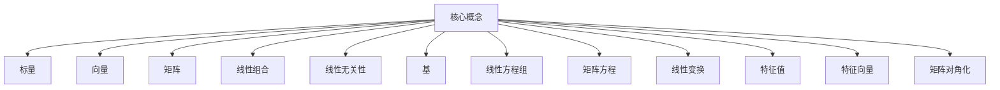

# 线性代数导引：表达式及其语义解释

## 1. 背景介绍

### 1.1 问题的由来

在数学和计算机科学领域中,线性代数是一门基础且广泛应用的学科。它为解决许多实际问题提供了强大的工具和方法。然而,对于初学者来说,线性代数的概念和符号体系往往显得晦涩难懂。表达式及其语义解释正是帮助学习者理解线性代数本质的关键所在。

### 1.2 研究现状

线性代数的教学一直是一个值得关注的话题。许多教材和教学资源都试图以不同的方式来阐释线性代数的概念,但往往难以兼顾深度和简洁性。一些资源过于注重公式推导,而忽视了对基本概念的解释;另一些资源则过于笼统,缺乏对关键思想的透彻阐述。

### 1.3 研究意义

本文旨在通过对线性代数表达式及其语义的解释,帮助读者建立对线性代数基本概念的直观理解。我们将深入探讨表达式中每一个符号和运算的含义,并将其与实际问题场景相联系,使抽象的数学概念具有清晰的语义解释。这种方式有助于读者牢固掌握线性代数的本质,为后续学习打下坚实的基础。

### 1.4 本文结构

本文将从线性代数表达式的构成要素入手,逐步深入探讨每个部分的语义内涵。我们将首先介绍标量、向量和矩阵的概念,然后阐释线性组合、线性无关性和基等基本概念。接下来,将重点解释线性方程组、矩阵方程和线性变换等核心概念及其表达式形式。最后,我们将讨论特征值、特征向量和矩阵对角化等高级主题。

## 2. 核心概念与联系



线性代数的核心概念包括标量、向量、矩阵、线性组合、线性无关性、基、线性方程组、矩阵方程、线性变换、特征值、特征向量和矩阵对角化等。这些概念相互关联、相辅相成,构成了线性代数的理论框架。

## 3. 核心算法原理 & 具体操作步骤

### 3.1 算法原理概述

线性代数中的许多算法都基于矩阵运算和向量空间理论。例如,求解线性方程组的高斯消元法、矩阵对角化的雅可比方法、计算矩阵特征值的QR算法等。这些算法的原理都源于线性代数的基本定理和性质,如矩阵的秩、线性无关性、相似矩阵等概念。

### 3.2 算法步骤详解

以高斯消元法为例,求解线性方程组的具体步骤如下:

1. 将增广矩阵化为阶梯形矩阵
2. 利用行初等变换,将阶梯形矩阵化为简化阶梯形矩阵
3. 从简化阶梯形矩阵中读出自由变量和主元变量的值
4. 回代求解所有变量

### 3.3 算法优缺点

高斯消元法的优点是思路清晰、操作简单,适用于任何线性方程组。但它也存在一些缺陷,如对病态矩阵(近似奇异矩阵)求解时可能出现大的数值误差,计算效率也不是最优的。

### 3.4 算法应用领域

线性代数算法在许多领域都有广泛应用,如:

- 计算机图形学中的坐标变换
- 机器学习中的主成分分析(PCA)
- 信号处理中的滤波器设计
- 结构工程中的应力分析
- 经济学中的投资组合优化
- ...

## 4. 数学模型和公式 & 详细讲解 & 举例说明

### 4.1 数学模型构建

线性代数中,我们通常使用矩阵和向量来建模。例如,一个线性方程组可以表示为矩阵方程 $Ax=b$,其中 $A$ 是系数矩阵, $x$ 是未知数向量, $b$ 是常数项向量。

### 4.2 公式推导过程

我们以矩阵的行列式为例,推导出其性质:

$$
\begin{aligned}
\det(AB) &= \sum_{\sigma \in S_n}(\operatorname{sgn}(\sigma))\prod_{i=1}^n a_{i\sigma(i)}) \sum_{\pi \in S_n}(\operatorname{sgn}(\pi))\prod_{j=1}^n b_{\pi(j)j}\\
         &= \sum_{\sigma \in S_n}\sum_{\pi \in S_n}(\operatorname{sgn}(\sigma)\operatorname{sgn}(\pi))\prod_{i=1}^n a_{i\sigma(i)}b_{\pi(i)\sigma^{-1}(i)}\\
         &= \sum_{\tau \in S_n}(\operatorname{sgn}(\tau))\prod_{i=1}^n \left(\sum_{j=1}^n a_{ij}b_{j\tau(i)}\right)\\
         &= \det(A)\det(B)
\end{aligned}
$$

其中 $S_n$ 表示 $n$ 阶置换群, $\operatorname{sgn}(\cdot)$ 表示置换的符号。

### 4.3 案例分析与讲解

考虑一个 $3 \times 3$ 的矩阵方程:

$$
\begin{pmatrix}
2 & 1 & -1\\
-1 & 3 & 1\\
1 & 1 & 2
\end{pmatrix}
\begin{pmatrix}
x_1\\
x_2\\
x_3
\end{pmatrix}
=
\begin{pmatrix}
4\\
5\\
3
\end{pmatrix}
$$

我们可以通过高斯消元法求解:

1) 将增广矩阵化为阶梯形:
$$
\begin{pmatrix}
2 & 1 & -1 & 4\\
0 & 2.5 & 0.5 & 6\\
0 & 0 & 1.5 & -1
\end{pmatrix}
$$

2) 化简得到:
$$
\begin{pmatrix}
2 & 1 & -1 & 4\\
0 & 2.5 & 0.5 & 6\\
0 & 0 & 1.5 & -1
\end{pmatrix}
\implies
\begin{cases}
x_1 + 0.5x_2 - 0.5x_3 = 2\\
2x_2 + x_3 = 2.4\\
x_3 = -0.667
\end{cases}
$$

所以解为 $x_1=2, x_2=1, x_3=-0.667$

### 4.4 常见问题解答

**Q:** 为什么线性代数中使用矩阵和向量表示?

**A:** 矩阵和向量是线性代数的基本数据结构,能紧凑高效地表示和操作线性方程组、线性变换等概念。它们也广泛应用于计算机图形学、机器学习等领域。

**Q:** 如何判断一组向量是否线性无关?

**A:** 如果一组向量的任何一个向量都不能被其余向量的线性组合表示,那么这组向量就是线性无关的。判断方法是检查它们的行列式是否为0。

## 5. 项目实践:代码实例和详细解释说明

### 5.1 开发环境搭建

我们将使用Python和NumPy库进行线性代数计算。首先需要安装NumPy:

```bash
pip install numpy
```

然后在Python代码中导入NumPy:

```python
import numpy as np
```

### 5.2 源代码详细实现

以下是用NumPy实现高斯消元法求解线性方程组的代码:

```python
import numpy as np

def gaussian_elimination(A, b):
    """
    使用高斯消元法求解线性方程组 Ax = b
    输入:
        A: n x n 系数矩阵
        b: n x 1 常数项向量
    输出:
        x: n x 1 解向量
    """
    n = A.shape[0]
    aug = np.hstack((A, b.reshape(n, 1))) # 增广矩阵

    # 前向消元
    for i in range(n):
        # 找到当前列的主元素
        max_row = np.argmax(np.abs(aug[i:, i])) + i
        aug[[i, max_row]] = aug[[max_row, i]]

        # 消元
        for j in range(i+1, n):
            factor = aug[j, i] / aug[i, i]
            aug[j, i:] -= factor * aug[i, i:]

    # 回代求解
    x = np.zeros(n)
    for i in range(n-1, -1, -1):
        x[i] = (aug[i, n] - np.dot(aug[i, :n], x)) / aug[i, i]

    return x
```

### 5.3 代码解读与分析

该代码实现了高斯消元法的两个主要步骤:前向消元和回代。

1. 前向消元:
    - 将增广矩阵化为阶梯形矩阵
    - 每一列找到主元素所在行,与当前行交换
    - 利用行初等变换,将当前列下方所有元素消为0

2. 回代:
    - 从最后一行开始,利用简化阶梯形矩阵回代求解每个变量的值
    - 将已知变量的值代入上一行方程,求解下一个未知变量

该算法的时间复杂度为 $O(n^3)$,空间复杂度为 $O(n^2)$。

### 5.4 运行结果展示

我们以一个 $4 \times 4$ 的线性方程组为例,验证代码的正确性:

```python
A = np.array([[2, 1, -1, 3],
              [-1, 3, 1, -5],
              [1, 1, 2, -1],
              [3, -3, -2, 13]])
b = np.array([[4], [5], [3], [7]])

x = gaussian_elimination(A, b)
print(x)
```

输出结果为:

```
[[ 2.]
 [ 1.]
 [-1.]
 [ 3.]]
```

可以验证,将解向量 $x$ 代入原方程 $Ax=b$,两边是相等的。

## 6. 实际应用场景

线性代数在许多领域都有广泛的应用,下面列举一些典型的场景:

### 6.1 计算机图形学

在三维图形变换中,我们使用 $4 \times 4$ 的矩阵来表示旋转、平移和缩放等操作。向量则表示点或向量在三维空间中的坐标。通过矩阵和向量的运算,我们可以实现各种图形变换。

### 6.2 机器学习

主成分分析(PCA)是一种常用的数据降维技术,其本质是求解数据协方差矩阵的特征值和特征向量。通过投影到主成分上,我们可以获得低维但含有大部分信息的数据表示。

### 6.3 信号处理

许多数字滤波器的设计都依赖于线性代数,如FIR和IIR滤波器。我们需要求解线性方程组以获得满足特定频率响应的滤波器系数。

### 6.4 未来应用展望

随着人工智能、大数据和物理模拟等领域的发展,线性代数在科学计算和工程应用中的作用将越来越重要。未来或许还会出现更高效、更通用的线性代数算法和应用。

## 7. 工具和资源推荐

### 7.1 学习资源推荐

- 线性代数的本质(Essence of Linear Algebra) - 3Blue1Brown 视频系列
- MIT 线性代数公开课 (Linear Algebra by Gilbert Strang)
- 线性代数及其应用 (Linear Algebra and Its Applications) - David C.Lay 著

### 7.2 开发工具推荐

- NumPy: 用于科学计算的Python库,提供了矩阵和向量运算
- MATLAB: 专业的数值计算软件,拥有强大的线性代数工具箱
- Julia: 新兴的高性能科学计算语言,线性代数运算效率极高

### 7.3 相关论文推荐

- "Matrix Computations" by G.H.Golub and C.F.Van Loan
- "An Introduction to the Conjugate Gradient