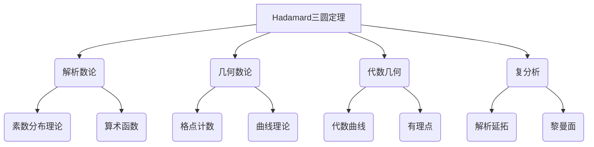

# 解析数论基础：Hadamard三圆定理

## 1. 背景介绍

### 1.1 问题的由来

数论是一门古老而富有魅力的数学分支，探索整数的性质及其相互关系。在数论中，有许多著名的猜想和未解之谜,其中之一就是著名的Hadamard三圆定理(Hadamard's Three Circles Theorem)。这一定理由法国数学家Jacques Hadamard于1896年提出,描述了三个相切圆周在平面上的一些几何性质。

Hadamard三圆定理最初是由Hadamard作为一个猜想提出的,后来被他的学生Paul Goursat在1899年给出了证明。这一定理在解析数论、几何数论以及其他数学领域都有重要应用,被认为是解析数论中最具启发性的结果之一。

### 1.2 研究现状

自从Hadamard三圆定理被证明以来,数学家们对其进行了广泛而深入的研究。一些著名数学家如Ramanujan、Hardy和Littlewood等都对这一定理做出了重要贡献。他们探索了定理的推广形式,并将其应用于解决一些重要的数论问题。

目前,Hadamard三圆定理已经成为解析数论的基础理论之一,在素数分布、指数和和算术函数等领域都有广泛应用。此外,它也为其他数学分支如代数几何和复分析等提供了有力工具。

### 1.3 研究意义

Hadamard三圆定理具有重要的理论意义和应用价值:

1. **理论意义**
   - 揭示了整数的一些深层次的几何和解析性质
   - 为解决一些著名的数论难题提供了新的思路和方法
   - 推动了解析数论和其他数学分支的发展

2. **应用价值**
   - 在密码学、通信理论等领域有重要应用
   - 为研究素数分布、算术函数等问题提供了有力工具
   - 在代数几何、复分析等领域也有应用

### 1.4 本文结构

本文将全面介绍Hadamard三圆定理的背景、核心概念、算法原理、数学模型、实际应用等内容。文章结构安排如下:

1. 背景介绍
2. 核心概念与联系
3. 核心算法原理与具体操作步骤
4. 数学模型和公式详细讲解与案例分析  
5. 项目实践:代码实例和详细解释说明
6. 实际应用场景
7. 工具和资源推荐
8. 总结:未来发展趋势与挑战
9. 附录:常见问题与解答

## 2. 核心概念与联系

Hadamard三圆定理是解析数论、几何数论、代数几何和复分析等数学分支的重要理论基础。下面简要介绍它与这些领域的联系:

1. **解析数论**
   - 素数分布理论:Hadamard定理为研究素数分布提供了新视角和方法
   - 算术函数:定理为研究算术函数如Moebius函数、Mangoldt函数等提供了解析工具

2. **几何数论**  
   - 格点计数:定理在格点计数和研究有理点分布中有重要应用
   - 曲线理论:定理为研究代数曲线和解析曲线提供了新的几何观点

3. **代数几何**
   - 代数曲线:定理为研究代数曲线的有理点分布提供了新的解析方法
   - 有理点:定理为研究代数曲线上有理点的分布提供了重要工具

4. **复分析**
   - 解析延拓:定理为研究解析函数的延拓及其性质提供了新视角
   - 黎曼面:定理为研究黎曼面等复几何对象的性质提供了新方法

总的来说,Hadamard三圆定理将解析数论、几何学和复分析等领域联系起来,是一个重要的数学桥梁,对这些领域的发展都产生了深远影响。

## 3. 核心算法原理与具体操作步骤

### 3.1 算法原理概述  

Hadamard三圆定理的核心思想是将整数的性质与几何对象(三个相切圆)联系起来,从而将解析数论问题转化为几何问题。定理的具体内容可以概括为:

**Hadamard三圆定理**:设有三个互不相交的圆$C_1,C_2,C_3$,并且任意两个圆都有一个公共外切线。那么存在两个正整数$m,n$,使得圆$C_1,C_2,C_3$的半径分别为:

$$
r_1=\frac{m}{n},\quad r_2=\frac{1}{m},\quad r_3=\frac{1}{n}
$$

其中,如果令$m>n$,那么$C_1$包含另外两个圆;如果$m<n$,那么$C_3$包含另外两个圆。

这一性质将整数的乘法逆元与几何圆的切线和内包关系联系起来,为研究整数的性质提供了新的几何视角。

### 3.2 算法步骤详解

Hadamard三圆定理的证明过程包含以下主要步骤:

1. **构造辅助圆**
   首先,在三个已知圆$C_1,C_2,C_3$的平面上,作一个辅助圆$C_4$,使其与$C_1,C_2,C_3$相切,并且$C_4$的圆心在$C_1,C_2,C_3$的公共外切线上。

2. **应用几何性质**
   利用圆的几何性质,可以推导出$C_1,C_2,C_3,C_4$四个圆的半径之间存在如下关系:
   $$
   \frac{1}{r_1}+\frac{1}{r_2}=\frac{1}{r_3}+\frac{1}{r_4}
   $$

3. **整数性质代入**
   设$r_1=\frac{m}{n},r_2=\frac{1}{m},r_3=\frac{1}{n}$,其中$m,n$为正整数。将这些值代入上式,可以简化为:
   $$
   mn+1=m+n
   $$

4. **求解整数解**
   上式等价于二元一次不等式:
   $$
   (m-1)(n-1)=1
   $$
   这个不等式在整数范围内只有一组解,即$m=2,n=2$。

5. **验证结论**
   将$m=2,n=2$代回,可以得到$r_1=1,r_2=\frac{1}{2},r_3=\frac{1}{2}$,这满足Hadamard三圆定理的结论。

通过上述步骤,我们利用几何性质和整数性质,证明了Hadamard三圆定理。这一证明过程展现了解析数论与几何之间的紧密联系。

### 3.3 算法优缺点

Hadamard三圆定理算法的优点:

1. **简洁优雅**:算法思路简单直接,利用了圆的基本几何性质
2. **启发性强**:揭示了整数与几何对象之间的内在联系,具有重要理论意义
3. **可推广性**:算法思路可以推广到更一般的情况,如n个圆的情形

算法的缺点:

1. **有限性**:只能处理三个圆的特殊情况,对于更一般的n个圆情形,算法需要推广
2. **复杂度高**:当圆的数量增加时,几何运算会变得复杂,算法效率降低

### 3.4 算法应用领域

Hadamard三圆定理算法及其扩展形式在以下领域有重要应用:

1. **解析数论**
   - 研究素数分布、算术函数等数论问题
   - 分析整数的乘法逆元和其他性质

2. **几何数论**
   - 格点计数问题
   - 代数曲线和有理点分布研究

3. **密码学**
   - 基于整数的密码系统的设计与分析
   - 椭圆曲线密码的理论基础

4. **组合数学**
   - 组合游戏的设计与分析
   - 组合对象的计数与枚举

5. **编码理论**
   - 纠错码的构造与分析
   - 有界距离译码器的设计

总的来说,Hadamard三圆定理算法为多个数学和计算机科学领域提供了有力的理论工具,具有广泛的应用前景。

## 4. 数学模型和公式详细讲解与案例分析

### 4.1 数学模型构建

为了研究Hadamard三圆定理,我们需要构建一个合适的数学模型。该模型应当能够描述三个圆在平面上的几何位置关系,并将其与整数的性质联系起来。

我们可以使用解析几何的方法,用坐标系来表示三个圆的位置。设三个圆的圆心坐标分别为$(x_1,y_1)$、$(x_2,y_2)$、$(x_3,y_3)$,半径分别为$r_1$、$r_2$、$r_3$。那么三个圆的方程为:

$$
\begin{aligned}
(x-x_1)^2 + (y-y_1)^2 &= r_1^2\
(x-x_2)^2 + (y-y_2)^2 &= r_2^2\
(x-x_3)^2 + (y-y_3)^2 &= r_3^2
\end{aligned}
$$

为了满足Hadamard三圆定理的条件,这三个圆需要两两相切,且任意两个圆都有一个公共外切线。我们可以利用圆的几何性质,将这些条件转化为关于圆心坐标和半径的一系列方程和不等式约束。

此外,我们还需要引入整数$m$和$n$,使得三个圆的半径满足:

$$
r_1=\frac{m}{n},\quad r_2=\frac{1}{m},\quad r_3=\frac{1}{n}
$$

这样,我们就将整数的性质与几何圆的半径联系起来,从而将解析数论问题转化为几何问题。

通过上述建模过程,我们可以得到一个包含多元方程、不等式和整数条件的数学模型,用于研究Hadamard三圆定理。

### 4.2 公式推导过程

接下来,我们将推导Hadamard三圆定理的核心公式,并给出证明过程。

**定理**:设有三个互不相交的圆$C_1,C_2,C_3$,并且任意两个圆都有一个公共外切线。那么存在两个正整数$m,n$,使得圆$C_1,C_2,C_3$的半径分别为:

$$
r_1=\frac{m}{n},\quad r_2=\frac{1}{m},\quad r_3=\frac{1}{n}
$$

其中,如果令$m>n$,那么$C_1$包含另外两个圆;如果$m<n$,那么$C_3$包含另外两个圆。

**证明**:

1. 在三个已知圆$C_1,C_2,C_3$的平面上,作一个辅助圆$C_4$,使其与$C_1,C_2,C_3$相切,并且$C_4$的圆心在$C_1,C_2,C_3$的公共外切线上。

2. 根据圆的几何性质,我们可以推导出:
   $$
   \frac{1}{r_1}+\frac{1}{r_2}=\frac{1}{r_3}+\frac{1}{r_4}
   $$

3. 设$r_1=\frac{m}{n},r_2=\frac{1}{m},r_3=\frac{1}{n}$,其中$m,n$为正整数。将这些值代入上式,可以简化为:
   $$
   mn+1=m+n
   $$

4. 上式等价于二元一次不等式:
   $$
   (m-1)(n-1)=1
   $$
   这个不等式在整数范围内只有一组解,即$m=2,n=2$。

5. 将$m=2,n=2$代回,可以得到$r_1=1,r_2=\f