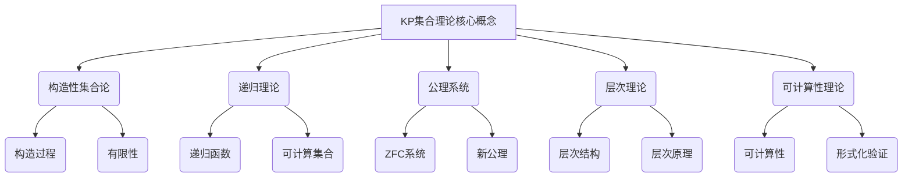

# 集合论导引：KP集合理论

## 1. 背景介绍

### 1.1 问题的由来

集合论是数学的一个基础分支,它研究集合及其运算、关系和结构。集合论不仅在数学领域扮演着重要角色,同时也广泛应用于计算机科学、逻辑学和其他许多学科领域。KP集合理论(Kuratowski-Platek Set Theory)是一种重要的集合论公理系统,由波兰数学家卡齐米日·库拉托夫斯基(Kazimierz Kuratowski)和拉吉斯瓦夫·普拉特克(Radzisław Fraync Platek)于20世纪60年代提出。

传统的集合论公理系统,如著名的ZFC(Zermelo-Fraenkel Set Theory with the Axiom of Choice),虽然在数学基础方面具有重要意义,但存在一些缺陷和局限性。例如,ZFC系统无法对"构造性"集合论进行适当描述,也无法充分解释递归理论中的一些现象。因此,人们开始探索新的集合论公理系统,以更好地描述和研究构造性集合论和递归理论。

### 1.2 研究现状

KP集合理论的提出,为构造性集合论和递归理论的发展提供了新的视角和工具。该理论不仅保留了ZFC系统的大部分内容,同时还引入了一些新的公理和概念,使其能够更好地描述构造性集合论和递归理论中的现象。

目前,KP集合理论已经成为集合论研究的一个重要分支,吸引了众多数学家和逻辑学家的关注。许多著名学者,如Michael Rathjen、Wolfram Pohlers和Wilfried Buchholz等,都对KP集合理论做出了重要贡献。他们不仅深化了对KP集合理论本身的理解,还将其应用于递归理论、可计算性理论和其他相关领域的研究。

### 1.3 研究意义

KP集合理论的研究具有重要的理论意义和应用价值:

1. **理论意义**:KP集合理论为构造性集合论和递归理论提供了一个新的公理系统和研究框架,有助于深化对这些领域的理解。它还为集合论的发展注入了新的活力,推动了集合论研究的进步。

2. **应用价值**:KP集合理论不仅在数学和逻辑学领域具有应用,还可以应用于计算机科学、人工智能等领域。例如,它可以用于研究递归函数、可计算性理论和形式化验证等问题。

3. **教育意义**:KP集合理论为集合论教学提供了一种新的视角和方法,有助于学生更好地理解构造性集合论和递归理论的概念和思想。

### 1.4 本文结构

本文将全面介绍KP集合理论的基本概念、核心内容和重要应用。文章结构如下:

1. 背景介绍
2. 核心概念与联系
3. 核心算法原理与具体操作步骤
4. 数学模型和公式详细讲解与举例说明
5. 项目实践:代码实例和详细解释说明
6. 实际应用场景
7. 工具和资源推荐
8. 总结:未来发展趋势与挑战
9. 附录:常见问题与解答

## 2. 核心概念与联系

KP集合理论的核心概念与构造性集合论、递归理论、公理系统、层次理论和可计算性理论等概念密切相关。

1. **构造性集合论**:KP集合理论旨在为构造性集合论提供一个合适的公理系统。构造性集合论强调集合的构造过程和有限性,即集合应该是通过有限步骤构造出来的,而不是任意给定的。

2. **递归理论**:KP集合理论与递归理论有着密切联系。递归理论研究递归函数和可计算集合,而KP集合理论提供了一个框架来描述和研究这些概念。

3. **公理系统**:KP集合理论是一个新的公理系统,它保留了ZFC系统的大部分内容,同时引入了一些新的公理和概念,如层次原理等。

4. **层次理论**:KP集合理论中的层次理论是一个重要概念,它将集合分为不同的层次,每个层次都有自己的构造规则和限制。

5. **可计算性理论**:KP集合理论与可计算性理论也有密切联系。可计算性理论研究可计算性的概念和限制,而KP集合理论提供了一个框架来描述和研究这些概念。

6. **形式化验证**:KP集合理论还可以应用于形式化验证领域,用于验证计算机程序和系统的正确性。

总的来说,KP集合理论是一个综合性的理论框架,它将构造性集合论、递归理论、公理系统、层次理论和可计算性理论等概念融合在一起,为这些领域的研究提供了新的视角和工具。

## 3. 核心算法原理与具体操作步骤

### 3.1 算法原理概述

KP集合理论的核心算法原理是基于层次理论和构造性集合论的思想。它将集合分为不同的层次,每个层次都有自己的构造规则和限制。这种层次结构使得KP集合理论能够更好地描述和研究构造性集合论和递归理论中的概念。

KP集合理论的核心算法原理可以概括为以下几个方面:

1. **层次划分**:将集合分为不同的层次,每个层次都有自己的构造规则和限制。
2. **构造性原则**:强调集合应该是通过有限步骤构造出来的,而不是任意给定的。
3. **递归原则**:引入递归概念,将递归函数和可计算集合纳入理论框架。
4. **公理系统**:建立一个新的公理系统,保留ZFC系统的大部分内容,同时引入新的公理和概念。

这些核心原理相互关联、相互影响,共同构成了KP集合理论的理论基础。

### 3.2 算法步骤详解

KP集合理论的算法步骤可以概括为以下几个方面:

1. **确定层次结构**:首先需要确定集合的层次结构,即将集合分为不同的层次。每个层次都有自己的构造规则和限制。

2. **定义构造规则**:对于每个层次,需要定义其构造规则,即该层次中集合可以通过哪些方式构造。通常,较低层次的集合可以通过有限步骤构造,而较高层次的集合可以通过递归或其他方式构造。

3. **引入公理**:在确定了层次结构和构造规则后,需要引入一系列公理来描述和规范这些概念。KP集合理论保留了ZFC系统的大部分公理,同时引入了一些新的公理,如层次原理等。

4. **推导定理**:基于公理系统,可以推导出一系列定理和结果,用于描述和研究构造性集合论和递归理论中的概念。

5. **应用和验证**:将推导出的定理和结果应用于实际问题中,并进行验证和检验。

这些步骤相互关联、循环迭代,构成了KP集合理论的核心算法流程。

### 3.3 算法优缺点

KP集合理论作为一种新的集合论公理系统,具有以下优点:

1. **描述能力强**:能够更好地描述和研究构造性集合论和递归理论中的概念,弥补了ZFC系统的不足。
2. **理论框架完备**:提供了一个完备的理论框架,将构造性集合论、递归理论、公理系统、层次理论和可计算性理论等概念融合在一起。
3. **应用前景广阔**:不仅在数学和逻辑学领域具有应用,还可以应用于计算机科学、人工智能等领域。

同时,KP集合理论也存在一些缺点和局限性:

1. **复杂性较高**:相比传统的ZFC系统,KP集合理论的理论框架和公理系统更加复杂,理解和掌握难度较大。
2. **研究深度有限**:虽然KP集合理论已经取得了一些重要进展,但相比ZFC系统,它的研究深度和广度仍有待进一步拓展。
3. **应用范围有限**:目前KP集合理论在实际应用中的范围仍然有限,需要进一步探索和推广。

总的来说,KP集合理论作为一种新兴的集合论公理系统,具有重要的理论意义和应用价值,但也存在一些需要进一步改进和发展的方面。

### 3.4 算法应用领域

KP集合理论的应用领域主要包括以下几个方面:

1. **构造性集合论**:KP集合理论为构造性集合论提供了一个合适的公理系统和研究框架,是构造性集合论研究的重要工具。

2. **递归理论**:KP集合理论与递归理论有着密切联系,可以用于研究递归函数、可计算集合等概念。

3. **可计算性理论**:KP集合理论提供了一个框架来描述和研究可计算性理论中的概念和限制。

4. **形式化验证**:KP集合理论可以应用于形式化验证领域,用于验证计算机程序和系统的正确性。

5. **数学基础研究**:KP集合理论对于深化对集合论和数学基础的理解具有重要意义。

6. **逻辑学**:KP集合理论与逻辑学密切相关,可以应用于逻辑学的研究和教学。

7. **计算机科学**:KP集合理论可以应用于计算机科学的一些领域,如算法复杂性理论、程序正确性验证等。

8. **人工智能**:KP集合理论也可能在人工智能领域有潜在的应用,如知识表示和推理等。

总的来说,KP集合理论的应用领域广泛分布于数学、逻辑学、计算机科学和人工智能等多个领域,具有重要的理论意义和应用价值。

## 4. 数学模型和公式详细讲解与举例说明

### 4.1 数学模型构建

在KP集合理论中,我们需要构建一个数学模型来描述和研究集合的层次结构和构造规则。这个数学模型通常被称为"KP模型"或"KP层次"。

KP模型的构建过程可以概括为以下几个步骤:

1. **定义层次结构**:首先需要定义集合的层次结构,即将集合分为不同的层次。每个层次都有自己的构造规则和限制。通常,我们将层次记为$\mathcal{L}_0, \mathcal{L}_1, \mathcal{L}_2, \ldots$,其中$\mathcal{L}_0$是最低层次,包含所有有限集合。

2. **确定构造规则**:对于每个层次$\mathcal{L}_\alpha$,需要确定其构造规则,即该层次中的集合可以通过哪些方式构造。通常,较低层次的集合可以通过有限步骤构造,而较高层次的集合可以通过递归或其他方式构造。

3. **引入公理**:在确定了层次结构和构造规则后,需要引入一系列公理来描述和规范这些概念。KP集合理论保留了ZFC系统的大部分公理,同时引入了一些新的公理,如层次原理等。

4. **推导定理**:基于公理系统,可以推导出一系列定理和结果,用于描述和研究构造性集合论和递归理论中的概念。

通过这些步骤,我们可以构建出一个完整的KP模型,用于描述和研究集合的层次结构和构造规则。

### 4.2 公式推导过程

在KP集合理论中,我们需要推导一些重要的公式和定理,以描述和研究集合的层次