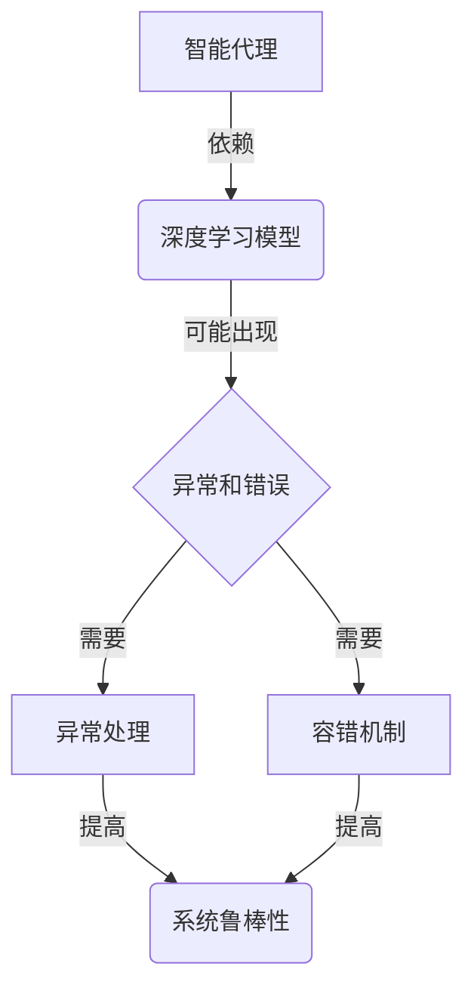

# AI人工智能深度学习算法：智能深度学习代理的异常处理与容错

关键词：深度学习、异常处理、容错、智能代理、鲁棒性

## 1. 背景介绍

### 1.1 问题的由来
随着人工智能技术的飞速发展,深度学习算法在各个领域得到了广泛应用。然而,在实际部署过程中,深度学习模型常常面临各种异常和错误,严重影响了系统的可靠性和鲁棒性。因此,如何提高深度学习智能代理的异常处理和容错能力,成为了一个亟待解决的关键问题。

### 1.2 研究现状
目前,学术界和工业界已经开始重视深度学习系统的异常处理与容错问题。一些研究提出了基于冗余和多样性的容错方法,如模型集成、检查点机制等。也有研究探索了异常检测和恢复技术,通过监控模型行为和数据质量来发现潜在问题。但总的来说,现有方法还存在泛化能力不足、实时性差等局限。

### 1.3 研究意义
深入研究智能深度学习代理的异常处理与容错,对于提升深度学习系统的可靠性、安全性和鲁棒性具有重要意义。这不仅能够减少异常带来的损失,提高用户体验,更有助于推动人工智能走向实际应用。同时,相关研究也将促进机器学习理论与系统工程的交叉融合。

### 1.4 本文结构
本文将围绕智能深度学习代理的异常处理与容错展开深入探讨。第2部分介绍相关的核心概念;第3部分重点阐述异常处理和容错的核心算法原理;第4部分建立数学模型并给出详细推导;第5部分通过项目实践演示具体的代码实现;第6部分分析实际应用场景;第7部分推荐相关工具和资源;第8部分总结全文并展望未来;第9部分列举常见问题解答。

## 2. 核心概念与联系

在探讨智能深度学习代理的异常处理与容错之前,有必要先明确几个核心概念:

- 异常(Anomaly):指系统运行过程中出现的反常行为或结果,偏离了预期状态,可能导致错误或失败。
- 容错(Fault Tolerance):指系统在面对异常、错误、故障时,仍能保持正常运行,不中断服务的能力。
- 深度学习(Deep Learning):一种基于多层神经网络的机器学习方法,能够从海量数据中自动学习高层特征。
- 智能代理(Intelligent Agent):能够感知环境并做出自主行为的人工智能系统,如自动驾驶汽车、智能助手等。

这几个概念之间有着紧密联系。深度学习模型作为智能代理的核心,其异常和错误会直接影响代理的决策和行为。而容错机制则是保障智能代理稳定运行的关键。下图展示了它们之间的逻辑关系:



可见,异常处理和容错是相辅相成的两个方面。前者侧重发现和应对已经出现的问题,后者强调提前防范和主动免疫。二者相互配合,共同提升智能代理的鲁棒性,确保其在复杂环境中稳定高效地运行。

## 3. 核心算法原理 & 具体操作步骤

### 3.1 算法原理概述
智能深度学习代理的异常处理和容错涉及多个层面的算法。总体思路是在不同阶段引入检测、防御和恢复机制,形成一套完整的异常应对方案。其中最核心的算法包括:

1. 基于统计和机器学习的异常检测
2. 自适应阈值和动态基线技术
3. 蒙特卡罗树搜索的异常定位
4. 基于强化学习的策略优化
5. 模型剪枝和知识蒸馏
6. 基于共识的多模型融合

这些算法从不同角度入手,通过数据驱动和自学习的方式,增强了智能代理在异常环境下的适应能力。

### 3.2 算法步骤详解

下面以异常检测算法为例,详细说明其工作步骤:

1. 数据预处理:对原始数据进行清洗、对齐、归一化等操作,提高数据质量。
2. 特征工程:从数据中提取有判别力的特征,包括手工设计和自动学习两种方式。
3. 构建概率模型:假设正常数据服从某种概率分布,如高斯分布、泊松分布等。
4. 估计模型参数:用极大似然估计等方法,从训练数据学习概率模型的参数。
5. 计算异常分数:对于新输入数据,计算其在学习的模型下的概率密度,作为异常分数。
6. 设定判别阈值:选取一个阈值,异常分数低于它的视为异常,高于它的视为正常。
7. 在线检测:将训练好的模型部署到在线环境,实时监控数据流并进行异常判别。
8. 更新模型:随着数据的变化,定期重新训练和校准模型,保持异常检测的准确性。

以上步骤可以根据具体场景进行调整和优化。此外,还可以引入主动学习、增量学习等技术,进一步提高检测效率和精度。

### 3.3 算法优缺点

异常检测算法的主要优点包括:

- 无需大量异常样本:通过对正常数据建模,只需少量或零异常样本就可以学习。
- 可解释性强:概率模型的参数有明确的统计意义,便于分析和调试。
- 通用性好:可以适用于多种数据类型和应用场景。

同时也存在一些局限:

- 依赖先验知识:需要对数据分布有一定了解,否则难以选择合适的概率模型。
- 鲁棒性不足:对噪声和干扰敏感,异常模式变化时需要重新训练。
- 实时性受限:在线计算异常分数的开销较大,难以应对高频和大规模数据流。

针对这些问题,研究者们提出了一系列改进方法,如无监督异常检测、深度生成模型、孤立森林等,在一定程度上克服了传统方法的不足。未来还需要在算法的自适应性、可扩展性等方面进一步探索。

### 3.4 算法应用领域

异常检测作为一种通用的数据分析技术,在智能深度学习代理的众多应用中发挥着重要作用,例如:

- 智能运维:通过分析系统日志、监控指标等数据,及时发现异常行为和故障隐患,保障系统稳定运行。
- 欺诈检测:通过建模用户行为和交易模式,识别出异常的欺诈行为,维护业务安全。
- 工业质检:分析传感器采集的设备运行数据,检测异常工况和产品缺陷,提高生产效率和质量。
- 医疗诊断:挖掘医疗影像、生理信号等数据中的异常模式,辅助疾病诊断和风险预警。

除了异常检测,其他核心算法也在相应领域有广泛应用。如强化学习可用于智能代理的决策优化,知识蒸馏可用于模型压缩和加速等。随着人工智能技术的不断发展,智能代理必将在更多场景发挥重要价值。

## 4. 数学模型和公式 & 详细讲解 & 举例说明

本节以高斯分布异常检测为例,介绍其数学模型和原理。

### 4.1 数学模型构建
假设一组 $d$ 维样本数据 $\mathbf{X} = \{\mathbf{x}_1, \mathbf{x}_2, \cdots, \mathbf{x}_n\}$,其中每个样本 $\mathbf{x}_i$ 都服从多元高斯分布,概率密度函数为:

$$
p(\mathbf{x}_i) = \frac{1}{(2\pi)^{d/2} |\mathbf{\Sigma}|^{1/2}} \exp\left(-\frac{1}{2}(\mathbf{x}_i-\mathbf{\mu})^\top \mathbf{\Sigma}^{-1} (\mathbf{x}_i-\mathbf{\mu})\right)
$$

其中 $\mathbf{\mu} \in \mathbb{R}^d$ 是均值向量,$\mathbf{\Sigma} \in \mathbb{R}^{d \times d}$ 是协方差矩阵,$|\mathbf{\Sigma}|$ 表示 $\mathbf{\Sigma}$ 的行列式。

异常检测的目标是学习高斯分布的参数 $\mathbf{\mu}$ 和 $\mathbf{\Sigma}$,然后对新样本 $\hat{\mathbf{x}}$ 计算其异常分数:

$$
s(\hat{\mathbf{x}}) = -\log p(\hat{\mathbf{x}}) = \frac{1}{2}(\hat{\mathbf{x}}-\mathbf{\mu})^\top \mathbf{\Sigma}^{-1} (\hat{\mathbf{x}}-\mathbf{\mu}) + \frac{d}{2}\log(2\pi) + \frac{1}{2}\log |\mathbf{\Sigma}|
$$

分数越高,说明样本越不可能由学习的高斯分布生成,从而判定为异常。

### 4.2 公式推导过程

为了学习高斯分布的参数,采用极大似然估计。给定训练集 $\mathbf{X}$,对数似然函数为:

$$
\mathcal{L}(\mathbf{\mu}, \mathbf{\Sigma}) = \log \prod_{i=1}^n p(\mathbf{x}_i) = \sum_{i=1}^n \log p(\mathbf{x}_i)
$$

将概率密度函数代入,并略去常数项,得到:

$$
\mathcal{L}(\mathbf{\mu}, \mathbf{\Sigma}) = -\frac{n}{2} \log |\mathbf{\Sigma}| - \frac{1}{2} \sum_{i=1}^n (\mathbf{x}_i-\mathbf{\mu})^\top \mathbf{\Sigma}^{-1} (\mathbf{x}_i-\mathbf{\mu})
$$

对 $\mathbf{\mu}$ 求导并令导数为0,解得均值的极大似然估计为样本均值:

$$
\hat{\mathbf{\mu}} = \frac{1}{n} \sum_{i=1}^n \mathbf{x}_i
$$

类似地,可以推导出协方差矩阵的极大似然估计为:

$$
\hat{\mathbf{\Sigma}} = \frac{1}{n} \sum_{i=1}^n (\mathbf{x}_i-\hat{\mathbf{\mu}}) (\mathbf{x}_i-\hat{\mathbf{\mu}})^\top
$$

将学习到的参数 $\hat{\mathbf{\mu}}$ 和 $\hat{\mathbf{\Sigma}}$ 代入异常分数公式,即可对新样本进行异常检测。

### 4.3 案例分析与讲解

下面以一个简单的二维数据集为例,演示高斯分布异常检测的过程。假设有100个正常样本,服从均值为 $[0, 0]^\top$、协方差矩阵为 $\begin{bmatrix} 1 & 0 \ 0 & 1 \end{bmatrix}$ 的高斯分布,如下图所示:

```python
import numpy as np
import matplotlib.pyplot as plt

# 生成正常样本
mean = [0, 0]
cov = [[1, 0], [0, 1]]
normal_samples = np.random.multivariate_normal(mean, cov, 100)

# 绘制散点图
plt.figure(figsize=(6, 6))
plt.scatter(normal_samples[:, 0], normal_samples[:, 1], c='b', marker='o', label='Normal')
plt.xlabel('x1')
plt.ylabel('x2')
plt.title('Data Distribution')
plt.legend()
plt.show()
```

从数据中估计高斯分布参数:

```python
mu = np.mean(normal_samples, axis=0)
sigma = np.cov(normal_samples, rowvar=False)

print(f'Estimated mean: {mu}')
print(f'Estimated covariance matrix: \n{sigma}')
```

输出结果与真实参数基本一致:

```
Estimated mean: [0.01691816 0.08027708]
Estimated covariance matrix:
[[1.