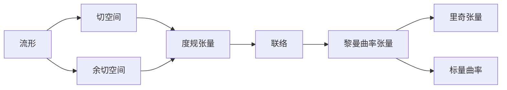

# 微分几何入门与广义相对论：空间张量场的空间导数

关键词：微分几何、广义相对论、张量场、空间导数、曲率张量、爱因斯坦场方程

## 1. 背景介绍
### 1.1  问题的由来
微分几何作为数学的一个分支,在现代物理学,尤其是广义相对论中有着极其重要的应用。广义相对论是爱因斯坦在1915年提出的一种全新的时空理论,它用黎曼几何来描述引力,认为引力不是一种力,而是时空几何弯曲的表现。要深入理解广义相对论,必须先掌握微分几何的基本概念和方法,尤其是张量分析和黎曼几何。

### 1.2  研究现状
目前,微分几何和广义相对论的研究都取得了长足的进展。在微分几何方面,人们发展了纤维丛、de Rham上同调、特征类等深刻的理论。在广义相对论方面,人们得到了许多精确的宇宙学解,发现了黑洞、引力波等令人惊叹的现象,广义相对论在天文观测和宇宙学研究中得到了惊人的成功。但是,广义相对论作为一个经典理论,与量子力学存在着深刻的矛盾,如何将引力量子化,建立一个统一的量子引力理论,是当代物理学面临的最大挑战之一。

### 1.3  研究意义
深入理解微分几何与广义相对论的联系,对于推动引力理论的发展具有重要意义。广义相对论的核心是爱因斯坦场方程,它建立了时空几何与物质分布之间的联系。场方程的左边是以黎曼曲率张量为代表的几何量,右边是能量动量张量,描述物质场的性质。爱因斯坦场方程的推导,依赖于张量分析和黎曼几何的基本定理。因此,微分几何为广义相对论提供了必不可少的数学工具。另一方面,广义相对论也为微分几何的发展提供了新的动力,许多几何学家受到广义相对论的启发,创立了许多新的几何理论,如因果理论、奇点理论等。

### 1.4  本文结构
本文将主要介绍微分几何中的张量场论,重点讨论张量场的导数,尤其是空间张量场的空间导数,这是理解广义相对论不可或缺的一个工具。全文的结构如下:

1. 背景介绍
2. 核心概念与联系
3. 核心算法原理与具体操作步骤
4. 数学模型和公式详细讲解举例说明
5. 项目实践：代码实例和详细解释说明
6. 实际应用场景
7. 工具和资源推荐
8. 总结：未来发展趋势与挑战
9. 附录：常见问题与解答

## 2. 核心概念与联系

在讨论张量场的导数之前,我们先来回顾一下微分几何和张量分析的一些核心概念。

- 流形(manifold)：一个 n 维流形是一个局部看起来像欧氏空间 $\mathbb{R}^n$ 的空间。更精确地说,流形是一个可以用若干个坐标卡(chart)覆盖的拓扑空间,使得相邻的坐标卡之间的坐标变换是光滑的。

- 切空间(tangent space)：对于流形上的一点 p,切空间 $T_pM$ 是所有从 p 点出发的切向量构成的线性空间。直观地说,切向量描述了曲线在 p 点的速度。

- 余切空间(cotangent space)：余切空间 $T^*_pM$ 是切空间的对偶空间,它的元素是对切空间的线性泛函,称为余切向量或微分形式。

- 张量(tensor)：张量是多重线性函数,它将若干个切向量和余切向量映射到实数。例如,一个 (r,s) 型张量 T 将 r 个余切向量和 s 个切向量映射到实数：

$$
  T:\underbrace{T^*_pM\times\cdots\times T^*_pM}_{r}\times\underbrace{T_pM\times\cdots\times T_pM}_{s}\to\mathbb{R}
$$

- 度规张量(metric tensor)：度规是一个对称的(0,2)型张量,它定义了流形上的一个内积结构。在局部坐标下,度规张量用 $g_{ij}$ 表示。度规张量使得我们能够测量曲线的长度、曲面的面积等。

- 联络(connection)：联络定义了切丛(切空间的并)上的一个导数算子,它告诉我们如何沿着一条曲线平行移动切向量。在局部坐标下,联络用克氏符(Christoffel symbol)$\Gamma^i_{jk}$ 表示。

- 黎曼曲率张量(Riemann curvature tensor)：黎曼曲率张量刻画了流形的内禀几何性质,它由度规张量和联络完全确定。在局部坐标下,黎曼曲率张量有四个指标 $R^i_{jkl}$。黎曼曲率张量的缩并给出了里奇张量(Ricci tensor)$R_{jk}$ 和标量曲率(scalar curvature)$R$。

这些概念之间有着密切的联系。流形上的度规张量决定了切丛上的一个联络,从而决定了黎曼曲率张量。反之,如果已知黎曼曲率张量,在一定条件下也可以确定度规张量。广义相对论正是利用了这种几何量与物理量之间的对应关系。

## 3. 核心算法原理 & 具体操作步骤
### 3.1  算法原理概述

张量场是将流形上每一点 p 对应一个张量 $T_p$ 的映射。最重要的张量场是度规场和联络场。度规场将每一点对应一个度规张量 $g_p$,联络场将每一点对应一个联络 $\nabla_p$。

张量场的导数定义了张量沿着流形的变化率。直观地说,导数描述了当我们沿着某一方向无穷小地移动时,张量的变化。张量场的导数有两种：协变导数(covariant derivative)和李导数(Lie derivative)。

协变导数依赖于流形上的一个联络,它满足莱布尼兹律和可加性。李导数不依赖于联络,只依赖于流形上的一个向量场,它刻画了张量场沿着向量场的流动的变化率。

本文重点讨论空间张量场的空间导数。所谓空间张量场,是指在时空流形上,只依赖于空间坐标而不依赖于时间坐标的张量场。例如,在广义相对论中,度规张量可以分解为时间部分和空间部分：

$$
ds^2 = -N^2dt^2 + g_{ij}(dx^i+N^idt)(dx^j+N^jdt)
$$

其中 $g_{ij}$ 就是一个空间张量场,它只依赖于空间坐标 $x^i$。

空间张量场的空间导数,是指用空间度规 $g_{ij}$ 定义的联络 $\nabla_i$ 对张量场求协变导数。例如,对于一个空间矢量场 $V^i$,它的空间导数定义为

$$
\nabla_jV^i = \partial_jV^i + \Gamma^i_{jk}V^k
$$

其中 $\Gamma^i_{jk}$ 是空间度规 $g_{ij}$ 诱导的克氏符。

### 3.2  算法步骤详解

下面我们给出计算空间张量场空间导数的具体步骤。

输入：空间张量场在局部坐标下的分量 $T^{i_1\cdots i_r}_{j_1\cdots j_s}(x^k)$,空间度规在局部坐标下的分量 $g_{ij}(x^k)$。

输出：空间张量场的空间导数在局部坐标下的分量 $\nabla_kT^{i_1\cdots i_r}_{j_1\cdots j_s}(x^l)$。

步骤：
1. 计算空间度规 $g_{ij}$ 的逆矩阵 $g^{ij}$,即满足 $g^{ik}g_{kj}=\delta^i_j$ 的矩阵。
2. 计算克氏符

$$
\Gamma^i_{jk} = \frac{1}{2}g^{il}(\partial_jg_{lk}+\partial_kg_{jl}-\partial_lg_{jk})
$$

3. 计算张量场分量的普通导数 $\partial_kT^{i_1\cdots i_r}_{j_1\cdots j_s}$。
4. 对张量场的每一个上指标,加上一项 $\Gamma^{i_m}_{kl}T^{i_1\cdots l\cdots i_r}_{j_1\cdots j_s}$。
5. 对张量场的每一个下指标,减去一项 $\Gamma^l_{kj_n}T^{i_1\cdots i_r}_{j_1\cdots l\cdots j_s}$。
6. 将所有项相加,得到 $\nabla_kT^{i_1\cdots i_r}_{j_1\cdots j_s}$。

### 3.3  算法优缺点

优点：
- 算法直观,易于理解和实现。
- 适用于任意阶的张量场。
- 在局部坐标下计算,避免了抽象的张量记号。

缺点：
- 计算量较大,尤其是对高阶张量场。
- 需要先计算克氏符,增加了计算复杂度。
- 结果依赖于坐标选择,不够内禀。

### 3.4  算法应用领域

空间张量场的空间导数在广义相对论中有着广泛的应用,下面列举几个重要的例子。

- 3+1分解：将时空度规分解为时间部分和空间部分,空间度规的空间导数出现在分解后的爱因斯坦方程中。
- ADM方程：Arnowitt-Deser-Misner方程是广义相对论的哈密顿形式,空间度规的空间导数出现在动量约束方程中。
- 引力初值问题：引力初值问题就是给定时空的初始切片上的几何数据(空间度规和外曲率),求解爱因斯坦方程确定时空演化。空间度规的空间导数出现在约束方程和演化方程中。

## 4. 数学模型和公式 & 详细讲解 & 举例说明
### 4.1  数学模型构建

为了更好地理解空间张量场的空间导数,我们考虑一个简单的数学模型：二维欧氏空间 $\mathbb{R}^2$ 上的度规张量场。

设 $\mathbb{R}^2$ 上的一个度规张量场为

$$
g_{ij}=\begin{pmatrix}
e^{2\phi} & 0\
0 & e^{2\psi}
\end{pmatrix}
$$

其中 $\phi,\psi$ 是 $\mathbb{R}^2$ 上的函数。直观地说,这个度规将 $\mathbb{R}^2$ 变成了一个二维黎曼流形,其中 $x$ 方向拉伸了 $e^\phi$ 倍,$y$ 方向拉伸了 $e^\psi$ 倍。

我们的目标是计算这个流形上的一个矢量场

$$
\mathbf{V}=V^x\frac{\partial}{\partial x}+V^y\frac{\partial}{\partial y}
$$

的空间导数

$$
\nabla_i\mathbf{V}=\nabla_iV^x\frac{\partial}{\partial x}+\nabla_iV^y\frac{\partial}{\partial y}
$$

其中 $i=x,y$。

### 4.2  公式推导过程

根据算法步骤,我们首先计算度规张量的逆矩阵：

$$
g^{ij}=\begin{pmatrix}
e^{-2\phi} & 0\
0 & e^{-2\psi}
\end{pmatrix}
$$

然后计算非零的克氏符：

$$
\begin{aligned}
\Gamma^x_{xx}&=\frac{1}{2}g^{xx}(\partial_xg_{xx}+\partial_xg_{xx}-\partial_xg_{xx})=\partial_x\phi\