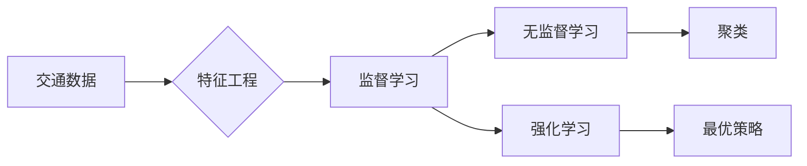

# Python机器学习实战：机器学习在智能交通系统中的应用

作者：禅与计算机程序设计艺术 / Zen and the Art of Computer Programming

关键词：Python，机器学习，智能交通系统，交通流量预测，交通信号控制，自动驾驶

## 1. 背景介绍

### 1.1 问题的由来

随着城市化进程的加快，交通拥堵、交通事故和环境污染等问题日益严重。为了缓解这些问题，智能交通系统（Intelligent Transportation Systems, ITS）应运而生。智能交通系统通过集成多种传感器、通信技术和信息处理技术，实现交通流量的实时监测、预测和控制，以提高交通效率、保障交通安全和减少环境污染。

机器学习作为人工智能领域的关键技术，在智能交通系统中扮演着重要角色。通过机器学习算法，我们可以从海量交通数据中挖掘有价值的信息，为交通管理部门、驾驶员和出行者提供决策支持。

### 1.2 研究现状

近年来，随着大数据、云计算和人工智能技术的不断发展，机器学习在智能交通系统中的应用越来越广泛。以下是一些常见的应用场景：

- **交通流量预测**：通过预测未来交通流量，为交通管理部门提供决策支持，优化交通信号灯控制策略，缓解交通拥堵。
- **交通事故预警**：通过分析历史交通事故数据，预测潜在的交通事故风险，提前采取措施预防事故发生。
- **自动驾驶车辆控制**：为自动驾驶车辆提供实时交通信息，辅助车辆进行安全驾驶。
- **交通拥堵检测**：实时监测交通流量，识别拥堵路段，为出行者提供最优路线规划。

### 1.3 研究意义

机器学习在智能交通系统中的应用具有以下意义：

- **提高交通效率**：通过预测和优化交通流量，减少交通拥堵，缩短出行时间。
- **保障交通安全**：通过预警和预防交通事故，降低交通事故发生率和死亡率。
- **减少环境污染**：通过优化交通流量和降低车辆排放，减轻环境污染。
- **辅助决策**：为交通管理部门和出行者提供数据支持和决策依据。

### 1.4 本文结构

本文将重点介绍机器学习在智能交通系统中的应用，包括核心概念、算法原理、项目实践和实际应用场景等。

## 2. 核心概念与联系

### 2.1 核心概念

- **机器学习**：一种使计算机系统从数据中学习和获取知识的技术。
- **特征工程**：从原始数据中提取有助于模型学习的特征。
- **监督学习**：根据已有标签数据训练模型，使其能够对新的数据进行预测。
- **无监督学习**：没有标签数据，通过聚类等方法发现数据中的潜在规律。
- **强化学习**：通过与环境交互，使模型学习到最优策略。

### 2.2 核心联系

机器学习在智能交通系统中的应用涉及多个领域，如图表展示：



## 3. 核心算法原理 & 具体操作步骤

### 3.1 算法原理概述

在智能交通系统中，常见的机器学习算法包括：

- **线性回归**：用于预测连续值，如交通流量。
- **逻辑回归**：用于预测离散值，如事故发生概率。
- **决策树**：用于分类和回归任务。
- **支持向量机（SVM）**：用于分类和回归任务，尤其适用于高维数据。
- **神经网络**：用于复杂非线性关系的学习。

### 3.2 算法步骤详解

1. **数据收集**：收集交通数据，包括交通流量、交通事故、交通信号灯状态等。
2. **数据预处理**：清洗数据，处理缺失值，进行数据转换等。
3. **特征工程**：从原始数据中提取有助于模型学习的特征。
4. **模型选择**：根据任务类型和数据特点选择合适的机器学习算法。
5. **模型训练**：使用训练数据训练模型，调整模型参数。
6. **模型评估**：使用测试数据评估模型性能，调整模型参数。
7. **模型部署**：将训练好的模型应用于实际场景。

### 3.3 算法优缺点

- **线性回归**：简单易用，但可能无法捕捉复杂非线性关系。
- **逻辑回归**：适用于二分类任务，但可能无法处理多分类问题。
- **决策树**：易于理解，但可能产生过拟合。
- **SVM**：适用于高维数据，但训练速度较慢。
- **神经网络**：能够捕捉复杂非线性关系，但需要大量数据和计算资源。

### 3.4 算法应用领域

机器学习在智能交通系统中的应用领域包括：

- **交通流量预测**：利用历史交通流量数据预测未来交通流量。
- **交通事故预警**：通过分析历史交通事故数据，预测潜在的交通事故风险。
- **自动驾驶**：为自动驾驶车辆提供实时交通信息，辅助车辆进行安全驾驶。

## 4. 数学模型和公式 & 详细讲解 & 举例说明

### 4.1 数学模型构建

以线性回归为例，假设我们有一个包含自变量$x$和因变量$y$的线性关系：

$$y = \beta_0 + \beta_1x + \epsilon$$

其中，$\beta_0$和$\beta_1$是回归系数，$\epsilon$是误差项。

### 4.2 公式推导过程

假设我们有$m$个样本，样本数据为$(x_1, y_1), (x_2, y_2), \dots, (x_m, y_m)$，则线性回归的目标是找到最佳的回归系数$\beta_0$和$\beta_1$，使得均方误差（Mean Squared Error, MSE）最小：

$$MSE(\beta_0, \beta_1) = \sum_{i=1}^m (y_i - (\beta_0 + \beta_1x_i))^2$$

通过求导和优化，可以得到最优回归系数：

$$\beta_0 = \frac{\sum_{i=1}^m (y_i - \beta_1x_i)}{m}$$
$$\beta_1 = \frac{\sum_{i=1}^m (y_i - \beta_0x_i)x_i}{\sum_{i=1}^m x_i^2}$$

### 4.3 案例分析与讲解

以交通流量预测为例，我们使用线性回归模型预测未来某段时间内的交通流量。

1. **数据收集**：收集历史交通流量数据，包括时间、路段和交通流量等。
2. **数据预处理**：清洗数据，处理缺失值，进行数据转换等。
3. **特征工程**：提取有助于预测交通流量的特征，如天气情况、节假日等。
4. **模型选择**：选择线性回归模型。
5. **模型训练**：使用历史数据训练模型。
6. **模型评估**：使用测试数据评估模型性能。
7. **模型部署**：将训练好的模型应用于实际场景。

### 4.4 常见问题解答

**问：为什么选择线性回归模型进行交通流量预测**？

**答**：线性回归模型简单易用，能够捕捉交通流量与时间、路段等因素之间的线性关系。在实际应用中，线性回归模型能够满足基本的预测需求。

## 5. 项目实践：代码实例和详细解释说明

### 5.1 开发环境搭建

首先，安装所需的库：

```bash
pip install numpy pandas scikit-learn matplotlib
```

### 5.2 源代码详细实现

以下是一个简单的交通流量预测项目示例：

```python
import numpy as np
import pandas as pd
from sklearn.linear_model import LinearRegression
import matplotlib.pyplot as plt

# 加载数据
data = pd.read_csv('traffic_data.csv')

# 特征工程
X = data[['hour', 'day_of_week', 'weather']]
y = data['traffic']

# 数据预处理
X = np.array(X)
y = np.array(y)

# 模型选择
model = LinearRegression()

# 模型训练
model.fit(X, y)

# 模型评估
y_pred = model.predict(X)

# 可视化
plt.plot(y, label='实际交通流量')
plt.plot(y_pred, label='预测交通流量')
plt.legend()
plt.show()
```

### 5.3 代码解读与分析

1. **导入库**：导入所需的库，如NumPy、Pandas、Scikit-learn和Matplotlib。
2. **加载数据**：使用Pandas读取CSV格式的交通数据。
3. **特征工程**：提取有助于预测交通流量的特征，如小时、星期几和天气情况等。
4. **数据预处理**：将数据转换为NumPy数组。
5. **模型选择**：选择线性回归模型。
6. **模型训练**：使用历史数据训练模型。
7. **模型评估**：使用训练好的模型预测交通流量，并可视化实际流量和预测流量。
8. **可视化**：使用Matplotlib可视化实际流量和预测流量。

### 5.4 运行结果展示

运行上述代码后，将生成一个包含实际流量和预测流量的折线图，直观地展示模型的预测效果。

## 6. 实际应用场景

### 6.1 交通流量预测

交通流量预测是智能交通系统中最常见的应用场景。通过预测未来交通流量，可以为交通管理部门提供决策支持，优化交通信号灯控制策略，缓解交通拥堵。

### 6.2 交通事故预警

交通事故预警可以提前发现潜在的交通事故风险，从而采取预防措施，降低交通事故发生率和死亡率。

### 6.3 自动驾驶

自动驾驶车辆需要实时获取交通信息，包括交通流量、路况和交通信号灯状态等。机器学习可以帮助自动驾驶车辆从海量交通数据中获取有价值的信息，提高驾驶安全性。

### 6.4 车辆路径规划

车辆路径规划可以帮助驾驶员规划最优路线，缩短出行时间，降低油耗。

## 7. 工具和资源推荐

### 7.1 学习资源推荐

1. **《Python数据科学手册》**: 作者：Jake VanderPlas
    - 介绍了Python在数据科学领域的应用，包括数据分析、可视化、机器学习等。
2. **《机器学习实战》**: 作者：Peter Harrington
    - 通过多个实例介绍了机器学习的基本概念和算法。

### 7.2 开发工具推荐

1. **Jupyter Notebook**: 用于编写和分享代码、可视化和文本。
2. **Scikit-learn**: Python的机器学习库。
3. **TensorFlow**: 用于构建和训练机器学习模型。
4. **PyTorch**: 用于构建和训练神经网络。

### 7.3 相关论文推荐

1. **《Deep Learning for Traffic Forecasting Using LSTM Networks》**: 作者：Jieping Ye et al.
    - 介绍了一种基于长短期记忆网络（LSTM）的交通流量预测方法。
2. **《A Survey of Traffic Flow Prediction: Data, Models, and Algorithms》**: 作者：Ming Liu et al.
    - 对交通流量预测技术进行了综述，包括数据、模型和算法。

### 7.4 其他资源推荐

1. **交通数据集**: [https://www.kaggle.com/c/traffic-accident-severity](https://www.kaggle.com/c/traffic-accident-severity)
    - 提供了交通事故数据集，可用于交通事故预警研究。
2. **OpenStreetMap**: [https://www.openstreetmap.org/](https://www.openstreetmap.org/)
    - 提供了全球交通地图数据，可用于路径规划研究。

## 8. 总结：未来发展趋势与挑战

### 8.1 研究成果总结

本文介绍了机器学习在智能交通系统中的应用，包括核心概念、算法原理、项目实践和实际应用场景等。通过案例分析和代码示例，展示了如何使用Python进行机器学习实战。

### 8.2 未来发展趋势

1. **更强大的模型**：随着深度学习等技术的不断发展，未来将出现更强大的模型，能够处理更复杂的交通场景。
2. **跨领域应用**：机器学习将在更多交通领域得到应用，如交通安全、能源管理、环境监测等。
3. **数据驱动决策**：通过大数据和机器学习技术，实现数据驱动决策，提高交通管理效率和安全性。

### 8.3 面临的挑战

1. **数据隐私与安全**：在智能交通系统中，数据隐私和安全是一个重要问题。如何保证数据安全和用户隐私，是一个挑战。
2. **算法可解释性**：机器学习模型通常被认为是黑盒模型，其决策过程难以解释。提高模型可解释性，使其决策过程透明可信，是一个挑战。
3. **跨领域协作**：智能交通系统涉及多个领域，如交通工程、计算机科学、电子工程等。如何实现跨领域协作，是一个挑战。

### 8.4 研究展望

随着技术的不断发展，机器学习在智能交通系统中的应用将越来越广泛。未来，我们将看到更加智能、高效和安全的交通系统。同时，如何应对数据隐私、算法可解释性和跨领域协作等挑战，也将是未来研究的重要方向。

## 9. 附录：常见问题与解答

### 9.1 机器学习在智能交通系统中的应用有哪些？

机器学习在智能交通系统中的应用包括交通流量预测、交通事故预警、自动驾驶、车辆路径规划等。

### 9.2 如何选择合适的机器学习算法？

选择合适的机器学习算法需要考虑多个因素，如数据特点、任务类型、计算资源等。常见的机器学习算法包括线性回归、逻辑回归、决策树、SVM和神经网络等。

### 9.3 如何评估机器学习模型的性能？

评估机器学习模型的性能可以通过多种方法，如均方误差、准确率、召回率、F1值等。选择合适的评估指标需要考虑具体任务和需求。

### 9.4 如何处理交通数据中的缺失值？

处理交通数据中的缺失值可以通过多种方法，如删除、填充和插值等。选择合适的方法需要考虑数据特点和处理效果。

### 9.5 如何提高机器学习模型的泛化能力？

提高机器学习模型的泛化能力可以通过以下方法：

- **特征工程**：从原始数据中提取有助于模型学习的特征。
- **正则化**：通过添加正则化项限制模型复杂度。
- **数据增强**：通过数据增强技术扩充数据集，提高模型的泛化能力。

### 9.6 智能交通系统的发展前景如何？

随着技术的不断进步，智能交通系统将在未来发挥越来越重要的作用。通过机器学习等人工智能技术的应用，智能交通系统将变得更加智能、高效和安全。