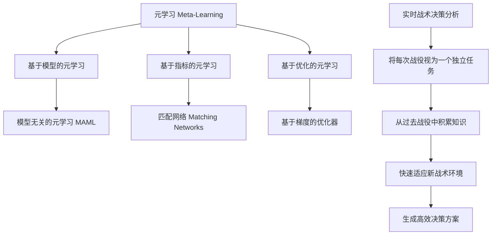
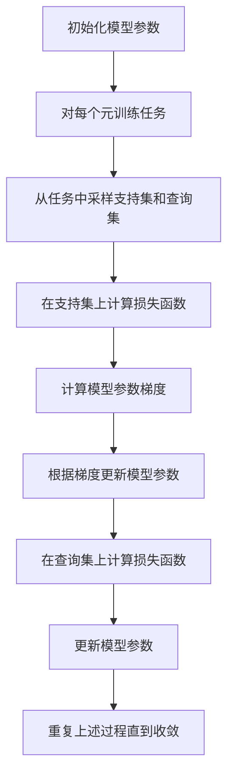

# 一切皆是映射：掌握元学习用于实时战术决策分析

## 1. 背景介绍

### 1.1 问题的由来

在当今瞬息万变的战场环境中，实时战术决策分析变得前所未有的重要。传统的决策系统往往基于预先定义的规则和模型,难以适应复杂多变的战场情况。因此,需要一种能够快速学习和适应新环境的智能决策系统。元学习(Meta-Learning)作为一种全新的机器学习范式,为解决这一挑战提供了新的思路。

### 1.2 研究现状

元学习的核心思想是"学会学习"(Learn to Learn),通过从过去的任务和经验中积累知识,快速获取新任务所需的技能。近年来,元学习在计算机视觉、自然语言处理等领域取得了令人瞩目的进展。然而,将元学习应用于实时战术决策分析仍是一个全新的挑战。

### 1.3 研究意义

成功应用元学习于实时战术决策分析,将极大提高决策系统的适应性和鲁棒性。它能够从历史战役中积累经验,快速学习新的战术环境,生成高效的决策方案。这不仅能提高战场指挥效率,更能最大限度保护人员生命安全。

### 1.4 本文结构

本文将全面介绍如何将元学习应用于实时战术决策分析。我们将首先阐述元学习的核心概念,然后深入探讨其算法原理和数学模型。接下来,通过项目实践展示具体的代码实现。最后,我们将讨论元学习在实际应用场景中的潜力,以及未来的发展趋势和挑战。

## 2. 核心概念与联系

元学习(Meta-Learning)是一种全新的机器学习范式,旨在通过学习任务之间的共性知识,快速获取新任务所需的技能。它可以被视为一种"学习去学习"的过程。

在传统机器学习中,模型是在特定任务的数据集上训练的,难以泛化到新的任务。而元学习则通过在多个不同但相关的任务上训练,学习到一种通用的知识表示,从而能够快速适应新的任务。

元学习可以分为三个主要类别:

1. **基于模型的元学习(Model-Based Meta-Learning)**: 通过学习一个可以快速适应新任务的模型的初始参数或优化器。例如,模型无关的元学习(Model-Agnostic Meta-Learning, MAML)。

2. **基于指标的元学习(Metric-Based Meta-Learning)**: 学习一个能够测量不同任务之间相似性的指标函数,从而将知识从相似任务转移到新任务上。例如,匹配网络(Matching Networks)。

3. **基于优化的元学习(Optimization-Based Meta-Learning)**: 直接学习一个能够快速优化新任务的优化算法。例如,基于梯度的优化器(Gradient-Based Optimizer)。

在实时战术决策分析中,我们可以将每一次战役视为一个独立的任务。通过元学习,决策系统能够从过去的战役中积累知识,快速适应新的战术环境,生成高效的决策方案。

## 3. 核心算法原理 & 具体操作步骤

### 3.1 算法原理概述

在元学习中,我们通常将任务集合$\mathcal{T}$分为两部分:元训练任务集合$\mathcal{T}_{train}$和元测试任务集合$\mathcal{T}_{test}$。算法的目标是在$\mathcal{T}_{train}$上学习一个能够快速适应$\mathcal{T}_{test}$中新任务的模型。

以MAML(Model-Agnostic Meta-Learning)为例,它的核心思想是:在每个元训练任务上,先根据支持集(Support Set)对模型进行几步梯度更新,得到一个适应当前任务的模型,然后在查询集(Query Set)上评估该模型的性能,并对模型参数进行梯度下降,最小化查询集上的损失函数。通过在所有元训练任务上重复这一过程,模型就能够学会快速适应新的任务。

在实时战术决策分析中,我们可以将历史战役作为元训练任务,新的战役作为元测试任务。决策模型通过学习历史战役,能够快速生成适应新战役环境的高效决策方案。

### 3.2 算法步骤详解

以MAML算法为例,具体操作步骤如下:

1. **初始化模型参数**$\theta$

2. **对每个元训练任务$\mathcal{T}_i$:**
    a. 从$\mathcal{T}_i$中采样支持集$\mathcal{D}_i^{sup}$和查询集$\mathcal{D}_i^{qry}$
    b. 在支持集上计算损失函数$\mathcal{L}_{\mathcal{T}_i}(\theta)$
    c. 计算模型参数的梯度:$\nabla_\theta\mathcal{L}_{\mathcal{T}_i}(\theta)$
    d. 根据梯度更新模型参数:$\theta_i' = \theta - \alpha\nabla_\theta\mathcal{L}_{\mathcal{T}_i}(\theta)$
    e. 在查询集上计算损失函数:$\mathcal{L}_{\mathcal{T}_i}(\theta_i')$
    f. 更新模型参数:$\theta \leftarrow \theta - \beta\nabla_\theta\sum_{\mathcal{T}_i\sim p(\mathcal{T})}\mathcal{L}_{\mathcal{T}_i}(\theta_i')$

3. **重复步骤2,直到模型收敛**

其中,$\alpha$和$\beta$分别是内循环和外循环的学习率。通过这种两层优化,模型能够快速适应新任务。

### 3.3 算法优缺点

**优点:**

1. **快速适应性**: 元学习算法能够从过去的任务中积累知识,快速适应新的任务环境。
2. **数据高效**: 相比传统监督学习,元学习在新任务上只需要少量数据就能取得良好性能。
3. **泛化能力强**: 元学习算法学习到的是任务之间的共性知识,因此具有很强的泛化能力。

**缺点:**

1. **计算开销大**: 元学习算法需要在多个任务上进行训练,计算开销较大。
2. **任务相关性**: 如果元训练任务与元测试任务差异过大,则难以取得好的性能。
3. **超参数敏感**: 算法的性能对超参数(如学习率)非常敏感,需要进行大量调参。

### 3.4 算法应用领域

除了实时战术决策分析,元学习还可以应用于以下领域:

1. **少样本学习(Few-Shot Learning)**: 在有限的标注数据下快速学习新概念。
2. **持续学习(Continual Learning)**: 在不同任务之间无缝切换,避免灾难性遗忘。
3. **机器人控制(Robot Control)**: 快速适应新环境,生成高效的控制策略。
4. **药物发现(Drug Discovery)**: 基于已知分子结构快速预测新分子的性质。

## 4. 数学模型和公式 & 详细讲解 & 举例说明

### 4.1 数学模型构建

我们将基于MAML算法,构建一个用于实时战术决策分析的元学习模型。假设我们有一个决策模型$f_\theta$,其参数为$\theta$。在每个元训练任务$\mathcal{T}_i$中,我们的目标是最小化以下损失函数:

$$\mathcal{L}_{\mathcal{T}_i}(\theta) = \sum_{(x,y)\in\mathcal{D}_i^{qry}}\ell(f_{\theta_i'}(x),y)$$

其中,$\mathcal{D}_i^{qry}$是任务$\mathcal{T}_i$的查询集,(x,y)是查询集中的数据样本,y是正确的决策标签,$\ell$是损失函数(如交叉熵损失),$\theta_i'$是在支持集$\mathcal{D}_i^{sup}$上通过梯度下降更新得到的模型参数:

$$\theta_i' = \theta - \alpha\nabla_\theta\sum_{(x,y)\in\mathcal{D}_i^{sup}}\ell(f_\theta(x),y)$$

在所有元训练任务上,我们的目标是最小化以下损失函数:

$$\min_\theta\sum_{\mathcal{T}_i\sim p(\mathcal{T})}\mathcal{L}_{\mathcal{T}_i}(\theta)$$

其中,$p(\mathcal{T})$是元训练任务的分布。通过梯度下降优化该损失函数,我们可以得到一个能够快速适应新任务的模型参数$\theta$。

### 4.2 公式推导过程

我们将推导MAML算法的梯度公式。首先,我们定义一个辅助损失函数:

$$\tilde{\mathcal{L}}_{\mathcal{T}_i}(\theta) = \sum_{(x,y)\in\mathcal{D}_i^{sup}}\ell(f_\theta(x),y) + \sum_{(x,y)\in\mathcal{D}_i^{qry}}\ell(f_{\theta_i'}(x),y)$$

其中,$\theta_i' = \theta - \alpha\nabla_\theta\tilde{\mathcal{L}}_{\mathcal{T}_i}(\theta)$。我们的目标是最小化$\sum_{\mathcal{T}_i\sim p(\mathcal{T})}\tilde{\mathcal{L}}_{\mathcal{T}_i}(\theta)$。

对$\theta$求导,我们得到:

$$\nabla_\theta\sum_{\mathcal{T}_i\sim p(\mathcal{T})}\tilde{\mathcal{L}}_{\mathcal{T}_i}(\theta) = \sum_{\mathcal{T}_i\sim p(\mathcal{T})}\left(\nabla_\theta\sum_{(x,y)\in\mathcal{D}_i^{sup}}\ell(f_\theta(x),y) + \nabla_\theta\sum_{(x,y)\in\mathcal{D}_i^{qry}}\ell(f_{\theta_i'}(x),y)\right)$$

由于$\theta_i'$依赖于$\theta$,我们需要应用链式法则:

$$\nabla_\theta\sum_{(x,y)\in\mathcal{D}_i^{qry}}\ell(f_{\theta_i'}(x),y) = \nabla_{\theta_i'}\sum_{(x,y)\in\mathcal{D}_i^{qry}}\ell(f_{\theta_i'}(x),y)\cdot\nabla_\theta\theta_i'$$

其中,$\nabla_\theta\theta_i' = I - \alpha\nabla_\theta^2\tilde{\mathcal{L}}_{\mathcal{T}_i}(\theta)$。将这一项代入上式,我们得到MAML算法的梯度公式:

$$\nabla_\theta\sum_{\mathcal{T}_i\sim p(\mathcal{T})}\tilde{\mathcal{L}}_{\mathcal{T}_i}(\theta) = \sum_{\mathcal{T}_i\sim p(\mathcal{T})}\left(\nabla_\theta\sum_{(x,y)\in\mathcal{D}_i^{sup}}\ell(f_\theta(x),y) + \nabla_{\theta_i'}\sum_{(x,y)\in\mathcal{D}_i^{qry}}\ell(f_{\theta_i'}(x),y)\cdot(I - \alpha\nabla_\theta^2\tilde{\mathcal{L}}_{\mathcal{T}_i}(\theta))\right)$$

### 4.3 案例分析与讲解

为了更好地理解元学习在实时战术决策分析中的应用,我们将通过一个具体案例进行分析。