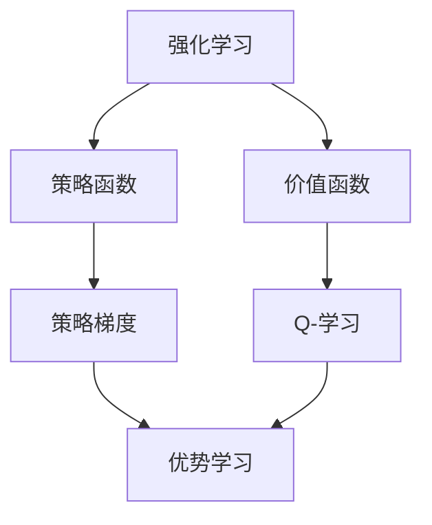

# 优势学习 (Advantage Learning) 原理与代码实例讲解

## 1. 背景介绍

### 1.1 问题的由来

在强化学习领域中,智能体如何有效地学习最优策略一直是一个重要的研究课题。传统的Q-学习算法虽然可以逐步更新Q值以获得最优策略,但存在一些缺陷,如学习效率低下、容易陷入局部最优等。为了解决这些问题,研究人员提出了一种新的强化学习算法——优势学习(Advantage Learning)。

优势学习的核心思想是直接学习状态-行为对的优势函数(Advantage Function),而不是像Q-学习那样学习状态-行为对的价值函数。优势函数表示一个行为相对于其他行为的优势程度,从而可以更快更有效地找到最优策略。

### 1.2 研究现状

优势学习算法最早由Baird于1993年提出,随后得到了广泛的关注和研究。近年来,优势学习算法在深度强化学习领域取得了重大进展,如A3C、UNREAL等算法的提出,使得优势学习在连续控制、多智能体系统等复杂问题中表现出色。

不过,优势学习算法也存在一些挑战,如如何设计高效的优势函数估计器、如何处理稀疏奖励问题等,这些问题都是当前研究的热点。

### 1.3 研究意义

优势学习算法具有以下重要意义:

1. 提高学习效率:通过直接学习优势函数,可以更快更有效地找到最优策略,从而提高强化学习的效率。

2. 解决局部最优问题:优势学习算法可以更好地避免陷入局部最优,从而找到全局最优解。

3. 处理连续控制问题:优势学习算法可以很好地应用于连续控制问题,如机器人控制、自动驾驶等领域。

4. 多智能体系统应用:优势学习算法在多智能体系统中表现出色,可以用于多智能体协作、竞争等场景。

### 1.4 本文结构

本文将全面介绍优势学习算法的原理、数学模型、实现细节和实际应用。具体内容安排如下:

1. 背景介绍
2. 核心概念与联系
3. 核心算法原理与具体操作步骤
4. 数学模型和公式详细讲解与案例分析
5. 项目实践:代码实例和详细解释说明
6. 实际应用场景
7. 工具和资源推荐
8. 总结:未来发展趋势与挑战
9. 附录:常见问题与解答

## 2. 核心概念与联系

优势学习算法涉及到了强化学习、策略梯度等多个核心概念,下面我们先介绍这些概念及它们之间的联系。

1. **强化学习(Reinforcement Learning)**:智能体通过与环境交互,获取奖励信号,从而学习最优策略的过程。是机器学习的一个重要分支。

2. **价值函数(Value Function)**:表示在某个状态下执行一系列行为所能获得的期望回报,是评估策略优劣的重要指标。

3. **策略函数(Policy Function)**:定义了智能体在每个状态下选择行为的概率分布,决定了智能体的行为方式。

4. **Q-学习(Q-Learning)**:一种基于价值函数的强化学习算法,通过不断更新Q值(状态-行为对的价值)来学习最优策略。

5. **策略梯度(Policy Gradient)**:一种基于策略函数的强化学习算法,通过调整策略函数的参数来最大化期望回报。

6. **优势学习(Advantage Learning)**:基于策略梯度算法,通过学习优势函数(行为相对于其他行为的优势程度)来加速策略优化过程。

可以看出,优势学习算法集成了价值函数和策略梯度的思想,旨在提高策略优化的效率和性能。接下来我们详细介绍优势学习算法的原理和实现细节。

## 3. 核心算法原理与具体操作步骤

### 3.1 算法原理概述

优势学习算法的核心思想是直接学习优势函数(Advantage Function),而不是学习价值函数或策略函数。优势函数定义为:

$$A^{\pi}(s,a) = Q^{\pi}(s,a) - V^{\pi}(s)$$

其中$Q^{\pi}(s,a)$表示在状态$s$执行行为$a$后按策略$\pi$执行所能获得的期望回报,$V^{\pi}(s)$表示在状态$s$按策略$\pi$执行所能获得的期望回报。

优势函数$A^{\pi}(s,a)$表示在状态$s$下执行行为$a$相对于其他行为的优势程度。当$A^{\pi}(s,a)$较大时,表明执行$a$是一个相对好的选择;当$A^{\pi}(s,a)$较小或为负时,表明执行$a$是一个相对差的选择。

通过学习优势函数,我们可以更快更有效地找到最优策略,因为优势函数直接告诉我们哪些行为是好的,哪些行为是差的,从而可以更快地调整策略参数。

优势学习算法的一般流程如下:

1. 初始化策略函数$\pi_{\theta}$(参数为$\theta$)和优势函数估计器$A_{\phi}$(参数为$\phi$)
2. 智能体与环境交互,收集状态-行为-奖励序列
3. 使用序列数据,根据优势函数目标计算优势函数估计器$A_{\phi}$的损失函数
4. 使用策略梯度算法,根据优势函数估计值计算策略函数$\pi_{\theta}$的损失函数
5. 同时优化$\phi$和$\theta$,使得优势函数估计值最大化,策略函数期望回报最大化
6. 重复2-5步,直到收敛

接下来我们详细介绍算法的具体操作步骤。

### 3.2 算法步骤详解

优势学习算法的具体步骤如下:

1. **初始化**
    - 初始化策略函数$\pi_{\theta}(a|s)$,即在状态$s$下执行行为$a$的概率分布,参数为$\theta$
    - 初始化优势函数估计器$A_{\phi}(s,a)$,参数为$\phi$

2. **生成数据**
    - 智能体根据当前策略$\pi_{\theta}$与环境交互
    - 收集一个序列$\tau = (s_0,a_0,r_0,s_1,a_1,r_1,...,s_T)$,其中$s_t$为状态,$a_t$为行为,$r_t$为奖励

3. **计算优势函数估计值**
    - 对于序列$\tau$中的每个状态-行为对$(s_t,a_t)$,计算其优势函数估计值$A_{\phi}(s_t,a_t)$
    - 常用的优势函数估计方法有:
        - 基于回报的估计:$A_{\phi}(s_t,a_t) = \sum_{t'=t}^{T}\gamma^{t'-t}r_{t'} - V_{\phi'}(s_t)$
        - 基于时序差分的估计:$A_{\phi}(s_t,a_t) = r_t + \gamma V_{\phi'}(s_{t+1}) - V_{\phi'}(s_t)$
    - 其中$V_{\phi'}(s)$为状态值函数估计器,可以与优势函数估计器共享参数或分开训练

4. **计算策略损失函数**
    - 根据策略梯度算法,策略函数$\pi_{\theta}$的损失函数为:

    $$J(\theta) = \mathbb{E}_{\tau \sim \pi_{\theta}}\left[\sum_{t=0}^{T}A_{\phi}(s_t,a_t)\right]$$

    - 目标是最大化$J(\theta)$,即最大化期望优势函数估计值
    - 对$\theta$进行梯度上升:$\theta \leftarrow \theta + \alpha \nabla_{\theta}J(\theta)$

5. **计算优势函数估计器损失函数**
    - 优势函数估计器$A_{\phi}$的损失函数可以有多种选择,如:
        - 平方损失:$L_1(\phi) = \mathbb{E}_{\tau \sim \pi_{\theta}}\left[\sum_{t=0}^{T}(A_{\phi}(s_t,a_t) - A^{\pi_{\theta}}(s_t,a_t))^2\right]$
        - 绝对损失:$L_2(\phi) = \mathbb{E}_{\tau \sim \pi_{\theta}}\left[\sum_{t=0}^{T}|A_{\phi}(s_t,a_t) - A^{\pi_{\theta}}(s_t,a_t)|\right]$
        - 指数损失:$L_3(\phi) = \mathbb{E}_{\tau \sim \pi_{\theta}}\left[\sum_{t=0}^{T}\exp(-A_{\phi}(s_t,a_t)A^{\pi_{\theta}}(s_t,a_t))\right]$
    - 目标是最小化损失函数,即使估计值$A_{\phi}(s,a)$尽可能接近真实优势函数$A^{\pi_{\theta}}(s,a)$
    - 对$\phi$进行梯度下降:$\phi \leftarrow \phi - \beta \nabla_{\phi}L(\phi)$

6. **更新策略和优势函数估计器**
    - 同时优化$\theta$和$\phi$:
        - $\theta \leftarrow \theta + \alpha \nabla_{\theta}J(\theta)$
        - $\phi \leftarrow \phi - \beta \nabla_{\phi}L(\phi)$
    - 重复2-6步,直到收敛

需要注意的是,优势函数估计器的设计对算法的性能有很大影响。一个好的估计器应该具有较低的方差和偏差,并且计算高效。此外,还需要注意策略更新和估计器更新之间的平衡,以确保算法的稳定性和收敛性。

### 3.3 算法优缺点

**优点:**

1. **高效学习**:通过直接学习优势函数,可以更快更有效地找到最优策略,提高了学习效率。

2. **避免局部最优**:优势学习算法可以更好地避免陷入局部最优,从而找到全局最优解。

3. **连续控制应用**:优势学习算法可以很好地应用于连续控制问题,如机器人控制、自动驾驶等领域。

4. **多智能体系统**:优势学习算法在多智能体系统中表现出色,可以用于多智能体协作、竞争等场景。

**缺点:**

1. **优势函数估计困难**:设计一个高效、低偏差、低方差的优势函数估计器是一个挑战。

2. **样本效率问题**:与价值函数方法相比,优势学习算法的样本效率可能较低。

3. **超参数sensitivityity**:算法的性能对于超参数(如学习率、优化器等)比较敏感,需要仔细调试。

4. **稀疏奖励问题**:在奖励信号稀疏的情况下,优势学习算法可能会表现不佳。

总的来说,优势学习算法是一种有前景的强化学习算法,具有高效学习、避免局部最优等优点,但也存在一些需要解决的挑战。

### 3.4 算法应用领域

优势学习算法由于其高效学习和连续控制能力,在以下领域有广泛的应用前景:

1. **机器人控制**:优势学习可以应用于机器人的运动规划、机械臂控制等连续控制任务。

2. **自动驾驶**:通过优势学习,可以训练出高效的自动驾驶策略,实现车辆的智能导航和决策。

3. **游戏AI**:优势学习可以用于训练游戏AI智能体,如AlphaGo、OpenAI Five等。

4. **金融决策**:在投资组合优化、交易策略制定等金融决策任务中,优势学习可以发挥重要作用。

5. **智能制造**:通过优势学习,可以优化工业生产流程,提高生产效率和产品质量。

6. **多智能体系统**:优势学习在多智能体协作、竞争等场景中表现出色,可用于机器人群控制、交通调度等任务。

7. **自然语言处理**: