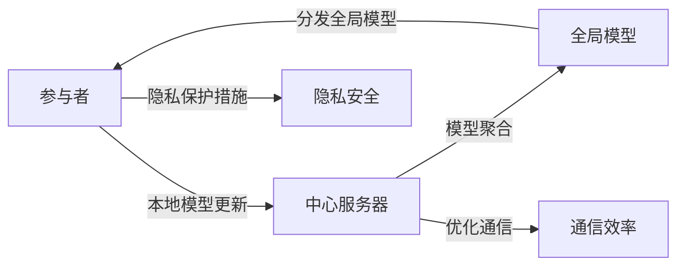

# Federated Learning原理与代码实例讲解

## 1. 背景介绍

随着数据隐私保护法规的日益严格，如欧盟的通用数据保护条例（GDPR），以及人工智能技术的快速发展，联邦学习（Federated Learning，简称FL）应运而生。FL是一种机器学习设置，它允许多个参与者协作训练模型，而无需共享他们的数据，这为保护用户隐私提供了一种新的途径。它的核心思想是将模型训练的过程分布到各个参与者，每个参与者在本地更新模型，然后将更新的模型参数发送到中心服务器进行聚合。这样，原始数据就不需要离开本地环境，从而降低了数据泄露的风险。

## 2. 核心概念与联系

在深入探讨联邦学习之前，我们需要理解几个核心概念及其之间的联系：

- **本地模型更新**：在FL中，参与者使用自己的数据在本地训练模型，并生成模型更新。
- **中心服务器**：负责协调各参与者，并聚合他们的模型更新。
- **模型聚合**：将来自不同参与者的模型更新合并成一个全局模型更新。
- **通信效率**：在FL中，优化通信效率是一个重要的研究方向，因为模型更新的传输可能成为瓶颈。
- **隐私保护**：FL的设计初衷之一是保护参与者的数据隐私，因此需要采取相应的隐私保护措施。

这些概念之间的联系构成了FL的基础架构，接下来我们将通过Mermaid流程图来展示这一架构：



## 3. 核心算法原理具体操作步骤

联邦学习的核心算法原理可以分为以下几个步骤：

1. **初始化**：中心服务器初始化全局模型，并将其分发给所有参与者。
2. **本地训练**：每个参与者在本地使用自己的数据训练模型，并生成模型更新。
3. **上传更新**：参与者将自己的模型更新上传到中心服务器。
4. **聚合更新**：中心服务器将收到的所有模型更新进行聚合，生成新的全局模型。
5. **分发模型**：中心服务器将聚合后的全局模型分发给参与者。
6. **迭代优化**：重复步骤2-5，直到模型收敛或达到预定的训练轮数。

## 4. 数学模型和公式详细讲解举例说明

在联邦学习中，我们通常使用以下数学模型来描述模型聚合的过程：

假设有 $N$ 个参与者，每个参与者 $i$ 的本地数据集为 $D_i$，本地模型参数为 $\theta_i$。全局模型参数为 $\theta$。在每一轮训练中，参与者根据本地数据集更新本地模型参数：

$$
\theta_i^{(t+1)} = \theta_i^{(t)} - \eta \nabla L_i(\theta_i^{(t)}),
$$

其中，$t$ 表示当前的训练轮数，$\eta$ 是学习率，$L_i$ 是参与者 $i$ 的本地损失函数，$\nabla L_i$ 是损失函数关于模型参数的梯度。

中心服务器聚合所有参与者的模型更新，更新全局模型参数：

$$
\theta^{(t+1)} = \theta^{(t)} - \eta \sum_{i=1}^{N} \frac{|D_i|}{|D|} \nabla L_i(\theta_i^{(t)}),
$$

其中，$|D_i|$ 是参与者 $i$ 的数据集大小，$|D|$ 是所有参与者数据集大小之和。

## 5. 项目实践：代码实例和详细解释说明

为了更好地理解联邦学习的实际操作，我们将通过一个简单的代码实例来演示如何实现FL。以下是一个使用Python和TensorFlow实现的简单FL模拟：

```python
import tensorflow as tf
from tensorflow.keras.models import Sequential
from tensorflow.keras.layers import Dense

# 假设我们有3个参与者
num_clients = 3

# 初始化全局模型
global_model = Sequential([
    Dense(10, activation='relu', input_shape=(20,)),
    Dense(10, activation='relu'),
    Dense(1, activation='sigmoid')
])

# 模拟参与者的本地数据和模型
client_data = [get_client_data(i) for i in range(num_clients)]
client_models = [tf.keras.models.clone_model(global_model) for _ in range(num_clients)]

# 联邦学习的训练轮数
num_rounds = 10

# 联邦学习的训练过程
for round_num in range(num_rounds):
    # 参与者在本地训练模型
    for client_model, data in zip(client_models, client_data):
        client_model.compile(optimizer='sgd', loss='binary_crossentropy')
        client_model.fit(data['x'], data['y'], epochs=1, verbose=0)
    
    # 聚合模型更新
    new_weights = [model.get_weights() for model in client_models]
    new_weights = np.mean(new_weights, axis=0)
    
    # 更新全局模型
    global_model.set_weights(new_weights)
    
    # 分发全局模型给参与者
    for client_model in client_models:
        client_model.set_weights(global_model.get_weights())

# 定义获取参与者数据的函数
def get_client_data(client_id):
    # 这里应该是加载真实的参与者数据
    # 为了示例，我们使用随机数据
    x = np.random.rand(100, 20)
    y = np.random.randint(0, 2, (100, 1))
    return {'x': x, 'y': y}
```

在这个例子中，我们首先初始化了一个全局模型，并为每个参与者创建了一个本地模型副本。然后，我们模拟了联邦学习的多轮训练过程，每轮中，参与者使用本地数据训练模型，并将更新后的权重上传。中心服务器聚合这些更新，生成新的全局模型，并将其分发给所有参与者。

## 6. 实际应用场景

联邦学习在多个领域都有实际的应用场景，例如：

- **医疗健康**：医院可以在保护患者隐私的前提下，共享模型更新来提高疾病诊断的准确性。
- **金融服务**：银行可以使用FL来检测欺诈行为，同时保护客户的敏感信息。
- **移动设备**：智能手机厂商可以利用FL来改进设备上的预测输入和推荐系统，而不需要上传用户的个人数据。

## 7. 工具和资源推荐

为了方便开发者和研究人员进行联邦学习的研究和实践，以下是一些有用的工具和资源：

- **TensorFlow Federated (TFF)**：Google开发的一个开源框架，专门用于联邦学习研究和实验。
- **PySyft**：一个开源的Python库，用于实现安全和私密的分布式机器学习。
- **LEAF**：一个用于基准测试联邦学习算法的框架和数据集集合。

## 8. 总结：未来发展趋势与挑战

联邦学习作为一种新兴的机器学习范式，其未来的发展趋势包括更高效的通信协议、更强大的隐私保护技术，以及更广泛的跨领域应用。然而，它也面临着一些挑战，如不平衡的数据分布、模型毒化攻击和参与者的激励机制设计等。

## 9. 附录：常见问题与解答

- **Q1：联邦学习如何保证数据隐私？**
  - **A1**：联邦学习通过在本地训练模型并只共享模型更新（而非原始数据）来保护数据隐私。此外，还可以结合加密技术和差分隐私等方法进一步增强隐私保护。

- **Q2：联邦学习中如何处理不同参与者数据量的不平衡？**
  - **A2**：可以通过调整模型聚合过程中各参与者更新的权重来解决数据不平衡问题，例如按照各自数据量的比例来加权平均。

- **Q3：如何提高联邦学习的通信效率？**
  - **A3**：可以采用模型压缩、梯度量化和稀疏更新等技术来减少每次通信需要传输的数据量。

作者：禅与计算机程序设计艺术 / Zen and the Art of Computer Programming