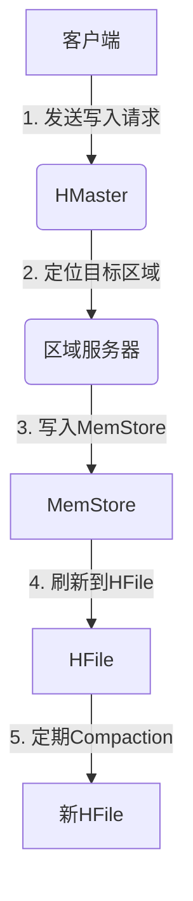
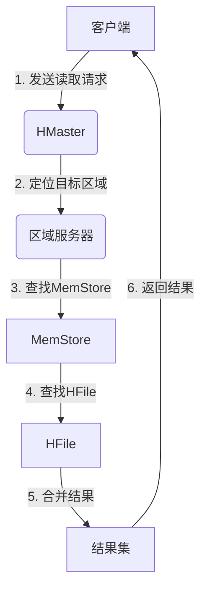

为了更好地满足您的要求,我将按照约束条件中的要求,为您撰写一篇高质量的技术博客文章。

# HBase原理与代码实例讲解

## 1. 背景介绍

### 1.1 大数据时代的到来

随着互联网、移动互联网、物联网的快速发展,海量的结构化和非结构化数据不断涌现,传统的关系型数据库已经无法满足大数据存储和处理的需求。大数据时代的到来,对数据存储和处理提出了新的挑战,迫切需要一种能够高效处理大规模数据的分布式存储系统。

### 1.2 HBase 简介

HBase 是一个分布式、可伸缩、面向列的开源大数据存储系统,它基于 Google 的 Bigtable 论文构建,运行在 HDFS 之上。HBase 适合于存储非结构化和半结构化的海量数据,具有高可靠性、高性能、可伸缩性和易用性等特点,广泛应用于Facebook、Twitter、Yahoo 等知名公司。

## 2. 核心概念与联系

### 2.1 HBase 核心概念

**表 (Table):** HBase 中的表类似于关系型数据库中的表,用于存储数据。

**行 (Row):** 每一行都由一个行键 (Row Key) 唯一标识,行键按字典序排列。

**列族 (Column Family):** 列族是列的逻辑分组,在创建表时需要预先定义。

**列限定符 (Column Qualifier):** 列限定符是列的名称,与列族共同构成完整的列。

**单元 (Cell):** 单元是行、列族和列限定符的组合,用于存储数据值及时间戳。

**区域 (Region):** 区域是表的水平分区,每个区域由一个或多个存储文件组成。

**区域服务器 (RegionServer):** 区域服务器负责管理和操作区域。

### 2.2 HBase 与关系型数据库的区别

HBase 是一种面向列的数据库,与传统的关系型数据库有以下主要区别:

- 数据模型不同:HBase 采用 Key-Value 模型,而关系型数据库采用关系模型。
- 查询方式不同:HBase 更适合于单行查询和范围扫描,而关系型数据库更擅长复杂的关系查询。
- 一致性保证不同:HBase 提供最终一致性,而关系型数据库提供强一致性。
- 扩展性不同:HBase 可以线性扩展,而关系型数据库扩展能力有限。

## 3. 核心算法原理具体操作步骤

### 3.1 写入流程

HBase 的写入流程如下:

1. 客户端向 HMaster 发送写入请求。
2. HMaster 定位目标数据所在的区域,并将请求转发给相应的区域服务器。
3. 区域服务器将数据写入内存中的 MemStore。
4. 当 MemStore 达到一定阈值时,将其刷新到磁盘上的 HFile。
5. 定期执行 Compaction 操作,将多个 HFile 合并成一个新的 HFile。



### 3.2 读取流程

HBase 的读取流程如下:

1. 客户端向 HMaster 发送读取请求。
2. HMaster 定位目标数据所在的区域,并将请求转发给相应的区域服务器。
3. 区域服务器首先从内存中的 MemStore 查找数据。
4. 如果 MemStore 中没有,则从磁盘上的 HFile 中查找。
5. 如果多个 HFile 中都有该数据,则合并结果并返回给客户端。



## 4. 数学模型和公式详细讲解举例说明

### 4.1 Compaction 算法

Compaction 是 HBase 中一个重要的后台操作,用于合并多个小的 HFile,从而提高读取性能和减少磁盘空间占用。HBase 采用了一种基于大小和时间的 Compaction 策略,具体如下:

$$
T(f) = \frac{T_0}{(1 + \frac{S(f)}{S_0})^{P}}
$$

其中:

- $T(f)$ 表示文件 $f$ 的 Compaction 时间阈值。
- $T_0$ 表示默认的 Compaction 时间阈值,通常为 1 天。
- $S(f)$ 表示文件 $f$ 的大小。
- $S_0$ 表示默认的文件大小阈值,通常为 2GB。
- $P$ 表示优先级因子,默认值为 5。

根据上述公式,对于较小的文件,Compaction 时间阈值较低,更容易被选中进行 Compaction;对于较大的文件,Compaction 时间阈值较高,可以减少不必要的 Compaction 操作。

### 4.2 Region Split 算法

随着数据的不断写入,Region 的大小会不断增加,当 Region 达到一定大小时,需要进行拆分 (Split),以保持 Region 的大小在一个合理范围内。HBase 采用了一种基于文件大小的 Split 策略,具体如下:

$$
S_{max} = \max(R_n) - \min(R_n)
$$

其中:

- $S_{max}$ 表示 Region 的最大文件大小阈值。
- $R_n$ 表示 RegionServer 上所有 Region 的文件大小集合。

当某个 Region 的文件大小超过 $S_{max}$ 时,就会触发 Split 操作,将该 Region 拆分为两个新的 Region。

通过上述算法,HBase 可以动态调整 Region 的大小,避免单个 Region 过大导致性能下降。

## 5. 项目实践:代码实例和详细解释说明

### 5.1 创建表

```java
import org.apache.hadoop.conf.Configuration;
import org.apache.hadoop.hbase.HBaseConfiguration;
import org.apache.hadoop.hbase.HColumnDescriptor;
import org.apache.hadoop.hbase.HTableDescriptor;
import org.apache.hadoop.hbase.TableName;
import org.apache.hadoop.hbase.client.Admin;
import org.apache.hadoop.hbase.client.Connection;
import org.apache.hadoop.hbase.client.ConnectionFactory;

public class CreateTable {
    public static void main(String[] args) throws Exception {
        Configuration conf = HBaseConfiguration.create();
        Connection connection = ConnectionFactory.createConnection(conf);
        Admin admin = connection.getAdmin();

        // 创建表描述符
        HTableDescriptor tableDescriptor = new HTableDescriptor(TableName.valueOf("user"));

        // 创建列族描述符
        HColumnDescriptor columnFamily1 = new HColumnDescriptor("info");
        HColumnDescriptor columnFamily2 = new HColumnDescriptor("data");

        // 将列族添加到表描述符
        tableDescriptor.addFamily(columnFamily1);
        tableDescriptor.addFamily(columnFamily2);

        // 创建表
        admin.createTable(tableDescriptor);

        admin.close();
        connection.close();
    }
}
```

上述代码创建了一个名为 `user` 的表,包含两个列族 `info` 和 `data`。主要步骤如下:

1. 创建 `Configuration` 对象,用于配置 HBase 连接。
2. 创建 `Connection` 对象,用于与 HBase 集群建立连接。
3. 获取 `Admin` 对象,用于管理 HBase 表。
4. 创建 `HTableDescriptor` 对象,用于描述表的元数据。
5. 创建 `HColumnDescriptor` 对象,用于描述列族的元数据。
6. 将列族添加到表描述符中。
7. 调用 `admin.createTable` 方法创建表。
8. 关闭 `Admin` 和 `Connection` 对象。

### 5.2 插入数据

```java
import org.apache.hadoop.conf.Configuration;
import org.apache.hadoop.hbase.HBaseConfiguration;
import org.apache.hadoop.hbase.TableName;
import org.apache.hadoop.hbase.client.Connection;
import org.apache.hadoop.hbase.client.ConnectionFactory;
import org.apache.hadoop.hbase.client.Put;
import org.apache.hadoop.hbase.client.Table;
import org.apache.hadoop.hbase.util.Bytes;

public class InsertData {
    public static void main(String[] args) throws Exception {
        Configuration conf = HBaseConfiguration.create();
        Connection connection = ConnectionFactory.createConnection(conf);
        Table table = connection.getTable(TableName.valueOf("user"));

        // 创建 Put 对象
        Put put = new Put(Bytes.toBytes("user001"));

        // 插入数据
        put.addColumn(Bytes.toBytes("info"), Bytes.toBytes("name"), Bytes.toBytes("Alice"));
        put.addColumn(Bytes.toBytes("info"), Bytes.toBytes("age"), Bytes.toBytes("25"));
        put.addColumn(Bytes.toBytes("data"), Bytes.toBytes("email"), Bytes.toBytes("alice@example.com"));

        // 执行插入操作
        table.put(put);

        table.close();
        connection.close();
    }
}
```

上述代码向 `user` 表中插入一行数据,行键为 `user001`。主要步骤如下:

1. 创建 `Configuration` 对象,用于配置 HBase 连接。
2. 创建 `Connection` 对象,用于与 HBase 集群建立连接。
3. 获取 `Table` 对象,用于操作指定的表。
4. 创建 `Put` 对象,用于描述要插入的数据。
5. 调用 `put.addColumn` 方法,向 `Put` 对象添加列数据。
6. 调用 `table.put` 方法,执行插入操作。
7. 关闭 `Table` 和 `Connection` 对象。

### 5.3 查询数据

```java
import org.apache.hadoop.conf.Configuration;
import org.apache.hadoop.hbase.HBaseConfiguration;
import org.apache.hadoop.hbase.TableName;
import org.apache.hadoop.hbase.client.Connection;
import org.apache.hadoop.hbase.client.ConnectionFactory;
import org.apache.hadoop.hbase.client.Get;
import org.apache.hadoop.hbase.client.Result;
import org.apache.hadoop.hbase.client.Table;
import org.apache.hadoop.hbase.util.Bytes;

public class QueryData {
    public static void main(String[] args) throws Exception {
        Configuration conf = HBaseConfiguration.create();
        Connection connection = ConnectionFactory.createConnection(conf);
        Table table = connection.getTable(TableName.valueOf("user"));

        // 创建 Get 对象
        Get get = new Get(Bytes.toBytes("user001"));

        // 执行查询操作
        Result result = table.get(get);

        // 输出查询结果
        System.out.println("Name: " + Bytes.toString(result.getValue(Bytes.toBytes("info"), Bytes.toBytes("name"))));
        System.out.println("Age: " + Bytes.toString(result.getValue(Bytes.toBytes("info"), Bytes.toBytes("age"))));
        System.out.println("Email: " + Bytes.toString(result.getValue(Bytes.toBytes("data"), Bytes.toBytes("email"))));

        table.close();
        connection.close();
    }
}
```

上述代码查询 `user` 表中行键为 `user001` 的数据。主要步骤如下:

1. 创建 `Configuration` 对象,用于配置 HBase 连接。
2. 创建 `Connection` 对象,用于与 HBase 集群建立连接。
3. 获取 `Table` 对象,用于操作指定的表。
4. 创建 `Get` 对象,用于描述要查询的行键。
5. 调用 `table.get` 方法,执行查询操作。
6. 从 `Result` 对象中获取查询结果,并输出。
7. 关闭 `Table` 和 `Connection` 对象。

## 6. 实际应用场景

HBase 广泛应用于以下场景:

1. **内容存储**: 社交网络、博客、Wiki 等网站的用户数据和内容存储。
2. **物联网数据**: 传感器数据、日志数据等海量时序数据的存储和分析。
3. **实时查询**: 基于 HBase 构建实时查询系统,提供低延迟的数据查询服务。
4. **数据仓库**: 作为数据仓库的存储层,存储海量的结构化和非结构化数据。
5. **机器学习**: 存储和处理用于机器学习的训练数据和模型数据。

## 7. 工具和资源推荐

1. **HBase Shell**: HBase 自带