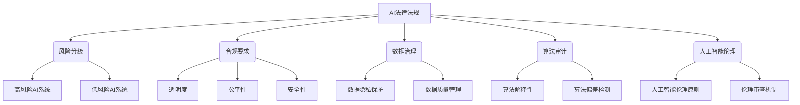
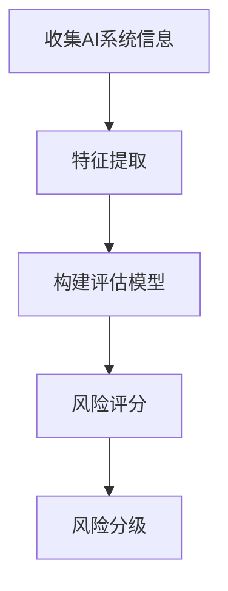

好的,我明白了您的要求。以下是根据您提供的标题和要求撰写的技术博客文章正文:

# AI相关法律法规原理与代码实战案例讲解

## 1. 背景介绍

### 1.1 问题的由来

随着人工智能(AI)技术的快速发展和广泛应用,AI系统越来越多地参与到我们生活和工作的方方面面。与此同时,AI系统的安全性、公平性、透明度和问责制等问题也日益受到关注。由于AI系统的复杂性和不确定性,如果管理不当,可能会给个人隐私、社会公平正义、国家安全等带来严重风险和挑战。因此,制定相关法律法规以规范和监管AI的研发与应用,已经成为一个紧迫的现实需求。

### 1.2 研究现状

目前,世界各国和国际组织都在积极探索AI治理的法律法规体系。2021年,欧盟提出了被誉为"世界上第一部AI法"的《人工智能法案》,对AI系统的风险分级和合规要求做出规定。中国也颁布了《互联网信息服务算法规范》等一系列AI相关法规。不过,由于AI技术的快速发展和复杂性,现有法律法规在很多方面还显得力有未逮。

### 1.3 研究意义

制定完善的AI法律法规体系,对于促进AI技术的健康有序发展、维护公众利益、保障国家安全等都具有重要意义。同时,深入研究AI法律法规的原理和实践操作,也有助于AI从业人员提高合规意识,降低法律风险,推动AI的负责任发展。

### 1.4 本文结构

本文将从以下几个方面深入探讨AI相关法律法规:
1) 核心概念与联系
2) 核心算法原理与操作步骤
3) 数学模型和公式详解
4) 项目实践:代码实例和解释
5) 实际应用场景
6) 工具和学习资源推荐
7) 未来发展趋势与挑战
8) 常见问题解答

## 2. 核心概念与联系



上图展示了AI法律法规中的一些核心概念及其相互关系。主要包括:

- **风险分级**: 根据AI系统可能带来的风险大小,将其分为高风险和低风险两类,对应不同的合规要求。
- **合规要求**: 对AI系统在透明度、公平性、安全性等方面提出明确要求,以降低风险。
- **数据治理**: 包括数据隐私保护和数据质量管理,是确保AI系统公平、安全的基础。
- **算法审计**: 检查算法的解释性和偏差情况,提高算法的可解释性和公平性。
- **人工智能伦理**: 制定AI伦理原则,建立伦理审查机制,促进AI的负责任发展。

这些核心概念相互关联、环环相扣,共同构成了AI法律法规的完整框架。

## 3. 核心算法原理与具体操作步骤

### 3.1 算法原理概述

AI法律法规中的核心算法主要包括:

1. **风险评估算法**: 根据AI系统的设计、用途、数据来源等因素,评估其可能带来的风险等级。

2. **算法审计算法**: 检测AI算法中可能存在的偏差和不公平情况,提高算法的公平性和可解释性。

3. **隐私保护算法**: 通过加密、匿名化等技术手段,保护个人数据隐私。

4. **数据质量评估算法**: 评估训练数据的质量和完整性,避免"垃圾进垃圾出"。

### 3.2 算法步骤详解

以风险评估算法为例,其主要步骤如下:



1. **收集AI系统信息**: 收集AI系统的设计文档、用途说明、数据来源等相关信息。

2. **特征提取**: 从收集的信息中提取出对风险评估有影响的特征,如应用领域、数据规模、算法类型等。

3. **构建评估模型**: 基于历史数据和专家知识,构建风险评估模型,将特征映射到风险分数。

4. **风险评分**: 将AI系统的特征代入模型,得到风险评分。

5. **风险分级**: 根据评分结果和预设阈值,将AI系统划分为高风险或低风险级别。

### 3.3 算法优缺点

上述算法的优点是能够系统、客观地评估AI系统的风险水平,但也存在一些不足:

- 优点:
    - 评估标准统一,可操作性强
    - 利用机器学习技术,提高评估效率
    - 有助于事先发现和防范风险

- 缺点:
    - 评估模型需要大量标注数据训练
    - 对新兴AI系统可能缺乏足够数据支持
    - 难以完全消除人为主观因素的影响

### 3.4 算法应用领域

风险评估、算法审计等算法可广泛应用于以下领域:

- AI系统开发企业,用于自我评估和审计
- 政府监管部门,对AI系统进行合规性审查
- 第三方审计机构,为企业提供独立审计服务
- 科研机构,研究算法公平性、安全性等问题

## 4. 数学模型和公式详细讲解及举例说明

### 4.1 数学模型构建

在AI法律法规中,通常需要构建数学模型来量化和评估AI系统的风险、公平性等指标。以下是一个常用的风险评估模型:

$$
\begin{aligned}
\text{Risk} &= f(X_1, X_2, \ldots, X_n) \
           &= w_1 X_1 + w_2 X_2 + \ldots + w_n X_n
\end{aligned}
$$

其中:

- $X_1, X_2, \ldots, X_n$是影响风险的$n$个特征变量
- $w_1, w_2, \ldots, w_n$是各特征变量的权重系数
- $f$是特征变量到风险值的映射函数,这里使用加权线性组合

该模型的优点是简单直观,缺点是线性假设可能过于简单化。在实践中,也可以使用非线性模型、机器学习模型等方法。

### 4.2 公式推导过程

对于算法审计中的公平性评估,常用的一种方法是计算不同人口统计群体之间的差异程度。假设有$m$个群体,使用$TPR$和$FPR$分别表示真正例率和假正例率,则可以定义群体间的统计学差距(Statistical Parity Difference)为:

$$
\begin{aligned}
SPD &= \max_{i,j} |TPR_i - TPR_j| \
    &= \max_{i,j} |\mathbb{E}[Y|G=i] - \mathbb{E}[Y|G=j]|
\end{aligned}
$$

其中:

- $i,j$为群体编号,取值范围$1,2,\ldots,m$
- $Y$为模型输出,是二值变量(0或1)
- $G$为群体标签,也是离散值
- $\mathbb{E}[\cdot]$表示数学期望

$SPD$值越小,说明算法对不同群体的处理越公平。我们可以将$SPD$作为公平性评估的一个重要指标。

### 4.3 案例分析与讲解

现有一个AI贷款审批系统,使用了年龄、收入、信用分数等特征进行风险评估。我们可以构建如下风险模型:

$$
\text{Risk} = 0.3 \times \text{Age} + 0.5 \times \text{Income}^{-1} + 0.2 \times (1 - \text{CreditScore})
$$

其中各特征变量的权重由历史数据和专家知识确定。该模型将年龄、收入和信用分数映射到0-1之间的风险值。

在算法审计时,我们发现不同年龄段的群体之间存在一定差异:

- 年龄在25岁以下的群体,真正例率$TPR_1 = 0.82$
- 年龄在25-45岁的群体,真正例率$TPR_2 = 0.88$
- 年龄在45岁以上的群体,真正例率$TPR_3 = 0.75$

根据公式,可计算出统计学差距:

$$
SPD = \max \{ |0.82 - 0.88|, |0.82 - 0.75|, |0.88 - 0.75| \} = 0.13
$$

$SPD$值较高(阈值通常取0.1),说明该算法在年龄特征上存在一定的偏差,对不同年龄群体的公平性有待提高。

### 4.4 常见问题解答

**Q:** 如何确定风险评估模型中各特征变量的权重?

**A:** 通常需要结合历史数据、专家知识和试验结果综合确定。可以构建训练集,使用机器学习算法拟合权重,也可以邀请相关领域的专家给出建议性权重,再通过实际案例测试并调整权重。

**Q:** 统计学差距只是评估算法公平性的一种方法,还有其他方法吗?

**A:** 是的,常见的其他方法包括:

- 情况检验(Situation Testing):构造虚拟用户,检测算法对不同人群是否存在差别对待。
- 因果推理(Causal Reasoning):使用因果模型分析算法中的因果路径,找出潜在的偏差来源。
- 代表性检验(Representation Test):检查训练数据和模型内部是否充分代表了不同人群。

不同的公平性评估方法各有利弊,可以根据具体情况综合使用。

## 5. 项目实践:代码实例和详细解释说明

### 5.1 开发环境搭建

本项目使用Python作为开发语言,主要依赖库有:

- NumPy: 科学计算库
- Pandas: 数据处理库
- Scikit-learn: 机器学习库
- Matplotlib: 数据可视化库

可以使用pip或conda等包管理工具安装上述库。

### 5.2 源代码详细实现

以下是一个风险评估模型的简单实现示例:

```python
import numpy as np
from sklearn.linear_model import LogisticRegression

# 加载训练数据
X_train = ... # 特征变量
y_train = ... # 标签(高风险/低风险)

# 构建逻辑回归模型
model = LogisticRegression()
model.fit(X_train, y_train)

# 对新系统进行风险评估
X_new = ... # 新系统的特征变量
risk_score = model.predict_proba(X_new)[:, 1]  # 高风险的概率
print(f"风险评分: {risk_score:.2f}")
```

这是一个使用逻辑回归的简单示例,实际项目中可能需要使用更复杂的模型和特征工程技术。

### 5.3 代码解读与分析

上述代码的主要步骤是:

1. 加载已标注的历史数据作为训练集,包括特征变量`X_train`和标签`y_train`。
2. 使用Scikit-learn库中的`LogisticRegression`类构建逻辑回归模型。
3. 调用`fit`方法,在训练集上训练模型,学习特征权重。
4. 对新的AI系统样本`X_new`调用`predict_proba`方法,计算其被评估为高风险的概率值。

该实现的优点是简单、高效,缺点是模型形式较为简单,泛化能力可能不足。在实际应用中,可以尝试使用更复杂的模型(如神经网络)、特征工程技术等方法来提高模型性能。

### 5.4 运行结果展示

假设有一个新的AI系统,其特征向量为:

```python
X_new