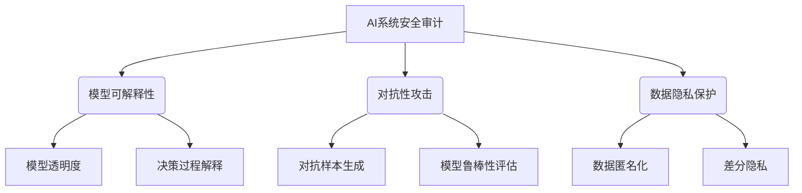
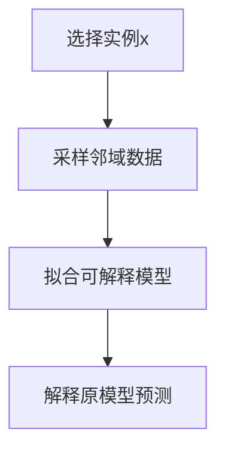
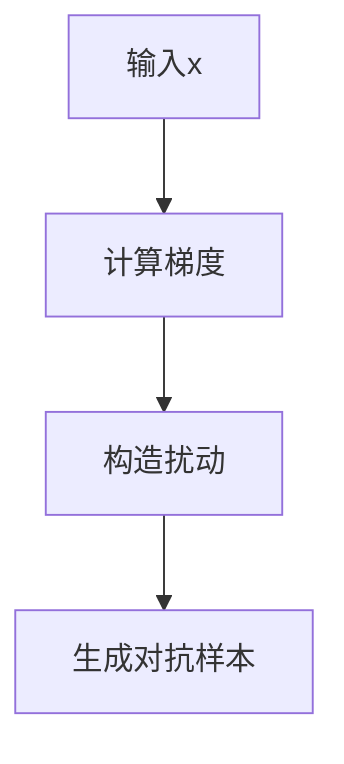
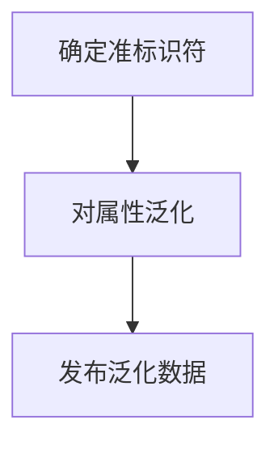

好的,我明白了您的要求。以下是题为《AI系统安全审计原理与代码实战案例讲解》的技术博客文章正文内容:

# AI系统安全审计原理与代码实战案例讲解

## 1. 背景介绍

### 1.1 问题的由来

随着人工智能(AI)系统在各行业的广泛应用,确保这些系统的安全性和可靠性变得至关重要。AI系统的错误或被恶意利用可能会导致严重的后果,如数据泄露、财务损失甚至生命安全问题。因此,对AI系统进行全面的安全审计以识别和修复潜在的漏洞和风险是必不可少的。

### 1.2 研究现状  

目前,AI系统安全审计领域正在快速发展。研究人员和从业者正在探索各种技术和方法来评估AI系统的安全性,包括模型可解释性、对抗性攻击测试、数据隐私保护等。然而,由于AI系统的复杂性和多样性,现有的安全审计方法往往存在局限性,无法全面覆盖所有潜在的安全风险。

### 1.3 研究意义

本文旨在提供一种全面的AI系统安全审计框架,涵盖了从理论原理到实践案例的多个方面。通过深入探讨核心概念、算法原理、数学模型以及代码实现细节,读者可以全面了解AI系统安全审计的关键技术,并掌握实际应用所需的知识和技能。

### 1.4 本文结构

本文共分为9个部分:背景介绍、核心概念与联系、核心算法原理与具体操作步骤、数学模型和公式详细讲解与举例说明、项目实践代码实例和详细解释说明、实际应用场景、工具和资源推荐、总结未来发展趋势与挑战,以及附录常见问题与解答。

## 2. 核心概念与联系

AI系统安全审计涉及多个核心概念,包括模型可解释性、对抗性攻击、数据隐私保护等。这些概念相互关联,构成了一个完整的安全审计框架。

模型可解释性关注AI模型的透明度和决策过程的解释能力,有助于发现潜在的偏差和不公平性。对抗性攻击则通过生成对抗样本来评估模型的鲁棒性,识别模型在对抗环境下的弱点。数据隐私保护则确保训练数据的安全性,防止敏感信息泄露。

这些核心概念相互依赖、相辅相成,共同构建了一个全面的AI系统安全审计框架。只有将它们综合考虑,才能够全面评估AI系统的安全性,并采取相应的防护措施。

## 3. 核心算法原理与具体操作步骤

### 3.1 算法原理概述

AI系统安全审计中的核心算法主要包括以下几个方面:

1. **模型可解释性算法**: 这些算法旨在提高AI模型的透明度和解释能力,常见的算法包括LIME、SHAP等。

2. **对抗样本生成算法**: 通过添加微小的扰动来生成对抗样本,评估模型在对抗环境下的鲁棒性,常见的算法包括FGSM、PGD等。

3. **数据隐私保护算法**: 通过数据匿名化、差分隐私等技术来保护训练数据的隐私,常见的算法包括K-anonymity、DP-SGD等。

这些算法的原理和具体实现步骤将在接下来的章节中详细阐述。

### 3.2 算法步骤详解

#### 3.2.1 模型可解释性算法

以LIME算法为例,其主要步骤如下:

1. 选择一个需要解释的实例x
2. 在x的邻域内采样一组数据实例
3. 使用一个简单的可解释模型(如线性回归)拟合这些数据实例及其对应的预测值
4. 使用拟合的可解释模型来解释原始模型在x处的预测结果

#### 3.2.2 对抗样本生成算法

以FGSM算法为例,其主要步骤如下:

1. 计算模型在输入x处的损失函数梯度$\nabla_xJ(x,y)$
2. 构造对抗扰动$\eta = \epsilon\text{sign}(\nabla_xJ(x,y))$
3. 生成对抗样本$x' = x + \eta$

$$x' = x + \epsilon\text{sign}(\nabla_xJ(x,y))$$

其中$\epsilon$控制扰动的大小。

#### 3.2.3 数据隐私保护算法

以K-anonymity算法为例,其主要步骤如下:

1. 确定数据集中的准标识符(quasi-identifier)属性
2. 对准标识符属性进行泛化,使得每个等价组中至少有K个记录
3. 对泛化后的数据集进行发布或分析

### 3.3 算法优缺点

每种算法都有其优缺点,需要根据具体场景进行权衡选择。

- **模型可解释性算法**:
  - 优点:提高模型透明度,有助于发现潜在偏差和不公平性
  - 缺点:解释结果可能不够准确,存在近似性

- **对抗样本生成算法**:
  - 优点:能够有效评估模型在对抗环境下的鲁棒性
  - 缺点:生成的对抗样本可能不够实际,存在可迁移性问题

- **数据隐私保护算法**:  
  - 优点:能够有效保护训练数据的隐私
  - 缺点:可能会导致模型性能下降,需要权衡隐私保护和模型精度

### 3.4 算法应用领域

这些算法在以下领域有广泛的应用:

- 金融领域:审计信贷评分模型、交易监控系统等
- 医疗领域:审计疾病诊断模型、药物开发模型等
- 自动驾驶领域:审计车辆感知模型、决策规划模型等
- 安全领域:审计入侵检测模型、恶意软件检测模型等

## 4. 数学模型和公式详细讲解与举例说明  

### 4.1 数学模型构建

在AI系统安全审计中,我们需要构建数学模型来量化和评估系统的安全性。以下是一个常见的模型框架:

设$f$为需要审计的AI模型,$x$为输入,$y$为真实标签。我们定义以下量:

- 模型可解释性得分$E(f,x)$:衡量模型在输入$x$处的解释能力
- 对抗鲁棒性得分$R(f,x,y)$:衡量模型在输入$x$和标签$y$处的对抗鲁棒性
- 隐私泄露风险$P(f,D)$:衡量模型$f$在训练数据$D$上的隐私泄露风险

则AI系统的整体安全性得分可以定义为:

$$S(f,x,y,D) = \alpha E(f,x) + \beta R(f,x,y) - \gamma P(f,D)$$

其中$\alpha,\beta,\gamma$为权重系数,根据具体场景进行调整。

该模型将模型可解释性、对抗鲁棒性和隐私保护综合考虑,能够全面评估AI系统的安全性。接下来我们将详细讲解每一项的计算方式。

### 4.2 公式推导过程

#### 4.2.1 模型可解释性得分$E(f,x)$

我们采用LIME算法来计算模型可解释性得分。LIME算法的核心思想是在输入$x$的邻域内拟合一个可解释的模型$g$,使其尽可能逼近原模型$f$在该邻域内的行为。

具体来说,我们定义一个损失函数:

$$L(f,g,\pi_x) = \sum_{\tilde{x}}\pi_x(\tilde{x})(f(\tilde{x}) - g(\tilde{x}))^2$$

其中$\pi_x$是以$x$为中心的一个领域分布。我们希望找到一个$g$使得$L$最小化,即:

$$g = \arg\min_g L(f,g,\pi_x)$$

经过一系列推导,我们可以得到$g$的闭式解:

$$g = \arg\min_g \sum_i(f(x_i) - g(x_i))^2\pi_x(x_i)$$

其中$x_i$是在$x$邻域内采样得到的实例。

我们将$g$作为$f$在$x$处的解释模型,并定义模型可解释性得分为:

$$E(f,x) = 1 - L(f,g,\pi_x)$$

#### 4.2.2 对抗鲁棒性得分$R(f,x,y)$

我们采用FGSM算法来生成对抗样本,并基于此定义对抗鲁棒性得分。

回顾FGSM算法,对抗样本$x'$的生成公式为:

$$x' = x + \epsilon\text{sign}(\nabla_xJ(x,y))$$

其中$J$为模型的损失函数。

我们定义对抗鲁棒性得分为:

$$R(f,x,y) = \begin{cases}
1, & \text{if } f(x') = y\
0, & \text{otherwise}
\end{cases}$$

即如果模型在对抗样本$x'$上的预测仍然正确,则对抗鲁棒性得分为1,否则为0。

#### 4.2.3 隐私泄露风险$P(f,D)$

我们采用差分隐私(Differential Privacy)的概念来量化隐私泄露风险。差分隐私保证了即使将一条记录加入或移出训练数据集,模型的输出分布也只会发生很小的变化。

形式上,我们定义$\epsilon$-差分隐私如下:

$$\Pr[M(D) \in S] \leq e^\epsilon \Pr[M(D') \in S]$$

其中$M$为机器学习算法,$D$和$D'$是相差一条记录的两个数据集,$S$为$M$的一个可能输出集合。

$\epsilon$越小,隐私保护程度越高。我们将隐私泄露风险定义为:

$$P(f,D) = \epsilon$$

其中$\epsilon$可以通过机器学习算法的隐私分析模块获得。

### 4.3 案例分析与讲解

为了更好地理解上述数学模型和公式,我们将通过一个图像分类案例进行分析和讲解。

假设我们有一个图像分类模型$f$,用于识别猫和狗的图像。我们将计算该模型在一个特定的猫图像$x$上的安全性得分$S(f,x,y,D)$。

#### 4.3.1 计算模型可解释性得分$E(f,x)$

我们使用LIME算法来计算$E(f,x)$。具体步骤如下:

1. 在$x$的邻域内采样一组图像$\{x_i\}$
2. 获取这些图像对应的模型预测值$\{f(x_i)\}$
3. 使用线性回归拟合一个可解释模型$g$,使得$\sum_i(f(x_i) - g(x_i))^2\pi_x(x_i)$最小化
4. 计算$E(f,x) = 1 - L(f,g,\pi_x)$

假设我们得到$E(f,x) = 0.85$,表示模型在该猫图像上的可解释性较高。

#### 4.3.2 计算对抗鲁棒性得分$R(f,x,y)$

我们使用FGSM算法生成对抗样本$x'$:

1. 计算$\nabla_xJ(x,y)$,即