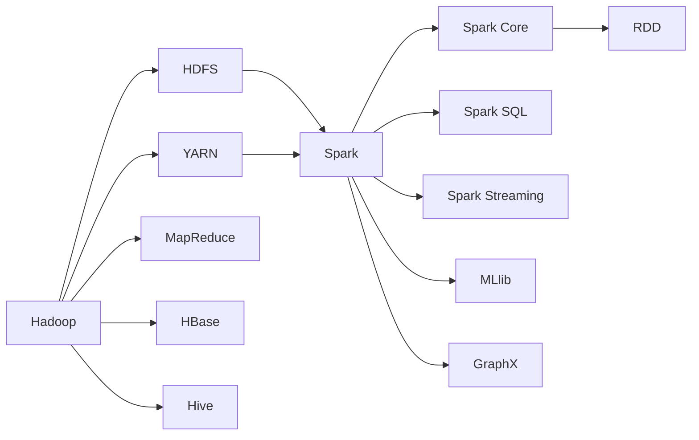
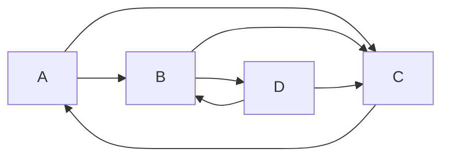

# 《Spark与Hadoop生态系统》

关键词：Spark、Hadoop、大数据、分布式计算、生态系统

## 1. 背景介绍
### 1.1  问题的由来
随着数据量的爆炸性增长，传统的数据处理方式已经无法满足实时计算和海量数据分析的需求。为了应对大数据时代的挑战，Hadoop应运而生，成为了大数据处理的事实标准。然而，Hadoop在实时计算和迭代计算方面存在不足，Spark作为Hadoop生态系统的重要补充，为大数据处理提供了更加高效、灵活的解决方案。

### 1.2  研究现状
目前，Spark已经成为大数据领域最活跃的开源项目之一，被广泛应用于各行各业。许多互联网巨头如阿里巴巴、腾讯、百度等都在生产环境中大规模使用Spark。学术界对Spark的研究也非常活跃，涌现出许多优化Spark性能、扩展Spark功能的研究成果。

### 1.3  研究意义
深入研究Spark与Hadoop生态系统的结合，对于构建高效、灵活、易用的大数据处理平台具有重要意义。通过系统性地分析Spark的核心原理、数学模型、应用实践，可以帮助开发者更好地理解和应用Spark，从而最大限度发挥Spark的性能优势，实现高效的大数据处理。

### 1.4  本文结构
本文将从以下几个方面深入探讨Spark与Hadoop生态系统：
- 核心概念与联系
- 核心算法原理与具体操作步骤
- 数学模型和公式详细讲解与举例说明
- 项目实践：代码实例和详细解释说明 
- 实际应用场景
- 工具和资源推荐
- 总结：未来发展趋势与挑战
- 附录：常见问题与解答

## 2. 核心概念与联系
Spark和Hadoop都是大数据处理领域的核心框架，它们既有联系又有区别。

Hadoop最核心的设计思想是MapReduce，即通过Map和Reduce两个操作来实现分布式计算。HDFS作为Hadoop的分布式文件系统，为MapReduce提供了数据存储支持。HBase、Hive等组件构成了Hadoop丰富的生态系统。

Spark的核心是RDD（Resilient Distributed Dataset），即弹性分布式数据集。RDD是Spark的基本计算单元，提供了一种高度受限的共享内存模型。Spark基于RDD提供了丰富的算子操作，如map、reduce、filter等，并支持DAG（有向无环图）的任务调度。

Spark可以与Hadoop无缝集成，既可以读写HDFS上的数据，也可以利用YARN实现资源管理和任务调度。Spark Streaming、Spark SQL、MLlib、GraphX等组件极大地丰富了Spark生态系统，使得Spark可以支持流处理、SQL查询、机器学习、图计算等多种场景。

下图展示了Spark与Hadoop生态系统的关系：



## 3. 核心算法原理 & 具体操作步骤 
### 3.1  算法原理概述
Spark的核心是RDD，RDD是一个不可变、可分区、里面的元素可并行计算的集合。RDD之间的转换是函数式的，通过一系列的算子操作来完成。常见的算子包括map、filter、reduce、join等。

Spark的任务调度采用了DAG（有向无环图）模型。Spark应用程序会被转换为DAG，DAG中的每一个节点代表一个RDD及其算子操作，边代表RDD之间的依赖关系。Spark根据DAG来生成具体的任务执行计划，并在集群中分发和执行任务。

### 3.2  算法步骤详解
以WordCount为例，详细讲解Spark的算法步骤：

1. 读取输入数据，创建初始RDD。可以从HDFS、本地文件、数据库等创建RDD。
   
   ```scala
   val lines = sc.textFile("hdfs://input/file.txt")
   ```

2. 对RDD应用算子操作，转换得到新的RDD。常见的转换算子包括：
   - map：对RDD中的每个元素应用一个函数，返回新的RDD。
   - filter：对RDD中的每个元素应用一个函数，返回满足条件的元素组成的新RDD。
   - flatMap：对RDD中的每个元素应用一个函数，将结果压平后返回新的RDD。
   - reduceByKey：对RDD中的每个key对应的值进行聚合。
   
   ```scala
   val words = lines.flatMap(_.split(" "))
   val pairs = words.map(word => (word, 1))
   val wordCounts = pairs.reduceByKey(_ + _)
   ```

3. 应用行动算子，触发任务执行并返回结果给Driver程序。常见的行动算子包括：
   - collect：将RDD中的所有元素返回给Driver程序。
   - count：返回RDD中的元素个数。
   - first：返回RDD中的第一个元素。
   - take：返回RDD中的前几个元素。
   - reduce：对RDD中的所有元素进行聚合。

   ```scala
   val result = wordCounts.collect()
   ```

### 3.3  算法优缺点
Spark相对于Hadoop MapReduce的优点包括：

- 基于内存计算，中间结果可以缓存在内存中，避免了不必要的磁盘IO，计算速度更快。
- 支持DAG的任务调度，可以更好地优化任务执行。
- 提供了丰富的算子，编程模型更灵活，适用于更多的场景。
- 与Hadoop生态系统良好集成，可以方便地访问HDFS等组件。

Spark的缺点包括：

- 对内存的要求较高，需要更多的内存资源。
- 调优较为复杂，需要对Spark原理有深入理解。
- 面向批处理，对实时性要求高的场景支持不够好。

### 3.4  算法应用领域
Spark在许多领域都有广泛应用，如：

- 日志分析：分析海量日志数据，挖掘用户行为模式。
- 推荐系统：基于用户历史行为数据，实现个性化推荐。
- 金融风控：分析交易数据，识别欺诈行为。
- 社交网络分析：分析社交网络结构和用户关系。

## 4. 数学模型和公式 & 详细讲解 & 举例说明
### 4.1  数学模型构建
Spark的数学模型可以用一个三元组$(D, T, R)$来表示：

- $D$：RDD，即数据集。RDD是Spark的基本计算单元。
- $T$：算子操作，即对RDD进行的转换。
- $R$：DAG，即RDD之间的依赖关系图。

假设有两个RDD $D_1$ 和 $D_2$，通过算子操作 $T_1$ 和 $T_2$ 生成新的RDD：

$$
D_2 = T_1(D_1) \
D_3 = T_2(D_2)
$$

则RDD之间的依赖关系可以表示为：

$$
D_1 \rightarrow^{T_1} D_2 \rightarrow^{T_2} D_3
$$

### 4.2  公式推导过程
以PageRank算法为例，推导Spark实现的数学公式。

PageRank算法的目的是计算网页的重要性得分。假设一个网页的重要性由所有指向它的网页的重要性决定。如果一个网页被很多其他重要网页指向，那么它也应该是重要的。

设网页$i$的重要性得分为$r_i$，网页$i$指向网页$j$的权重为$w_{ij}$，则网页$j$的得分可以表示为：

$$
r_j = \sum_{i \rightarrow j} w_{ij} r_i
$$

其中，$i \rightarrow j$表示所有指向网页$j$的网页$i$。

考虑到一个网页可能没有出链，引入阻尼因子$\alpha$，则公式变为：

$$
r_j = \alpha \sum_{i \rightarrow j} w_{ij} r_i + (1 - \alpha) \frac{1}{N}
$$

其中，$N$为网页总数。

将所有网页的得分组成向量$\vec{r}$，则PageRank算法可以表示为：

$$
\vec{r} = \alpha W^T \vec{r} + (1 - \alpha) \frac{1}{N} \vec{1}
$$

其中，$W$为链接矩阵，$W_{ij} = w_{ij}$，$\vec{1}$为全1向量。

### 4.3  案例分析与讲解
下面以一个简单的例子来说明PageRank算法在Spark中的实现。

假设有4个网页A、B、C、D，它们之间的链接关系如下：



初始时，每个网页的得分为1/4=0.25。设阻尼因子为0.8，则第一轮迭代后，各网页的得分为：

$$
\begin{aligned}
r_A &= 0.8 \times 0.25 + 0.2 \times 0.25 = 0.25 \
r_B &= 0.8 \times (0.25 + 0.25) + 0.2 \times 0.25 = 0.45 \
r_C &= 0.8 \times (0.25 + 0.25 + 0.25) + 0.2 \times 0.25 = 0.65 \
r_D &= 0.8 \times 0 + 0.2 \times 0.25 = 0.05
\end{aligned}
$$

在Spark中，可以使用如下代码实现PageRank算法：

```scala
val links = sc.parallelize(Seq(
  ("A", Seq("B", "C")),
  ("B", Seq("C", "D")),
  ("C", Seq("A")), 
  ("D", Seq("B", "C"))
))

val ranks = links.mapValues(_ => 1.0)

for (i <- 1 to 10) {
  val contributions = links.join(ranks).flatMap {
    case (page, (links, rank)) =>
      links.map(dest => (dest, rank / links.size))
  }
  
  val newRanks = contributions.reduceByKey(_ + _).mapValues(0.2 + 0.8 * _)
  
  ranks = newRanks
}

val result = ranks.collect()
```

### 4.4  常见问题解答
**Q**: Spark能否实现图算法？

**A**: 可以，Spark提供了GraphX库，支持图计算。GraphX基于RDD抽象，提供了一种弹性分布式属性图，可以方便地实现PageRank、连通性分析等图算法。

**Q**: Spark如何实现机器学习？

**A**: Spark提供了MLlib库，支持常见的机器学习算法，如分类、回归、聚类、协同过滤等。MLlib同样基于RDD抽象，可以方便地在海量数据上训练机器学习模型。此外，Spark还提供了基于DataFrame的机器学习API，使得机器学习的应用更加简单。

## 5. 项目实践：代码实例和详细解释说明
### 5.1  开发环境搭建
Spark应用程序可以使用Scala、Java、Python等多种语言开发。这里以Scala为例，介绍Spark开发环境的搭建。

首先需要安装JDK和Scala，然后下载Spark安装包并解压：

```bash
wget https://archive.apache.org/dist/spark/spark-3.0.0/spark-3.0.0-bin-hadoop2.7.tgz
tar -xf spark-3.0.0-bin-hadoop2.7.tgz
```

设置环境变量：

```bash
export SPARK_HOME=/path/to/spark-3.0.0-bin-hadoop2.7
export PATH=$SPARK_HOME/bin:$PATH
```

### 5.2  源代码详细实现
以词频统计为例，给出Spark实现的完整代码：

```scala
import org.apache.spark.SparkContext
import org.apache.spark.SparkConf

object WordCount {
  def main(args: Array[String]) {
    val conf = new SparkConf().setAppName("WordCount")
    val sc = new SparkContext(conf)
    
    val lines = sc.textFile("hdfs://input/file.txt")
    val words = lines.flatMap(_.split(" "))
    val pairs = words.map(word => (word, 1))
    val wordCounts = pairs.reduceByKey(_ + _)
    
    wordCounts.saveAsTextFile("hdfs://output/wordcount")