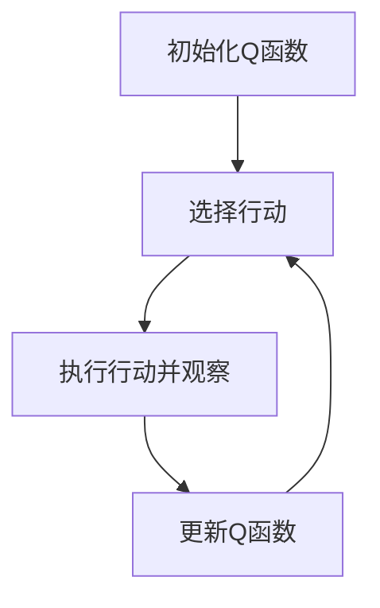

以下是根据您提供的要求和框架撰写的技术博客文章正文内容：

# 一切皆是映射：AI Q-learning在工业控制中的实践

## 1. 背景介绍

### 1.1 问题的由来

在现代工业生产中,控制系统扮演着至关重要的角色。它们负责监控和调节各种复杂的生产流程,以确保产品质量、效率和安全性。然而,传统的控制系统往往依赖于预先编程的规则和算法,这使得它们在面对不断变化的工况和意外情况时,缺乏灵活性和适应性。

### 1.2 研究现状

近年来,人工智能(AI)技术的飞速发展为工业控制系统带来了新的契机。其中,强化学习(Reinforcement Learning)作为一种基于奖惩机制的机器学习范式,展现出了巨大的潜力。Q-learning作为强化学习的一种经典算法,已经在多个领域取得了令人瞩目的成就,如游戏AI、机器人控制等。

### 1.3 研究意义

将Q-learning应用于工业控制系统,可以赋予控制器在线学习和自适应的能力。控制器将不再被限制在固定的规则集中,而是能够根据实时反馈,动态调整控制策略,从而更好地应对复杂多变的生产环境。这不仅有助于提高生产效率和产品质量,还能降低能耗并减少意外事故的发生。

### 1.4 本文结构

本文将首先介绍Q-learning的核心概念和算法原理,并详细阐述其在工业控制中的应用。接下来,我们将构建相应的数学模型,推导关键公式,并通过案例分析加深理解。然后,我们将实践一个基于Q-learning的工业控制项目,包括环境搭建、代码实现、结果分析等。最后,我们将探讨Q-learning在工业控制领域的实际应用场景、未来发展趋势和面临的挑战。

## 2. 核心概念与联系

Q-learning是一种基于时间差分(Temporal Difference)的强化学习算法,它允许智能体(Agent)通过与环境的交互,学习如何在给定状态下采取最优行动,以最大化预期的长期回报。

Q-learning的核心思想是维护一个Q函数(Q-function),用于估计在某个状态下采取某个行动所能获得的预期长期回报。通过不断更新Q函数,智能体可以逐步改善其决策策略,最终收敛到最优策略。

Q-learning的优势在于,它不需要事先了解环境的转移概率模型,只需要通过与环境交互获取反馈,就可以进行在线学习。这使得Q-learning特别适用于复杂的、难以建模的环境,如工业控制系统。

在工业控制中,我们可以将生产流程视为一个马尔可夫决策过程(Markov Decision Process,MDP),其中每个状态对应生产线的当前状态,而行动则对应控制器可采取的调节操作。通过Q-learning,控制器可以学习在各种状态下采取何种行动,以最大化生产效率、质量等长期目标。

## 3. 核心算法原理与具体操作步骤

### 3.1 算法原理概述

Q-learning算法的核心思想是通过时间差分更新,不断修正Q函数的估计值,使其逐渐收敛到最优Q函数。具体来说,在每个时间步,智能体根据当前状态选择一个行动,并观察到下一个状态和即时奖励。然后,算法会根据这些信息更新Q函数,以减小其与真实Q值之间的差距。

更新公式如下:

$$Q(s_t, a_t) \leftarrow Q(s_t, a_t) + \alpha \left[ r_t + \gamma \max_a Q(s_{t+1}, a) - Q(s_t, a_t) \right]$$

其中:
- $s_t$和$a_t$分别表示当前状态和行动
- $r_t$是立即奖励
- $\alpha$是学习率,控制更新幅度
- $\gamma$是折扣因子,平衡即时和长期回报
- $\max_a Q(s_{t+1}, a)$是下一状态下所有可能行动的最大Q值

通过不断应用这一更新规则,Q函数将逐渐收敛,最终得到最优策略。

### 3.2 算法步骤详解

1. **初始化**:初始化Q函数,通常将所有状态-行动对的Q值设置为0或一个较小的常数。
2. **选择行动**:根据当前状态,选择一个行动。探索(Exploration)和利用(Exploitation)之间需要平衡,通常采用$\epsilon$-贪婪策略。
3. **执行行动并观察**:执行所选行动,观察到下一个状态和即时奖励。
4. **更新Q函数**:根据上述更新公式,修正Q函数中相应的状态-行动对的Q值估计。
5. **重复步骤2-4**:重复以上过程,直到算法收敛或达到预设的终止条件。

在实践中,我们通常采用一些技巧来加速Q-learning的收敛,如经验回放(Experience Replay)、目标网络(Target Network)等。



### 3.3 算法优缺点

**优点**:

1. 无需事先了解环境模型,可在线学习
2. 收敛性证明,保证最终收敛到最优策略
3. 算法简单,易于实现和理解

**缺点**:

1. 收敛速度较慢,需要大量样本
2. 维数灾难问题,状态-行动空间过大时性能下降
3. 对于连续状态和行动空间,需要进行离散化处理

### 3.4 算法应用领域

除了工业控制系统外,Q-learning还广泛应用于:

- 机器人控制
- 自动驾驶决策
- 网络路由优化
- 资源调度优化
- 游戏AI等

## 4. 数学模型和公式详细讲解与举例说明

### 4.1 数学模型构建

在Q-learning中,我们将工业控制问题建模为一个马尔可夫决策过程(MDP)。MDP可以用一个元组$(S, A, P, R, \gamma)$来表示,其中:

- $S$是状态空间集合
- $A$是行动空间集合
- $P(s' | s, a)$是状态转移概率,表示在状态$s$下执行行动$a$后,转移到状态$s'$的概率
- $R(s, a, s')$是奖励函数,表示在状态$s$下执行行动$a$并转移到状态$s'$时获得的即时奖励
- $\gamma \in [0, 1)$是折扣因子,用于平衡即时和长期回报

在工业控制中,状态$s$可以是生产线的各种参数值的组合,如温度、压力、流量等;行动$a$则对应控制器可以采取的各种调节操作。

目标是找到一个策略$\pi: S \rightarrow A$,使得在遵循该策略时,预期的长期折扣回报最大:

$$\max_\pi \mathbb{E}\left[ \sum_{t=0}^\infty \gamma^t R(s_t, a_t, s_{t+1}) | \pi \right]$$

其中$s_t$和$a_t$分别表示第$t$个时间步的状态和行动。

### 4.2 公式推导过程

Q-learning算法的核心是通过时间差分更新,不断修正Q函数的估计值。我们定义最优Q函数$Q^*(s, a)$为在状态$s$下执行行动$a$后,按最优策略进行的预期长期回报:

$$Q^*(s, a) = \mathbb{E}\left[ \sum_{k=0}^\infty \gamma^k r_{t+k+1} | s_t = s, a_t = a, \pi^* \right]$$

其中$\pi^*$是最优策略。

我们可以将$Q^*(s, a)$分解为两部分:

$$Q^*(s, a) = R(s, a, s') + \gamma \max_{a'} Q^*(s', a')$$

即立即奖励$R(s, a, s')$加上下一状态$s'$下按最优策略进行时的预期长期回报$\gamma \max_{a'} Q^*(s', a')$。

通过这一分解,我们得到了Q-learning的更新规则:

$$Q(s_t, a_t) \leftarrow Q(s_t, a_t) + \alpha \left[ r_t + \gamma \max_a Q(s_{t+1}, a) - Q(s_t, a_t) \right]$$

这一更新规则保证了Q函数在经过足够多次更新后,将收敛到最优Q函数$Q^*$。

### 4.3 案例分析与讲解

考虑一个简单的工业控制案例:一台加热炉,需要根据当前温度调节加热量,使温度维持在一个理想范围内。我们将问题建模为一个MDP:

- 状态$s$:当前温度,离散化为$\{0, 1, 2, \ldots, 20\}$
- 行动$a$:加热量,离散化为$\{-1, 0, 1\}$,分别表示降温、保持和升温
- 状态转移概率$P(s' | s, a)$:根据当前温度和加热量,确定转移到下一温度的概率
- 奖励函数$R(s, a, s')$:当前温度与理想温度的差距的负值,即$R(s, a, s') = -|s - 15|$

我们用Q-learning训练一个智能体,目标是学习一个最优策略,使温度维持在理想范围内。

通过大量训练样本,智能体逐步更新Q函数,最终学会了合理的控制策略:在温度过低时升温,过高时降温,在理想范围内则保持不变。

```python
# 简化的 Q-learning 伪代码
Q = defaultdict(lambda: 0)  # 初始化 Q 函数
for episode in range(num_episodes):
    state = env.reset()  # 重置环境
    while not done:
        action = epsilon_greedy(Q, state)  # 选择行动
        next_state, reward, done = env.step(action)  # 执行行动并观察
        Q[state, action] += alpha * (reward + gamma * max(Q[next_state].values()) - Q[state, action])  # 更新 Q 函数
        state = next_state
```

### 4.4 常见问题解答

**1. Q-learning是如何处理连续状态和行动空间的?**

对于连续空间,我们通常需要进行离散化或函数逼近。例如,可以使用深度神经网络来逼近Q函数,这就是深度Q网络(Deep Q-Network,DQN)的做法。

**2. 如何平衡探索和利用?**

一种常用的方法是$\epsilon$-贪婪策略,即以$\epsilon$的概率随机选择行动(探索),以$1-\epsilon$的概率选择当前Q值最大的行动(利用)。$\epsilon$通常会随着时间的推移而递减。

**3. 为什么需要折扣因子$\gamma$?**

折扣因子$\gamma$用于平衡即时和长期回报。如果$\gamma=0$,则只考虑即时奖励;如果$\gamma=1$,则所有未来奖励权重相同。通常取$\gamma$接近但小于1,这样可以确保回报序列收敛。

**4. Q-learning如何避免过拟合?**

可以采用经验回放(Experience Replay)和目标网络(Target Network)等技术来提高算法的稳定性和泛化能力,从而避免过拟合。

## 5. 项目实践:代码实例和详细解释说明

### 5.1 开发环境搭建

在本项目中,我们将使用Python编程语言和PyTorch深度学习框架来实现Q-learning算法。首先,我们需要安装必要的Python包:

```bash
pip install numpy matplotlib pygame torch
```

其中,NumPy用于数值计算,Matplotlib用于绘图,PyGame用于构建简单的游戏环境,PyTorch则是我们的深度学习框架。

### 5.2 源代码详细实现

我们将实现一个简单的游戏环境,智能体需要控制一个球从起点到达终点。环境如下所示:

```python
import pygame
import numpy as np

class GameEnv:
    def __init__(self):
        # 初始化游戏窗口
        pygame.init()
        self.window = pygame.display.set_mode((600, 400))
        pygame.display.set_caption("Q-Learning Game")

        # 定义游戏对象
        self.ball = pygame.Rect