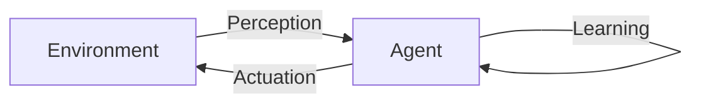

# AI Agent: AI的下一个风口 当前的研究难点与挑战

关键词：AI Agent、人工智能、强化学习、多智能体、知识表示、自主学习、可解释性、泛化能力、伦理道德

## 1. 背景介绍
### 1.1  问题的由来
人工智能(Artificial Intelligence, AI)技术的飞速发展,使得智能Agent(代理)系统成为了AI领域的研究热点。智能Agent是一种能够感知环境,并根据环境做出自主决策和行动的AI系统。它们在自动驾驶、智能助理、自动化运维等领域有广泛应用前景。然而,当前的智能Agent系统仍面临诸多技术挑战,亟需学术界和工业界的共同努力来突破。

### 1.2  研究现状
近年来,深度强化学习、多智能体协作、知识表示与推理等前沿技术的进展,极大地推动了智能Agent系统的发展。DeepMind的AlphaGo系统击败了人类顶尖围棋高手,展现了深度强化学习的强大能力。OpenAI Five在Dota2游戏中击败职业选手,证明了多智能体协作的可行性。而谷歌、微软等科技巨头也纷纷推出了自己的智能助理产品。

尽管取得了一定进展,但目前的智能Agent系统在可解释性、鲁棒性、泛化能力等方面仍存在不足。同时,如何赋予Agent更强的自主学习能力,建立Agent与人的情感连接,以及解决伦理道德问题,也是亟待研究的重要课题。

### 1.3  研究意义
智能Agent技术的突破,有望在智慧城市、智能制造、医疗健康、教育娱乐等领域带来变革性影响,极大提升社会生产效率和人类生活品质。同时,它也为认知科学、心理学等基础学科提供了新的研究视角。因此,智能Agent的研究具有重要的理论意义和应用价值。

### 1.4  本文结构
本文将围绕智能Agent技术展开深入探讨。第2节介绍智能Agent的核心概念及其相互联系。第3节重点阐述智能Agent的核心算法原理和具体实现步骤。第4节从数学角度对智能Agent的建模方法进行公式推导和案例分析。第5节通过代码实例,讲解如何实现一个智能Agent系统。第6节展望智能Agent技术的实际应用场景和未来前景。第7节推荐相关学习资源和开发工具。第8节对全文进行总结,并分析智能Agent所面临的机遇与挑战。

## 2. 核心概念与联系

智能Agent涉及一系列核心概念,包括:

- **感知(Perception)**: Agent通过传感器接收外界环境信息的过程。
- **决策(Decision Making)**: Agent根据感知信息和自身知识,进行推理和规划,做出行动决策的过程。
- **执行(Actuation)**: Agent根据决策结果,通过执行器对环境进行操作和交互的过程。
- **学习(Learning)**: Agent通过不断与环境交互,积累经验,优化自身决策模型的过程。
- **目标(Goal)**: Agent期望达成的状态或完成的任务,是其行为的驱动力。
- **环境(Environment)**: Agent所处的客观世界,提供感知信息并接受Agent的行为作用。

这些概念环环相扣,构成了智能Agent的核心闭环,如下图所示:



智能Agent通过感知接收环境信息,结合决策和学习能力做出行动决策,并通过执行器影响环境,最终达成目标。这一过程不断循环,使得Agent能够与环境进行持续的交互和适应。

## 3. 核心算法原理 & 具体操作步骤
### 3.1  算法原理概述
智能Agent的核心算法主要包括决策算法和学习算法两大类。

**决策算法**用于根据当前状态进行行动选择,代表方法有:

- 基于规则的推理
- 启发式搜索
- 马尔可夫决策过程(MDP)
- 部分可观察马尔可夫决策过程(POMDP)
- 蒙特卡洛树搜索(MCTS)

**学习算法**用于优化决策模型,提升Agent的环境适应能力,代表方法有:

- 监督学习(SL)
- 无监督学习(UL)
- 强化学习(RL)
- 迁移学习(TL)
- 元学习(Meta-Learning)

### 3.2  算法步骤详解
下面以强化学习中的Q-Learning算法为例,详细讲解其工作原理和实现步骤。

Q-Learning是一种值函数型的无模型强化学习算法,通过学习状态-动作值函数Q(s,a)来指导Agent做出最优决策。其核心思想是通过不断与环境交互,利用贝尔曼方程来更新Q值,最终收敛得到最优策略。

Q-Learning的具体步骤如下:

1. 初始化Q值表Q(s,a),对于所有状态s和动作a,令Q(s,a)=0。
2. 重复以下步骤,直到Q值收敛或达到训练次数上限:
   1) 根据当前状态s,采用ε-贪心策略选择动作a。即以ε的概率随机选择动作,否则选择Q值最大的动作。
   2) 执行动作a,得到奖励r和下一状态s'。
   3) 根据贝尔曼方程更新Q(s,a)的值:
      $$Q(s,a) \leftarrow Q(s,a) + \alpha [r + \gamma \max_{a'}Q(s',a') - Q(s,a)]$$
      其中,α为学习率,γ为折扣因子。
   4) 令s=s',开始下一轮迭代。
3. 返回最终的Q值表作为Agent的最优策略。

### 3.3  算法优缺点
Q-Learning算法的优点包括:

- 简单易实现,适用于离散状态和动作空间。
- 能够在无需环境模型的情况下,通过试错学习获得最优策略。
- 具备一定的探索能力,能够在一定程度上避免局部最优。

但Q-Learning也存在一些局限性:

- 难以处理连续状态和动作空间。
- 在状态和动作空间较大时,Q表难以存储和更新。
- 样本利用率低,学习效率较差。
- 难以迁移到新环境中。

### 3.4  算法应用领域
Q-Learning在机器人控制、自动驾驶、游戏AI等领域有广泛应用。例如,DeepMind的DQN算法通过将Q-Learning与深度神经网络相结合,实现了在Atari视频游戏中超越人类的表现。

## 4. 数学模型和公式 & 详细讲解 & 举例说明
### 4.1  数学模型构建
为了对智能Agent系统进行数学建模,我们通常采用马尔可夫决策过程(MDP)框架。MDP由以下元素组成:

- 状态空间 $\mathcal{S}$: Agent所处环境的有限状态集合。
- 动作空间 $\mathcal{A}$: Agent可执行的有限动作集合。
- 状态转移概率 $\mathcal{P}$: 在状态s执行动作a后,转移到状态s'的概率,即$\mathcal{P}(s'|s,a)$。
- 奖励函数 $\mathcal{R}$: 在状态s执行动作a后,环境返回的即时奖励,即$\mathcal{R}(s,a)$。
- 折扣因子 $\gamma$: 用于平衡即时奖励和未来奖励的权重,取值范围为[0,1]。

MDP的目标是寻找一个最优策略$\pi^*$,使得Agent能够获得最大化的期望累积奖励。形式化地,最优策略$\pi^*$满足贝尔曼最优方程:

$$V^*(s) = \max_{a \in \mathcal{A}} \left\{ \mathcal{R}(s,a) + \gamma \sum_{s' \in \mathcal{S}} \mathcal{P}(s'|s,a) V^*(s') \right\}, \forall s \in \mathcal{S}$$

其中,$V^*(s)$表示在状态s下采用最优策略能够获得的最大期望累积奖励。

### 4.2  公式推导过程
我们可以使用价值迭代(Value Iteration)算法求解上述贝尔曼最优方程,得到最优状态值函数$V^*(s)$。价值迭代的核心思想是通过迭代更新来逼近最优值函数。

定义第k轮迭代的状态值函数为$V_k(s)$,价值迭代的更新公式为:

$$V_{k+1}(s) = \max_{a \in \mathcal{A}} \left\{ \mathcal{R}(s,a) + \gamma \sum_{s' \in \mathcal{S}} \mathcal{P}(s'|s,a) V_k(s') \right\}, \forall s \in \mathcal{S}$$

重复更新$V_k(s)$,直至收敛,即可得到最优状态值函数:

$$\lim_{k\to\infty} V_k(s) = V^*(s), \forall s \in \mathcal{S}$$

进而,我们可以根据$V^*(s)$得到最优策略$\pi^*$:

$$\pi^*(s) = \arg\max_{a \in \mathcal{A}} \left\{ \mathcal{R}(s,a) + \gamma \sum_{s' \in \mathcal{S}} \mathcal{P}(s'|s,a) V^*(s') \right\}, \forall s \in \mathcal{S}$$

### 4.3  案例分析与讲解
下面我们以一个简单的网格世界环境为例,说明如何应用MDP模型和价值迭代算法求解最优策略。

考虑一个3x3的网格世界,Agent的目标是从起点出发,尽快到达终点。
- 状态空间$\mathcal{S}$: 网格中的9个位置,用坐标(x,y)表示,即$\mathcal{S}=\{(0,0),(0,1),...,(2,2)\}$。
- 动作空间$\mathcal{A}$: 上、下、左、右四个方向,即$\mathcal{A}=\{up, down, left, right\}$。
- 状态转移概率$\mathcal{P}$: 执行动作后,有80%的概率按预期方向移动,10%的概率按顺时针方向移动,10%的概率按逆时针方向移动。
- 奖励函数$\mathcal{R}$: 到达终点的奖励为+10,其余位置的奖励为-1。
- 折扣因子$\gamma$: 取值为0.9。

我们可以使用价值迭代算法,通过不断更新状态值函数$V_k(s)$,最终得到最优策略$\pi^*(s)$。例如,在位置(1,1)处,根据最优策略,Agent应该选择向右移动,以最快速度到达终点。

### 4.4  常见问题解答
**Q:** 如何处理连续状态和动作空间?

**A:** 对于连续状态和动作空间,我们可以采用函数逼近的方法,用参数化的函数(如神经网络)来表示值函数或策略函数。代表算法有DQN、DDPG、PPO等。

**Q:** 环境模型未知时如何进行规划决策?

**A:** 当环境模型未知时,我们可以使用无模型的强化学习算法,如Q-Learning、Sarsa等。它们通过试错与环境交互,在线学习值函数,无需事先知道状态转移概率和奖励函数。

**Q:** 如何提高强化学习算法的样本效率?

**A:** 为了提高样本效率,我们可以采用Experience Replay机制,将历史交互数据存入Replay Buffer,并通过随机采样回放的方式来训练模型。此外,我们还可以借助示范数据、环境模型等先验知识,引导和加速智能体的学习过程。

## 5. 项目实践：代码实例和详细解释说明
### 5.1  开发环境搭建
我们使用Python语言和PyTorch深度学习框架来实现一个简单的Q-Learning智能体。首先安装必要的依赖包:

```
pip install torch numpy matplotlib
```

### 5.2  源代码详细实现
下面给出Q-Learning智能体的核心代码实现:

```python
import torch
import numpy as np
import random

class QLearningAgent: