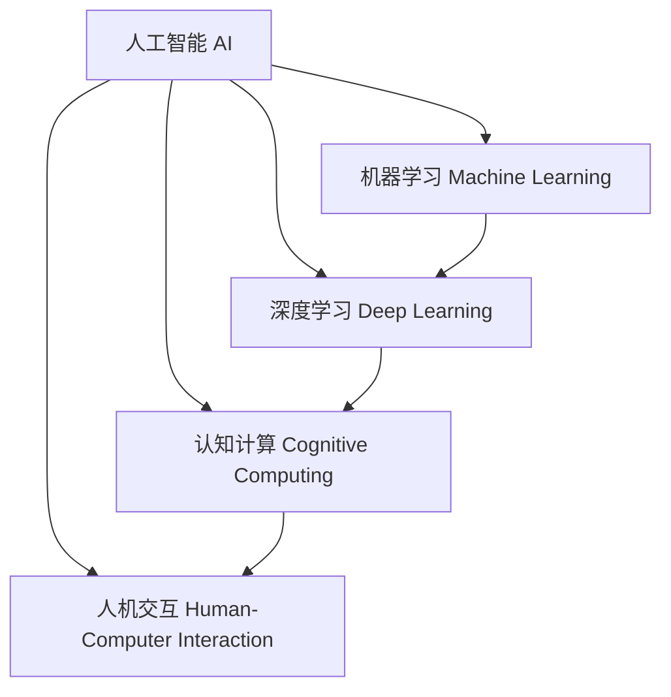

以下是标题为《AI人工智能 Agent：对人类思维方式的影响》的技术博客文章正文内容：

# AI人工智能 Agent：对人类思维方式的影响

## 1. 背景介绍

### 1.1 问题的由来

人工智能(AI)的发展一直是科技领域的热门话题。随着计算能力的不断提高和算法的日益复杂,AI系统在各个领域的应用越来越广泛。然而,AI的快速发展也引发了人们对其影响的担忧和质疑。其中,AI对人类思维方式的影响就是一个值得关注的问题。

### 1.2 研究现状

目前,已有一些研究探讨了AI对人类思维方式的影响。一些学者认为,AI系统的决策过程可能会影响人类的决策方式,使其更加依赖机器而忽视了自身的判断能力。另一些研究则表明,与AI系统的交互可能会改变人类的学习方式,使其更加注重数据和算法,而忽视了创造力和直觉。

### 1.3 研究意义

深入研究AI对人类思维方式的影响,有助于我们更好地理解人机交互的影响,并制定相应的策略来应对潜在的挑战。这不仅关乎个人层面的思维发展,也关系到社会层面的决策过程和价值观念的演变。

### 1.4 本文结构

本文将从以下几个方面探讨AI对人类思维方式的影响:

1. 核心概念与联系
2. 核心算法原理与具体操作步骤
3. 数学模型和公式详细讲解与举例说明
4. 项目实践:代码实例和详细解释说明
5. 实际应用场景
6. 工具和资源推荐
7. 总结:未来发展趋势与挑战
8. 附录:常见问题与解答

## 2. 核心概念与联系

在探讨AI对人类思维方式的影响之前,我们需要先了解一些核心概念及其相互关系。

### 2.1 人工智能(AI)

人工智能(Artificial Intelligence,AI)是一门致力于研究、开发能够模拟人类智能行为的理论、方法、技术及应用系统的学科。它涉及多个领域,包括计算机科学、数学、心理学、语言学等。

### 2.2 机器学习(Machine Learning)

机器学习是AI的一个重要分支,它赋予计算机系统在没有明确编程的情况下,通过数据自动分析获取模式的能力。常见的机器学习算法包括监督学习、非监督学习、强化学习等。

### 2.3 深度学习(Deep Learning)

深度学习是机器学习的一种技术,它基于对数据的模式进行表示学习。深度学习模型通过构建多层神经网络,对复杂的非线性关系进行建模,在图像识别、语音识别、自然语言处理等领域表现出色。

### 2.4 认知计算(Cognitive Computing)

认知计算是一种模拟人类认知过程的计算范式,旨在使计算机系统能够像人一样感知、推理和学习。它结合了AI、机器学习、自然语言处理等多种技术,以期实现更智能、更人性化的人机交互。

### 2.5 人机交互(Human-Computer Interaction)

人机交互是研究人与计算机之间交互过程的学科,旨在设计出更加自然、高效的人机交互方式。随着AI技术的发展,人机交互也在不断演进,逐步融入更多智能化元素。

上述概念相互关联、相辅相成,共同推动着AI技术的发展。它们不仅影响着计算机系统的设计和实现,也必将对人类的思维方式产生深远影响。

## 3. 核心算法原理 & 具体操作步骤

在探讨AI对人类思维方式的影响之前,我们需要先了解一些核心算法的原理和具体操作步骤。

### 3.1 算法原理概述

#### 3.1.1 监督学习

监督学习是机器学习中最常见的一种范式,它通过学习已标记的训练数据,建立输入和输出之间的映射关系,从而对新的输入数据进行预测或分类。常见的监督学习算法包括线性回归、逻辑回归、决策树、支持向量机等。

#### 3.1.2 非监督学习

非监督学习则不需要事先标记的训练数据,它通过对数据的内在结构和模式进行探索,实现数据的聚类、降维或者关联规则挖掘等任务。常见的非监督学习算法包括K-Means聚类、主成分分析(PCA)、关联规则挖掘等。

#### 3.1.3 强化学习

强化学习是一种基于奖惩机制的学习范式,它通过与环境的交互,不断尝试不同的行为策略,并根据获得的奖惩信号调整策略,最终达到最优化目标。强化学习广泛应用于游戏AI、机器人控制等领域。

#### 3.1.4 深度学习

深度学习则是基于神经网络的一种机器学习技术,它通过构建多层神经元网络,对输入数据进行特征提取和模式识别。常见的深度学习模型包括卷积神经网络(CNN)、递归神经网络(RNN)、生成对抗网络(GAN)等。

### 3.2 算法步骤详解

以下我们将以监督学习中的线性回归算法为例,详细介绍其具体操作步骤。

1. **数据预处理**:首先需要对原始数据进行清洗和标准化,处理缺失值、异常值等,并将数据拆分为训练集和测试集。

2. **构建模型**:线性回归假设输入变量 $x$ 和输出变量 $y$ 之间存在线性关系,即 $y = wx + b$,其中 $w$ 为权重, $b$ 为偏置。我们需要通过训练数据来学习 $w$ 和 $b$ 的值。

3. **定义损失函数**:为了评估模型的预测效果,我们需要定义一个损失函数,常用的是均方误差(MSE): $\text{MSE} = \frac{1}{n}\sum_{i=1}^{n}(y_i - \hat{y}_i)^2$,其中 $y_i$ 为真实值, $\hat{y}_i$ 为预测值。

4. **优化算法**:我们需要使用优化算法(如梯度下降)来最小化损失函数,从而找到最优的 $w$ 和 $b$ 值。梯度下降的更新规则为:

$$
\begin{aligned}
w &\leftarrow w - \alpha \frac{\partial \text{MSE}}{\partial w} \
b &\leftarrow b - \alpha \frac{\partial \text{MSE}}{\partial b}
\end{aligned}
$$

其中 $\alpha$ 为学习率,决定了每次更新的步长。

5. **模型评估**:在测试集上评估模型的性能,常用的指标有均方根误差(RMSE)、决定系数 $R^2$ 等。

6. **模型调优**:根据评估结果,可以调整模型的超参数(如学习率、正则化系数等)或特征工程,以进一步提高模型性能。

7. **模型部署**:将训练好的模型部署到实际的应用系统中,用于新数据的预测或决策。

### 3.3 算法优缺点

线性回归算法的优点是简单易懂、计算高效,但也存在一些局限性:

- 优点:
  - 模型简单,可解释性强
  - 训练速度快,计算高效
  - 对于线性问题,效果较好

- 缺点:
  - 对于非线性问题,效果较差
  - 对异常值敏感
  - 需要进行特征工程和数据预处理

### 3.4 算法应用领域

线性回归算法广泛应用于以下领域:

- 金融:股票价格预测、风险评估
- 制造业:产品质量控制、工艺优化
- 医疗:疾病风险预测、药物剂量调整
- 营销:销售预测、广告效果评估
- 气象:温度、降水量预测
- ...

## 4. 数学模型和公式 & 详细讲解 & 举例说明

在上一节中,我们已经介绍了线性回归算法的原理和步骤,接下来我们将详细讲解其中的数学模型和公式。

### 4.1 数学模型构建

线性回归的数学模型假设输入变量 $\boldsymbol{x} = (x_1, x_2, \ldots, x_n)$ 和输出变量 $y$ 之间存在线性关系,即:

$$y = w_1x_1 + w_2x_2 + \ldots + w_nx_n + b$$

其中, $w_1, w_2, \ldots, w_n$ 为各个特征的权重系数, $b$ 为偏置项。我们可以用向量形式更紧凑地表示为:

$$y = \boldsymbol{w}^T\boldsymbol{x} + b$$

对于给定的训练数据集 $\mathcal{D} = \{(\boldsymbol{x}^{(i)}, y^{(i)})\}_{i=1}^{m}$,我们的目标是找到最优的 $\boldsymbol{w}$ 和 $b$,使得模型在训练数据上的预测值 $\hat{y}^{(i)} = \boldsymbol{w}^T\boldsymbol{x}^{(i)} + b$ 尽可能接近真实值 $y^{(i)}$。

### 4.2 公式推导过程

为了找到最优的 $\boldsymbol{w}$ 和 $b$,我们需要定义一个损失函数(Loss Function)来衡量预测值与真实值之间的差异。常用的损失函数是均方误差(Mean Squared Error, MSE):

$$\text{MSE}(\boldsymbol{w}, b) = \frac{1}{m}\sum_{i=1}^{m}(y^{(i)} - \hat{y}^{(i)})^2 = \frac{1}{m}\sum_{i=1}^{m}(y^{(i)} - \boldsymbol{w}^T\boldsymbol{x}^{(i)} - b)^2$$

我们的目标是最小化这个损失函数,即找到 $\boldsymbol{w}^*$ 和 $b^*$ 使得:

$$\boldsymbol{w}^*, b^* = \arg\min_{\boldsymbol{w}, b} \text{MSE}(\boldsymbol{w}, b)$$

为了求解这个优化问题,我们可以使用梯度下降(Gradient Descent)算法。具体步骤如下:

1. 初始化 $\boldsymbol{w}$ 和 $b$ 为随机值
2. 计算损失函数 $\text{MSE}(\boldsymbol{w}, b)$ 对 $\boldsymbol{w}$ 和 $b$ 的偏导数:

$$
\begin{aligned}
\frac{\partial \text{MSE}}{\partial w_j} &= \frac{2}{m}\sum_{i=1}^{m}(y^{(i)} - \hat{y}^{(i)})(-x_j^{(i)}) \
\frac{\partial \text{MSE}}{\partial b} &= \frac{2}{m}\sum_{i=1}^{m}(y^{(i)} - \hat{y}^{(i)})(-1)
\end{aligned}
$$

3. 更新 $\boldsymbol{w}$ 和 $b$ 的值:

$$
\begin{aligned}
w_j &\leftarrow w_j - \alpha \frac{\partial \text{MSE}}{\partial w_j} \
b &\leftarrow b - \alpha \frac{\partial \text{MSE}}{\partial b}
\end{aligned}
$$

其中 $\alpha$ 为学习率(Learning Rate),控制每次更新的步长。

4. 重复步骤2和3,直到收敛或达到最大迭代次数。

通过上述过程,我们可以找到使损失函数最小的 $\boldsymbol{w}^*$ 和 $b^*$,从而得到最优的线性回归模型。

### 4.3 案例分析与讲解

为了更好地理解线性回归模型,我们来看一个实际案例。假设我们有一个数据集,包含了某城市不同社区的房屋面积(平方英尺)和房价(千美元)数据,我们希望基于房屋面积来预测房价。

首先,我们将数据可视化,