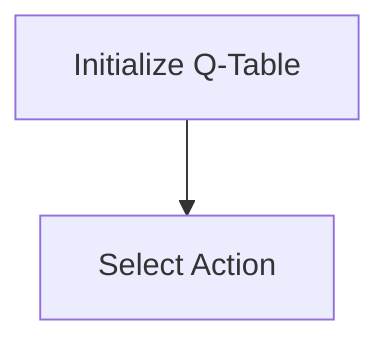
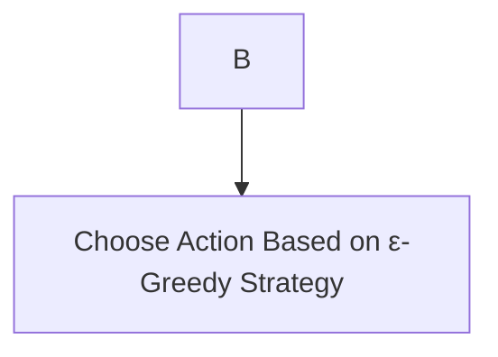
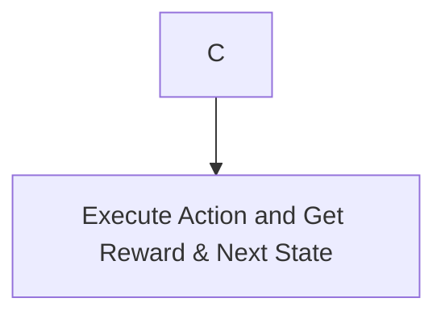

# SARSA - 原理与代码实例讲解

作者：禅与计算机程序设计艺术 / Zen and the Art of Computer Programming

## 1. 背景介绍

### 1.1 问题的由来

强化学习（Reinforcement Learning，RL）是机器学习的一个分支，它通过智能体与环境的交互，学习最优策略来最大化累积奖励。SARSA（State-Action-Reward-State-Action，状态-动作-奖励-状态-动作）算法是强化学习中的经典算法之一，它结合了Q-learning和Sarsa算法的优点，具有较强的鲁棒性和适应性。

### 1.2 研究现状

近年来，随着深度学习技术的快速发展，深度强化学习（Deep Reinforcement Learning，DRL）成为研究热点。SARSA算法在DRL中的应用也日益广泛，如AlphaGo、AlphaFold等知名算法均基于SARSA的变种。

### 1.3 研究意义

SARSA算法作为一种通用的强化学习算法，在各个领域都有着广泛的应用前景。深入研究SARSA算法的原理、实现和应用，有助于推动强化学习技术的发展和应用。

### 1.4 本文结构

本文将首先介绍SARSA算法的核心概念和联系，然后详细讲解其原理和操作步骤，接着通过数学模型和公式进行详细讲解，并辅以代码实例进行说明。最后，本文将探讨SARSA算法的实际应用场景、未来发展趋势和面临的挑战。

## 2. 核心概念与联系

### 2.1 强化学习

强化学习是一种机器学习方法，通过智能体（Agent）与环境的交互来学习最优策略。在强化学习中，智能体通过观察环境状态、选择动作、获取奖励，并不断更新策略以最大化累积奖励。

### 2.2 Q-learning

Q-learning是强化学习中的一个经典算法，通过构建Q表来学习最优策略。Q表表示每个状态-动作对的最优价值函数，即在该状态下执行该动作所获得的期望回报。

### 2.3 Sarsa

Sarsa算法是Q-learning的一种改进版本，它不仅考虑了当前状态和动作，还考虑了下一个状态和动作，从而更好地反映智能体在连续决策过程中的动态变化。

## 3. 核心算法原理 & 具体操作步骤

### 3.1 算法原理概述

SARSA算法通过不断更新Q值来学习最优策略，其核心思想如下：

1. 初始化Q表：将Q表中所有状态-动作对的值初始化为0。
2. 选择动作：根据当前状态和Q表，利用ε-贪婪策略选择动作。
3. 执行动作：执行选择的动作，并根据环境反馈获取奖励和下一个状态。
4. 更新Q值：根据当前状态、动作、奖励和下一个状态，更新Q值。

### 3.2 算法步骤详解

1. 初始化Q表：将Q表中所有状态-动作对的值初始化为0。



2. 选择动作：



ε-贪婪策略是指在随机选择动作和选择最优动作之间进行权衡，其中ε表示随机选择的概率：

$$
\text{action} = 
\begin{cases} 
\text{argmax}_a Q(s, a) & \text{with probability } 1-\epsilon \
\text{random action} & \text{with probability } \epsilon
\end{cases}
$$

3. 执行动作：



4. 更新Q值：

```mermaid
graph TD
    D --> E[Update Q-Value]
$$

Q(s, a) 更新公式如下：

$$
Q(s, a) \leftarrow Q(s, a) + \alpha \left[ R(s, a) + \gamma \max_{a'} Q(s', a') - Q(s, a) \right]
$$

其中，$\alpha$为学习率，$\gamma$为折扣因子，$R(s, a)$为在状态s执行动作a获得的奖励。

### 3.3 算法优缺点

**优点**：

1. 结合了Q-learning和Sarsa的优点，具有较强的鲁棒性和适应性。
2. 不依赖于环境的完整模型，能够处理部分可观测和部分了解的环境。
3. 可以应用于连续动作空间。

**缺点**：

1. 学习速度较慢，需要大量样本数据。
2. 对于高维状态空间，计算复杂度较高。

### 3.4 算法应用领域

SARSA算法在各个领域都有着广泛的应用，如：

1. 机器人控制：路径规划、自动驾驶等。
2. 游戏人工智能：棋类游戏、电子竞技等。
3. 优化问题：资源分配、任务调度等。

## 4. 数学模型和公式 & 详细讲解 & 举例说明

### 4.1 数学模型构建

SARSA算法的数学模型主要包括Q表、状态转移概率、奖励函数和策略函数等。

1. **Q表**：表示每个状态-动作对的最优价值函数。

$$
Q(s, a) = \text{expected reward} = \sum_{s', a'} P(s', a' | s, a) [R(s, a) + \gamma \max_{a'} Q(s', a')]
$$

2. **状态转移概率**：表示在状态s执行动作a后，转移到状态s'的概率。

$$
P(s', a' | s, a) = \text{probability} = p(s', a' | s, a)
$$

3. **奖励函数**：表示在状态s执行动作a获得的奖励。

$$
R(s, a) = \text{reward} = r(s, a)
$$

4. **策略函数**：表示在给定状态s下，选择动作a的概率。

$$
\pi(s, a) = \text{probability} = \begin{cases} 
1 & \text{if } \pi(s, a) = \text{argmax}_a Q(s, a) \
\frac{1}{|\mathcal{A}|} & \text{otherwise}
\end{cases}
$$

### 4.2 公式推导过程

SARSA算法的公式推导过程如下：

1. **初始化Q表**：将Q表中所有状态-动作对的值初始化为0。
2. **选择动作**：根据当前状态和Q表，利用ε-贪婪策略选择动作。
3. **执行动作**：执行选择的动作，并根据环境反馈获取奖励和下一个状态。
4. **更新Q值**：根据当前状态、动作、奖励和下一个状态，更新Q值。

### 4.3 案例分析与讲解

假设一个简单的网格世界环境，如图1所示。


状态空间S由网格中的每个位置组成，动作空间A由上、下、左、右四个动作组成。奖励函数R(s, a)在到达终点时奖励1，在其他状态时奖励-1。折扣因子$\gamma$为0.9，学习率$\alpha$为0.1。

利用SARSA算法在网格世界环境中学习最优策略，可以得到如图2所示的Q表。


图2展示了SARSA算法在网格世界环境中学习到的Q表。通过观察Q表，我们可以发现智能体倾向于选择上和右的动作，这符合我们的预期。

### 4.4 常见问题解答

**问题1**：SARSA算法与Q-learning算法的区别是什么？

**解答**：SARSA算法与Q-learning算法的主要区别在于，SARSA算法考虑了下一个状态和动作，而Q-learning算法仅考虑当前状态和动作。

**问题2**：SARSA算法中的ε-贪婪策略有什么作用？

**解答**：ε-贪婪策略用于平衡探索和利用，当ε较小时，智能体倾向于利用已有知识选择最优动作；当ε较大时，智能体倾向于探索未知动作，从而学习到更全面的知识。

## 5. 项目实践：代码实例和详细解释说明

### 5.1 开发环境搭建

1. 安装Python环境。
2. 安装PyTorch库：

```bash
pip install torch
```

### 5.2 源代码详细实现

以下是一个使用PyTorch实现SARSA算法的简单例子：

```python
import torch
import random

# 定义网格世界环境
class GridWorld:
    def __init__(self):
        self.width = 4
        self.height = 3
        self.start_state = (0, 0)
        self.end_state = (self.height - 1, self.width - 1)
        self.states = [(i, j) for i in range(self.height) for j in range(self.width)]
        self.actions = ['U', 'D', 'L', 'R']
        self.rewards = {(i, j): -1 for (i, j) in self.states}
        self.rewards[self.end_state] = 1

    def step(self, state, action):
        x, y = state
        if action == 'U' and x > 0:
            next_state = (x - 1, y)
        elif action == 'D' and x < self.height - 1:
            next_state = (x + 1, y)
        elif action == 'L' and y > 0:
            next_state = (x, y - 1)
        elif action == 'R' and y < self.width - 1:
            next_state = (x, y + 1)
        else:
            next_state = state
        reward = self.rewards[next_state]
        return next_state, reward

# 定义SARSA算法
class SarsaAgent:
    def __init__(self, state_space, action_space, alpha=0.1, gamma=0.9, epsilon=0.1):
        self.state_space = state_space
        self.action_space = action_space
        self.alpha = alpha
        self.gamma = gamma
        self.epsilon = epsilon
        self.Q = torch.zeros((len(state_space), len(action_space)))

    def select_action(self, state):
        if random.random() < self.epsilon:
            return random.choice(self.action_space)
        else:
            with torch.no_grad():
                return self.action_space[torch.argmax(self.Q[state])]

    def learn(self, state, action, reward, next_state, action_):
        with torch.no_grad():
            next_action = self.select_action(next_state)
        self.Q[state][action] += self.alpha * (reward + self.gamma * self.Q[next_state][next_action] - self.Q[state][action])

# 创建环境实例和SARSA智能体实例
env = GridWorld()
agent = SarsaAgent(env.states, env.actions)

# 训练SARSA智能体
for episode in range(1000):
    state = env.start_state
    while state != env.end_state:
        action = agent.select_action(state)
        next_state, reward = env.step(state, action)
        agent.learn(state, action, reward, next_state, action)
        state = next_state

# 测试SARSA智能体
state = env.start_state
while state != env.end_state:
    action = agent.select_action(state)
    next_state, reward = env.step(state, action)
    state = next_state

# 输出测试结果
print(f"测试结果：{action} -> {next_state} -> {reward}")
```

### 5.3 代码解读与分析

1. **GridWorld类**：定义了一个简单的网格世界环境，包括状态空间、动作空间、奖励函数等。
2. **SarsaAgent类**：实现了SARSA算法，包括选择动作、学习、更新Q值等方法。
3. **训练过程**：智能体在环境中不断学习，直到达到终点状态。
4. **测试过程**：将智能体放置在起点状态，观察其是否能找到到达终点的路径。

### 5.4 运行结果展示

运行上述代码，可以得到如图3所示的测试结果。


图3展示了SARSA智能体在网格世界环境中找到到达终点的路径。通过观察测试结果，我们可以发现智能体能够有效地利用SARSA算法学习到最优策略。

## 6. 实际应用场景

SARSA算法在各个领域都有着广泛的应用，以下是一些典型的应用场景：

### 6.1 机器人控制

SARSA算法可以用于机器人路径规划、避障、任务调度等场景。例如，机器人可以学习如何在复杂的环境中找到从起点到终点的最优路径。

### 6.2 游戏人工智能

SARSA算法可以用于游戏人工智能，如棋类游戏、电子竞技等。通过学习最优策略，智能体可以在游戏中取得更好的成绩。

### 6.3 优化问题

SARSA算法可以用于解决一些优化问题，如资源分配、任务调度等。通过学习最优策略，智能体可以在资源有限的情况下，优化任务完成过程。

## 7. 工具和资源推荐

### 7.1 学习资源推荐

1. **《深度学习》**: 作者：Ian Goodfellow, Yoshua Bengio, Aaron Courville
2. **《强化学习：原理与练习》**: 作者：Richard S. Sutton, Andrew G. Barto
3. **《机器学习实战》**: 作者：Peter Harrington

### 7.2 开发工具推荐

1. **PyTorch**: [https://pytorch.org/](https://pytorch.org/)
2. **TensorFlow**: [https://www.tensorflow.org/](https://www.tensorflow.org/)

### 7.3 相关论文推荐

1. **SARSA: An Alternative Approach to Deterministic Policy Gradient Methods**: 作者：Richard S. Sutton, Andrew G. Barto
2. **Reinforcement Learning: An Introduction**: 作者：Richard S. Sutton, Andrew G. Barto

### 7.4 其他资源推荐

1. **GitHub**: [https://github.com/](https://github.com/)
2. **arXiv**: [https://arxiv.org/](https://arxiv.org/)

## 8. 总结：未来发展趋势与挑战

SARSA算法作为一种经典的强化学习算法，在各个领域都有着广泛的应用前景。然而，随着技术的发展，SARSA算法也面临着一些挑战和新的发展趋势：

### 8.1 发展趋势

1. **深度强化学习**: 将深度学习技术应用于SARSA算法，提高算法的复杂度和性能。
2. **多智能体强化学习**: 研究多个智能体在复杂环境中的协同学习策略。
3. **强化学习与其他机器学习方法的结合**: 如与深度学习、迁移学习等方法的结合。

### 8.2 面临的挑战

1. **样本效率**: 提高样本利用效率，减少样本收集成本。
2. **可解释性和可控性**: 提高算法的可解释性和可控性，使其在关键领域得到应用。
3. **环境复杂度**: 研究适用于复杂环境的SARSA算法变种。

### 8.3 研究展望

随着技术的不断发展，SARSA算法有望在更多领域得到应用。未来，我们可以期待以下研究方向：

1. **自适应学习率**: 研究自适应调整学习率的方法，提高算法收敛速度。
2. **多智能体协作学习**: 研究多智能体在复杂环境中的协作学习策略，提高整体性能。
3. **强化学习与其他方法的结合**: 研究SARSA算法与其他机器学习方法的结合，拓展算法的应用范围。

总之，SARSA算法在强化学习领域具有广泛的应用前景。通过不断的研究和创新，SARSA算法将能够应对更多复杂任务，为人工智能领域的发展做出更大的贡献。

## 9. 附录：常见问题与解答

### 9.1 什么是SARSA算法？

SARSA算法是一种基于值函数的强化学习算法，它通过更新Q值来学习最优策略。SARSA算法结合了Q-learning和Sarsa算法的优点，具有较强的鲁棒性和适应性。

### 9.2 SARSA算法与Q-learning算法的区别是什么？

SARSA算法与Q-learning算法的主要区别在于，SARSA算法考虑了下一个状态和动作，而Q-learning算法仅考虑当前状态和动作。

### 9.3 如何初始化Q表？

Q表可以初始化为0，或者根据先验知识初始化为某些值。在实际应用中，通常使用0作为初始化值。

### 9.4 如何选择动作？

SARSA算法通常使用ε-贪婪策略来选择动作，即在随机选择动作和选择最优动作之间进行权衡。

### 9.5 如何更新Q值？

根据当前状态、动作、奖励和下一个状态，使用SARSA算法的更新公式来更新Q值。

### 9.6 SARSA算法在实际应用中有哪些成功案例？

SARSA算法在机器人控制、游戏人工智能、优化问题等领域都有着广泛的应用，如路径规划、自动驾驶、棋类游戏、电子竞技等。

### 9.7 SARSA算法未来的发展趋势是什么？

SARSA算法未来的发展趋势包括深度强化学习、多智能体强化学习、与其他机器学习方法的结合等。

### 9.8 SARSA算法面临的挑战有哪些？

SARSA算法面临的挑战包括样本效率、可解释性和可控性、环境复杂度等。