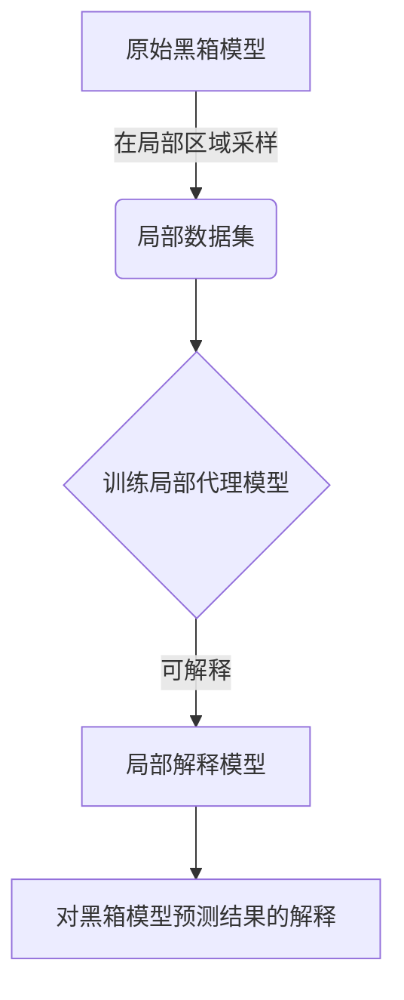
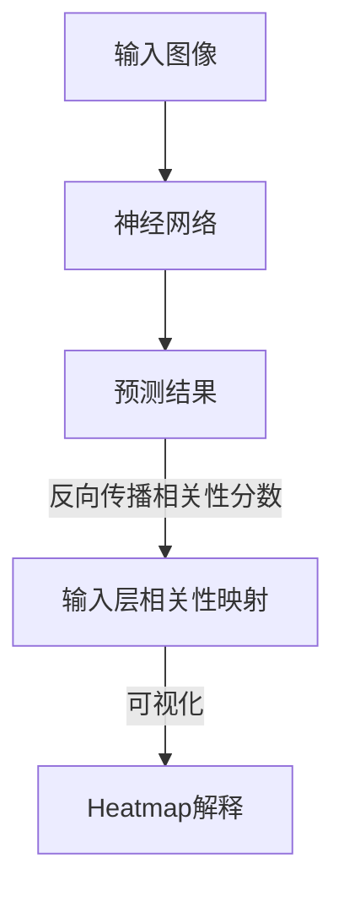
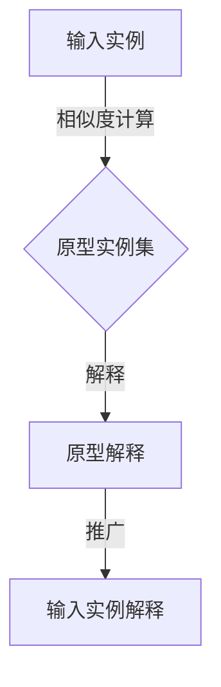

# AI Interpretability原理与代码实例讲解

## 1. 背景介绍

### 1.1 问题的由来

随着人工智能系统在各领域的广泛应用,其决策过程的透明度和可解释性日益受到关注。传统的"黑箱"模型虽然在某些任务上表现出色,但由于其内在机理的不可解释性,常常遭到质疑和不信任。因此,提高AI系统的可解释性(Interpretability)成为了一个迫切的需求。

可解释性不仅有助于提高人们对AI系统的信任度,更重要的是,它有助于发现模型中潜在的偏差和缺陷,从而促进模型的持续改进。此外,在一些高风险领域(如医疗、金融等),可解释性也是一个法律和道德要求,以确保AI系统的决策过程是透明和可审计的。

### 1.2 研究现状

近年来,AI可解释性领域取得了长足进展,涌现出多种解释技术和框架。一些常见的方法包括:

- **特征重要性分析**(Feature Importance)
- **局部解释模型**(Local Interpretable Model-Agnostic Explanations, LIME)
- **形象化解释**(Saliency Maps)
- **层次化解释**(Layer-wise Relevance Propagation, LRP)
- **原型解释**(Prototype Explanations)

然而,现有方法仍然存在一些不足,如解释的稳定性差、难以理解、缺乏统一的评估标准等。因此,设计更加通用、高效和可靠的可解释性方法,仍然是该领域的一大挑战。

### 1.3 研究意义

提高AI系统的可解释性,有着重要的理论意义和现实应用价值:

- **理论意义**:可解释性有助于揭示AI模型的内在机理,推动人工智能理论的发展。
- **应用价值**:可解释性可以提高人们对AI系统的信任度,促进其在高风险领域的应用。
- **社会影响**:可解释性有助于确保AI系统的公平性、透明度和可审计性,维护社会公平正义。

因此,AI可解释性研究对于推动人工智能技术的健康发展,具有重要的战略意义。

### 1.4 本文结构

本文将全面介绍AI可解释性的核心概念、算法原理、数学模型、代码实现和应用场景等内容。文章结构安排如下:

1. **背景介绍**:阐述AI可解释性问题的由来、研究现状和意义。
2. **核心概念与联系**:介绍可解释性的核心概念,并与相关概念(如模型透明度、公平性等)建立联系。
3. **核心算法原理与具体操作步骤**:重点讲解几种主流的可解释性算法,如LIME、LRP等,并给出具体的操作步骤。
4. **数学模型和公式详细讲解与举例说明**:建立可解释性的数学模型,推导关键公式,并结合实例进行讲解和分析。
5. **项目实践:代码实例和详细解释说明**:提供可解释性算法的代码实现示例,并进行详细的解读和说明。
6. **实际应用场景**:介绍可解释性在不同领域(如医疗、金融等)的实际应用案例。
7. **工具和资源推荐**:推荐一些有用的学习资源、开发工具和相关论文。
8. **总结:未来发展趋势与挑战**:总结研究成果,展望未来发展趋势,并分析面临的主要挑战。
9. **附录:常见问题与解答**:解答一些常见的疑问和问题。

接下来,我们将逐一深入探讨上述各个方面的内容。

## 2. 核心概念与联系

### 2.1 可解释性(Interpretability)的定义

可解释性是指人工智能系统能够以人类可理解的方式解释其内部决策过程和预测结果的能力。具体来说,它包括以下几个层面:

1. **模型透明度**(Model Transparency):模型内部结构和运作机理对人类是透明和可解释的。
2. **决策解释**(Decision Explanation):模型能够解释为什么做出某个特定的决策或预测。
3. **过程理解**(Process Understanding):人类能够理解模型是如何从输入到输出的全过程。

### 2.2 可解释性与其他概念的关系

可解释性与人工智能系统的其他重要属性,如**公平性**(Fairness)、**安全性**(Safety)、**隐私保护**(Privacy Preservation)等都有着密切的联系。

- **公平性**:可解释性有助于发现模型中存在的潜在偏差和歧视,从而促进模型公平性的改进。
- **安全性**:对于一些高风险应用场景(如自动驾驶、医疗诊断等),可解释性是确保系统安全性的关键。
- **隐私保护**:一些可解释性方法可能会泄露个人隐私信息,因此需要在可解释性和隐私保护之间寻求平衡。

总的来说,可解释性是构建可信赖、负责任的人工智能系统的重要基石。

## 3. 核心算法原理与具体操作步骤

本节将重点介绍几种主流的可解释性算法,包括其核心原理、具体操作步骤、优缺点分析等内容。

### 3.1 算法原理概述

#### 3.1.1 LIME(Local Interpretable Model-Agnostic Explanations)

LIME是一种模型无关的局部解释方法,其核心思想是:通过训练一个局部可解释的代理模型(如线性回归或决策树)来近似拟合原始黑箱模型在局部区域的行为,从而为原始模型的预测结果提供解释。

#### 3.1.2 LRP(Layer-wise Relevance Propagation)

LRP是一种针对深度神经网络的形象化解释方法。它通过反向传播相关性分数(Relevance Score),将神经网络最后一层的预测结果分解到输入层的每个像素上,从而生成一个热力图(Heatmap),直观展示了输入特征对预测结果的贡献程度。

#### 3.1.3 原型解释(Prototype Explanations)

原型解释的思路是:通过寻找与输入实例最相似的一组原型实例,并解释这些原型实例为什么会被分类为某个类别,从而间接解释输入实例的分类结果。原型实例可以是真实数据,也可以是人工合成的。

### 3.2 算法步骤详解

接下来,我们将详细讲解上述算法的具体操作步骤。

#### 3.2.1 LIME算法步骤

1. **数据采样**:在输入实例的局部邻域随机采样一组数据实例。
2. **标记数据**:使用原始黑箱模型对采样数据进行标记(即预测)。
3. **训练代理模型**:使用带标记的采样数据训练一个局部代理模型(如线性回归或决策树)。
4. **解释生成**:利用训练好的代理模型,计算每个特征对预测结果的贡献程度,从而生成解释。

#### 3.2.2 LRP算法步骤

1. **前向传播**:输入图像通过神经网络进行前向传播,得到最后一层的预测结果。
2. **相关性初始化**:将最后一层的预测结果作为相关性分数的初始值。
3. **反向传播**:按照特定的传播规则,将相关性分数逐层反向传播到输入层。
4. **可视化解释**:将输入层的相关性分数映射到原始图像上,生成热力图解释。

#### 3.2.3 原型解释步骤

1. **原型实例选取**:从训练数据或人工合成数据中选取一组原型实例。
2. **相似度计算**:计算输入实例与每个原型实例之间的相似度。
3. **原型解释生成**:对最相似的几个原型实例进行解释,说明它们为什么被分类为某个类别。
4. **解释推广**:将原型实例的解释推广到输入实例,作为输入实例的解释。

### 3.3 算法优缺点

每种算法都有其优缺点,我们需要根据具体场景和需求选择合适的方法。

- **LIME**:优点是模型无关性强,可解释性较好;缺点是解释的一致性和稳定性较差,计算代价较高。
- **LRP**:优点是可以生成直观的形象化解释,有助于人类理解;缺点是仅适用于神经网络模型,对非线性模型的解释能力较差。
- **原型解释**:优点是解释直观,便于人类理解;缺点是需要选取合适的原型实例,否则解释质量会受影响。

### 3.4 算法应用领域

可解释性算法在多个领域都有广泛的应用,例如:

- **计算机视觉**:解释图像分类、目标检测等任务的预测结果。
- **自然语言处理**:解释文本分类、机器翻译等任务的预测过程。
- **医疗健康**:解释疾病诊断、治疗方案等决策的依据。
- **金融风控**:解释贷款审批、交易监控等决策的原因。

## 4. 数学模型和公式详细讲解与举例说明

### 4.1 数学模型构建

为了量化和评估可解释性,我们需要构建合适的数学模型。一种常见的做法是将可解释性建模为一个优化问题,在预测准确性和可解释性之间寻求最佳平衡。

设 $f(x)$ 为黑箱模型的预测函数, $g(x)$ 为可解释模型的预测函数,我们可以构建如下优化目标:

$$\underset{g}{\mathrm{minimize}}\quad \mathcal{L}(f,g) + \Omega(g)$$

其中:

- $\mathcal{L}(f,g)$ 是预测损失项,用于衡量 $g(x)$ 与 $f(x)$ 的预测差异。
- $\Omega(g)$ 是可解释性正则项,用于度量 $g(x)$ 的可解释性程度。

通过优化上述目标函数,我们可以得到一个在预测准确性和可解释性之间达到良好平衡的可解释模型 $g(x)$。

### 4.2 公式推导过程

接下来,我们将推导一种常见的可解释性正则项 $\Omega(g)$ 的具体形式。

假设我们希望 $g(x)$ 是一个线性可解释模型,即:

$$g(x) = w_0 + \sum_{i=1}^{d}w_ix_i$$

其中 $w_0$ 是偏置项, $w_i$ 是特征 $x_i$ 的权重系数。

为了提高可解释性,我们可以对模型权重 $w$ 施加稀疏性约束,使得大部分特征的权重为0,从而只保留对预测结果有重要影响的少数特征。这可以通过 $L_1$ 范数正则项来实现:

$$\Omega(g) = \lambda\sum_{i=1}^{d}|w_i|$$

其中 $\lambda>0$ 是一个超参数,用于控制稀疏性的程度。

将上述 $\mathcal{L}(f,g)$ 和 $\Omega(g)$ 代入优化目标,我们可以得到如下具体形式:

$$\underset{w_0,w}{\mathrm{minimize}}\quad \sum_{j=1}^{n}L(f(x_j),w_0+\sum_{i=1}^{d}w_ix_{j,i}) + \lambda\sum_{i=1}^{d}|w_i|$$

这就是一个典型的带 $L_1$ 范数正则项的稀疏线性回归问题,可以通过广义最小二乘