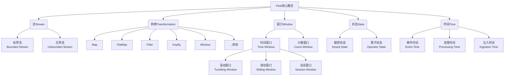

# Flink应用场景与实践

## 1. 背景介绍

### 1.1 问题的由来

在当今大数据时代,海量数据的实时处理和分析已经成为各行业的迫切需求。传统的批处理系统已经无法满足实时性和低延迟的要求,而流式计算应运而生。Apache Flink作为新一代分布式流处理框架,凭借其低延迟、高吞吐量、精确一次语义和事件时间语义等优势,在实时计算领域占据重要地位。

### 1.2 研究现状

近年来,Flink生态系统不断发展壮大,涌现出诸多优秀的流处理应用案例,如实时数据分析、实时机器学习、实时监控预警等。越来越多的企业开始将Flink应用到核心业务场景中,以提升业务效率和决策能力。然而,Flink的应用实践仍面临诸多挑战,如系统性能调优、状态管理、容错机制等,需要持续探索和创新。

### 1.3 研究意义

本文旨在深入探讨Flink在实际应用场景中的实践经验,包括系统架构设计、性能优化、故障处理等方面的最佳实践。通过剖析典型应用案例,全面揭示Flink的核心概念、算法原理和数学模型,为读者提供实用的技术指导和经验分享。同时,本文还将展望Flink的未来发展趋势和面临的挑战,为读者拓展视野。

### 1.4 本文结构

本文共分为八个章节:第一章介绍背景;第二章阐述Flink核心概念;第三章解析核心算法原理;第四章讲解数学模型和公式推导;第五章提供项目实践案例;第六章探讨实际应用场景;第七章推荐工具和资源;第八章总结发展趋势和挑战。

## 2. 核心概念与联系

Apache Flink是一个分布式、有状态的流处理框架,它将流处理作为无界数据集合的一种特殊情况。Flink的核心概念包括流(Stream)、转换(Transformation)、窗口(Window)、状态(State)和时间(Time)等。



流(Stream)是Flink的核心数据结构,可分为有界流和无界流。有界流是指有限的数据集,如文件或集合;无界流则是连续不断的数据流,如消息队列或传感器数据。

转换(Transformation)是对流进行转换和处理的操作,包括Map、FlatMap、Filter、KeyBy、Window等常见转换,以及其他自定义转换。

窗口(Window)是对无界流进行切分,将其划分为有限的数据集或数据窗口。Flink支持时间窗口(如滚动窗口、滑动窗口、会话窗口)和计数窗口。

状态(State)是Flink实现有状态计算的关键,包括键控状态(与键值对相关联)和算子状态(与整个算子相关联)。状态使得Flink能够在流处理过程中保存和访问历史数据。

时间(Time)是Flink流处理中的重要概念,包括事件时间(数据产生的时间)、处理时间(数据到达Flink的时间)和注入时间(数据进入源的时间)。正确处理事件时间对于实现精确一次语义至关重要。

这些核心概念相互关联,共同构建了Flink流处理的基础架构。理解它们有助于更好地设计和实现Flink应用程序。

## 3. 核心算法原理 & 具体操作步骤

### 3.1 算法原理概述

Flink的核心算法原理包括以下几个方面:

1. **流执行模型**: Flink采用流水线式执行模型,将数据流分成多个流水线阶段,每个阶段由一个或多个算子组成。这种模型可以提高吞吐量和延迟,并支持有状态计算。

2. **分区和并行度**: Flink将流数据划分为多个分区,并行执行计算任务。每个算子都有自己的并行度,可以根据需求进行调整。

3. **窗口操作**: Flink支持多种窗口操作,如滚动窗口、滑动窗口和会话窗口,用于对无界流进行切分和聚合计算。

4. **状态管理**: Flink通过状态后端(如RocksDB)管理算子状态和键控状态,实现有状态计算和容错恢复。

5. **时间语义**: Flink支持事件时间语义,通过水位线(Watermark)机制来处理乱序数据和实现精确一次语义。

6. **容错机制**: Flink采用基于检查点(Checkpoint)和状态快照的容错机制,可以在发生故障时恢复计算状态,保证精确一次语义。

### 3.2 算法步骤详解

以WordCount示例为例,介绍Flink流处理的具体步骤:

1. **获取数据源**: 从Socket或Kafka等源头获取数据流。

```java
DataStream<String> text = env.socketTextStream("localhost", 9999);
```

2. **转换操作**: 对数据流进行转换操作,如FlatMap、Filter等。

```java
DataStream<Tuple2<String, Integer>> wordCounts = text
    .flatMap(new FlatMapFunction<String, Tuple2<String, Integer>>() {...})
    .keyBy(0)
    .timeWindow(Time.seconds(5))
    .sum(1);
```

3. **窗口操作**: 对转换后的数据流进行窗口操作,如滚动窗口、滑动窗口等。

4. **聚合计算**: 在窗口内进行聚合计算,如sum、min、max等。

5. **结果输出**: 将计算结果输出到Sink,如文件系统或数据库。

```java
wordCounts.print();
```

6. **执行作业**: 调用`env.execute()`方法提交并执行Flink作业。

```java
env.execute("Word Count Example");
```

整个过程中,Flink会自动进行数据分区、任务调度、容错处理等操作,开发者只需关注业务逻辑即可。

### 3.3 算法优缺点

Flink核心算法的优点包括:

- 低延迟、高吞吐: 流水线执行模型和有效的内存管理机制。
- 精确一次语义: 基于检查点和重放机制实现容错恢复。
- 事件时间语义: 支持处理乱序数据和实现精确计算。
- 有状态计算: 状态管理机制支持维护和访问历史数据。
- 高可扩展性: 基于分区和并行度实现水平扩展。

不足之处包括:

- 学习曲线陡峭: 概念较多,上手门槛较高。
- 状态管理开销: 有状态计算会带来额外的内存和存储开销。
- 反压机制不足: 反压机制相对较弱,可能导致背压问题。
- 资源隔离性差: 作业之间资源隔离性差,可能导致相互影响。

### 3.4 算法应用领域

Flink核心算法广泛应用于以下领域:

- 实时数据分析: 如用户行为分析、网络日志分析、fraud检测等。
- 实时机器学习: 如实时推荐系统、在线模型训练和评分等。
- 实时监控预警: 如IT系统监控、金融风控、网络安全等。
- 实时数据处理: 如电商订单处理、物联网数据处理等。
- 传统批处理任务: 如ETL、数据仓库构建等。

总的来说,Flink核心算法适用于对低延迟、高吞吐、有状态计算和精确一次语义有需求的各种实时数据处理场景。

## 4. 数学模型和公式 & 详细讲解 & 举例说明

### 4.1 数学模型构建

在Flink中,流处理可以抽象为一个数学模型,其中流被表示为一个无限序列,算子被表示为对序列元素进行转换的函数。

设有一个输入流$S = \{s_1, s_2, s_3, \ldots\}$,其中$s_i$表示第$i$个元素。应用一个转换算子$f$,得到输出流$S' = \{s'_1, s'_2, s'_3, \ldots\}$,其中$s'_i = f(s_i)$。

对于有状态的算子,其转换函数还依赖于状态$\sigma$,即$s'_i = f(s_i, \sigma)$。状态$\sigma$的更新规则为$\sigma' = g(s_i, \sigma)$,其中$g$是状态更新函数。

窗口操作可以看作是一种特殊的有状态转换,其中状态$\sigma$表示当前窗口的内容,转换函数$f$对窗口内的元素进行聚合计算。

### 4.2 公式推导过程

以滚动窗口的Count聚合为例,推导其数学表达式。

设窗口大小为$w$,输入流为$S = \{s_1, s_2, s_3, \ldots\}$,窗口状态为$\sigma_i = \{s_{i-w+1}, s_{i-w+2}, \ldots, s_i\}$,表示第$i$个窗口的内容。

对于新到达的元素$s_{i+1}$,状态更新规则为:

$$\sigma_{i+1} = \{s_{i-w+2}, s_{i-w+3}, \ldots, s_{i+1}\}$$

即将最新元素$s_{i+1}$加入窗口,移除最早的元素$s_{i-w+1}$。

Count聚合的转换函数为:

$$s'_i = \sum_{j=i-w+1}^{i} s_j$$

将状态更新规则代入,可得:

$$s'_{i+1} = \sum_{j=i-w+2}^{i+1} s_j = s'_i - s_{i-w+1} + s_{i+1}$$

这个递推公式表明,只需维护前一个窗口的Count值$s'_i$和最新到达的元素$s_{i+1}$,即可高效计算出新窗口的Count值$s'_{i+1}$,而无需重新遍历整个窗口。

### 4.3 案例分析与讲解

考虑一个实时电商用户行为分析的案例。假设有一个UserBehaviorStream,其中每个元素表示一个用户行为事件,包含用户ID、事件类型(浏览、下单、支付)和事件时间戳。

我们希望统计过去5分钟内每个用户的浏览次数、下单次数和支付次数,并对结果进行实时更新。这可以使用Flink的窗口操作和状态管理来实现。

1. 首先,我们需要根据用户ID对UserBehaviorStream进行KeyBy操作,将相同用户的事件聚合在一起。

2. 接下来,我们应用一个滑动窗口,窗口大小为5分钟,滑动间隔为1分钟。这样可以保证任何5分钟内的用户行为都被捕获到。

3. 在每个窗口内,我们使用状态变量来维护浏览次数、下单次数和支付次数的计数器。对于新到达的事件,根据事件类型更新相应的计数器。

4. 最后,我们可以将每个窗口的统计结果输出到下游应用程序或存储系统中,用于实时展示或进一步分析。

该案例展示了Flink如何通过窗口操作、KeyBy和状态管理来实现实时数据分析。相关代码示例如下:

```java
DataStream<UserBehavior> userBehaviorStream =