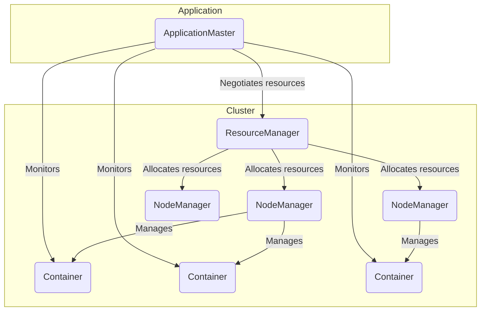

# YARN Resource Manager原理与代码实例讲解

## 1. 背景介绍

### 1.1 问题的由来

随着大数据时代的到来，海量数据的存储和处理成为了一个巨大的挑战。传统的单机系统已经无法满足现代大数据应用的需求,因此分布式计算框架应运而生。Apache Hadoop作为一个开源的分布式系统,能够可靠地存储和处理大规模数据集,成为了大数据处理的核心基础设施之一。

在Hadoop生态系统中,YARN(Yet Another Resource Negotiator)作为一个资源管理和任务调度框架,扮演着至关重要的角色。它负责集群资源的管理和调度,确保集群资源得到高效利用,并为各种类型的应用程序提供服务。

### 1.2 研究现状

YARN自从诞生以来,就受到了广泛关注和研究。许多学者和工程师致力于优化和改进YARN的性能、可扩展性和可靠性。目前,YARN已经成为Hadoop生态系统中不可或缺的一部分,被广泛应用于各种大数据应用中。

然而,随着大数据应用的不断发展,对YARN的要求也在不断提高。例如,如何更好地支持机器学习和人工智能应用、如何更好地管理异构资源、如何提高资源利用率等,都是YARN面临的挑战。

### 1.3 研究意义

深入理解YARN Resource Manager的原理和实现,对于优化和改进YARN,提高大数据应用的性能和效率具有重要意义。本文将从YARN Resource Manager的架构、核心算法、数学模型、代码实现等多个角度进行全面剖析,旨在为读者提供一个深入的理解和实践指导。

### 1.4 本文结构

本文将按照以下结构进行阐述:

1. 背景介绍
2. 核心概念与联系
3. 核心算法原理与具体操作步骤
4. 数学模型和公式详细讲解与举例说明
5. 项目实践:代码实例和详细解释说明
6. 实际应用场景
7. 工具和资源推荐
8. 总结:未来发展趋势与挑战
9. 附录:常见问题与解答

## 2. 核心概念与联系

在深入探讨YARN Resource Manager的原理之前,我们需要先了解一些核心概念及其之间的关系。

**ResourceManager(RM)**: YARN集群的主要协调者和负责资源分配的组件。它负责跟踪可用资源,并根据应用程序的需求进行资源分配和调度。

**ApplicationMaster(AM)**: 每个应用程序在YARN上运行时,都会启动一个AM进程。AM负责与RM协商获取资源,并监控应用程序的执行和进度。

**NodeManager(NM)**: 运行在每个节点(Node)上的组件,负责管理该节点上的资源,启动和监控容器(Container)。

**Container**: YARN中的资源抽象,封装了CPU、内存等多种资源。应用程序的任务将在容器中执行。

**队列(Queue)**: YARN支持将集群资源划分为多个队列,每个队列可设置不同的资源限制和调度策略,实现资源隔离和公平调度。

这些核心概念相互关联,共同构建了YARN的资源管理和任务调度框架。下图展示了它们之间的关系:

## 3. 核心算法原理与具体操作步骤

### 3.1 算法原理概述

YARN Resource Manager的核心算法是一种基于容量约束的公平调度算法,它旨在根据队列的资源配置和应用程序的资源需求,实现资源的合理分配和公平调度。

该算法的基本思想是:首先,根据队列的资源配置,计算出每个队列的资源份额(资源容量)。然后,根据应用程序的资源需求,按照一定的策略(如公平策略或优先级策略)从各个队列中分配资源。

在分配资源时,算法会考虑以下几个主要因素:

1. **队列资源容量**: 每个队列可用的资源容量,由队列的配置决定。
2. **应用程序资源需求**: 每个应用程序对CPU、内存等资源的需求。
3. **队列优先级**: 不同队列可设置不同的优先级,用于调节资源分配顺序。
4. **公平性**: 确保资源在队列和应用程序之间公平分配。

算法会根据这些因素,动态地调整资源分配,以实现高效利用和公平分配。

### 3.2 算法步骤详解

YARN Resource Manager的核心算法可以分为以下几个主要步骤:

1. **初始化**: 读取队列配置,计算每个队列的资源容量。
2. **资源请求**: 应用程序向ResourceManager发送资源请求。
3. **资源分配**:
   - 根据队列优先级,选择一个队列进行资源分配。
   - 在选中的队列中,按照公平策略或优先级策略,选择一个应用程序进行资源分配。
   - 根据应用程序的资源需求和队列的剩余资源容量,分配资源给应用程序。
4. **资源释放**: 当应用程序完成任务或退出时,释放占用的资源。
5. **资源重新分配**: 将释放的资源重新分配给其他应用程序或队列。
6. **重复步骤3-5**: 持续进行资源分配和释放,直到所有应用程序完成或被终止。

在整个过程中,算法会动态调整资源分配,以确保资源得到高效利用,并保持队列和应用程序之间的公平性。

### 3.3 算法优缺点

YARN Resource Manager的核心算法具有以下优点:

- **公平性**: 通过队列和应用程序级别的公平调度策略,确保资源在不同实体之间公平分配。
- **资源隔离**: 队列机制实现了资源的逻辑隔离,防止某些应用程序monopoly占用资源。
- **可扩展性**: 算法可以很好地支持大规模集群和大量应用程序的资源管理。
- **灵活性**: 可以通过配置调整队列资源容量和优先级,满足不同应用程序的需求。

同时,该算法也存在一些缺点:

- **静态资源配置**: 队列的资源容量是静态配置的,无法动态调整,可能导致资源利用率不高。
- **公平性与资源利用率的权衡**: 过于追求公平性可能会牺牲资源利用率。
- **复杂性**: 算法涉及多个因素和策略,实现和调优较为复杂。

### 3.4 算法应用领域

YARN Resource Manager的核心算法广泛应用于以下领域:

- **大数据处理**: Hadoop生态系统中的MapReduce、Spark、Flink等大数据处理框架都依赖于YARN进行资源管理和任务调度。
- **机器学习和人工智能**: YARN可以为机器学习和深度学习任务提供资源支持,如TensorFlow on YARN等。
- **流处理**: 流处理系统如Apache Kafka、Apache Storm等也可以在YARN上运行。
- **其他分布式应用**: YARN还可以支持各种分布式应用,如Elasticsearch、Cassandra等。

总的来说,任何需要在分布式环境下运行并需要资源管理和调度的应用程序,都可以利用YARN Resource Manager的核心算法来实现高效的资源利用和公平调度。

## 4. 数学模型和公式详细讲解与举例说明

### 4.1 数学模型构建

为了更好地理解和优化YARN Resource Manager的核心算法,我们可以构建一个数学模型来描述资源分配问题。

假设集群中有 $N$ 个节点,每个节点 $i$ 拥有 $R_i$ 个资源(如CPU核数、内存大小等)。我们将资源抽象为一个标量值,并定义集群的总资源为:

$$R_{total} = \sum_{i=1}^{N} R_i$$

集群被划分为 $M$ 个队列,每个队列 $j$ 被分配了一个资源容量 $C_j$,满足:

$$\sum_{j=1}^{M} C_j \leq R_{total}$$

在每个队列 $j$ 中,有 $K_j$ 个应用程序,每个应用程序 $k$ 对资源的需求为 $D_{jk}$。我们的目标是找到一种资源分配方案 $A_{jk}$,使得:

1. 对于每个队列 $j$,所有应用程序获得的资源之和不超过队列容量:

   $$\sum_{k=1}^{K_j} A_{jk} \leq C_j$$

2. 所有队列和应用程序获得的资源之和不超过集群总资源:

   $$\sum_{j=1}^{M} \sum_{k=1}^{K_j} A_{jk} \leq R_{total}$$

3. 资源分配满足一定的公平性准则,例如:
   - 对于每个队列 $j$,应用程序获得的资源与其需求成比例:
     $$\frac{A_{jk}}{D_{jk}} = \frac{A_{jk'}}{D_{jk'}} \quad \forall k, k'$$
   - 或者,应用程序获得的资源与队列容量成比例:
     $$\frac{A_{jk}}{C_j} = \frac{A_{j'k'}}{C_{j'}} \quad \forall j, j', k, k'$$

这个数学模型描述了资源分配问题的基本约束条件和公平性目标。在实际实现中,YARN Resource Manager的核心算法需要在满足这些约束条件的前提下,寻找一种合理的资源分配方案,尽可能实现资源利用率最大化和公平性最优化。

### 4.2 公式推导过程

接下来,我们将推导一个公式,用于计算应用程序在给定队列中可获得的资源份额。

假设队列 $j$ 的资源容量为 $C_j$,该队列中有 $K_j$ 个应用程序,每个应用程序 $k$ 对资源的需求为 $D_{jk}$。我们定义队列 $j$ 中所有应用程序的资源需求之和为:

$$D_j = \sum_{k=1}^{K_j} D_{jk}$$

如果采用完全公平的策略,则每个应用程序获得的资源份额应与其资源需求成比例。因此,应用程序 $k$ 在队列 $j$ 中可获得的资源份额 $A_{jk}$ 可以计算为:

$$A_{jk} = \frac{D_{jk}}{D_j} \cdot C_j$$

进一步推导,我们可以得到:

$$A_{jk} = \frac{D_{jk}}{\sum_{k'=1}^{K_j} D_{jk'}} \cdot C_j$$

这个公式表示,应用程序 $k$ 在队列 $j$ 中可获得的资源份额,等于它的资源需求占该队列中所有应用程序资源需求之和的比例,乘以队列的资源容量。

需要注意的是,这个公式只考虑了完全公平的情况。在实际实现中,YARN Resource Manager的核心算法还需要考虑队列优先级、资源剩余量等其他因素,以实现更加灵活和高效的资源分配。

### 4.3 案例分析与讲解

为了更好地理解上述数学模型和公式,我们来分析一个具体的案例。

假设我们有一个YARN集群,总共有 10 个节点,每个节点拥有 8 个CPU核和 32GB内存。因此,集群的总资源为:

$$R_{total} = 10 \times (8 \text{ CPU cores} + 32 \text{ GB memory})$$

该集群被划分为 3 个队列,资源容量分配如下:

- 队列 1: $C_1 = 100$ (CPU核数 + 内存大小)
- 队列 2: $C_2 = 80$
- 队列 3: $C_3 = 70$

在队列 1 中,有 3 个应用程序,资源需求分别为:

- 应用程序 1: $D_{11} = 40$
-