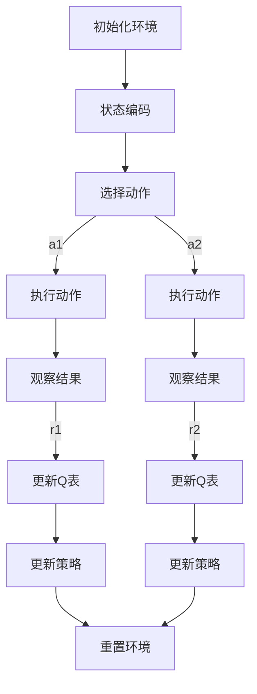

# AI人工智能深度学习算法：智能深度学习代理的未来发展趋势

作者：禅与计算机程序设计艺术 / Zen and the Art of Computer Programming

## 关键词：

深度学习，人工智能，智能深度学习代理，算法，未来趋势，挑战

## 1. 背景介绍

### 1.1 问题的由来

随着信息技术的飞速发展，人工智能（AI）已成为推动社会进步的重要力量。深度学习作为AI的核心技术之一，近年来取得了显著的进展。然而，传统的深度学习算法在处理复杂任务时仍然存在诸多局限性，如过拟合、可解释性差、计算效率低等。为了克服这些限制，研究者们开始探索智能深度学习代理（Smart Deep Learning Agent）这一新型AI范式。

### 1.2 研究现状

智能深度学习代理融合了深度学习、强化学习、迁移学习等多种技术，旨在构建具有自主决策、自适应和自学习的AI系统。当前，智能深度学习代理的研究主要集中在以下几个方面：

1. **可解释性和透明性**：提高深度学习模型的解释性和透明性，使模型决策过程可理解。
2. **鲁棒性和泛化能力**：增强模型的鲁棒性和泛化能力，使其能够应对复杂多变的环境。
3. **高效性和可扩展性**：优化模型训练和推理过程，提高计算效率，降低资源消耗。
4. **迁移学习和自适应**：通过迁移学习和自适应技术，使模型能够快速适应新任务和环境。

### 1.3 研究意义

智能深度学习代理的研究具有重要的理论意义和应用价值：

1. **推动AI技术发展**：智能深度学习代理将促进深度学习、强化学习等相关技术的融合与创新。
2. **拓展AI应用领域**：智能深度学习代理能够应用于更广泛的场景，如自动驾驶、智能制造、智能医疗等。
3. **提升AI系统性能**：通过提高模型的鲁棒性、泛化能力和可解释性，使AI系统更加可靠和高效。

### 1.4 本文结构

本文将首先介绍智能深度学习代理的核心概念与联系，然后分析其核心算法原理和具体操作步骤。接着，我们将详细讲解数学模型和公式，并通过项目实践展示代码实例。最后，我们将探讨智能深度学习代理的实际应用场景、未来发展趋势和面临的挑战。

## 2. 核心概念与联系

### 2.1 智能深度学习代理概述

智能深度学习代理是一种融合了深度学习、强化学习、迁移学习等多种技术的AI系统。它具备以下特点：

1. **自主决策**：能够根据环境信息和自身状态进行自主决策。
2. **自适应学习**：能够根据新信息和反馈不断调整和优化自身策略。
3. **迁移学习**：能够将已学到的知识迁移到新任务中。
4. **可解释性**：模型的决策过程可理解，有助于提高用户信任度。

### 2.2 智能深度学习代理与相关技术的联系

智能深度学习代理与以下相关技术有着紧密的联系：

1. **深度学习**：为智能深度学习代理提供强大的特征提取和表示能力。
2. **强化学习**：为智能深度学习代理提供决策能力和策略优化能力。
3. **迁移学习**：帮助智能深度学习代理快速适应新任务和环境。
4. **多智能体系统**：促进智能深度学习代理之间的协作和交互。

## 3. 核心算法原理 & 具体操作步骤

### 3.1 算法原理概述

智能深度学习代理的核心算法主要包括以下几部分：

1. **环境建模**：根据任务需求，构建虚拟或真实环境，用于模拟和测试代理的决策过程。
2. **状态感知**：通过传感器等手段获取环境信息，并转换为代理可理解的状态。
3. **决策规划**：根据状态信息和目标，生成一系列动作序列。
4. **动作执行**：根据决策规划，执行对应的动作，并获取环境反馈。
5. **学习与优化**：根据动作执行结果，不断调整和优化代理的策略。

### 3.2 算法步骤详解

1. **环境建模**：根据任务需求，构建虚拟或真实环境，如使用Unity、Pygame等游戏引擎创建虚拟环境，或使用实际机器人等设备创建真实环境。
2. **状态感知**：通过传感器等手段获取环境信息，并转换为代理可理解的状态。例如，使用图像识别技术将摄像头捕获的图像转换为状态表示。
3. **决策规划**：根据状态信息和目标，生成一系列动作序列。可以使用深度强化学习、规划算法等手段实现决策规划。
4. **动作执行**：根据决策规划，执行对应的动作，并获取环境反馈。例如，使用机器人控制算法控制机器人执行动作。
5. **学习与优化**：根据动作执行结果，不断调整和优化代理的策略。可以使用强化学习、迁移学习等技术实现学习与优化。

### 3.3 算法优缺点

#### 优点

1. **灵活性**：智能深度学习代理能够适应不同的环境和任务。
2. **自主性**：代理能够根据环境和自身状态进行自主决策。
3. **可解释性**：决策过程可理解，有助于提高用户信任度。

#### 缺点

1. **计算复杂性**：智能深度学习代理的训练和推理过程较为复杂，需要大量的计算资源。
2. **数据依赖性**：代理的性能依赖于训练数据的质量和数量。
3. **可解释性**：虽然算法具有可解释性，但在某些情况下，决策过程可能仍然难以理解。

### 3.4 算法应用领域

智能深度学习代理的应用领域广泛，包括：

1. **自动驾驶**：智能驾驶辅助系统、无人驾驶汽车等。
2. **智能制造**：智能机器人、自动化生产线等。
3. **智能医疗**：辅助诊断、药物研发、手术机器人等。
4. **智能客服**：智能客服机器人、在线客服系统等。

## 4. 数学模型和公式 & 详细讲解 & 举例说明

### 4.1 数学模型构建

智能深度学习代理的数学模型主要包括以下几部分：

1. **状态空间**：表示环境状态和代理状态的集合。
2. **动作空间**：表示代理可执行动作的集合。
3. **奖励函数**：用于评估代理动作的优劣。
4. **策略**：描述代理如何从状态空间到动作空间进行映射。

### 4.2 公式推导过程

以下是一个简化的智能深度学习代理的数学模型：

1. **状态空间**：假设状态空间为$S$，状态表示为$s \in S$。
2. **动作空间**：假设动作空间为$A$，动作表示为$a \in A$。
3. **奖励函数**：假设奖励函数为$R(s, a)$，表示代理执行动作$a$在状态$s$时获得的奖励。
4. **策略**：假设策略为$\pi(s) = P(a|s)$，表示在状态$s$下，代理选择动作$a$的概率。

### 4.3 案例分析与讲解

以下是一个简单的例子，展示如何使用深度Q网络（DQN）构建智能深度学习代理：



在这个例子中，智能深度学习代理通过DQN算法学习在环境中的最优策略。具体步骤如下：

1. **初始化环境**：创建一个虚拟或真实环境，并设置初始状态。
2. **状态编码**：将环境状态编码为向量形式。
3. **选择动作**：根据当前状态，使用DQN算法选择一个动作。
4. **执行动作**：在环境中执行选择的动作，并观察结果。
5. **更新Q表**：根据观察到的结果和奖励，更新Q表。
6. **更新策略**：根据更新后的Q表，更新代理的策略。
7. **重置环境**：重置环境到初始状态，为下一次迭代做准备。

### 4.4 常见问题解答

1. **Q-Learning与DQN的区别是什么**？
   - Q-Learning是一种无模型的强化学习算法，而DQN是一种基于深度学习的Q-Learning算法。DQN通过神经网络近似Q函数，能够处理高维状态空间。
2. **如何提高智能深度学习代理的性能**？
   - 可以通过以下方法提高智能深度学习代理的性能：
     - 使用更强大的神经网络模型。
     - 优化训练数据的质量和数量。
     - 调整奖励函数，使其更符合实际需求。
     - 使用迁移学习技术，使代理能够快速适应新任务。

## 5. 项目实践：代码实例和详细解释说明

### 5.1 开发环境搭建

1. 安装Python环境。
2. 安装PyTorch、TensorFlow或Keras等深度学习框架。
3. 安装OpenAI Gym等强化学习环境。

### 5.2 源代码详细实现

以下是一个使用PyTorch和OpenAI Gym实现智能深度学习代理的示例：

```python
import gym
import torch
import torch.nn as nn
import torch.optim as optim

# 创建环境
env = gym.make('CartPole-v1')

# 定义神经网络
class DQN(nn.Module):
    def __init__(self, state_size, action_size):
        super(DQN, self).__init__()
        self.fc1 = nn.Linear(state_size, 24)
        self.fc2 = nn.Linear(24, 24)
        self.fc3 = nn.Linear(24, action_size)

    def forward(self, x):
        x = torch.relu(self.fc1(x))
        x = torch.relu(self.fc2(x))
        return self.fc3(x)

# 初始化模型、优化器和损失函数
model = DQN(env.observation_space.shape[0], env.action_space.n)
optimizer = optim.Adam(model.parameters(), lr=0.001)
criterion = nn.MSELoss()

# 训练模型
for episode in range(10000):
    state = env.reset()
    done = False

    while not done:
        action = model(state).argmax().item()
        next_state, reward, done, _ = env.step(action)
        optimizer.zero_grad()
        q_value = model(state)
        target_value = reward + 0.99 * max(model(next_state))

        loss = criterion(q_value, target_value)
        loss.backward()
        optimizer.step()

        state = next_state
```

### 5.3 代码解读与分析

1. **创建环境**：使用OpenAI Gym创建CartPole-v1环境，该环境是一个经典的强化学习任务，用于训练智能体控制一个杆在水平位置上保持平衡。
2. **定义神经网络**：使用PyTorch定义一个DQN模型，该模型由三个全连接层组成，用于近似Q函数。
3. **初始化模型、优化器和损失函数**：初始化DQN模型、Adam优化器和均方误差损失函数。
4. **训练模型**：使用DQN算法训练模型，通过迭代环境状态、动作、奖励和下一个状态，不断更新模型参数。

### 5.4 运行结果展示

运行上述代码，模型将在CartPole-v1环境中进行训练，并通过可视化界面展示训练过程。在训练过程中，智能体将学会控制杆子保持平衡。

## 6. 实际应用场景

### 6.1 自动驾驶

智能深度学习代理在自动驾驶领域具有广泛的应用前景。通过训练智能代理在虚拟或真实环境中模拟驾驶，能够实现自动驾驶汽车的安全、高效行驶。

### 6.2 智能制造

智能深度学习代理可以应用于智能制造领域，如机器人控制、生产线优化等。通过训练智能代理，能够实现生产过程的自动化、智能化和高效化。

### 6.3 智能医疗

智能深度学习代理在智能医疗领域具有重要作用。通过训练智能代理进行医学影像分析、疾病诊断和治疗规划，能够提高医疗服务的质量和效率。

### 6.4 智能客服

智能深度学习代理可以应用于智能客服领域，如客服机器人、在线客服系统等。通过训练智能代理，能够提供更优质、高效的客户服务。

## 7. 工具和资源推荐

### 7.1 学习资源推荐

1. **《深度学习》**: 作者：Ian Goodfellow, Yoshua Bengio, Aaron Courville
2. **《强化学习》**: 作者：Richard S. Sutton, Andrew G. Barto
3. **《机器学习实战》**: 作者：Peter Harrington

### 7.2 开发工具推荐

1. **PyTorch**: [https://pytorch.org/](https://pytorch.org/)
2. **TensorFlow**: [https://www.tensorflow.org/](https://www.tensorflow.org/)
3. **Keras**: [https://keras.io/](https://keras.io/)

### 7.3 相关论文推荐

1. **Deep Reinforcement Learning**: [https://arxiv.org/abs/1708.05277](https://arxiv.org/abs/1708.05277)
2. **DQN: Deep Q-Networks**: [https://arxiv.org/abs/1509.06461](https://arxiv.org/abs/1509.06461)
3. **Asynchronous Advantage Actor-Critic (A3C)**: [https://arxiv.org/abs/1602.01783](https://arxiv.org/abs/1602.01783)

### 7.4 其他资源推荐

1. **OpenAI Gym**: [https://gym.openai.com/](https://gym.openai.com/)
2. **Kaggle**: [https://www.kaggle.com/](https://www.kaggle.com/)
3. **GitHub**: [https://github.com/](https://github.com/)

## 8. 总结：未来发展趋势与挑战

### 8.1 研究成果总结

智能深度学习代理作为一种新型AI范式，在近年来取得了显著的进展。通过融合深度学习、强化学习、迁移学习等多种技术，智能深度学习代理在多个领域展现出强大的应用潜力。

### 8.2 未来发展趋势

1. **多模态学习**：未来，智能深度学习代理将融合多模态数据，实现跨模态的信息融合和理解。
2. **自监督学习**：通过自监督学习，智能深度学习代理能够利用无标注数据提升性能和泛化能力。
3. **可解释性和透明性**：提高智能深度学习代理的可解释性和透明性，增强用户信任度。
4. **强化学习和深度学习的融合**：进一步探索强化学习和深度学习的融合，构建更加智能的代理。

### 8.3 面临的挑战

1. **计算资源与能耗**：智能深度学习代理的训练和推理过程需要大量的计算资源，如何降低能耗成为一大挑战。
2. **数据隐私与安全**：如何保证数据隐私和安全，防止数据泄露成为重要问题。
3. **公平性与偏见**：如何避免模型中的偏见和歧视，实现公平、公正的决策成为关键。
4. **模型可解释性**：如何提高模型的可解释性，使其决策过程更加透明成为研究重点。

### 8.4 研究展望

智能深度学习代理的研究将不断深入，未来将在以下方向取得突破：

1. **跨领域应用**：智能深度学习代理将在更多领域得到应用，如教育、金融、交通等。
2. **人机协作**：智能深度学习代理将与人协同工作，提高工作效率和生活质量。
3. **智能体协同**：多个智能体之间的协同与协作，实现更加复杂的任务。

通过不断探索和创新，智能深度学习代理将为人类社会带来更多福祉。

## 9. 附录：常见问题与解答

### 9.1 什么是智能深度学习代理？

智能深度学习代理是一种融合了深度学习、强化学习、迁移学习等多种技术的AI系统，能够根据环境和自身状态进行自主决策、自适应和自学习。

### 9.2 智能深度学习代理与传统深度学习算法有何区别？

智能深度学习代理与传统的深度学习算法相比，具有更强的自主性、自适应性和可解释性。

### 9.3 如何提高智能深度学习代理的性能？

提高智能深度学习代理的性能可以通过以下方法实现：

1. 使用更强大的神经网络模型。
2. 优化训练数据的质量和数量。
3. 调整奖励函数，使其更符合实际需求。
4. 使用迁移学习技术，使代理能够快速适应新任务。

### 9.4 智能深度学习代理在哪些领域具有应用前景？

智能深度学习代理在自动驾驶、智能制造、智能医疗、智能客服等多个领域具有广泛的应用前景。

### 9.5 智能深度学习代理的未来发展趋势是什么？

智能深度学习代理的未来发展趋势包括：

1. 多模态学习。
2. 自监督学习。
3. 可解释性和透明性。
4. 强化学习和深度学习的融合。

### 9.6 智能深度学习代理在应用过程中面临哪些挑战？

智能深度学习代理在应用过程中面临的挑战包括：

1. 计算资源与能耗。
2. 数据隐私与安全。
3. 公平性与偏见。
4. 模型可解释性。