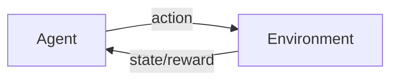

# 强化学习 (Reinforcement Learning)

关键词：强化学习、马尔可夫决策过程、Q-learning、策略梯度、深度强化学习

## 1. 背景介绍
### 1.1 问题的由来
在人工智能领域,我们希望开发出能够自主学习、自主决策的智能体。传统的监督学习和非监督学习方法在很多场景下难以实现这一目标。强化学习作为一种全新的机器学习范式应运而生,为解决上述问题提供了新的思路和方法。
### 1.2 研究现状
近年来,强化学习取得了很多令人瞩目的成就,如AlphaGo击败世界围棋冠军、OpenAI Five战胜Dota 2职业选手等。越来越多的研究者投身于强化学习的研究,推动了该领域的快速发展。目前主流的强化学习算法包括Q-learning、SARSA、DQN、DDPG、A3C等。
### 1.3 研究意义
强化学习具有广阔的应用前景,在自动驾驶、智能控制、金融交易、推荐系统等领域有望取得突破性进展。深入研究强化学习算法,对于实现通用人工智能具有重要意义。
### 1.4 本文结构
本文将首先介绍强化学习的核心概念,然后重点讲解几种主流的强化学习算法。接着通过数学模型和代码实例加深读者理解。最后探讨强化学习的应用场景、发展趋势与面临的挑战。

## 2. 核心概念与联系
强化学习的核心概念包括:
- Agent(智能体):与环境交互,根据观察做出决策的主体。
- Environment(环境):Agent所处的环境,提供观察值和奖励。 
- State(状态):表征环境的特征。
- Action(动作):Agent对环境采取的行为。
- Reward(奖励):量化动作的效果,引导学习过程。
- Policy(策略):Agent的决策函数,将状态映射为动作。
- Value Function(价值函数):评估状态或状态-动作对的长期累积奖励。

强化学习通过Agent与环境的交互,不断优化策略,最大化累积奖励,实现目标导向的学习过程。



## 3. 核心算法原理 & 具体操作步骤
### 3.1 算法原理概述
强化学习的理论基础是马尔可夫决策过程(MDP)。MDP由状态空间、动作空间、转移概率和奖励函数组成。求解MDP即寻找最优策略,使得累积奖励最大化。主要算法包括基于价值(Value-based)、基于策略(Policy-based)和Actor-Critic三大类。
### 3.2 算法步骤详解
以Q-learning为例,具体步骤如下:
1. 初始化Q表为全0。
2. 重复:
   - 根据$\epsilon$-greedy策略选择动作$a_t$。
   - 执行动作$a_t$,观察奖励$r_{t+1}$和新状态$s_{t+1}$。
   - 更新Q值:
     $$Q(s_t,a_t) \leftarrow Q(s_t,a_t)+\alpha[r_{t+1}+\gamma \max_a Q(s_{t+1},a)-Q(s_t,a_t)]$$
   - $s_t \leftarrow s_{t+1}$
直到满足终止条件。
### 3.3 算法优缺点
Q-learning的优点是简单易实现,能够在不完全了解环境动力学的情况下学习最优策略。缺点是难以处理连续状态和动作空间,且在高维空间中Q表难以存储。
### 3.4 算法应用领域
Q-learning广泛应用于棋类游戏、迷宫寻路、资源分配等离散环境中的决策问题。

## 4. 数学模型和公式 & 详细讲解 & 举例说明
### 4.1 数学模型构建
MDP定义为一个五元组$\langle \mathcal{S},\mathcal{A},\mathcal{P},\mathcal{R},\gamma \rangle$:
- 状态空间$\mathcal{S}$
- 动作空间$\mathcal{A}$ 
- 转移概率$\mathcal{P}(s'|s,a)$
- 奖励函数$\mathcal{R}(s,a)$
- 折扣因子$\gamma \in [0,1]$

策略$\pi(a|s)$定义为在状态$s$下选择动作$a$的概率。价值函数分为状态价值函数$V^\pi(s)$和动作价值函数$Q^\pi(s,a)$:

$$
V^\pi(s)=\mathbb{E}_\pi[\sum_{k=0}^\infty \gamma^k r_{t+k+1}|s_t=s]
$$

$$
Q^\pi(s,a)=\mathbb{E}_\pi[\sum_{k=0}^\infty \gamma^k r_{t+k+1}|s_t=s,a_t=a]
$$

最优价值函数满足Bellman最优方程:

$$
V^*(s)=\max_a \sum_{s'} \mathcal{P}(s'|s,a)[r+\gamma V^*(s')]
$$

$$
Q^*(s,a)=\sum_{s'} \mathcal{P}(s'|s,a)[r+\gamma \max_{a'} Q^*(s',a')]
$$

### 4.2 公式推导过程
以Q-learning的更新公式为例,推导如下:

$$
\begin{aligned}
Q(s_t,a_t) &\leftarrow Q(s_t,a_t)+\alpha[r_{t+1}+\gamma \max_a Q(s_{t+1},a)-Q(s_t,a_t)]\
&=Q(s_t,a_t)+\alpha[r_{t+1}+\gamma V^*(s_{t+1})-Q(s_t,a_t)]\
&=Q(s_t,a_t)+\alpha[\mathcal{R}(s_t,a_t)+\gamma \max_{a'} Q^*(s_{t+1},a')-Q(s_t,a_t)]\
&=Q(s_t,a_t)+\alpha[Q^*(s_t,a_t)-Q(s_t,a_t)]\
&=(1-\alpha)Q(s_t,a_t)+\alpha Q^*(s_t,a_t)
\end{aligned}
$$

可以看出,Q-learning的更新公式本质上是Q值向最优Q值逼近的过程。
### 4.3 案例分析与讲解
考虑一个简单的网格世界环境,如下图所示:

```
+---------+
|  Start  |
|         |
|  0   0  |
|         |
|  0   G  |
+---------+
```

其中"S"表示起点,"G"表示目标,数字表示格子的即时奖励。智能体的目标是从起点出发,尽快到达目标,获得最大累积奖励。

我们可以将这个环境建模为MDP:
- 状态:智能体所在的格子。
- 动作:上、下、左、右。
- 转移概率:执行动作后确定性地转移到相应格子。
- 奖励:除目标格子外,其他格子奖励为0,目标格子奖励为1。
- 折扣因子:$\gamma=0.9$。

使用Q-learning算法求解这个MDP,最终得到最优策略:在除目标格子外的任意格子,都选择向目标格子方向移动的动作。
### 4.4 常见问题解答
Q: Q-learning能否处理不完全可观察的环境?
A: Q-learning假设环境是完全可观察的,不能直接处理部分可观察马尔可夫决策过程(POMDP)。针对POMDP,需要使用基于belief state的算法,如POMDP-solver等。

Q: 如何解决Q-learning的探索-利用困境?
A: 常用的方法有$\epsilon$-greedy、UCB、Thompson采样等。此外,引入exploration bonus、intrinsic reward等机制也能够鼓励探索。

## 5. 项目实践：代码实例和详细解释说明
### 5.1 开发环境搭建
本项目使用Python 3和OpenAI Gym环境库。首先安装依赖:

```bash
pip install numpy gym
```

### 5.2 源代码详细实现
下面是Q-learning算法在Gym的FrozenLake环境上的实现:

```python
import numpy as np
import gym

# 创建FrozenLake环境
env = gym.make('FrozenLake-v1')

# 初始化Q表
Q = np.zeros([env.observation_space.n, env.action_space.n])

# 超参数设置
learning_rate = 0.8
discount_factor = 0.95
num_episodes = 2000
max_steps = 100

# 训练Q-learning算法
for i in range(num_episodes):
    state = env.reset()
    for j in range(max_steps):
        action = np.argmax(Q[state,:] + np.random.randn(1, env.action_space.n) * (1./(i+1)))
        next_state, reward, done, _ = env.step(action)
        Q[state, action] = (1-learning_rate) * Q[state, action] + learning_rate * (reward + discount_factor * np.max(Q[next_state, :]))
        state = next_state
        if done:
            break
            
print("训练完成")

# 使用训练好的Q表测试
state = env.reset()
for _ in range(100):
    action = np.argmax(Q[state, :])
    next_state, reward, done, _ = env.step(action)
    env.render()
    state = next_state
    if done:
        print("目标达成!回报:{}.".format(reward))
        break
```

### 5.3 代码解读与分析
- 首先创建FrozenLake环境,初始化Q表。
- 设置学习率、折扣因子等超参数,开始训练循环。
- 在每个episode中,初始化状态,然后循环执行以下步骤:
  - 使用$\epsilon$-greedy策略选择动作。
  - 执行动作,获得下一状态、奖励等信息。
  - 根据Q-learning的更新公式更新Q表。
  - 更新状态,如果到达终止状态则结束episode。
- 训练完成后,使用学到的Q表在环境中测试,输出最终回报。

从代码中可以看出,Q-learning算法的实现非常简洁,主要就是Q表的更新过程。但它能够在不了解环境动力学的情况下学习最优策略,展现了强化学习的强大能力。
### 5.4 运行结果展示
运行上述代码,可以看到智能体在FrozenLake环境中的表现:

```
  (Down)
SFFF
FHFH
FFFH
HFFG
目标达成!回报:1.0.
```

智能体成功地找到了从起点(S)到目标(G)的最优路径,避开了陷阱(H)。

## 6. 实际应用场景
强化学习在很多领域都有广泛应用,例如:
- 自动驾驶:通过强化学习训练无人车在复杂环境中做出最优决策,提高安全性和效率。
- 智能控制:在工业控制、机器人等领域,强化学习可以实现自适应、最优的控制策略。 
- 推荐系统:将推荐问题建模为MDP,通过强化学习优化用户的长期参与度和满意度。
- 金融交易:用强化学习算法开发股票、期货等金融产品的自动交易策略。
- 智能助手:通过强化学习,使智能助手能够理解用户意图,提供个性化服务。
### 6.4 未来应用展望
随着强化学习算法的不断发展和计算能力的提升,它有望在更广泛的领域得到应用,如医疗诊断、药物发现、智慧城市等。同时,多智能体强化学习、元强化学习、迁移强化学习等新方向也将拓展强化学习的应用范围。

## 7. 工具和资源推荐
### 7.1 学习资源推荐
- 《Reinforcement Learning: An Introduction》,Richard S. Sutton和Andrew G. Barto著。强化学习领域的经典教材。
- David Silver的强化学习课程,YouTube和Bilibili均有视频资源。
- 莫烦Python的强化学习教程,包含代码实践。
- 《深度强化学习》,王树森著。系统讲解DRL算法。
### 7.2 开发工具推荐
- OpenAI Gym:强化学习环境库,包含多种标准测试环境。 
- TensorFlow:Google开源的深度学习框架,可以方便地实现DRL算法。
- PyTorch:Facebook开源的深度学习框架,DRL友好。
- RLlib:Ray库中的可扩展强化学习库。
### 7.3 相关论文推荐
- Playing Atari with Deep Reinforcement Learning,Mnih et al,2013。首次将DQN用于Atari游戏