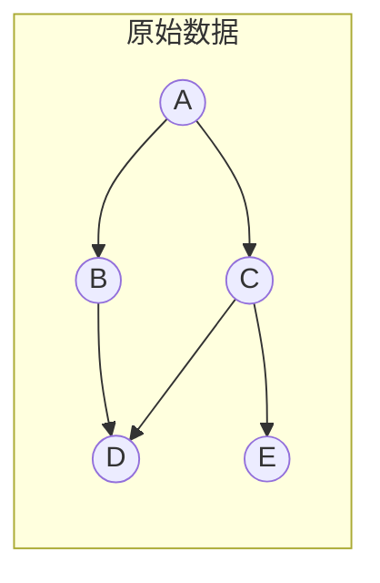
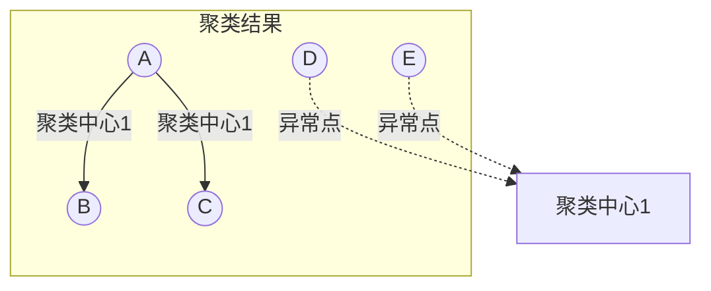
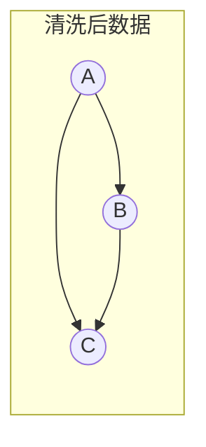
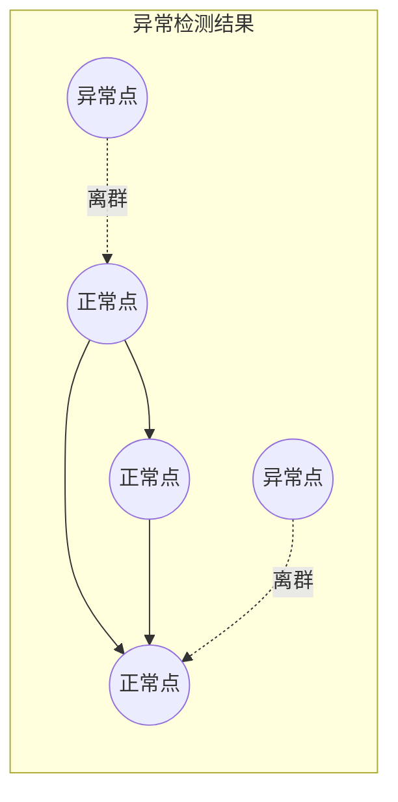

# 无监督学习在数据清洗中的应用

关键词：无监督学习、数据清洗、聚类、异常检测、降维

## 1. 背景介绍
### 1.1  问题的由来
在大数据时代,海量的数据每时每刻都在被生成和收集。然而,原始数据通常包含大量噪声、异常值、缺失值等"脏"数据,严重影响了数据质量,给后续的数据分析和挖掘带来极大挑战。因此,如何高效地对原始数据进行清洗,去除其中的噪声和异常,成为大数据处理的首要任务之一。
### 1.2  研究现状
传统的数据清洗方法主要依赖于人工制定规则,费时费力且容易遗漏。近年来,机器学习技术的发展为数据清洗提供了新的思路。有监督学习可以通过带标签的历史数据训练模型,自动识别异常和噪声。但在很多场景下,带标签的数据获取成本很高,甚至无法获得。无监督学习作为一类重要的机器学习范式,可以在没有标签数据的情况下,自动发现数据内在的结构和模式,为数据清洗提供了新的可能。
### 1.3  研究意义
探索无监督学习在数据清洗中的应用,对提高大数据处理效率、保障数据质量具有重要意义。一方面,无监督学习可以自动识别数据中的异常点、孤立点,去除噪声数据,提升数据可靠性。另一方面,无监督学习能发现数据内在结构,去除冗余和不相关特征,实现数据降维,提高后续挖掘效率。研究无监督学习在数据清洗中的应用,有助于建立高效、智能、自动化的数据清洗流程,为大数据分析奠定基础。
### 1.4  本文结构
本文将重点探讨无监督学习在数据清洗中的应用。第2部分介绍数据清洗与无监督学习的核心概念。第3部分重点阐述无监督学习的几类核心算法。第4部分建立数据清洗的数学模型。第5部分通过代码实例演示具体应用。第6部分总结无监督学习在数据清洗中的典型应用场景。第7部分推荐相关工具和资源。第8部分对全文进行总结并展望未来。第9部分列举常见问题解答。

## 2. 核心概念与联系
数据清洗是指检测并纠正数据文件中可识别的错误的过程,包括检查数据一致性,处理无效值和缺失值等任务,旨在提高数据质量,为后续数据分析做好准备。无监督学习是机器学习的一个分支,旨在发现数据内在的结构和模式,而无需使用带标签的训练数据。常见的无监督学习任务包括聚类、异常检测、降维等。将无监督学习应用于数据清洗,可以自动识别异常点和离群点,发现数据内在结构,去除冗余特征,极大提升数据清洗的效率和效果。

## 3. 核心算法原理 & 具体操作步骤
### 3.1  算法原理概述
常用于数据清洗的无监督学习算法主要包括:
(1)聚类算法:将相似的数据点划分到同一个簇,不相似的数据点划分到不同簇,可用于去除异常点。
(2)异常检测算法:基于数据的统计特性或分布,识别明显偏离大多数的少数异常点。
(3)降维算法:通过某种映射,将高维数据转换为低维表示,去除噪声和冗余。
### 3.2  算法步骤详解
以最常用的K-Means聚类算法为例,其基本步骤如下:
(1)随机选择K个数据点作为初始聚类中心
(2)重复下列步骤直到收敛:
- 对每个数据点,计算其到各个聚类中心的距离,并将其分配到距离最近的簇
- 对每个簇,重新计算聚类中心(如取簇内所有点的均值)
(3)将距离聚类中心较远的点识别为异常点
### 3.3  算法优缺点
优点:
- 原理简单,易于实现
- 计算高效,适用于大规模数据集
- 可以自动发现数据内在结构,无需标注数据
缺点:
- 需要预先确定聚类数K
- 对初始聚类中心敏感
- 难以发现非凸形的簇结构
### 3.4  算法应用领域
K-Means聚类在数据清洗领域应用广泛,可用于去除异常数据点,提升数据质量。此外,还被广泛应用于客户细分、图像分割、社交网络分析等领域。

## 4. 数学模型和公式 & 详细讲解 & 举例说明
### 4.1  数学模型构建
设有 $n$ 个 $d$ 维数据点 $\{x_1,x_2,...,x_n\}, x_i\in \mathbb{R}^d$,希望将其划分为 $K$ 个簇 $\{C_1,C_2,...,C_K\}$,每个簇 $C_i$ 有一个聚类中心 $\mu_i$。定义目标函数:
$$J(C,\mu)=\sum_{i=1}^K \sum_{x\in C_i} \left \| x-\mu_i \right \|^2$$
其中 $\left \| \cdot  \right \|$ 表示欧几里得距离。K-Means 算法的目标是找到 $C$ 和 $\mu$ 以最小化目标函数 $J$。
### 4.2  公式推导过程
对目标函数求导可得:
$$\frac{\partial J}{\partial \mu_i}=2\sum_{x\in C_i}(x-\mu_i)$$
令导数为0,可得:
$$\mu_i=\frac{1}{|C_i|}\sum_{x\in C_i}x$$
即每个聚类中心 $\mu_i$ 为簇 $C_i$ 内所有点的均值。
### 4.3  案例分析与讲解
以一个二维数据集为例,假设数据点分布如下图所示:



经过K-Means聚类后,可以发现D、E两个点偏离其他数据点较远,可能是异常点:



去除D、E两个异常点后,得到较为干净的数据集:



### 4.4  常见问题解答
Q:如何确定最优聚类数K?
A:可以用手肘法、轮廓系数等方法,通过多次试验选取得分最高的K值。

Q:如何评估聚类结果的好坏?
A:常用Dunn指数、DB指数等内部评估指标,或通过与外部标签比较计算兰德指数等外部指标。

## 5. 项目实践：代码实例和详细解释说明
### 5.1  开发环境搭建
推荐使用Python作为开发语言,需要安装NumPy、Pandas、Scikit-learn等常用库:

```bash
pip install numpy pandas scikit-learn
```

### 5.2  源代码详细实现
以下代码演示了用K-Means进行异常检测的完整过程:

```python
from sklearn.cluster import KMeans
from sklearn.preprocessing import StandardScaler
from sklearn.datasets import make_blobs

# 生成模拟数据
X, _ = make_blobs(n_samples=1000, centers=5, cluster_std=1.0, random_state=42)

# 数据标准化
scaler = StandardScaler()
X_scaled = scaler.fit_transform(X)

# 构建K-Means模型
km = KMeans(n_clusters=5, random_state=42)
km.fit(X_scaled)

# 计算每个点到聚类中心的距离
distances = km.transform(X_scaled)
min_distances = distances.min(axis=1)

# 根据距离阈值检测异常点
threshold = 3
anomalies = X[min_distances > threshold]
```

### 5.3  代码解读与分析
首先,我们生成一个包含5个簇的模拟数据集。然后,对数据进行标准化处理,使其均值为0、方差为1,消除量纲影响。接着,构建一个5类的K-Means模型,并训练之。训练完成后,我们计算每个数据点到其最近聚类中心的距离。最后,设定一个距离阈值(如3),将距离超过阈值的点识别为异常点。阈值的选取可根据具体场景和需求进行调整。

### 5.4  运行结果展示
运行上述代码后,我们得到了被判定为异常点的数据。可以将其可视化展示,或进一步分析其特征,以发现问题根源。下图展示了检测出的部分异常点(红色)与正常点(蓝色)的分布情况:



## 6. 实际应用场景
无监督学习可以在多个数据清洗场景中发挥重要作用:
- 金融欺诈检测:通过聚类分析用户交易行为,识别异常交易模式,及时预警欺诈风险。
- 传感器数据校准:对多个传感器采集的同一指标数据进行聚类,剔除偏离较大的异常值。
- 医疗诊断辅助:对患者各项生理指标数据进行聚类和异常检测,筛查出疑似疾病的异常个案。
- 用户画像精准营销:将用户按特征聚类,自动剔除假用户,提升画像精准度,优化营销效果。
### 6.4  未来应用展望
随着大数据和人工智能技术的快速发展,无监督学习在数据清洗领域的应用将进一步深化。一方面,针对时序、图等复杂数据类型,亟需开发新的无监督学习算法。另一方面,无监督学习与其他技术(如迁移学习、强化学习)的结合,有望进一步提升数据清洗的智能化水平。此外,无监督学习还可以与知识图谱、因果推断等技术联合,挖掘数据背后的关联和因果,实现更加全面、精准的数据清洗。

## 7. 工具和资源推荐
### 7.1  学习资源推荐
- 《Machine Learning》by Andrew Ng:经典的机器学习入门课程,包含无监督学习算法详解
- 《统计学习方法》by 李航:系统介绍各类机器学习算法,数学推导详尽
- Scikit-learn官方文档:Scikit-learn是流行的Python机器学习库,文档包含丰富的无监督学习算法API介绍和使用示例
### 7.2  开发工具推荐
- Scikit-learn:用于数据挖掘和数据分析的Python第三方库,内置多种无监督学习算法实现
- ELKI:专门用于聚类分析的数据挖掘开源软件,Java编写,包含众多聚类算法
- RapidMiner:用于机器学习和数据挖掘的开源软件平台,提供多种无监督学习算法组件
### 7.3  相关论文推荐
- A Survey of Clustering Algorithms for Big Data: Taxonomy & Empirical Analysis. IEEE Transactions on Emerging Topics in Computing, 2014.
- Anomaly Detection: A Survey. ACM Computing Surveys, 2009.
- Outlier detection with autoencoder ensembles. SDM, 2017.
### 7.4  其他资源推荐
- Kaggle数据集:Kaggle上有大量真实数据集,其中不乏需要清洗的"脏"数据,是无监督学习算法的理想实践场
- 数据清洗工具合集:KDnuggets整理的流行数据清洗工具,包括OpenRefine、Trifacta Wrangler等
- 异常检测文章合集:Towards Data Science上的异常检测