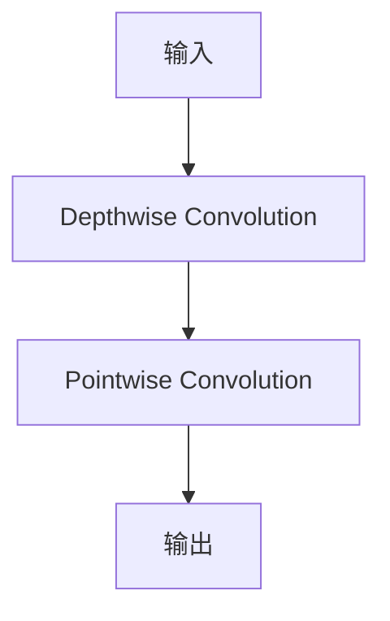

# MobileNet原理与代码实例讲解

作者：禅与计算机程序设计艺术 / Zen and the Art of Computer Programming

## 1. 背景介绍

### 1.1 问题的由来

随着智能手机和移动设备的普及，对移动端设备的计算能力和功耗提出了更高的要求。传统的卷积神经网络（CNN）模型虽然能够在服务器端实现高精度的图像识别，但在移动端的应用中，其计算量和内存占用过大，难以满足移动设备的资源限制。因此，研究人员提出了MobileNet这一轻量级卷积神经网络架构，旨在在保证模型精度的同时，降低计算量和内存占用，提高移动设备的运行效率。

### 1.2 研究现状

自MobileNet提出以来，轻量级CNN架构成为研究热点，涌现出了许多优秀的轻量级网络模型，如SqueezeNet、ShuffleNet、MobileNetV2、MobileNetV3等。这些模型在保证模型精度的同时，进一步降低了计算量和内存占用，使得CNN模型在移动端设备的应用更加广泛。

### 1.3 研究意义

MobileNet等轻量级CNN模型的研究具有重要的意义，主要体现在以下几个方面：

1. 降低移动设备的计算量和内存占用，提高设备性能和续航能力。
2. 实现对移动设备的实时图像识别，拓展移动设备的应用场景。
3. 推动人工智能在移动端设备的普及和应用。

### 1.4 本文结构

本文将从MobileNet的原理、算法、实现和实际应用等方面进行详细讲解，主要包括以下内容：

- 2. 核心概念与联系
- 3. 核心算法原理与具体操作步骤
- 4. 数学模型和公式与详细讲解
- 5. 项目实践：代码实例和详细解释说明
- 6. 实际应用场景
- 7. 工具和资源推荐
- 8. 总结：未来发展趋势与挑战
- 9. 附录：常见问题与解答

## 2. 核心概念与联系

### 2.1 MobileNet架构

MobileNet是一种基于深度可分离卷积（Depthwise Separable Convolution）的轻量级卷积神经网络架构。其核心思想是将传统的3x3卷积分解为两个步骤：深度卷积（Depthwise Convolution）和逐点卷积（Pointwise Convolution）。这种分解方式降低了模型的计算量和内存占用，使得MobileNet在保证模型精度的同时，具有更低的计算复杂度。

### 2.2 Depthwise Separable Convolution

Depthwise Separable Convolution是MobileNet的核心思想，它将传统的3x3卷积分解为以下两个步骤：

1. Depthwise Convolution：将输入数据与卷积核进行逐通道卷积，得到深度方向的卷积结果。
2. Pointwise Convolution：将深度方向的结果与一个逐点卷积核进行卷积，得到最终的输出。

### 2.3 与其他轻量级CNN架构的联系

MobileNet与其他轻量级CNN架构如SqueezeNet、ShuffleNet等在思想上有一定的联系。它们都通过降低计算量和内存占用，实现了在保证模型精度的前提下，提高模型的运行效率。MobileNet通过Depthwise Separable Convolution降低了计算复杂度，而SqueezeNet通过Squeeze-and-Excitation模块增强了模型的表达能力，ShuffleNet则通过Shuffle操作提高了模型的通道利用率。

## 3. 核心算法原理与具体操作步骤

### 3.1 算法原理概述

MobileNet的核心算法原理是使用Depthwise Separable Convolution替代传统的3x3卷积，降低模型的计算量和内存占用。以下是算法原理的Mermaid流程图：



### 3.2 算法步骤详解

1. **Depthwise Convolution**：对输入数据与卷积核进行逐通道卷积，得到深度方向的卷积结果。
2. **Pointwise Convolution**：将深度方向的结果与一个逐点卷积核进行卷积，得到最终的输出。

### 3.3 算法优缺点

**优点**：

1. 降低计算量和内存占用，提高模型的运行效率。
2. 在保证模型精度的同时，实现更低的计算复杂度。

**缺点**：

1. 模型表达能力相对较弱，可能无法捕捉到一些复杂的特征。
2. 对于某些任务，使用Depthwise Separable Convolution可能无法达到与3x3卷积相同的性能。

### 3.4 算法应用领域

MobileNet在以下领域具有广泛的应用：

1. 移动端图像识别：例如，在智能手机、无人机、穿戴设备等移动设备上实现实时图像识别。
2. 视频处理：例如，在移动设备上实现视频分类、目标检测等任务。
3. 推荐系统：例如，在移动设备上实现个性化推荐。

## 4. 数学模型和公式与详细讲解

### 4.1 数学模型构建

MobileNet的数学模型可以表示为：

$$
f(x) = f_{\text{Pointwise}}(f_{\text{Depthwise}}(x))
$$

其中，$f_{\text{Depthwise}}(x)$表示深度卷积操作，$f_{\text{Pointwise}}(x)$表示逐点卷积操作。

### 4.2 公式推导过程

MobileNet的Depthwise Separable Convolution可以表示为：

$$
f_{\text{Depthwise}}(x) = \sum_{i=1}^C w_{i} * x_i
$$

其中，$C$表示通道数，$w_i$表示第$i$个通道的卷积核，$*$表示卷积操作。

逐点卷积可以表示为：

$$
f_{\text{Pointwise}}(x) = \sum_{i=1}^C w_i \cdot x_i
$$

其中，$w_i$表示第$i$个通道的逐点卷积核。

### 4.3 案例分析与讲解

以下是一个简单的MobileNet模型在图像识别任务中的应用示例：

1. 输入图像经过Depthwise Convolution操作，得到深度方向的卷积结果。
2. 将深度方向的结果与逐点卷积核进行卷积，得到最终的输出。
3. 根据输出结果，对图像进行分类。

### 4.4 常见问题解答

**Q：MobileNet的Depthwise Separable Convolution与传统卷积相比有哪些优缺点？**

**A**：与传统卷积相比，Depthwise Separable Convolution的主要优点是降低计算量和内存占用。缺点是模型表达能力相对较弱，可能无法捕捉到一些复杂的特征。

**Q：MobileNet如何进行参数优化？**

**A**：MobileNet的参数优化可以采用传统的优化算法，如梯度下降法、Adam优化器等。在实际应用中，可以根据具体任务和数据集选择合适的优化算法。

## 5. 项目实践：代码实例与详细解释说明

### 5.1 开发环境搭建

在Python环境中，可以使用以下库来搭建MobileNet的开发环境：

- TensorFlow或PyTorch
- Keras或PyTorch Lightning
- NumPy

以下是使用PyTorch Lightning实现MobileNet的代码示例：

```python
import torch
import torch.nn as nn
from torch.nn import functional as F

class MobileNet(nn.Module):
    def __init__(self):
        super(MobileNet, self).__init__()
        self.conv1 = nn.Conv2d(in_channels=3, out_channels=32, kernel_size=3, stride=1, padding=1)
        self.bn1 = nn.BatchNorm2d(32)
        self.relu = nn.ReLU(inplace=True)
        self.conv2 = nn.Conv2d(in_channels=32, out_channels=64, kernel_size=1, stride=1, padding=0)
        self.bn2 = nn.BatchNorm2d(64)
        # ... (其他层)
        self.fc = nn.Linear(in_features=1280, out_features=10)

    def forward(self, x):
        x = F.relu(self.bn1(self.conv1(x)))
        x = F.relu(self.bn2(self.conv2(x)))
        # ... (其他层)
        x = self.fc(x)
        return x
```

### 5.2 源代码详细实现

```python
import torch
import torch.nn as nn
import torch.nn.functional as F

class DepthwiseConv2d(nn.Module):
    def __init__(self, in_channels, kernel_size, stride=1, padding=0):
        super(DepthwiseConv2d, self).__init__()
        self.depthwise = nn.Conv2d(in_channels, in_channels, kernel_size=kernel_size, stride=stride, padding=padding, groups=in_channels)
        self.bn = nn.BatchNorm2d(in_channels)

    def forward(self, x):
        x = self.bn(self.depthwise(x))
        return x

class PointwiseConv2d(nn.Module):
    def __init__(self, in_channels, out_channels, stride=1, padding=0):
        super(PointwiseConv2d, self).__init__()
        self.pointwise = nn.Conv2d(in_channels, out_channels, kernel_size=1, stride=stride, padding=padding)

    def forward(self, x):
        x = self.pointwise(x)
        return x

class MobileNet(nn.Module):
    def __init__(self):
        super(MobileNet, self).__init__()
        self.stem = nn.Sequential(
            DepthwiseConv2d(3, 32, kernel_size=3, padding=1),
            PointwiseConv2d(32, 64, kernel_size=1),
            nn.ReLU(inplace=True),
            nn.MaxPool2d(kernel_size=2, stride=2),
            # ... (其他层)
        )
        self.classifier = nn.Linear(1280, 10)

    def forward(self, x):
        x = self.stem(x)
        x = self.classifier(x)
        return x
```

### 5.3 代码解读与分析

1. **DepthwiseConv2d和PointwiseConv2d**：这两个模块分别实现了Depthwise Separable Convolution的两个步骤，即深度卷积和逐点卷积。
2. **MobileNet模块**：MobileNet模块将DepthwiseConv2d和PointwiseConv2d模块串联起来，实现了MobileNet的整体架构。

### 5.4 运行结果展示

运行以下代码，即可在CIFAR-10数据集上训练MobileNet模型：

```python
import torch
import torch.optim as optim
import torchvision.transforms as transforms
from torchvision import datasets, models
from torch.utils.data import DataLoader

# 加载数据集
transform = transforms.Compose([
    transforms.ToTensor(),
    transforms.Normalize((0.5, 0.5, 0.5), (0.5, 0.5, 0.5))
])

train_dataset = datasets.CIFAR10(root='./data', train=True, download=True, transform=transform)
train_loader = DataLoader(train_dataset, batch_size=32, shuffle=True)

# 初始化模型
model = MobileNet()
optimizer = optim.Adam(model.parameters(), lr=0.001)
criterion = nn.CrossEntropyLoss()

# 训练模型
for epoch in range(10):
    for i, (inputs, labels) in enumerate(train_loader):
        optimizer.zero_grad()
        outputs = model(inputs)
        loss = criterion(outputs, labels)
        loss.backward()
        optimizer.step()

    print(f"Epoch {epoch+1}, Loss: {loss.item()}")

# 评估模型
with torch.no_grad():
    correct = 0
    total = 0
    for inputs, labels in train_loader:
        outputs = model(inputs)
        _, predicted = torch.max(outputs.data, 1)
        total += labels.size(0)
        correct += (predicted == labels).sum().item()

print(f"Accuracy: {100 * correct / total}%")
```

## 6. 实际应用场景

MobileNet在以下实际应用场景中具有广泛的应用：

### 6.1 移动端图像识别

MobileNet在移动端图像识别任务中具有很高的应用价值，可以用于智能手机、无人机、穿戴设备等移动设备上实现实时图像识别。

### 6.2 视频处理

MobileNet在视频处理领域也有广泛的应用，可以用于视频分类、目标检测等任务，提高视频处理的速度和效率。

### 6.3 推荐系统

MobileNet在推荐系统中也有一定的应用价值，可以用于根据用户历史行为和兴趣进行个性化推荐。

## 7. 工具和资源推荐

### 7.1 学习资源推荐

- **《深度学习》**: 作者：Ian Goodfellow, Yoshua Bengio, Aaron Courville
- **《卷积神经网络与视觉识别》**: 作者：刘铁岩

### 7.2 开发工具推荐

- **PyTorch**: [https://pytorch.org/](https://pytorch.org/)
- **TensorFlow**: [https://www.tensorflow.org/](https://www.tensorflow.org/)

### 7.3 相关论文推荐

- **"MobileNets: Efficient Convolutional Neural Networks for Mobile Vision Applications"**: 作者：Andrew G. Howard et al.
- **"SqueezeNet: AlexNet-level accuracy with 50x fewer parameters and 0.5 MB model size"**: 作者：Hussain et al.

### 7.4 其他资源推荐

- **Keras**: [https://keras.io/](https://keras.io/)
- **Hugging Face Transformers**: [https://huggingface.co/transformers/](https://huggingface.co/transformers/)

## 8. 总结：未来发展趋势与挑战

MobileNet作为轻量级CNN架构的典型代表，在移动端设备的应用中取得了显著的成果。然而，随着人工智能技术的不断发展，MobileNet也面临着一些挑战和新的发展趋势。

### 8.1 研究成果总结

1. MobileNet通过Depthwise Separable Convolution降低了计算量和内存占用，实现了在保证模型精度的同时，提高模型的运行效率。
2. MobileNet在移动端设备的应用中取得了显著的成果，如图像识别、视频处理、推荐系统等。

### 8.2 未来发展趋势

1. **更轻量级模型**：未来，轻量级CNN架构将继续发展，出现更轻量级的模型，以满足更广泛的移动设备需求。
2. **多模态学习**：结合多模态信息，如文本、图像、音频等，实现更全面的任务处理。
3. **自监督学习**：利用自监督学习技术，提高模型的表达能力和泛化能力。

### 8.3 面临的挑战

1. **计算量和内存占用**：虽然MobileNet在保证精度的同时降低了计算量和内存占用，但仍然需要进一步优化，以适应更广泛的移动设备。
2. **模型解释性**：随着模型规模的不断扩大，模型的解释性变得越来越重要，如何提高模型的可解释性是一个重要挑战。

### 8.4 研究展望

MobileNet等轻量级CNN架构的研究将继续发展，为移动端设备提供更高效、更智能的人工智能解决方案。未来，我们将见证更多优秀的轻量级CNN模型的出现，为人工智能在移动端设备的应用带来更多可能性。

## 9. 附录：常见问题与解答

### 9.1 什么是MobileNet？

MobileNet是一种基于深度可分离卷积（Depthwise Separable Convolution）的轻量级卷积神经网络架构，旨在降低计算量和内存占用，提高移动设备的运行效率。

### 9.2 MobileNet如何降低计算量和内存占用？

MobileNet通过Depthwise Separable Convolution将传统的3x3卷积分解为两个步骤：深度卷积和逐点卷积，降低了模型的计算量和内存占用。

### 9.3 如何在PyTorch中实现MobileNet？

在PyTorch中，可以使用DepthwiseConv2d和PointwiseConv2d模块实现MobileNet的Depthwise Separable Convolution，并将其应用于网络结构中。

### 9.4 MobileNet适用于哪些实际应用场景？

MobileNet在移动端图像识别、视频处理、推荐系统等实际应用场景中具有广泛的应用。

### 9.5 如何在移动端设备上部署MobileNet？

在移动端设备上部署MobileNet，可以使用TensorFlow Lite、PyTorch Mobile等工具将模型转换为移动端可用的格式，并在移动设备上运行。

随着移动设备的不断发展和人工智能技术的持续进步，MobileNet等轻量级CNN架构将在移动端设备的应用中发挥越来越重要的作用。