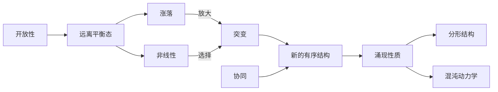

# 计算：第四部分 计算的极限 第 11 章 复杂性计算 耗散结构

作者：禅与计算机程序设计艺术 / Zen and the Art of Computer Programming

关键词：复杂性计算、耗散结构、非平衡态热力学、自组织、协同学、分形、混沌、突现

## 1. 背景介绍
### 1.1 问题的由来
自然界和人类社会中存在大量复杂系统,它们由大量相互作用的子系统构成,展现出丰富多样的动力学行为和结构特征。传统的还原论科学范式难以有效描述和预测这些系统的宏观涌现性质。20世纪中后期兴起的复杂性科学为研究复杂系统提供了新的视角和方法。其中,非平衡态热力学为揭示复杂系统的普适规律做出了重要贡献。

### 1.2 研究现状
非平衡态热力学经历了三个主要发展阶段:线性不可逆过程热力学、耗散结构理论和协同学。目前的研究重点包括:
- 探索远离平衡态系统的普适规律
- 阐明耗散结构形成的必要条件
- 建立定量描述复杂系统的数学模型
- 揭示涌现现象背后的机理
- 将非平衡热力学应用于各个领域

### 1.3 研究意义  
深入理解复杂系统的普适规律,对于认识自然、社会乃至认知过程本身具有重要意义。非平衡态热力学为理解生命起源、生态演化、认知涌现等根本问题提供了新的思路。同时,其思想方法已被应用于化学、生物、认知科学、社会学、经济学等诸多领域,推动了相关学科的发展。

### 1.4 本文结构
本文将系统阐述非平衡态热力学的核心概念、数学模型、代表性成果及其应用,内容安排如下:

1. 背景介绍  
2. 核心概念与联系
3. 核心算法原理 & 具体操作步骤
4. 数学模型和公式 & 详细讲解 & 举例说明
5. 项目实践:代码实例和详细解释说明
6. 实际应用场景
7. 工具和资源推荐
8. 总结:未来发展趋势与挑战
9. 附录:常见问题与解答

## 2. 核心概念与联系

非平衡态热力学引入了一系列新概念来刻画复杂系统的特征,主要包括:

- 耗散结构:在远离平衡态下,系统通过与外界交换物质和能量,自发形成的宏观有序结构。
- 涨落:系统内部或与环境相互作用引起的物理量偏离平均值的现象。
- 非线性:系统的响应与激励之间不成正比,导致多稳态和分岔等现象。
- 突变:控制参数变化引起系统状态发生质变的现象。
- 协同:系统内部各子系统通过相互作用,表现出整体性、相干性的现象。
- 涌现:系统整体展现出的宏观性质和规律,不能简单归结为局部性质的"机械"叠加。
- 分形:系统呈现出的自相似嵌套结构,具有分形维数特征。
- 混沌:确定性系统对初值敏感,产生类随机的不规则运动。

这些概念相互交织,构成了非平衡态热力学的核心术语体系。耗散结构强调了系统与环境的物质-能量交换,是远离平衡态系统的重要特征。涨落为新的有序结构提供了形成的"种子"。非线性导致系统对涨落的放大,使涨落从微观尺度发展到宏观尺度,最终形成新的有序结构。这一过程通常伴随突变现象的发生。协同反映了系统内部各组分之间的关联,是理解涌现现象的关键。分形与混沌则揭示了表面无序背后可能蕴藏的内在几何和动力学规律。

总的来说,开放性、非线性、涨落和协同是复杂系统形成耗散结构的四个基本要素。它们共同作用,驱动系统从无序走向有序,呈现出丰富多彩的宏观图景。下图总结了这些概念之间的逻辑联系:



## 3. 核心算法原理 & 具体操作步骤
### 3.1 算法原理概述

耗散结构的形成可以用反应扩散方程组来定量描述。设系统中有n种组分,它们的浓度为$u_1(x,t),\cdots,u_n(x,t)$,满足如下偏微分方程组:

$$
\frac{\partial u_i}{\partial t}=f_i(u_1,\cdots,u_n)+D_i \nabla^2 u_i, \quad i=1,\cdots,n
$$

其中$f_i$为反应项,描述化学反应动力学;$D_i$为扩散系数;$\nabla^2$为Laplace算子,描述空间扩散过程。通过求解该方程组,可以得到系统在时空的演化规律。

### 3.2 算法步骤详解

1. 建立反应扩散方程组。根据系统的化学反应机理,列出各组分的反应项$f_i$,确定扩散系数$D_i$。

2. 设定初始条件和边界条件。给定各组分的初始浓度分布$u_i(x,0)$,以及边界上的浓度或流量条件。

3. 选择数值求解方法。常用的方法有有限差分、有限元、谱方法等。

4. 离散化方程。将连续的偏微分方程转化为离散的差分方程或代数方程。

5. 迭代求解。利用选定的数值方法,逐步推进时间,计算每一时刻系统的状态。

6. 结果分析。对得到的时空演化数据进行可视化,提取关键特征量,分析系统的动力学行为。

### 3.3 算法优缺点

优点:
- 直接基于系统的物理化学机理,具有明确的物理意义
- 可以获得系统状态随时空演化的详细信息
- 适用于多种类型的反应扩散系统

缺点:  
- 计算量大,对高维系统和长时演化的模拟非常耗时
- 对反应机理和参数的依赖性强,需要足够的先验知识
- 数值误差和不稳定性问题可能影响结果的可靠性

### 3.4 算法应用领域

反应扩散方程广泛应用于化学、生物、物理等领域,用于模拟各类耗散结构的形成过程,如:

- 化学反应中的图灵斑图、螺旋波、靶波等
- 生物形态发生过程中的图灵斑图
- 催化剂表面的化学波
- 燃烧过程中的火焰传播
- 生态系统中的斑块动力学
- 神经网络中的同步振荡

## 4. 数学模型和公式 & 详细讲解 & 举例说明
### 4.1 数学模型构建

我们以Brusselator模型为例,说明如何建立描述化学振荡的反应扩散方程。该模型考虑如下三步可逆反应:

$$
\begin{aligned}
&A \stackrel{k_1}{\longrightarrow} X \
&B + X \stackrel{k_2}{\longrightarrow} Y + D \  
&2X + Y \stackrel{k_3}{\longrightarrow} 3X
\end{aligned}
$$

假设反应物$A$和$B$的浓度保持恒定,令$X$和$Y$的浓度分别为$u(x,t)$和$v(x,t)$,可得如下反应扩散方程组:

$$
\begin{aligned}
\frac{\partial u}{\partial t} &= k_1 A - (k_2 B+k_3)u + k_3 u^2 v + D_u \nabla^2 u \
\frac{\partial v}{\partial t} &= k_2 B u - k_3 u^2 v + D_v \nabla^2 v
\end{aligned}
$$

其中$D_u$和$D_v$分别为$X$和$Y$的扩散系数。

### 4.2 公式推导过程

为了无量纲化,引入如下变换:

$$
\begin{aligned}
&\tilde{u} = \sqrt{\frac{k_3}{k_1 A}}u, \quad \tilde{v} = \sqrt{\frac{k_3}{k_1 A}}v \
&\tilde{t} = k_1 A t, \quad \tilde{x} = \sqrt{\frac{k_1 A}{D_u}}x \  
&a = \frac{k_2 B}{k_1 A}, \quad b = \frac{k_3}{k_1 A}, \quad d = \frac{D_v}{D_u}
\end{aligned}
$$

代入原方程组,并略去符号"~",得到无量纲形式:

$$
\begin{aligned}
\frac{\partial u}{\partial t} &= 1 - (a+b)u + b u^2 v + \nabla^2 u \
\frac{\partial v}{\partial t} &= a u - b u^2 v + d \nabla^2 v  
\end{aligned}
$$

### 4.3 案例分析与讲解

下面我们通过数值模拟来研究Brusselator模型的图灵斑图形成过程。取参数$a=3,b=10,d=10$,在一维空间$x \in [0,1]$上进行模拟,初始条件为随机扰动,边界条件为周期性边界条件。

利用有限差分方法对方程组进行离散化,时间步长取$\Delta t=0.001$,空间步长取$\Delta x=0.01$,迭代50000步。下图展示了不同时刻$u$的空间分布:

```
t=0.0    [随机噪声]
t=5.0    [噪声放大]  
t=10.0   [斑图形成] 
t=50.0   [斑图稳定]
```

可以看到,系统从初始的随机扰动出发,经过一段时间的演化后,在空间上形成了稳定的周期性斑图。这种斑图是由扩散引起的空间不稳定性导致的,体现了图灵斑图的典型特征。

### 4.4 常见问题解答

Q: 图灵斑图形成的本质是什么?
A: 图灵斑图是由扩散引起的空间不稳定性导致的。当激活物扩散速率远大于抑制物时,系统对空间非均匀扰动敏感,扰动被放大并最终形成稳定的空间斑图。

Q: 反应扩散方程的稳定性如何判断?
A: 通常采用线性稳定性分析的方法。将方程组在均匀稳态解附近线性化,然后分析所得线性化方程组的特征值。若所有特征值实部均小于零,则均匀稳态解稳定;若存在实部大于零的特征值,则出现空间不稳定性,可能导致图灵斑图等结构的形成。

Q: 反应扩散方程的数值求解有哪些需要注意的问题?
A: 主要问题包括:数值格式的稳定性和耗散性、边界条件的处理、初值的选取等。显式格式虽然编程简单,但时间步长受限;隐式格式稳定性好,但求解代价大。边界条件需要根据实际问题合理设置。初值一般选取随机扰动,但不同的随机序列可能导致不同的结果,需要进行多次模拟。

## 5. 项目实践:代码实例和详细解释说明
### 5.1 开发环境搭建

我们使用Python语言来实现Brusselator模型的数值模拟。需要安装以下库:

- NumPy:用于数组操作和数值计算 
- Matplotlib:用于绘图显示结果

可以使用pip命令进行安装:

```
pip install numpy matplotlib
```

### 5.2 源代码详细实现

```python
import numpy as np
import matplotlib.pyplot as plt

# 模型参数
a = 3.0
b = 10.0 
d = 10.0

# 空间和时间步长
dx = 0.01
dt = 0.001

# 空间和时间网格
nx = 100